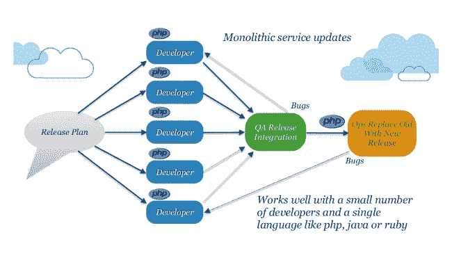
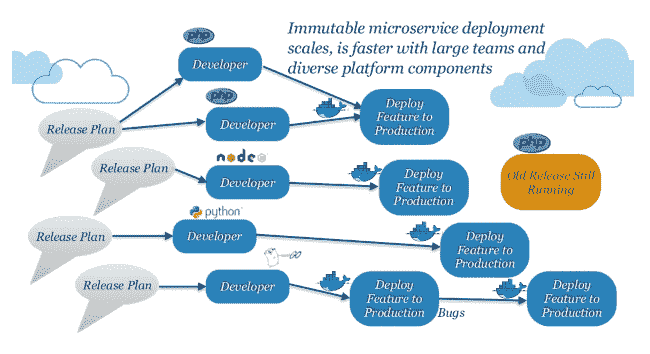
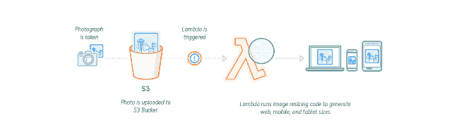

# 无服务器不是为了节约成本，而是为了提高效率

> 原文：<https://thenewstack.io/serverless-isnt-cost-savings-bats/>

400 多名[无服务器和功能即服务](/category/serverless/) (FaaS)爱好者最近聚集在奥斯汀参加第四次 ServerlessConf 会议，在那里进行的所有演示中，这可能是最重要的一张幻灯片:

[迈克·罗伯茨](https://www.linkedin.com/in/mikebroberts/)是该书的作者，如果你不知道他在 [Symphonia](https://www.symphonia.io/) 云和无服务器咨询公司的工作，你可能会从[马丁·福勒的博客](http://www.martinfowler.com)中知道他，去年夏天罗伯茨在那里发表了被许多人认为是[对这项年轻技术及其好处的权威描述](https://martinfowler.com/articles/serverless.html)。

 [皮特·约翰逊

Pete Johnson 拥有 20 多年的技术行业经验，是思科系统公司全球合作伙伴组织的云和无服务器技术的技术解决方案架构师。](https://twitter.com/nerdguru) 

Roberts 在他的演讲中提到的是，虽然成本节约是无服务器技术的头条新闻，但这并不是引起人们注意的主要好处。当然，无服务器架构可以很好地按比例缩小，而且由于 FaaS 的主要供应商提供了慷慨的免费层，所以很容易开始使用无服务器架构，而不需要花费大量的金钱。

> 有了 monoliths，你一年可以打 4 次，有了 microservices，你可以打 365 次。哪一个更有可能找到创新热点？

但是 Roberts 的主要观点是，组成无服务器架构的更小、更松散耦合的部分非常适合敏捷软件方法。这意味着无服务器不是为了节约成本，而是为了提高效率。

## 从整体到微服务

软件创新来自快速迭代，或者借用棒球术语，来自击球。这里的前提是大多数想法都是坏的，所以找到好想法的最好方法是循环尽可能多的想法，以增加找到好想法的机会。如果你掷出更多的骰子，你就增加了其中一个掷出 7 的机会。换个体育隐喻来说，新英格兰爱国者队历史上一直在 NFL 选秀中囤积选秀权，并最终获得更多能够在职业水平上做出贡献的球员。还有无数其他的例子。

在软件世界中，我们从整体架构到当前微服务事实标准的转变中学到了很多。我最喜欢的对这一现象的描述来自亚马逊网络服务云架构副总裁阿德里安·科克罗夫特在 2014 年 Monkotoberfest 上关于快速交付的演讲中。他之前在甲板上的照片是这样的:

紧密耦合的组件通常通过某种内存中的库调用相互通信，所有这些组件都具有用单一语言编写的单一发布计划，这就是我们过去编写软件的方式。在一个 QA 发布周期中，所有组件必须同步，如果在那里发现了一个 bug，或者在生产中出现了天理不容的情况，整个发布必须被取消，因为依赖关系如此紧密，以至于组件不能独立存在。

在这个整体模型中，如果您能够每季度发布一次，那您就很幸运了，因为同时将所有这些相关的部分移动到一起是很复杂的。

[然而，微服务](/category/microservices/)给我们带来了更松散耦合的组件，这些组件通过已发布 API 的契约相互通信。只要 API 保持不变，组件就可以独立发布，甚至可以用不同的语言编写。在这种模型中，每周甚至每天发布是常见的，因为当 API 发生变化时，破坏两个组件之间的接口的风险是最高的，而这种情况很少发生。

有了 monoliths，你一年就有 4 个 at-bats，有了微服务，你就有 365 个。哪一个更有可能找到创新热点？

## 从微服务到功能

无服务器架构将微服务的两个关键概念向前推进了一步，使添加新功能变得更加容易，而且可能更重要的是，删除不产生价值的功能，从而带来越来越多的专注点。首先，因为它们可以在几毫秒内从磁盘加载，所以函数更小。在 ServerlessConf 上，不止一次的讨论接受了函数应该只做一件事的观点。

其次，微服务通过 API 在组件之间创建契约，而无服务器方法增加了不仅在组件之间，而且在 FaaS 供应商通过事件提供的其他服务之间创建这些契约的能力。这使得组件之间的耦合更加松散，使得添加和删除业务逻辑更加容易，而不会破坏已经存在的逻辑。

让我们来看一个基于规范 AWS Lambda 用例的具体示例，当您更仔细地观察它时，它是不正确的:

在解释无服务器概念时，这个图像缩略图示例是最广泛的一个，但对于移动的方向，它并不完全。如现在所呈现的，图像被放入对象存储中，这导致触发器被触发。作为对触发器的响应，执行一个函数，该函数获取原始图像并生成三个缩略图到对象存储的不同部分。

这有什么不好？那就是 AWS 触发器目前只支持一个函数调用。OpenWhisk 和其他一些工具支持每个触发器多个函数调用，并且所有的 FaaS 提供者在某种程度上都可能支持这一点。

这如何改变了这个例子，更好地说明了越来越多的专注于击球的概念？如果可以执行多个函数来响应一个事件，那么更好的方法是为每个期望的图像大小提供一个函数，而不是用一个函数来处理所有三个函数。

假设您想尝试第四种和第五种图像尺寸，看看如果用户有更多的选择，您的应用程序是否会更吸引用户。在这个多功能模型中，您只需在同一个触发器中添加两个新函数，而不会干扰前三个函数中的代码。类似地，一旦你收集了使用指标，你可能会发现并不是所有的图像尺寸都受欢迎，在这种多功能方法中，你可以简单地删除不受欢迎的图像尺寸，而不会干扰人们更频繁使用的图像尺寸的代码。

由于单个功能的小尺寸和事件提供的松散耦合，增加和减少功能变得更加容易，导致越来越多的集中的 at-bat。

## 下一步是什么？

与结构工程相比，软件工程仍然是一门年轻的学科，在结构工程中，你可以发现新的拱门建筑，它们与罗马人用来建造沟渠的建筑没有什么不同。因此，软件架构继续处于不断变化的状态，因为我们都试图找出如何做得更好。

无服务器方法是这种不断变化中的下一个进化步骤。通过收缩功能单元并将这些单元之间的连接与事件耦合，插入或删除这些单元变得更加容易。这与敏捷开发非常一致，使团队有更多的机会，更多的机会，为他们的应用程序找到创新的特性。

通过 Pixabay 的特征图像。

<svg xmlns:xlink="http://www.w3.org/1999/xlink" viewBox="0 0 68 31" version="1.1"><title>Group</title> <desc>Created with Sketch.</desc></svg>