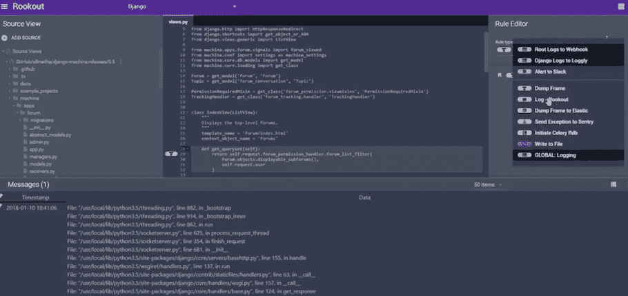

# 基础设施即代码时代的无服务器监控

> 原文：<https://thenewstack.io/serverless-monitoring-in-the-age-of-infrastructure-as-code/>

监控无服务器系统需要一个新的接受度，即在分布式应用程序架构时代，代码和产品测试等基础设施正在大规模地进行软件开发。

无服务器监控工具 [Rookout](https://www.rookout.com/) 的首席执行官兼联合创始人[或 Weis](https://www.linkedin.com/in/orweis/) 说:“我们看到了软件开发的快速转变。“软件现在有成千上万个实例，开发人员可能永远也看不到它们中的任何一个。例如，软件开发者可能永远不知道一个实例可能具有的环境特定的参数。因此，模拟代码在测试环境中如何运行的能力水平正迅速接近于零。”

> 监控不仅仅是针对性能、速度或超时设置警报这么简单，而是需要更高层次的思考，与应用程序的预期目标相关联。

Weis 说，这意味着在无服务器系统中的监控变成了在更高层次上理解可观测性。无服务器系统正在创造一种“基础设施即代码”的思维模式和实践，在这种思维模式和实践中，应用程序不仅拥有执行其功能和计算过程的所有代码，而且因为它运行在无服务器系统上，所以它还是实例的发起者，并在需要时自动扩展。

这意味着监控不仅仅是针对性能、速度或超时设置警报那么简单，而是需要更高层次的思考，与应用程序的预期目标相关联。这涉及到基础设施即代码等概念。

当我们说基础设施即代码时，它真正的意思是什么？“首先，这意味着你试图减少使软件更加敏捷所需的摩擦，”Weis 说。“其次，这意味着您需要与从基础架构到应用程序的所有软件层同步工作，因此您需要一个流程编排层来管理所有这些。”

Weis 解释了为什么我们需要一种新的方法来在这种环境中进行监控:“因此，您需要利用您的所有组织，并将其与您的应用程序设计相匹配。你的软件创造了一定的规模:它创造了新的集群，满足了新的用例。但是作为开发人员，我们当前的过程经常不能满足这个新的速度层。我们作为开发人员的工具并没有真正改变。所以现在我们已经达到了一个瓶颈，如果我们试图加快速度，我们就会被我们的能力所束缚。因此，我们必须加快我们自己的监控流程，以及我们观察和迭代的方式。”

Weis 说，如今在无服务器监控中没有必须具备的指标，相反，它需要与应用目标相关联。

你有哪些用例？它们会随着时间而改变吗？你的目标是什么？你的下一个功能是什么？客户将如何使用你的产品？就可观察性而言，你需要什么，你有多少时间，你需要多少时间？Weis 说，在你开始监测之前，你需要问这些问题。“这不再是询问具体的性能或您的功能需要运行的具体时间。专注于一个指标会让你看不到全貌。这也是许多开发人员正在转向的方向:让我们消除代码周围的干扰。”

为了帮助这种新方法，Weis 和他的团队建立了 Rookout，这是一种可插入的监控工具，可以将日志数据从无服务器系统馈送到现有的数据工具，如 Honeycomb、Datadog 和 Sentry.io。在与裸机微服务架构合作的同时，Rookout 越来越关注用于无服务器系统的 AWS Lambda 和 IBM 云功能。

Rookout 界面类似于一个 IDE，有四个窗格显示源文件、代码、规则引擎和响应。用户可以从基于 Git 的存储库中提取源代码，并在主窗格中显示代码，然后他们可以选择可能需要新的数据收集日志的行。已经建立了一系列定义好的数据收集规则，所以开发人员不需要在代码中的特定点编写他们想要洞察的数据。该监控工具旨在在现有的无服务器生态系统中工作，因此侧重于数据的收集和管道传输，允许用户将数据传输到他们首选的工具，无论是 in-IDE 响应窗格还是他们自己的数据工具。Honeycomb 存在集成，将结果直接提供给 Slack 和一系列其他工具。

使用 Rookout，除了确定数据日志应该何时运行，用户还可以定义他们想要接收的响应，包括他们需要看到的任何特定参数。“基本上，对于 AWS Lambda，这添加了一个依赖项，然后用我们的包装器包装函数。它不会以任何方式减缓生产，”韦斯说。

由于开发中的测试越来越无用，这里的机会是数据日志可以被返回并推送到数据工具或 Slack，或者另一个输出接口，同时功能继续执行和运行。

“这使我们能够以以前不可能的方式使用无服务器。你过去必须停下来看看发生了什么。一旦你停止一个函数，你的整个调试系统就变得无用，因为它不再是实际的处理环境。您可以查看您想要的所有数据，但您可以不受干扰地获得生产级质量的数据。这是基础设施即代码的方法，”Weis 说。

专题图片: [Lou Levit](https://unsplash.com/photos/B4op5oZ4x5Q?utm_source=unsplash&utm_medium=referral&utm_content=creditCopyText) 在 [Unsplash](https://unsplash.com/search/photos/rook?utm_source=unsplash&utm_medium=referral&utm_content=creditCopyText) 上拍摄的照片。

<svg xmlns:xlink="http://www.w3.org/1999/xlink" viewBox="0 0 68 31" version="1.1"><title>Group</title> <desc>Created with Sketch.</desc></svg>