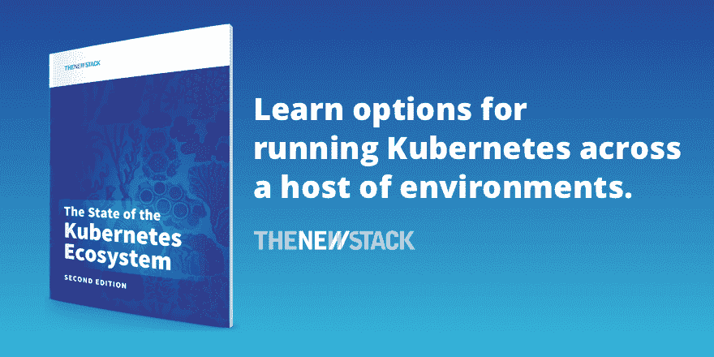

# 调查显示，K8s 用户欢迎无服务器多云

> 原文：<https://thenewstack.io/serverless-multicloud-popular-with-k8s-users-survey-says/>

根据[的一项新调查](https://www.cockroachlabs.com/guides/kubernetes-trends)，无服务器技术，这个时刻[似乎总是处于到来](https://thenewstack.io/has-serverless-jumped-the-shark/)的尖端的尖端技术，终于到来了——至少对 Kubernetes 的用户来说是这样。

在这项针对 IT 专业人士的新研究中，88%的参与者表示，他们要么正在使用无服务器计算，要么正计划这样做。

根据这项研究，混合和多云环境也正在被迅速接受。65%的调查受访者表示，他们将在年底前积极迁移到该架构。另有 20%的人预计将在 9 个月或更长时间内到达那里。

这种转变并不容易:三分之一的调查参与者表示，在 Kubernetes(有时称为 K8s)上运行工作负载时，导航混合和多云需求是他们的主要关注点。

这些发现让蟑螂实验室的首席产品宣传员[吉姆·沃克](https://www.linkedin.com/in/jwwalker/)大吃一惊，蟑螂实验室与[红帽 OpenShift](https://www.openshift.com/try?utm_content=inline-mention) 共同发起了这项研究。这两家公司发起了这项调查，以发现已经采用 Kubernetes 的组织是如何使用它的——以及更广泛采用的障碍可能是什么。

“多云和混合云是一件非常困难的事情，特别是对于 Kubernetes，”Walker 告诉新堆栈。“由于网络、存储和安全性的复杂性，我们通常认为 Kubernetes 处于单一环境、单一控制平面中。

“事实上，很长一段时间以来，我们一直试图找出 Kubernetes 集群联盟作为 Kubernetes 社区中的一个社区。这很困难。”

他补充说，显示无服务器技术被广泛采用的结果特别值得注意:“我真的很惊讶，因为我认为这仍然是一种尖端技术，如果不是尖端技术的话。”

gate point Research[对来自美国企业和小型组织的 202 名 IT 专业人员进行了调查，他们代表了各种行业。所代表的绝大多数组织是财富 1000 强公司。](https://www.gatepointresearch.com/)

## 挑战:事务性工作负载

在 Kubernetes 首次发布七年后，关于如何使用它的许多问题仍然没有答案。哪些工作负载正在其上运行？多少？谁在管理他们？

这项调查揭示了其中的许多秘密，包括用户面临的挑战。

[K8s 被设计用来处理无状态应用](https://thenewstack.io/3-reasons-to-bring-stateful-applications-to-kubernetes/)；有状态或事务性应用程序，[数据丰富的工作负载](https://thenewstack.io/stateful-workloads-on-kubernetes-with-container-attached-storage/)，保存活动中的客户端数据以供将来使用。

在有效设计和部署 Kubernetes 时，事务性或有状态工作负载是调查受访者最常提到的问题，有 46%的受访者提到了这个问题。

> “人们真的想在 Kubernetes 上运行事务性工作负载，”他说。“他们正在运行数据库，它就在 Kubernetes 旁边，只是不在上面。不在同一个环境。”

— **吉姆·沃克，蟑螂实验室的首席产品宣传员**

该报告指出，这一挑战“被最多的参与者列为关切事项。它还被选为一个单一的关注点，超过了任何其他类别(远远超过其他类别)。”10%的受访者认为这是他们唯一的挑战。

沃克承认，作为一家数据库公司的员工，他在这个话题上确实有既得利益，但他仍然对这个结果感到惊讶。

“人们真的想在 Kubernetes 上运行事务性工作负载，”他说。“他们正在运行数据库，它就在 Kubernetes 旁边，只是不在上面。不在同一个环境。”

研究发现，59%的参与组织在 Kubernetes 上运行有状态和无状态工作负载，而 28%的组织在 K8s 上运行或计划运行有状态应用程序。只有 15%的人在 Kubernetes 上运行或计划运行无状态工作负载。

Walker 指出，希望或需要在分布式架构上运行事务性应用的团队面临着持续的挑战。“豆荚短暂的本质实际上是违反直觉的，”他说。“在过去几年中，随着 Kubernetes 的一些进步，这变得容易多了。但我认为旧的数据库不是为这种新的基础设施而构建的。”

其他最常提到的挑战包括:

*   **近 45%的受访者提到了传统工作负载的复杂迁移**。它仅次于事务性工作负载，但很少有调查参与者选择这作为他们的唯一挑战。
*   41%的调查参与者提到了培训团队和建筑专家。此外，
*   **33%的参与者提出了混合和多云需求**。
*   **预算**被 23%引用。
*   **当前带宽和招聘**被认为是 18%的挑战。

## 谁在看集群？

运行 Kubernetes 的组织使用它来运行一些服务和应用程序或许多服务和应用程序，几乎没有中间地带:

*   38%的受访组织在 Kubernetes 上运行(或计划运行)五个或更少的服务/应用。
*   同时，42%的企业正在运行或计划运行 15 种或更多的服务和应用。

沃克和该报告的作者、蟑螂实验室的高级技术内容经理米歇尔·吉诺(Michelle Gienow)说，这些结果表明需要进一步研究，规模经济是否在组织使用 Kubernetes 时要么保持小规模，要么变大，没有太大的中间值。

只有 5%使用完全托管的云服务；其余的依靠内部专业知识；在依赖托管云服务的组织中，75%的组织报告在 Kubernetes 上运行五个或更少的工作负载。

该研究还揭示了组织依赖谁来运行其 K8s 工作负载。

*   在 54%的参与组织中，一个 DevOps 或站点可靠性工程(SRE)团队维护 Kubernetes。
*   但是 41%的人报告说他们的组织中的多个团队分担了责任。
*   在使用专用开发运维服务/SRE 的公司中，19%的公司表示团队至少有 10 名成员，而 32%的公司拥有 2 到 10 名成员的开发运维服务/SRE 团队。

“我们不知道的是这些类型的团队和各种工作负载之间的关系，这是我们接下来要深入研究的，”Gienow 说。

她补充说，“跨职能团队的团队和公司通常处于 CI/CD 工作流中，或者将大量工作负载分配给许多团队，这是有道理的，因为这是我的微服务的全部魅力，对吗？但我们不能确定。”

Walker 说，结果表明 K8s 用户需要更多地分享他们如何使用 container orchestrator 开展日常业务的信息。

“对话总是围绕着这些技术，”他说。“它必须更多地关注真实世界的使用案例和正在发生的事情。这就是转变。这就是我们作为一个社区现在需要做的。”

*要了解 K8s 如何在各种环境中工作，请免费下载最新版的新 Stack 电子书[“Kubernetes 生态系统的状态”](https://thenewstack.io/ebooks/kubernetes/state-of-kubernetes-ecosystem-second-edition-2020/)*

<svg xmlns:xlink="http://www.w3.org/1999/xlink" viewBox="0 0 68 31" version="1.1"><title>Group</title> <desc>Created with Sketch.</desc></svg>