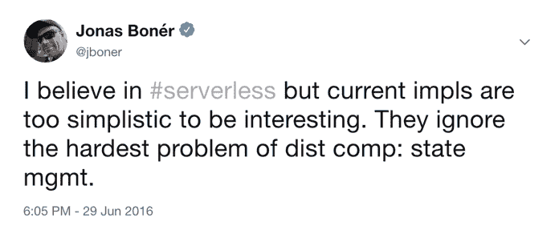

# 无服务器需要更大胆、更有状态的愿景

> 原文：<https://thenewstack.io/serverless-needs-a-bolder-stateful-vision/>

[Jonas bonér](https://www.lightbend.com/)

[Jonas bonér 是 Lightbend 的联合创始人，Akka 事件驱动中间件项目的创建者。此前，他是 Terracotta 的核心技术贡献者，从事核心 JVM 级别的集群技术，并在 BEA 作为 JRockit JVM 团队的一员。Jonas 也是开源项目的积极贡献者，包括 AspectWerkz 面向方面编程(AOP)框架和 Eclipse AspectJ 项目。他是一名业余爵士音乐家，热爱滑雪，拥有瑞典中部大学的理学学士学位。](https://www.lightbend.com/)

在 2005 年的一次网格计算活动——globus World 上——当时的 Network World 主编 John Dix 主持了思科、惠普、IBM、英特尔、北电和 SAP 的发言人关于网格和联网机器未来的对话。他的开场白:

*“许多人认为，当今组织的平均系统利用率为 15%到 20%，而显然，理想的利用率应该在 80%左右。此外，大约 20%的 IT 预算用于运营，略低于指定用于资本投资的 25%。我们创建了大型、未充分利用的复杂环境，维护成本高昂。因此，我们非常需要做得更好，而在这一点上，主流的想法似乎是网格就是答案。”*

接下来的对话是一个有趣的时间胶囊，预测了 15 年前分布式计算和云对企业堆栈的影响，其中很多是准确的。

大约 15 年前，它是关于资源利用，以及公司从服务器和数据中心的巨额资本支出转向按需付费的模式——这是市场的需求，也是我们今天所知的云计算的形成原因。

> 然而，无服务器的编程模型仍然主要限于无状态功能，即所谓的功能即服务(FaaS)模型，这限制了支持的用例范围。

现在，对未来下一波计算浪潮的新共识是*速度*——更快地让开发人员获得他们需要的东西，更快地从数据中获得价值，更快地处理数据，更快地交付软件，同时保持可靠性和可预测性保证。

我们正处于企业计算的另一个转折点，未来的大愿景背后有一股强大的推动力，即向*无服务器*架构的推动力——一个运营中需要更少人工监督和参与的世界。

## 但是，当我们想象这个未来时，无服务器的愿景是如何局限于功能的呢？

我坚信无服务器运动。去年有很多有趣的工作(例如围绕[的 Knative 项目](https://github.com/knative/))在无服务器 UX 上扩展，覆盖了整个软件生命周期，从构建(源代码到映像)，到 CI/CD 管道，到部署，到运行时管理(自动缩放，缩放到 0，自动故障转移，等等)。).然而，编程模型仍然主要限于无状态功能，即所谓的功能即服务(FaaS)模型，这限制了支持的用例范围。

目前，我看到很多对话将 FaaS 与无服务器混淆。类似于区块链被(错误地)与比特币互换使用(比特币是区块链的实现，而不是等价的)，FaaS 是一个无服务器的实现。虽然我认为 FaaS 是一项伟大的技术，但它是在兜售无服务器的承诺。无服务器是关于 UX 的，UX 可以解决许多实现，FaaS 是第一个。

但是为什么首先要对函数大惊小怪呢？函数作为软件的底层构件非常有用。函数式编程完全是关于用函数编程的——将函数作为一级值使用，这些值可以被发送、组合和重用。这是一个很好的抽象概念。我将函数定义为本质上简单的乐高积木，具有定义明确的输入和输出——接收数据，处理数据，并输出新数据。一个纯函数是无状态的，这使得它是可预测的，你可以相信给定一个特定的输入，它将总是产生相同的输出。

一个功能的输出可以成为另一个功能的输入，这样就可以像乐高积木一样将它们串联起来，由可重复使用的小部件组成更大的功能。单个功能本身并不那么有用，因为它们(应该)有一个有限的范围，提供单一的明确定义的功能。但是通过将它们组合成更大的函数，您可以构建丰富而强大的组件或服务。Scala 是主流语言中功能强大的一个例子(另一面是面向对象)。

FaaS 的想法是将这些定义明确的小功能组合成更大的工作流，所有这些都由事件(数据)的生产和消费驱动。这种数据传送架构非常适合面向数据处理的用例，在这些用例中，功能被组合到工作流中，处理下游数据，并最终产生一个结果作为事件发出，供用户或其他服务或系统使用。

但它不是构建现代实时数据中心应用程序和系统的通用平台。与所有旨在很好地解决狭窄和特定问题的有针对性的解决方案一样，当超出其预期范围使用时，它会受到痛苦的约束和限制。

其中一个限制是 FaaS 函数是短暂的、无状态的和短命的(例如，Amazon Lambda 将它们的生命周期限制为 15 分钟)。这使得构建通用的以数据为中心的云原生应用程序变得困难，因为从性能、延迟和吞吐量方面来看，失去计算上下文(引用位置)并被迫一次又一次地从后端存储加载和存储状态的成本太高了。另一个限制是函数没有直接寻址能力，这意味着它们不能使用点对点通信直接相互通信，而总是需要求助于发布-订阅，通过一些缓慢而昂贵的存储介质传递所有数据。这种模型可以很好地用于事件驱动的用例，但对于解决通用分布式计算问题来说，会产生过高的延迟。关于这一点的详细讨论，以及 FaaS 的其他限制和问题，请阅读 Joe Hellerstein 等人的论文[“无服务器计算:前进一步，后退两步”](http://cidrdb.org/cidr2019/papers/p119-hellerstein-cidr19.pdf)。

Functions 是一个伟大的工具，它在云计算工具包中占有一席之地，但是对于无服务器来说，要实现行业要求的无运营世界的宏伟愿景，同时允许我们构建以数据为中心的现代实时应用程序，我们不能继续忽视分布式系统中最困难的问题:管理*状态*——您的数据。

### 状态是最难的部分，也是无服务器最有趣的机会

在应用程序开发的云原生世界中，我仍然看到对无状态的、通常是同步的协议和设计的强烈依赖。人们拥抱容器，但是太经常地坚持旧的架构、设计、习惯、模式、实践和工具——为运行在全能的 SQL 数据库之上的单片单节点系统的世界而制造。

今天的无服务器运动非常关注底层基础设施的自动化，但在某种程度上忽略了应用层同样复杂的要求，在应用层，向快速数据和事件驱动的有状态架构的转变为生产中的操作系统带来了各种新的挑战。

忽略最困难的部分(状态)并将它的责任推给应用层听起来是个好主意——有时确实如此。然而，随着当今应用程序变得越来越以数据为中心和数据驱动，通过一种高效、高性能和可靠的方式管理、处理、转换和丰富应用程序本身的数据来掌控您的数据变得比以往任何时候都更加重要。

许多应用程序无法承受每次数据访问或存储都要往返数据库的代价，而我们在传统的三层架构中已经习惯了这样做，但需要以接近实时的方式连续处理数据，在数据“飞逝”时从永无止境的数据流中挖掘知识。为了可扩展性、低延迟和高吞吐量，数据通常还需要以分布式方式进行处理，然后才能存储。

这种从“静态数据”到“动态数据”的转变迫使许多公司采用分布式流处理和事件驱动的微服务来加快数据架构，从而将状态状态和数据管理置于应用设计的中心。

这只是分布式应用程序中管理状态的许多关注点的起点，也是无服务器运动必须征服的领域，以不断取得有趣的进展，实现其提高抽象级别和减少生产中系统操作的人工交互的目标。

### 没有状态的无服务器并不有趣

差不多三年前，我在推特上发了这条微博，我认为它在很大程度上仍然是正确的(尽管在改进和扩展整体无服务器 UX 方面已经取得了很多进展)。

虽然 1.0 版本的无服务器完全是关于无状态函数的，但 2.0 版本将主要关注状态——允许我们在享受无服务器 UX 的同时构建通用的分布式应用程序。

如果无服务器在概念上是关于如何将人类从等式中移除，并解决开发人员在生产中对系统进行推理的最困难问题，那么他们需要具有丰富且易于理解的语义的声明性 API 和高级抽象(超越函数等低级原语),以便处理永不停止的数据流，管理复杂的分布式数据工作流，并以可靠、有弹性、可伸缩和高性能的方式管理分布式状态。

示例包括支持有状态的长寿命虚拟可寻址组件[^(【1】)](#_ftn1)，用于大规模可靠地管理分布式状态的工具，其一致性选项范围从强[^(【2】)](#_ftn2)到最终和因果一致性[^(【3】)](#_ftn3)，并且能够推理流式管道及其作为整体所具有的属性和保证[^(【4】)](#_ftn4)。

### 结论:无服务器的需求正从基础设施发展到应用程序逻辑

该企业正在其轨道上广泛地在容器、Kubernetes 和云原生框架上重新平台化数据中心，其采用和势头非常显著。

我经常听到的一个问题是:*“现在我的应用程序已经容器化了，我还需要担心所有那些硬分布式系统的东西吗？Kubernetes 不会解决我在云弹性、可伸缩性、稳定性和安全性方面的所有问题吗？”*不幸的是，答案是*“不，绝对不”*——事情没那么简单。

虽然我认为 Kubernetes 是管理和编排云中容器的最佳方式，但它并不是解决应用程序级别编程挑战的灵丹妙药，例如:

*   应用程序的底层业务逻辑和操作语义。
*   管理分布式应用数据的一致性和完整性。
*   管理分布式和本地工作流和通信。
*   与其他系统的集成。

在 1984 年的经典论文[“系统设计中的端到端争论”](http://web.mit.edu/Saltzer/www/publications/endtoend/endtoend.pdf)中，Saltzer、Reed 和 Clark 讨论了一个问题，即底层基础设施中的许多功能(该论文讨论了通信系统)只能在端点应用的帮助下才能完全正确地实现。

这并不是反对使用像 Kubernetes 和 Istio 这样的底层基础设施工具——它们显然带来了巨大的价值——而是呼吁基础设施和应用层之间在维护整体正确性和安全保证方面进行更紧密的协作。

端到端的正确性、一致性和安全性对于不同的服务有不同的含义。它完全依赖于用例，不能完全外包给基础设施。引用 Pat Helland 的话:“不确定性的管理必须在业务逻辑中实现。”

换句话说，一个整体稳定的系统仍然是应用程序的责任，而不是所使用的基础架构工具——下一代无服务器实施需要提供编程模型和整体 UX，与维护这些属性的底层基础架构协同工作，而不是继续忽略最困难也是最重要的问题:如何在云中管理数据——可靠地进行大规模管理。

———-

[^(【1】)](#_ftnref1)这里所有的术语都很重要，我来澄清一下。有状态:内存中持久且有弹性的状态；长期:生命周期不绑定到特定的会话，上下文在显式销毁之前可用；虚拟:位置透明且可移动，不受限于物理位置；可寻址的:通过稳定的地址引用。具有这些特征的组件的一个例子是[演员](https://doc.akka.io/docs/akka/snapshot/actors.html)(演员模型)。

[^(【2】)](#_ftnref2)具有强一致性，我指的是[可串行化和/或可线性化](http://www.bailis.org/blog/linearizability-versus-serializability/)。

[^(【3】)](#_ftnref3)比如像[crdt](https://en.wikipedia.org/wiki/Conflict-free_replicated_data_type)这样的无序编程构造。

[^(【4】)](#_ftnref4)背压、开窗、完整性与正确性等属性。

<svg xmlns:xlink="http://www.w3.org/1999/xlink" viewBox="0 0 68 31" version="1.1"><title>Group</title> <desc>Created with Sketch.</desc></svg>