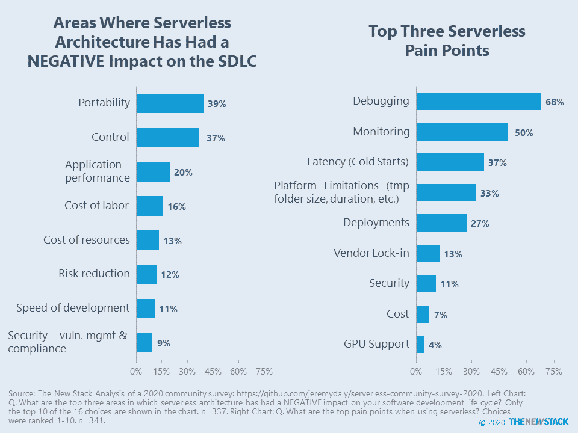
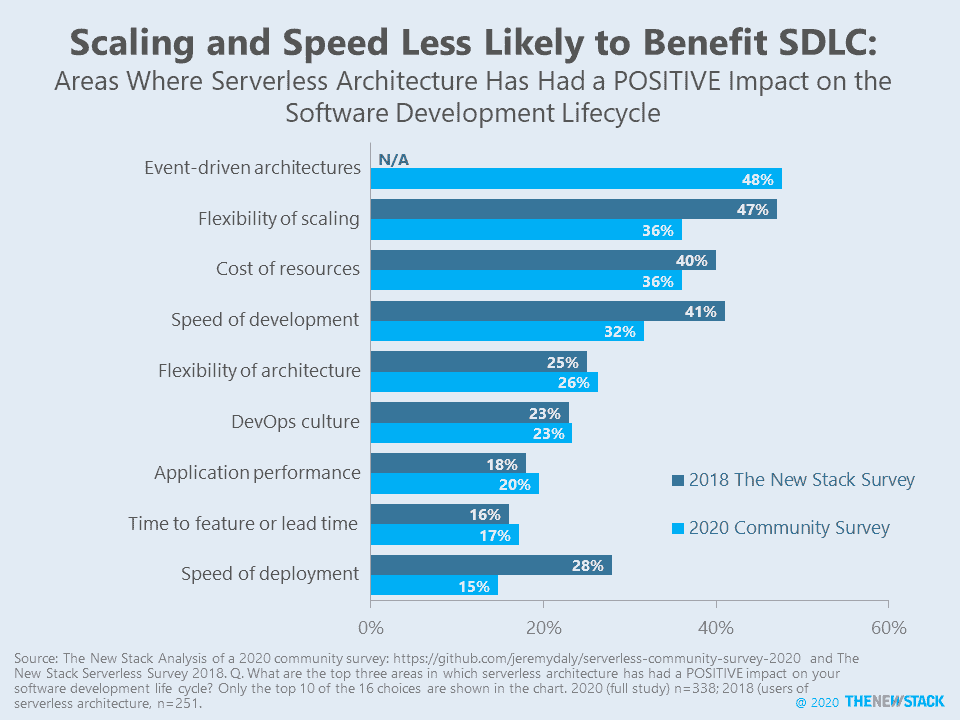

# 无服务器需要更多的观察工具

> 原文：<https://thenewstack.io/serverless-needs-more-observability-tools/>

自从我们在 2018 年发布“[无服务器技术指南](https://thenewstack.io/ebooks/serverless/guide-to-serverless-technologies/)”以来，无服务器应用的开发者没有太大变化，该指南调查了 300 多名无服务器架构的用户。当时，78%的受访者主要计划将无服务器架构用于新的工作负载，而不是现有的工作负载。根据主持[无服务器聊天](https://www.serverlesschats.com/)播客的[杰瑞米·戴利](https://www.jeremydaly.com/)主持的 2020 年社区调查，快进两年，75%的人计划在未来 12 个月建立一个绿地无服务器应用。结果的原始数据可以在 GitHub [repo](https://github.com/jeremydaly/serverless-community-survey-2020) 中找到。

这些调查具有可比性，部分原因是我们在项目的问题创建阶段与 Jeremy 进行了沟通。过去和现在，顶级用例都围绕 REST APIs 和业务逻辑。无论是过去还是现在，兴奋都集中在设计模式上，而不是惊人的技术上。与以前相比，现在采用的范围将继续扩大，但明显的障碍正在抑制企业快速扩展在无服务器架构上运行的工作负载。

调试和监控仍然是最大的无服务器难题。新的设计模式和越来越多的被管理的功能都与这些问题有关。超过一半的受访者在生产中运行 50 多种功能，行业分析师 Mark Wilcox 指出:“无服务器监控和可观察性工具的市场看起来将出现惊人的增长。”

[在过去](https://thenewstack.io/faas-selection-criteria-little-desire-for-multicloud/)，用户愿意牺牲云环境之间的可移植性和缺乏控制，以便他们可以从开发速度和扩展灵活性中获益。可移植性和控制继续在软件开发生命周期中产生问题，但是很少有人认为灵活的伸缩和更快的速度被认为是不太可能的结果。在 2020 年，事件架构被视为无服务器架构对软件开发生命周期产生积极影响的首要领域。

根据容器平台开发者 Karl Isenberg 的说法，这体现了平台抽象之间的一种 T2 式的永久权衡——你可以获得控制、灵活性和解决特定问题的能力，或者你可以选择一个带有简单 API 和集成用户界面的自以为是的堆栈。就其本质而言，AWS Lambda 和其他 FaaS 提供商属于第二类，但许多企业正在寻求更多的控制，也许是基于 Knative 项目。

亚马逊网络服务公司是新堆栈的赞助商。

Pixabay 的 skeeze 的专题图片。

目前，新堆栈不允许直接在该网站上发表评论。我们邀请所有希望讨论某个故事的读者通过 [Twitter](https://twitter.com/thenewstack) 或[脸书](https://www.facebook.com/thenewstack/)访问我们。我们也欢迎您通过电子邮件发送新闻提示和反馈: [feedback@thenewstack.io](mailto:feedback@thenewstack.io) 。

<svg xmlns:xlink="http://www.w3.org/1999/xlink" viewBox="0 0 68 31" version="1.1"><title>Group</title> <desc>Created with Sketch.</desc></svg>