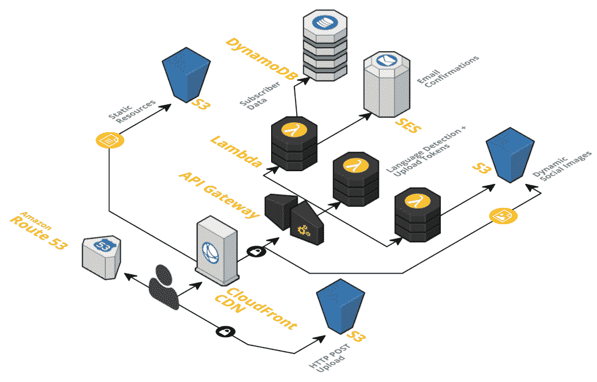

# 无服务器为 AWS Lambda 提供一个框架

> 原文：<https://thenewstack.io/serverless-offers-framework-aws-lambda/>

大规模使用 AWS Lambda 对于那些刚刚开始使用函数或者不熟悉无服务器计算的人来说是一个挑战。尤其是在企业环境中，在生产环境中启动并运行 Lambda 是一场与时间的赛跑。

这就是全新公司[无服务器](http://serverless.com)的用武之地。Serverless 为开发人员提供了一个无状态计算框架来管理运行在 [AWS Lambda](https://aws.amazon.com/lambda/details/) 和 [AWS API Gateway](https://aws.amazon.com/api-gateway/) 上的物联网、移动和网络应用，旨在让开发人员跟上已经在生产项目中工作的速度。

Lambda 虽然高效且创新，但在服务器管理方面[几乎没有提供什么。“在一个大型项目中使用 AWS Lambda 时，如果没有一个适合它们的框架，会有很多功能变得混乱，”无服务器创始人奥斯汀·柯林斯说。最初，柯林斯在寻找一种遏制功能蔓延的方法，他最初在周末将无服务器作为一个辅助项目，当他将存储库发布到网上时，立即得到了回应。](https://thenewstack.io/apex-makes-aws-lambda-easy-peasy-programmers/)

## 应用程序开发的未来将是无状态的

根据 Ryan S. Brown 的一篇详细介绍开发过程的博客文章，甚至在正式推出之前，Serverless 就已经被用来构建一个完全可扩展的应用程序来销售 Guetta 的最新单曲。该应用程序允许粉丝进入他们自己的虚拟录音室，每次通话都会生成大量独特的用户数据，包括专辑封面、声乐曲目和他们最喜欢的球队的旗帜。为快速扩展而构建的 Serverless 执行了一项艰巨的任务，即轻松地为一个应用程序提供动力来推广 Guetta 的单曲。

大卫·盖塔:这是给你的，谷歌 Nexus 10 上的应用测试机器人。

onboarding Serverless 的优势有很多，尽管有三个主要的好处会吸引任何使用 AWS Lambda 的企业级开发人员。

第一个，当然，围绕着这个平台如何得到它的名字。Serverless 使用无状态计算技术来支持其框架，尽管无状态意味着开发人员不必考虑自己管理服务器。虽然州和它的服务器实际上是存在的，但是 AWS 为开发人员管理它们。

> “我们认为 Lambda 将成为 AWS 的焦点”——Austen Collins，无服务器

由于不需要处理物理服务器维护，这意味着通常只需要很少的管理。然而，由于可以自由地将应用程序逻辑容器化，其用户发现这是合理的，在专注于更以数据为中心的方法来管理应用程序框架之前，Serverless 最初模仿微服务进行建模。

无服务器还利用 AWS Lambda 定价模型。这意味着考虑大规模实施 Lambda 框架的企业将只为他们实际使用的计算资源付费。

“每个人都有未充分利用的基础设施，他们整个月都在为此付费。有了 Lambda，就没有这种事了。只有当一个功能真正运行时，你才需要付费，”柯林斯说。

最重要的是，无服务器是敏捷的。通过利用 Lambda 的无状态计算框架，服务器、容器和应用程序编排被自动管理。然后，开发人员需要处理更重要的问题，比如如何封装应用程序的逻辑。

“这是给你的”应用程序的后端架构图。来源 Parall.ax 通过瑞安 s .布朗。

这种灵活性为开发人员提供了将应用程序推向生产的自由和灵活性，并且易于扩展。Lambda 依赖于数据模式，为了更好地支持这些模式，Serverless 将其框架交织在一起。通常，在构建应用程序时，开发人员会使用 REST API，以及针对各个 web 点的 Lambda 函数。

随着该公司不断更新其应用程序，Serverless 可以更新每个单独的 API 端点，而不会影响任何其他端点。“其他人会用一个 Lambda 函数，把它挂在多个端点上，玩一个 monolith 模式。它们可能有一个或两个包含所有应用程序逻辑的函数。柯林斯说:“我们使用 GraphQL 为他们提供这种能力。

## 辞旧迎新

与其试图强迫开发者一夜之间接受无状态计算，Serverless 的目标是用一种熟悉的方法来创建它的平台。为了尽可能接近传统的应用程序开发，该公司避免向开发者强加新的模式。由于对当前社区环境中太多不同方法的高度关注，Serverless 接受了开发人员社区在构建之前已经接受的传统原则。

如今，使用 [AWS Lambda](https://thenewstack.io/aws-gets-serious-lambda-adds-python-cron-scheduling/) 可以实现的目标是无限的。尽管一些企业正在 Lambda 框架上重新构建单一的 web 应用程序，但其他企业已经通过采用无状态计算挽救了数百个应用程序。Collins 提供了一种洞察，它揭示了内省和创新应用程序开发的本质。

“最终，没有整体应用，没有微服务，没有纳米服务。只有你的逻辑和在逻辑之间划线的自由——按照你喜欢的方式分离逻辑，”他说。

通过摆脱分层定价的永不停机资源，或那些基于服务器运行向用户收费的资源，公司可以通过无服务器计算在一年内节省大量成本。通常，公司将 IT 成本设置为自动循环，而没有意识到他们可能只使用了所付费用的 15%。有了 AWS Lambda，用户只有在功能实际运行时才付费。

AWS Lambda API 调用预警设置图

充分利用无服务器无疑需要潜在用户至少对 AWS 有一个基本的了解，但比你想象的要少。

“你真的不用知道那么多。我们尽量避免人们去查看 AWS 仪表板或 AWS 文档。我们希望通过无服务器 CLI 提供完整的 AWS 体验，”柯林斯说。

AWS Lambda 不仅为开发基于网络的应用程序的开发人员提供了大量机会，也为开发移动和物联网应用程序的开发人员提供了大量机会。通过利用 Lambda 和 AWS API Gateway，开发人员能够构思的几乎任何东西都有可能在无服务器框架上运行。

Collins 指出，用户可以使用无服务器构建一个完整的 REST API 后端，其中包含大量函数，用于响应 AWS 事件、处理 REST、等待用户 AWS 帐户上的触发器并执行所需的功能。

控制台中的 AWS Lambda 功能上传

Collins 声称，这是第一个 AWS Lambda 驱动的开发框架，将应用程序代码与基础设施结合在一起。“我们认为 Lambda 将成为 AWS 的焦点，”柯林斯说。

用户可以将 REST API 和应用程序逻辑部署到云中，控制 Dynamo 等等。Serverless 还支持多种编程语言，让开发人员可以自由地用各种流行的脚本语言编写应用程序。随着对 [Node.js](https://nodejs.org/en/) 和 [Python](https://www.python.org/) 的支持，Collins 注意到对 Java 的支持正在进行中。

除此之外，Serverless 允许开发人员组合他们的脚本语言，能够在同一个应用程序中混合 JavaScript/Node.js 和 Python。Python 支持对无服务器团队来说是新事物，因为他们主要以 Node.js 为中心。Serverless 在前端和后端都由 Node.js 提供支持，其框架的大部分由 JavaScript 组成。

在前端使用相同的语言，并使编程新手或初学 JavaScript 的开发人员可以使用 Serverless。刚刚开始应用程序开发的个人可以查看 GitHub 上的无服务器存储库，并且无需费力就能理解它。柯林斯指出，无服务器团队努力使平台可扩展，用各种方式支持开发人员努力改进平台本身。

“开发者需要能够挖掘和破解东西。一个好的开发工具必须是 100%可黑客攻击的，并且是完全可修改的，”他说。

为此，任何无服务器可以做的事情，开发者都可以用插件覆盖或扩展。

官方的无服务器网站将在一周内发布，将会有很多对 AWS Lambda 无状态框架感兴趣的个人的贡献。迄今为止，Serverless 在其 GitHub repo 上已经获得了近 7000 颗星，并且没有任何短期内放缓的迹象。

通过 Pixabay 的特征图像。通过[瑞安·布朗](https://serverlesscode.com/post/david-guetta-online-recording-with-lambda/)嵌入图像。

<svg xmlns:xlink="http://www.w3.org/1999/xlink" viewBox="0 0 68 31" version="1.1"><title>Group</title> <desc>Created with Sketch.</desc></svg>