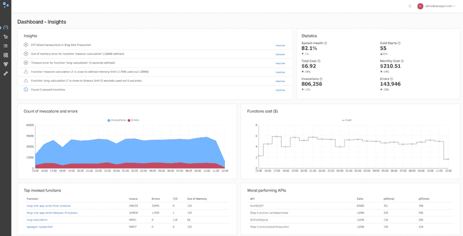

# 无服务器定价:估计消费成本

> 原文：<https://thenewstack.io/serverless-pricing-estimating-consumption-costs/>

无服务器将基于消费的定价理念带到了 IT 预算的前沿，最终将彻底改变公司和企业的决策和组织结构。无服务器已经使新的创业公司更加可行，并允许企业以更低的风险更快地进行实验，因为生产不依赖于分配服务器基础设施来运行新的应用程序或部署尚未经过市场测试的产品功能。

通常，走向无服务器的最初动力是关于开发人员的速度。向企业和政府提供快速测试新想法的机会，而没有基础设施成本开销，这激发了兴趣并推动了初步实施。但是，如果不加以监控，无服务器成本可能会导致与传统系统一样大的基础架构成本。

“我们发现人们越来越担心无服务器系统的成本，”[爱普生](http://epsagon.com)首席执行官兼联合创始人[尼赞·沙皮拉](https://www.linkedin.com/in/nitzan-shapira-521291108/?originalSubdomain=il)说。“人们希望了解他们在无服务器中的成本，因为它是按使用付费的。越来越多的采纳者现在在问:我们支付什么，为了什么？是因为代码慢，还是因为我们用的一个 API？他们需要能够以非常商业和符合逻辑的方式分析成本。”

## 找到函数运行时的最佳点

无服务器系统的定价虽然没有完全商品化，但 AWS、Azure Functions、Google Cloud Platform 和 IBM OpenWhisk 都以类似的方式构建。每百万次调用都要对函数收费。然后，用户可以选择分配给计算时间的内存大小。

从表面上看，为计算选择最低的内存分配似乎是最便宜的，代价是运行时可能会更慢。但是正如杰瑞米·戴利在今年早些时候 AWS 举办的创业日活动中与[分享的那样，“调整你的函数的计算能力有很大的好处。”](https://www.jeremydaly.com/15-key-takeaways-from-the-serverless-talk-at-aws-startup-day/)

由于较小的内存分配可能会延长执行时间，因此总成本可能会更高。Daly 分享了由亚马逊网络服务的高级开发人员 Chris Munns 提交的数据，该数据表明，在 1000 次调用后，分配 128MB 的内存大小可能需要花费 0.024628 美元，耗时 11.72 秒。然后，256MB 和 512MB 内存大小分配的价格略有上升，但最有趣的是，当用户分配 1024 MB RAM 进行计算时，执行时间下降到 1.47 秒，但成本仅为 0.00001 美元，为 0.024638 美元。

去年在纽约举行的 Serverlessconf 会议上，几位发言人都分享了关于寻找无服务器定价最佳点的类似发现，而不考虑云供应商。

## 定价不仅仅是调用和计算

然而，除了计算时间所需的函数调用和内存分配之外，在一个完整的无服务器系统或工作流中还会增加其他成本。[来自 IP 地理定位 API 公司](https://github.com/jonathan-kosgei) [ipdata](https://ipdata.co/) 、[的 Jonathan Kosgei](https://medium.freecodecamp.org/how-we-serve-25m-api-calls-from-10-scalable-global-endpoints-for-150-a-month-911002703280) 写道，无服务器给了他们“优惠的价格”和无限的规模和高吞吐量。这是他们的全球服务所需要的，该服务需要根据网站访问者的 IP 地址快速返回他们的位置，以便提供定制的和区域相关的内容。但这样一个在 AWS 中设计的无服务器系统，不仅需要 lambdas，还需要 API Gateway、Dynamodb、CloudWatch 服务的使用和 Kinesis。

> “我们已经看到一些公司因为代码出错而收到了一张 5 万美元的账单。”

对于 Kosgei 来说，是意外的 CloudWatch 使用，包括警报和请求，并且由于 CloudWatch 只存储 24 小时的日志，因此更长期的日志存储也涉及到额外的成本。从好的方面来看，Kosgei 指出他的 Dynamodb 成本低于预期，因为可能会过度提供 rcu 的使用，但计费是基于使用的，因此只有在任何设定的时间范围内使用的那些才会被收费。他指出，理解 Dynamodb 的定价体系也需要一个学习过程。

Elliot Forbes [还发现了无服务器系统](https://read.acloud.guru/scaling-your-static-site-to-a-global-market-for-a-fraction-of-the-cost-on-aws-12d23f30f877)的额外成本，因此尽管他能够通过使用无服务器将托管单页 web 应用的总成本从每月 20 美元降至每月 7 美元，但这些成本中的大部分来自 CloudFront，一小部分来自 Route53 和 S3 存储公司。

另一个隐性成本来自 API 请求。Spotinst， [的首席执行官兼创始人 Amiram Shachar 在年初](https://medium.com/@amiram_26122/the-hidden-costs-of-serverless-6ced7844780b) 写道，这是无服务器系统最昂贵的定价要素之一。“由于许多无服务器应用程序大量调用 API，这可能会非常昂贵，大约每执行 100 万次需要 3.50 美元，”他指出。

## 在无服务器中，性能和成本紧密相关

来自 Epsagon 的 Shapira 说，理解无服务器成本的关键是要超越单个功能，看到完整的无服务器业务流程。

他说，分布式跟踪是理解无服务器系统的关键，以便首先监控性能，进而确定成本。

“要真正弄清楚无服务器系统中发生了什么，你必须以某种方式将事件联系起来。这就是我们考虑无服务器成本和分布式跟踪的原因，”Shapira 说。“我们使用代码工具和人工智能技术将无服务器应用分成不同类型的流，例如，一种类型的流可能是用户注册系统，另一种类型的流是用户付款。然后，您可以识别最频繁的流和最高优先级的流。然后你可以弄清楚，你怎么知道为什么业务流程需要一秒钟？是因为您的代码速度慢，还是因为您使用的 API 降低了性能？”

Shapira 说，这是一个核心问题，因为当无服务器系统的性能受到影响时，这是通过定价来实现的。Shapira 解释说:“当你考虑整个系统时，成本进来得非常快。当你期待一张 5000 美元的账单时，你如何真正知道你不会在月底得到一张 100000 美元的账单？我们已经看到一些公司因为代码出错而收到了 5 万美元的账单。”

Shapira 说，无服务器定价基本上是你的代码运行多长时间乘以一些因素，比如计算资源(加上上面提到的所有额外费用)。但这表明，专注于优化函数代码的编写，使其小而高效，将会降低成本。

“您的函数的总时间和成本更受 API 的影响，包括 AWS 的 API，或任何第三方，如 Twilio 或 Stripe。即使这些 API 中的一个运行缓慢，您也可能会付出很大的代价。如果它们以每秒 50 毫秒的速度工作，并且一个月内发生一百万次，那么成本就会增加。你需要识别你正在使用的所有 API，我们的系统会告诉你这些 API 运行缓慢，”Shapira 建议道。

Epsagon 仪表板显示性能和成本之间的联系

映射和识别所有正在使用的无服务器工作流的另一个目标是，更容易区分哪些工作流是核心业务不可或缺的，而不是为没有增加相应业务价值份额或没有创收的工作流支付更高的费用。

## 监控企业无服务器产品定价的新方法

目前，许多开始采用无服务器的人并没有看到这些隐藏的定价问题。获得最大优势的是那些购买未充分利用的服务器并迁移到无服务器的用户，他们的基础架构成本大幅降低。已经建立了新的无服务器应用但尚未达到规模的初创公司和颠覆者也从基于消费的定价中受益，在这种定价中，他们的使用水平可能意味着他们每月无需支付任何费用或支付很低的费用。

但是，那些寻求将服务器自动扩展作为其采用无服务器的关键优势的大型企业，面临着将财务钥匙交给无服务器云提供商的风险。密切监控与峰值相关的风险，并确保估计成本不会因无服务器工作流和系统的低性能而增加，这将是工程副总裁和企业架构师在未来一年的新重点。

专题图片:[阿尔瓦罗·雷耶斯](https://unsplash.com/photos/MEldcHumbu8?utm_source=unsplash&utm_medium=referral&utm_content=creditCopyText)在 [Unsplash](https://unsplash.com/search/photos/cash-register?utm_source=unsplash&utm_medium=referral&utm_content=creditCopyText) 拍摄的照片。

<svg xmlns:xlink="http://www.w3.org/1999/xlink" viewBox="0 0 68 31" version="1.1"><title>Group</title> <desc>Created with Sketch.</desc></svg>