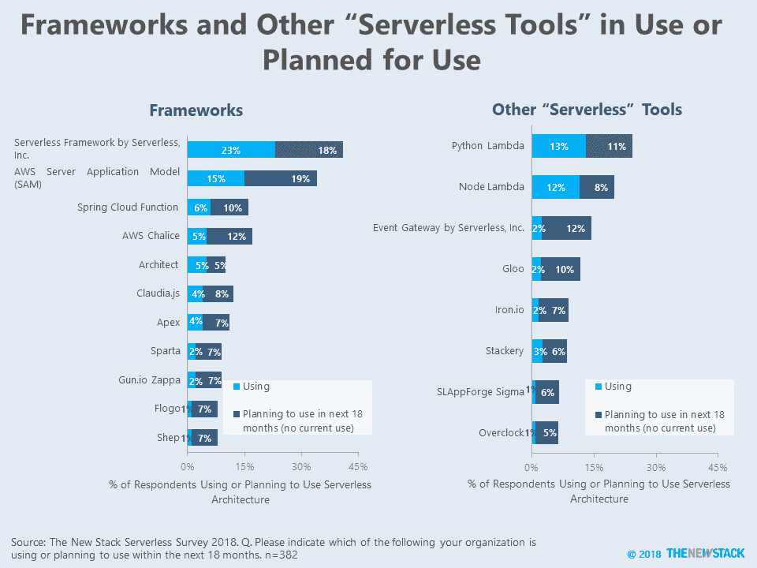
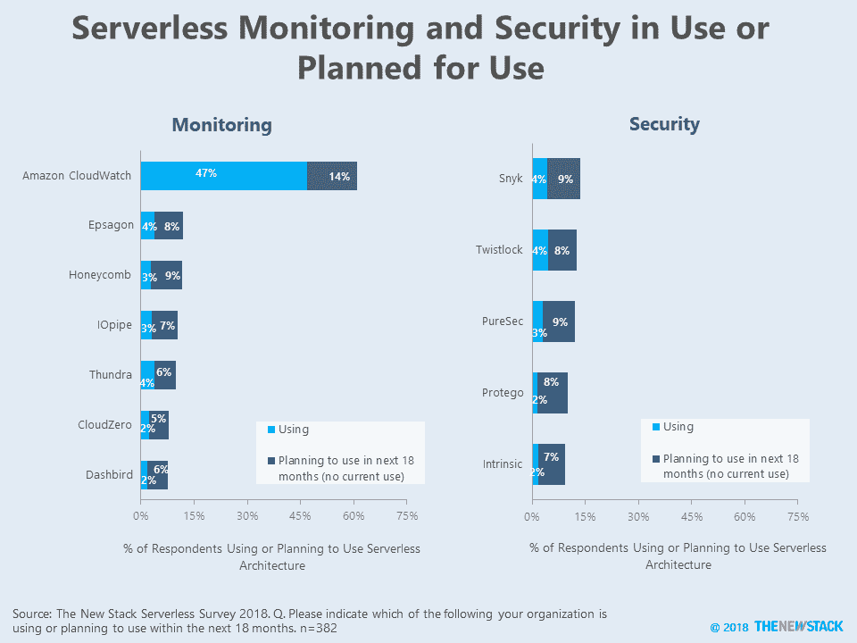

# 无服务器路线图:监控、安全性、框架、工具

> 原文：<https://thenewstack.io/serverless-roadmaps-monitoring-security-frameworks-tools/>

运行无服务器工作负载的[平台](https://thenewstack.io/serverless-roadmaps-platforms/)只是在整个软件开发生命周期中管理和监控应用程序的更大工具生态系统的一个方面。尽管许多解决方案是开源的，但是随着企业将无服务器应用程序转移到生产环境中，有大量公司希望从中获利。本文使用调查数据来展示那些使用无服务器架构的人正在采用哪些工具。

框架使得开发和部署应用程序变得更加容易。在我们的调查中，最受欢迎的框架是由 Serverless，Inc. 开发的[无服务器框架，它可以在许多不同的云平台上使用。无服务器公司已经成功地将其早期的领先地位转化为采用另一种 oft is 产品，](https://serverless.com/framework/)[事件网关](https://serverless.com/event-gateway/)，它路由事件并协助 API 开发。我们发现，目前 7%的无服务器框架用户已经部署了 Event Gateway，另外 20%的用户计划在未来 18 个月内这样做。第二个最常提到的框架只对以 AWS 为中心的开发有帮助，来自 Amazon Web Services 的[服务器应用程序模型](https://github.com/awslabs/serverless-application-model)。

正如我们之前[报道的](/add-it-up-prepare-for-an-onslaught-of-go-language-serverless-functions/)，62%的预期使用无服务器架构的人说他们将使用 Python 编写函数。因此，像 [Python Lambda](https://github.com/nficano/python-lambda) 和 [AWS Chalice](https://github.com/aws/chalice) 这样的 Python 专用工具在无服务器路线图上有显著的表现也就不足为奇了。

这些数据来自我们的“[无服务器技术指南](https://thenewstack.io/ebooks/serverless/guide-to-serverless-technologies/)”电子书中的一项调查，该书描述了监控无服务器应用程序所面临的一些挑战，以及它们对企业安全状况的影响。

对于监控，我们发现云提供商自己的工具通常用于监控应用程序，88%的受访者在使用 AWS Lambda 时使用了 [Amazon CloudWatch](https://aws.amazon.com/cloudwatch/) 。实现。虽然微软的 Azure Application Insights 和谷歌的 Stackdriver 没有在调查中作为答案提供，但许多受访者努力在“其他”框中提到这些工具。

其他写入，如 New Relic 和 Prometheus，属于更通用的监控工具类别，开始关注无服务器应用程序。调查本身询问了为无服务器用例专门构建的工具，例如 [Epsagon](https://epsagon.com/) 、[桑德拉](https://www.thundra.io/)和 [CloudZero](https://www.cloudzero.com/) ，但是在这个群体中似乎没有明确的最爱。安全解决方案也是如此，Snyk[和](https://snyk.io/) [Twistlock](https://www.twistlock.com/) 是正在使用的领先工具，但整体采用率很低，竞争对手有机会赶上。

关于本文中提到的一些技术的深入报道可以在以下文章中找到:

* * *

## 解读数据

与大多数基于网络的调查一样，这项研究并没有准确描述市场份额。相反，它只是描述了 382 名受访者的采用现状，这些受访者表示他们正在使用或计划在未来 18 个月内使用无服务器架构。高水平的未来考虑有时是品牌认知度的结果，而不是使用特定产品或服务的具体计划。

新的堆栈采取措施限制供应商对调查的影响。例如，来自相同公司或 IP 地址的回复被排除在研究之外。此外，UTM 代码被用来跟踪哪些受访者通过供应商了解到这项调查。尽管由于这些受访者，一些供应商可能获得了一个百分点的增长，但这对“使用中+计划中”的总数字产生了微小的影响。

调查结果的完整数据集可在[在线](https://docs.google.com/spreadsheets/d/1OnArfd4nPGUbuJZMR4P38E4ODfrriIEa_9sbvQmp3KI/)获得。

Stackery，Twistlock 和 New Relic 是新堆栈的赞助商

通过 Pixabay 的特征图像。

<svg xmlns:xlink="http://www.w3.org/1999/xlink" viewBox="0 0 68 31" version="1.1"><title>Group</title> <desc>Created with Sketch.</desc></svg>