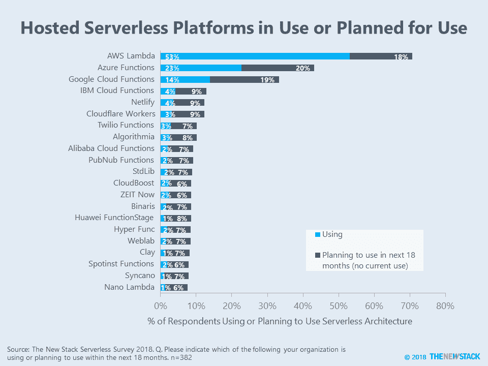

# 无服务器路线图:托管和可安装平台

> 原文：<https://thenewstack.io/serverless-roadmaps-platforms/>

为我们的“[无服务器技术指南](https://thenewstack.io/ebooks/serverless/guide-to-serverless-technologies/)”进行的调查询问了一系列关于我们将在未来 18 个月内使用的供应商和技术的问题，以推动我们对新堆栈的报道。

路线图的前半部分涉及部署无服务器架构的平台和框架。领先的托管平台是三大云提供商的 FaaS 产品。 [AWS Lambda](https://aws.amazon.com/lambda/) 的用户数量是 [Azure Functions](https://azure.microsoft.com/en-us/services/functions/) 的两倍，是 [Google Cloud Functions](https://cloud.google.com/functions/) 的三倍多。虽然内部部署并不普遍，但它们正在被广泛考虑。事实上，计划使用 [Kubeless](https://github.com/kubeless/kubeless) 、 [OpenFaaS](https://www.openfaas.com/) 和 [Apache OpenWhisk](https://openwhisk.apache.org/) 的百分比与那些关注 AWS、微软和谷歌的人相当。换句话说，无服务器应用的下一次浪潮正在激烈地展开。

许多公司都在积极考虑使用他们的托管无服务器平台。我们期待在未来的 18 个月内看到这些供应商获得多少付费客户。以下是对其中六个选项的深入介绍:

* * *

## 解读数据

与大多数基于网络的调查一样，这项研究并没有准确描述市场份额。相反，它只是描述了 382 名受访者的采用现状，这些受访者表示他们正在使用或计划在未来 18 个月内使用无服务器架构。高水平的未来考虑有时是品牌认知度的结果，而不是使用特定产品或服务的具体计划。

新的堆栈采取措施限制供应商对调查的影响。例如，来自相同公司或 IP 地址的回复被排除在研究之外。此外，UTM 代码被用来跟踪哪些受访者通过供应商了解到这项调查。尽管由于这些受访者，一些供应商可能获得了一个百分点的增长，但这对“使用中+计划中”的总数字产生了微小的影响。

调查结果的完整数据集可在网上[获得](https://docs.google.com/spreadsheets/d/1OnArfd4nPGUbuJZMR4P38E4ODfrriIEa_9sbvQmp3KI/)。

通过 Pixabay 的特征图像。

<svg xmlns:xlink="http://www.w3.org/1999/xlink" viewBox="0 0 68 31" version="1.1"><title>Group</title> <desc>Created with Sketch.</desc></svg>