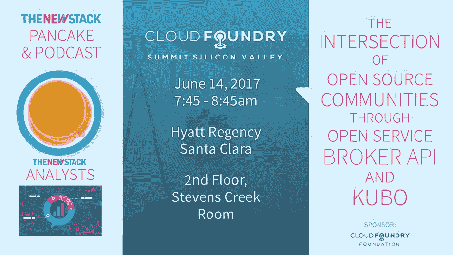

# 无服务器如何塑造软件开发的未来

> 原文：<https://thenewstack.io/serverless-shaping-future-software-development/>

无服务器架构通常被定位为云计算中的下一个大事件，但是到底什么是[无服务器](/category/serverless/)，谁在利用这些工具和服务，以及这个生态系统是如何成熟的？在这一集的[新堆栈制造商](https://thenewstack.io/podcasts/makers)播客中，我们采访了 [Symphonia.io](https://www.symphonia.io/) 的联合创始人 [Mike Roberts](https://www.linkedin.com/in/mikebroberts/) ，谈论所有无服务器的事情。

Symphonia 是 Roberts 和 John Chapin，他们是一年多前开始使用无服务器工具的行业老手。Roberts 撰写了 Martin Fowler 的网站的[的无服务器架构部分，该部分对许多人来说是对无服务器概念的介绍。我们请 Roberts 帮助我们确定无服务器到底是什么，以及他预计在不久的将来会有哪些类型的客户采用无服务器。我们还澄清了一些关于无服务器的概念，包括“NoOps”的神话](https://martinfowler.com/articles/serverless.html)

[无服务器如何塑造软件开发的未来](https://thenewstack.simplecast.com/episodes/how-serverless-is-shaping-the-future-of-software-development)

## 主题

[0:52:](https://thenewstack.simplecast.com/episodes/how-serverless-is-shaping-the-future-of-software-development?t=0:52) 关于交响乐以及它是如何开始的。
[3:20:](https://thenewstack.simplecast.com/episodes/how-serverless-is-shaping-the-future-of-software-development?t=3:20) 无服务器到底是什么意思。
[7:59:](https://thenewstack.simplecast.com/episodes/how-serverless-is-shaping-the-future-of-software-development?t=7:59) 在无服务器环境中，像最近亚马逊 S3 宕机这样的宕机是可以避免的吗？
[11:53:](https://thenewstack.simplecast.com/episodes/how-serverless-is-shaping-the-future-of-software-development?t=11:53)Symphonia 用例的人口统计学。
[21:13:](https://thenewstack.simplecast.com/episodes/how-serverless-is-shaping-the-future-of-software-development?t=21:13) 无服务器与数据流重叠的地方。
[26:46:](https://thenewstack.simplecast.com/episodes/how-serverless-is-shaping-the-future-of-software-development?t=26:46)2017 年交响乐的下一步是什么？

<svg xmlns:xlink="http://www.w3.org/1999/xlink" viewBox="0 0 68 31" version="1.1"><title>Group</title> <desc>Created with Sketch.</desc></svg>