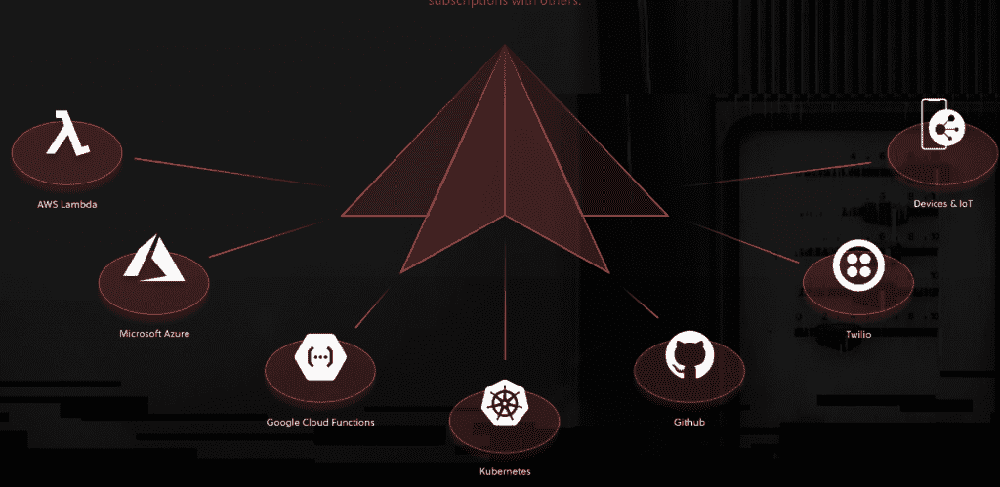
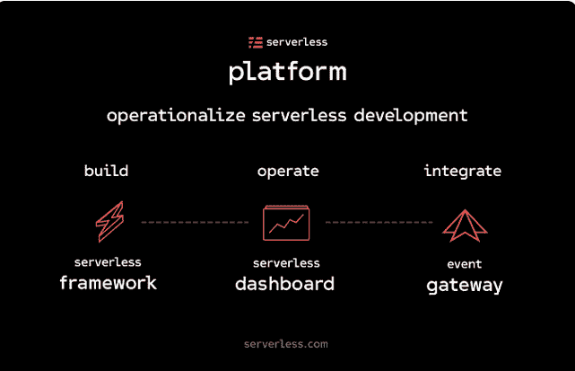

# 该公司将工具添加到其同名技术中

> 原文：<https://thenewstack.io/serverless-the-company-adds-tooling-for-its-namesake-technology/>

据[无服务器](https://serverless.com/)公司创始人兼首席执行官 [Austen Collins](https://www.linkedin.com/in/austen-collins-80427a69/) 称，企业采用无服务器架构的速度令人惊讶。

这家总部位于旧金山的初创公司成立于 2015 年，其宣布的无服务器平台围绕开源的[无服务器框架](https://github.com/serverless/serverless)构建。

享受无服务器承诺的企业的需求持续增长:能够更快地移动，以低开销构建更多，并关注结果，而不是基础架构。

“我们没想到企业采用会这么快。…他们马上就抓住了这一点，”他说。已经采用无服务器模式的企业包括 Nordstrom、可口可乐、路透社和 Capital One。

在一项由公司发起的调查中，受访者往往是该公司所宣传的合唱团的成员，说他们使用无服务器的比例几乎翻了一番，超过一半的人说无服务器对他们的工作至关重要。有趣的是，近四分之一的受访者表示，他们在无服务器之前没有公共云体验；其中 65%的人现在表示，无服务器对他们的工作来说是“关键”或“重要”的。

“当你对花费数百万美元管理机器(升级、修补、维护机器)的开发人员或企业组织说这句话时，你会产生这种情绪反应。人们会变得兴奋。他们说，‘是的，这是我们一直想要的。我们不想考虑基础设施，我们想考虑结果，我们想考虑逻辑，考虑我们想要制造的产品，”柯林斯说。

云计算本地计算基金会(CNCF)无服务器工作组(WG) 的一份白皮书指出，该技术仍处于早期阶段，伴随着不成熟的生态系统和工具的缺乏。同样，在 Serverless，Inc .的调查中提到的三个主要难点是调试、监控和测试——该公司正在通过其产品解决这些问题。

“现在，无服务器已经为企业做好了准备，”柯林斯说。“我们正在与许多公司合作。但这种趋势还为时尚早。他们之所以不能尽可能多地采用，是因为他们还没有合适的工具。他们没有提供正确防护的工具，没有帮助确保他们的开发人员仍然遵循组织政策的工具。和工具，帮助他们在多个云中选择供应商和选项。”

为此，该公司的产品分为三个部分:

*   **平台** —柯林斯将其描述为“扩展无服务器框架的故事”，该框架于 2015 年推出。去年，该框架的 280 万个实例向包括 AWS、谷歌和微软在内的各种云提供商执行了 800 多万次部署。它有助于解决构建、部署和更新无服务器应用程序的问题。使用该框架，您可以将业务逻辑建模为对事件做出反应的功能。它使用户能够利用 API 端点、数据处理管道、物联网后端等构建微服务。
*   **仪表板** —它提供架构可视化、用户访问控制、作为流事件的数据流、日志、应用指标和审计日志。开发人员可以在“订阅”和“资源”选项卡中可视化他们的服务结构并检查交叉依赖性，并与队友协作调试无服务器应用程序。用户可以轻松钻取功能、活动订阅及其所有资源；监控部署，并检查更改以诊断问题。

“它解决了无服务器操作中的新挑战，例如让您可以监督您构建的所有应用程序及其包含的所有基础架构。你可以看到部署历史，当你的队友调整了应用程序，部署了新版本的应用程序，”柯林斯说。

*   **事件网关** —它融合了 [API 网关](https://thenewstack.io/api-gateways-age-microservices/)和发布/订阅模式，为无服务器计算创建了一个高效的事件路由器。它使用户能够从任何地方(传统系统、客户端应用或 SaaS)向网关发布事件数据，网关将这些事件路由到任何云提供商的无服务器功能。

柯林斯说，这是对企业询问如何将无服务器集成到他们现有投资中的回答。

“这只是一个基于事件驱动设计的通信基础设施，”他解释道。“您可以将数据发送到事件网关，任何发生的事件，无论是来自您的传统解决方案还是您拥有的任何其他系统，它都会将数据路由到无服务器计算，如 AWS Lambda 或 Azure 函数或 Google Cloud 函数。”

Collins [去年秋天推出](https://thenewstack.io/whats-next-serverless-platform/)的框架和网关是开源的，这意味着如果公司愿意，他们可以自己操作它，但是 Serverless 公司正在推出一个托管版本的网关。dashboard 是一个免费增值服务。

根据 Research and Markets 的数据，功能即服务(FaaS)的[市场(T4)预计到 2021 年将达到 77.2 亿美元，复合年增长率(CAGR)为 32.7%。](https://www.businesswire.com/news/home/20170227006262/en/7.72-Billion-Function-as-a-Service-Market-2017---Global)

Serverless，Inc .最近筹集了 1000 万美元的首轮融资，由 Lightspeed Venture Partners 牵头，使其总融资额达到 1300 万美元。

Iguazio 的 [Nuclio](https://thenewstack.io/migrating-to-serverless-in-an-production-setting/) 产品是一个替代的开源无服务器平台，可以与 Docker、Google Container Engine、Azure Container Service 和 Kubernetes 一起工作。

柯林斯将无服务器描述为“低成本云或云精简版”。它更容易访问，”指出了四分之一的受访者对云没有什么经验。

“我们听到企业说他们将直接转向无服务器。他们想去云，但他们最大的担忧是培训员工进行云开发，”他说。“无服务器对于那些希望加快速度的组织来说非常有吸引力，他们希望以较低的开销构建更多。”

然而，CircleCI 的首席技术官罗布·朱伯在与 Stackery 的首席执行官内特·塔加特的一次谈话中指出，尽管有无服务器的承诺，但仍存在误解。其中最主要的想法是，无服务器意味着永远不必管理基础设施。他说，这不是真的。安全问题也引起了广泛关注。

CNCF、CircleCI、微软和谷歌是新堆栈的赞助商。

通过 Pixabay 的特征图像。

<svg xmlns:xlink="http://www.w3.org/1999/xlink" viewBox="0 0 68 31" version="1.1"><title>Group</title> <desc>Created with Sketch.</desc></svg>