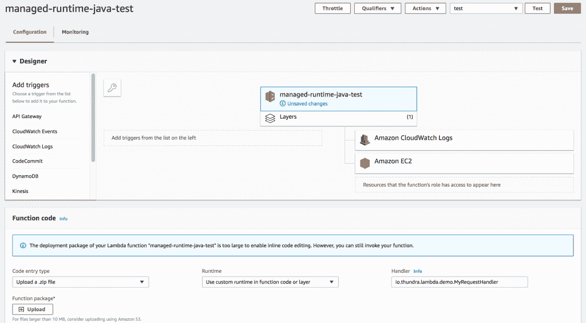
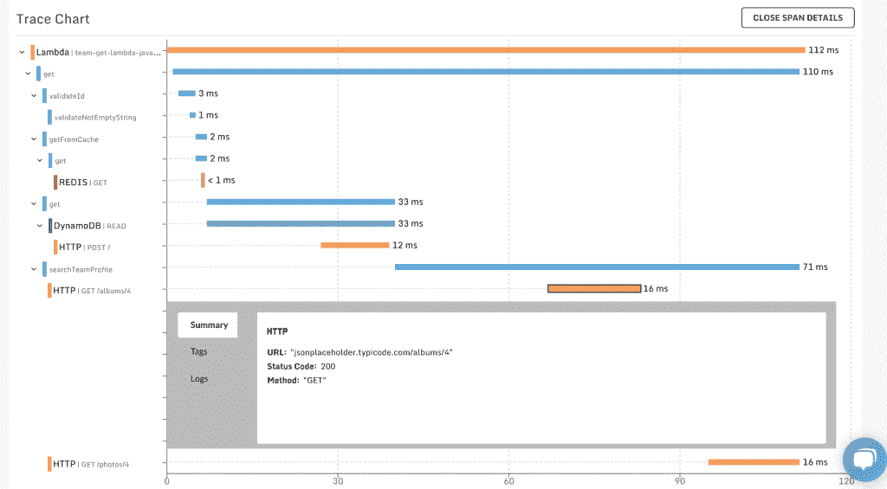

# 无服务器:桑德拉增加了 AWS Lambda 的可观测性

> 原文：<https://thenewstack.io/serverless-thundra-adds-observability-to-aws-lambda/>

正如许多测试无服务器应用程序的开发人员发现的那样，遗留的工具和方法很少或根本不能发现哪里出错了，因此需要新的工具和方法。

这正是导致创建[桑德拉](https://www.thundra.io/)的问题，这是一个针对无服务器环境的可观测性解决方案，将于本周推出 beta 版，同时在本周的 [AWS re:Invent](https://reinvent.awsevents.com/) 上发布 [AWS Lambda 层和运行时 API](https://aws.amazon.com/blogs/aws/new-for-aws-lambda-use-any-programming-language-and-share-common-components/) 。桑德拉为 AWS Lambda 应用程序提供跟踪、指标和日志，进一步扩展了 AWS X-Ray 的功能。据首席技术官兼创始人 Serkan ozal 称，桑德拉是在 OpsGenie 使用 AWS Lambda 的时代诞生的，该公司在被 Atlassian 收购后由桑德拉正式剥离出来。

“我们在为 OpsGenie 使用 AWS Lambda，并希望监控该应用程序，但我们就是找不到监控解决方案，”zal 说。“Cloudwatch 指标无法精确定位生产中的问题，因此我们在内部构建并使用了桑德拉，发现 AWS Lambda 的服务监控存在缺口。”

作为该公司正式发布的一部分，桑德拉宣布了桑德拉层，这是一个基于新的 AWS 运行时 API 功能实现的自定义运行时。zal 解释说，桑德拉层可以添加到 AWS Lambda 上的无服务器应用程序中，而无需对现有代码进行任何修改，并且可以在几分钟内启动并运行，从而为您的应用程序提供可观察性，甚至跨多个 AWS Lambda 功能和帐户。以前，用户需要下载、安装和手动设置桑德拉，但桑德拉图层使安装变得简单，只需选择选项、设置一些配置选项，然后就可以开始了。

“无服务器正在被企业迅速采用，一些消息来源表明，46%的 IT 决策者现在正在使用或评估这项技术，”zal 在一份声明中说。“但这些项目成功的关键将在很大程度上取决于每个团队实施和使用可观察性技术的能力，以快速查明关键的性能问题，纠正并解决它们，而无需猜测。”

桑德拉营销副总裁 [Christina Wong](https://www.linkedin.com/in/christinaleewong/) 进一步解释说，桑德拉在构建时考虑了灵活性，提供同步和异步监控，让用户能够在虚拟私有云内运行桑德拉层，或者不增加额外的计算成本。

Wong 还强调了该初创公司与 AWS 的高级技术合作伙伴地位，她说这使该公司能够更紧密地与亚马逊 AWS 合作，并根据桑德拉的声明，“为 AWS 客户提供额外的信心，相信桑德拉有能力支持和提供可靠和安全的企业无服务器监控功能”。

桑德拉是众多自动气象站监控软件合作伙伴中的一员，他们已经为自动气象站图层定制了服务。 [Datadog](https://www.datadoghq.com/) 、 [IOPipe](https://www.iopipe.com/) 、 [Epsagon](https://epsagon.com/) 和 [NodeSource](https://nodesource.com/) 也功不可没。

<svg xmlns:xlink="http://www.w3.org/1999/xlink" viewBox="0 0 68 31" version="1.1"><title>Group</title> <desc>Created with Sketch.</desc></svg>