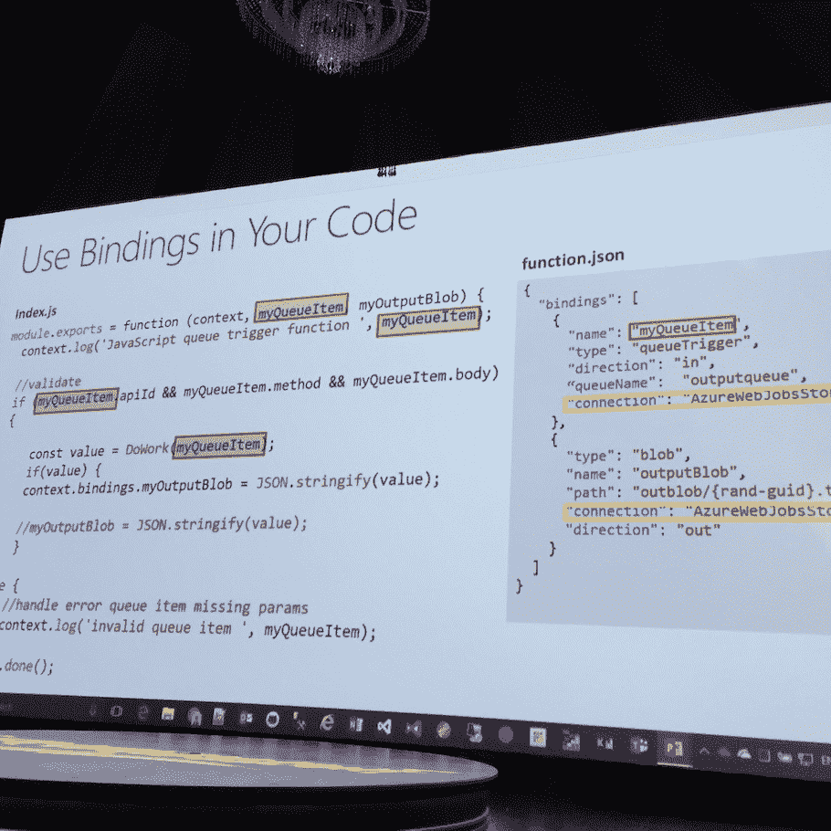
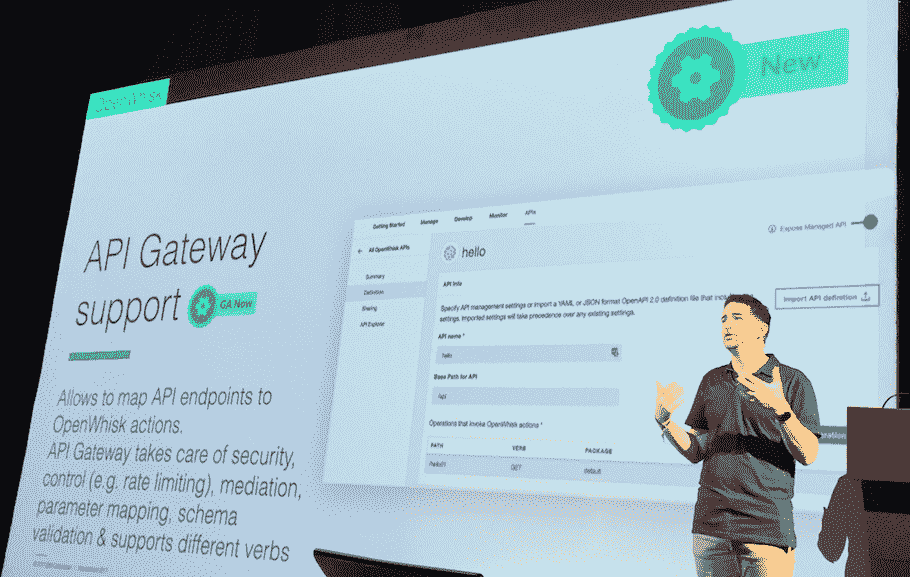
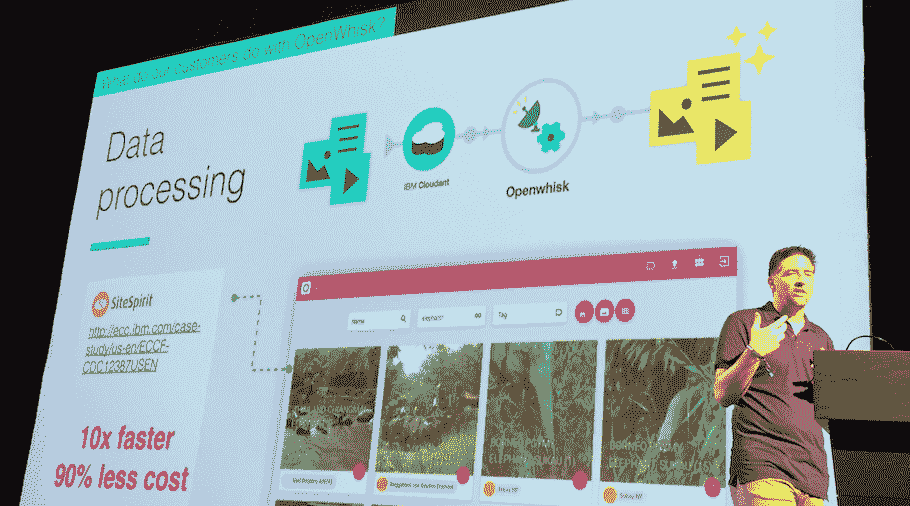

# 无服务器在 API 架构中工作得最好

> 原文：<https://thenewstack.io/serverless-works-best-api-architectures/>

在上个月的 Serverlessconf 大会上，IBM OpenWhisk 和微软 Azure 功能分别推出了新的特性和工具，这些功能在很大程度上依赖于已经被证明可以在支持 API 的架构中工作的功能。

将 API 引入 IT 架构的核心原则之一是，它使更大系统的每个组件都可以独立使用、重新配置，并以菊花链形式连接到新的工作流中。无服务器则更进一步，它提供按需链接，提升计算能力以获得数据，然后在需求消失时再次消失，所有这些都无需管理执行处理的服务器。

## 混合无服务器

这就是为什么进入[无服务器计算](/category/serverless/)的一个关键切入点可能是通过 [API 无服务器架构产品](https://thenewstack.io/serverless-computing-growing-quickly/) 让用户在云中构建 API，这些 API 调用的数据也存储在云托管存储中。这可能是将业务能力和资产引入无服务器工作流的关键资源。

虽然这可能有一定的意义，但绝大多数情况下，市场已经开始采用更多的[微服务](/category/microservices/)类型的方法，其中触发事件的微服务一直是创建无服务器解决方案的常见起点。

这反映了无服务器在整个企业架构中的位置。在[事件可能会触发一组在无服务器模式下完成的处理任务—容器旋转以按顺序或异步执行一组功能—然后结果会返回到工作流以在本地/虚拟私有云架构中继续。](https://twitter.com/serverlessconf)

Serverlessconf 开幕主题演讲人[Austen Collins](https://twitter.com/austencollins),[无服务器框架](https://github.com/serverless) 的创始人说，无服务器正被用于事件驱动的工作流，并越来越多地导致架构团队中的“无服务器优先”心态，他们更喜欢“在无服务器中做尽可能多的事情，然后在无服务器绝对不起作用时退回到其他技术。”

微软 Azure 架构师约翰·戈斯曼 提到了类似的想法，他开玩笑说“遗产”是“有用的东西”的另一个词[慈善专业人士](https://twitter.com/mipsytipsy)来自 [蜂巢](https://Honeycomb.io) 和 [Florian Motlik](https://twitter.com/flomotlik) 来自 [Codeship](https://codeship.com/) 都认为无服务器有其存在的理由，但它可能不是万能的。例如，图像处理是无服务器专业的一个很好的用例。Motlik 解释说，无服务器意味着放弃对特定流程的控制和责任，因此虽然它适合于实验性解决方案和一些事件处理，但它可能不是管理核心业务任务的最佳选择。

## 用于 API 集成的 Azure 绑定

鉴于这种将无服务器视为混合架构方法的一部分的转变，无服务器平台正在扩展它们的工具，以使开发人员能够像集成完整的 API 那样集成无服务器工作流。

微软 Azure 展示了几个新特性，将标准 API 设计模式和方法带入了无服务器领域。第一个是绑定的概念，用于取代无服务器代码中对 SDK 的需求。

微软 Azure 的首席项目经理 Yochay Kiriaty 说:“绑定让你定义函数的输入和输出参数。“绑定是服务的抽象。这是一个让开发者消费服务的高效工具。”

Kiriaty 给出了 [通过无服务器工作流使用 SendGrid API](https://docs.microsoft.com/en-us/azure/azure-functions/functions-bindings-sendgrid) 发送电子邮件的例子。“如果我想这样做，我需要引入 SDK，对其进行配置，并编写几行代码来完成。但是通过绑定，它抽象了所有的工作。”

Kiriaty 解释说，绑定实现包装了 SDK，因此它在运行时是一个 Azure 函数。API 用户名、密码和 API 密钥是绑定的属性，并且被映射到环境变量。这样，开发人员无需集成 SDK 和编写特定代码，只需在控制台中编写 sendgrid.sendemail，Azure Functions 会完成剩下的工作。

目前，Azure 的目录中有 21 个现成的绑定实现，尽管因为它是开源的，API 提供商可以为他们的 SDK 编写自己的绑定，如果他们希望 Azure functions 用户可以使用它们的话。

## OpenWhisk 的 API 网关

与此同时，IBM 在 Serverlessconf 上宣布，它已经将 API 网关工具引入了 OpenWhisk 无服务器平台。这里的目标是将从管理 API 中学到的安全功能引入到无服务器环境中。

IBM 云平台首席技术官兼副总裁 [杰森·麦基](https://twitter.com/jrmcgee) 说:“这是关于 API 网关功能的集成，但没有管理基础设施的复杂性。“我们引入了高级速率限制、API 密钥、开发者仪表盘，以及对这些 API 使用方式的分析。”

McGee 说，新网关的一个关键使能因素是允许开发者保护他们代码的执行。API Gateway 有助于将功能作为 API 公开，潜在地向第三方开发人员公开，而没有通常与 API 管理相关的所有繁重工作。

McGee 说:“除了 API 的实际设计和构造之外，你还必须担心安全性、身份访问、验证数据的能力、对 API 使用情况的分析……这些都是常见的 API 管理问题，我们希望在 OpenWhisk 上轻松实现 API，而不必自己管理所有这些事情。”

## 无服务器混合用例示例

McGee 给出了几个用例示例，展示了无服务器是如何像 API 一样使用的，以及它们是如何形成混合系统的一部分的，在混合系统中，特定的流程从更大的价值链中提取出来，并在无服务器环境中运行。

荷兰企业 [SiteSpirit](http://www.sitespirit.nl/) 希望允许客户拍摄新图像，并将其自动放入目录中。这需要一些图像处理任务。McGee 说:“他们正在使用 OpenWhisk 来做这件事。当新对象被添加到对象存储器时，它触发那些图像处理事件，更新元数据，然后将新的标准化对象上传到目的地对象存储器。SiteSpirit 将图像添加到目录时，速度提高了 10 倍，而成本却降低了 90%。”

McGee 还谈到了 Santander Bank 使用 OpenWhisk 的无服务器平台进行支票处理的情况。银行不会在没有服务器的情况下运行所有的核心流程，但是像支票处理这样的任务非常适合。在一周中，可能没有太多的需求来管理支票交易的计算和处理资源，但是到了周五下午，当人们兑现他们一周的工资时，就会出现“巨大的高峰”麦基说。“这是非常受事件驱动的。桑坦德银行拍摄支票图像，使用 OCR 检查签名和金额，驱动后端支票结算系统，并向客户发送通知。”

像柯林斯、梅杰斯和基里亚特一样，McGee 说他预计这将是未来无服务器的主要用途。“有一种趋势认为这将解决整个应用问题。我认为这是危险的，这更是一个问题:我们如何将它们融合在一起？”

专题图片:慈善专业人士出席 2017 年奥斯汀的 Serverlessconf

<svg xmlns:xlink="http://www.w3.org/1999/xlink" viewBox="0 0 68 31" version="1.1"><title>Group</title> <desc>Created with Sketch.</desc></svg>