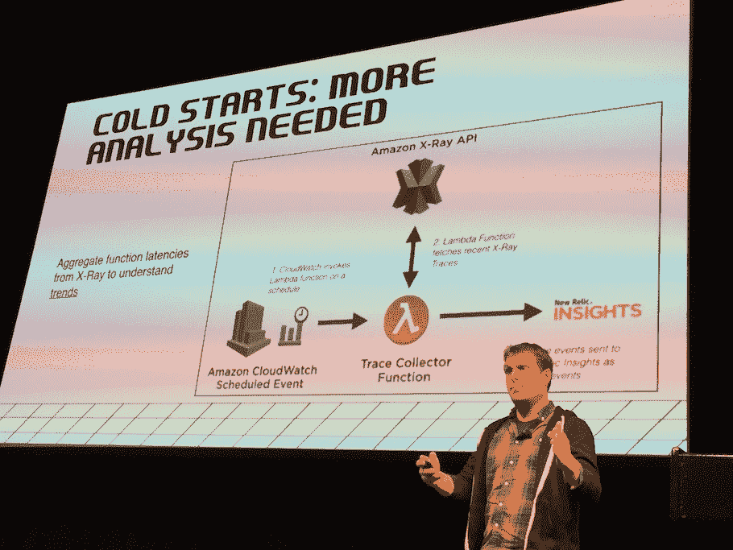
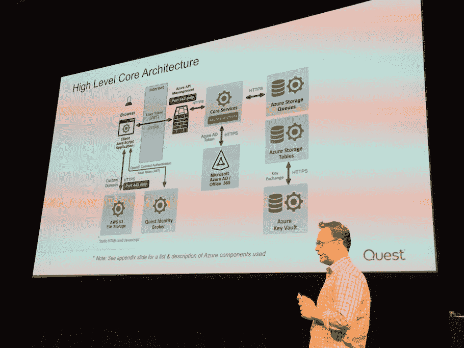
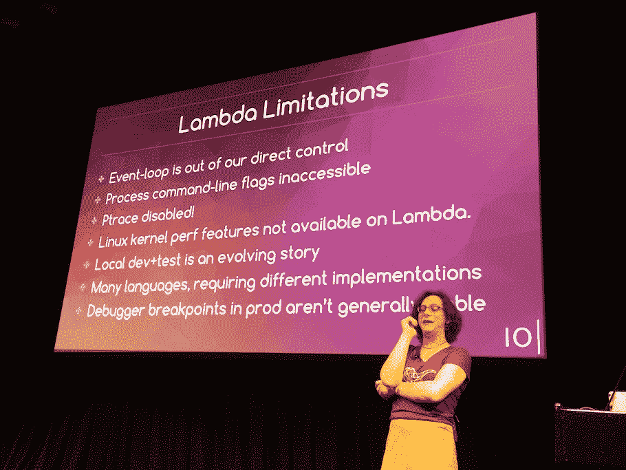

# 纽约:监控无服务器性能以控制成本

> 原文：<https://thenewstack.io/serverlessconf-new-york-monitoring-serverless-performance-manage-cost/>

大规模监控[无服务器应用](/category/serverless/)以确保性能、可靠性和全球可访问性，现在也有助于生产采用者理解和调整他们的架构成本决策。虽然开发速度可能是无服务器的主要优势，但“不要为闲置资源买单”的口号通常是引入无服务器的商业驱动力。通过确保成本最小化和性能优化来证明价值成为新的 [DevOps](/category/devops/) 的最终目标。

周三在纽约市的 [Serverlessconf](https://nyc.serverlessconf.io/agenda) 上，几位发言者重申，无服务器实现“易于启动和运行”，但接下来发生的事情最终难倒了采纳者:性能监控、成本管理和管理外部因素，通常是最初可能没有想到的下游因素，都成为了潜在的障碍。

## 无服务器实验项目

New Relic 的开发者支持者 Clay Smith 描述了一个在 AWS Lambda 上运行 [Headless Chrome 的项目。他建议无服务器生产采用者必须不断监控的三个主要性能问题是:](https://medium.com/clog/running-selenium-and-headless-chrome-on-aws-lambda-fb350458e4df)

*   快吗？
*   并发快吗？
*   潜在的最坏情况是什么——也就是说，异常值是什么——为什么？

他举了一个使用新的 [AWS X 射线追踪产品](https://aws.amazon.com/xray/)来区分猜测和现实的例子。冷启动(调用和启动一个新的 Lambda 函数所需的时间，这可能会造成延迟，从而降低应用程序的整体性能)通常被认为是主要原因。

但是使用 X 射线，Smith 分析了几天的数据，查看了他的应用程序架构中每四分钟运行一次的函数。到目前为止，Smith 必须创建一个 lambda 函数来分析 X 射线数据。

冷启动仅占时间的 1.49%，因此不是性能延迟的关键驱动因素。相反，需要考虑其他因素，如语言运行时和函数大小。Smith 发现调整内存使用是最强大的性能使能因素。

这就是成本管理进入生产部署决策的地方。与直觉相反，Smith 建议增加函数使用的 CPU，虽然意味着每个请求支付更多，但函数执行的持续时间会下降，所以“存在一个性能最佳点，因为函数运行得更快，所以增加的内存变得更便宜，”Smith 分享道。

## 来自企业的无服务器应用

对于运行在 Azure 功能堆栈上但集成了 AWS Lambda 的 Quest Software 来说，理解监控并使用它来确定成本影响也是生产实现的关键部分。

Quest on Demand 是 Quest 的 [Office 365](https://www.office.com/) 管理解决方案，这是一款 SaaS 产品，允许企业管理其 Office 365 用户，并制定政策来确定个人用户可以使用的功能，同时还确保如果任何用户按错按钮，备份可以回滚。该产品已经上市 3 个月了，到目前为止已经处理了 100 多万个客户对象。

该架构将静态内容存储在内容交付网络上的 S3 中，用户通过身份代理进行身份验证，然后身份代理发布一个 [JWT 令牌](https://jwt.io/)，定义用户的许可和访问权限。然后，这些信息被输入到 Quest 的微软技术管理包 [Quest on Demand](https://www.quest.com/community/products/on-demand/) 的核心服务中(该包运行在 [Azure Functions](https://azure.microsoft.com/en-us/blog/introducing-azure-functions/) 上)。所有业务逻辑组件都是专用功能，按业务目的分组。从那里，可以引入特定的服务，包括 [Vault](https://azure.microsoft.com/en-us/services/key-vault/) ，以及跨平台集成到 AWS Lambdas 中，例如。

Quest 杰出工程师兼微软 MVP Curtis Johnstone 认为，要在生产环境中大规模实施无服务器应用，预防性策略至关重要。安全需要成为首要的发展问题。约翰斯通警告说:“如果你需要回去并增加安全措施，这将花费两到三倍的费用。”。类似地，性能和可伸缩性测试(不仅仅是功能测试)需要在整个开发过程中进行，最好是在模拟生产的环境中进行。

## 无服务器调试的局限性

但是，首席技术官兼 Lambda 绩效管理公司 [IOpipe](https://www.iopipe.com/) 的联合创始人[埃里卡·温迪施](https://twitter.com/ewindisch)说，开发测试并不总是像传统应用程序开发那样简单明了。“在 AWS Lambda 上运行之前，您可以调试代码。但是如果你在云中运行，很多调试工具都是不可用的。“在 Lambda 中，应用程序插装很困难。尤其是本地开发+测试方法在 Lambda 下仍在不断成熟。”

Smith、Johnstone 和 Windisch 都主张在生产环境中部署无服务器应用程序时，应用程序规范应该到位。对于 Quest on Demand，Johnstone 的团队使用 [Azure Application Insights](https://azure.microsoft.com/en-us/services/application-insights/) 并将数据导出到 ELK，以便他们可以添加 Lambda 数据，并获得跨云平台的整个应用性能的单一视图。

## 性能监控和成本决策

但是监控不仅仅是确保性能。相反，分析帮助 Quest 更好地管理与无服务器架构相关的成本。“在一个地理区域使用无服务器产品可能会对性能造成很大影响，所以你需要关注平台的产品路线图，以确保你正在使用的产品在你的应用服务的地理区域内可用，”Johnstone 说。

Johnstone 表示，监控分析有助于确定最合适的无服务器成本模型。能够选择与工作负载的资源需求和成本概况相匹配的无服务器计划变得至关重要，而监控数据提供了这种洞察力。成本决策会影响绩效，形成恶性循环:选择错误计划的风险是资源更快耗尽，然后绩效下降。

企业和初创公司都在寻找降低云选择的成本开销的方法，无服务器解决方案是一个很有吸引力的解决方案。在这种商业环境下，开发人员被驱动到允许足够监控的解决方案，以确保实现成本优势，即使架构变得更加复杂并添加更多功能。在无服务器环境中，性能监控和预算决策形成共生关系。

微软是这一新技术的赞助商。

<svg xmlns:xlink="http://www.w3.org/1999/xlink" viewBox="0 0 68 31" version="1.1"><title>Group</title> <desc>Created with Sketch.</desc></svg>