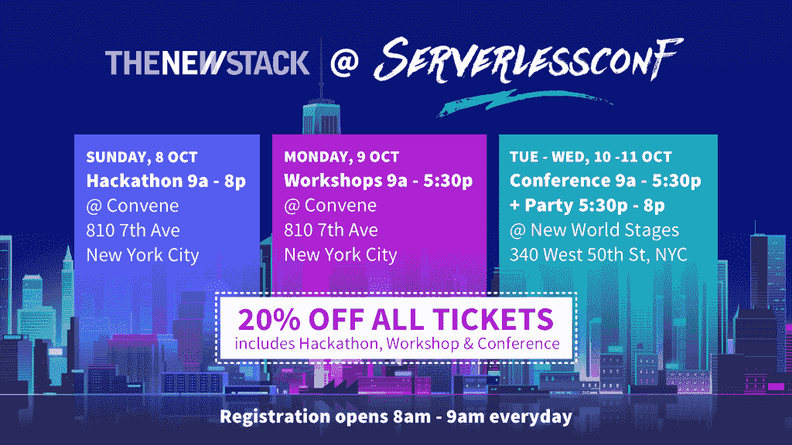

# 在无服务器的世界中解决 DevOps 问题

> 原文：<https://thenewstack.io/serverlessconf-nyc-address-devops-serverless-world/>

它有望成为无服务器社区迄今为止最大的聚会:[10 月 8 日至 11 日在纽约市，ServerlessConf NYC](https://serverlessconf-nyc.eventbrite.com?discount=XYiFeEfV) 承诺将数百名云原生应用程序开发人员聚集在一起，深入讨论[无服务器](/category/serverless/)的最新概念将如何融入现有的开发人员文化——由于其他原因，这种文化已经在不断变化。

“最初，有一种讨论认为，也许无服务器就是‘无操作’而事实证明这根本不是真的，”主持 ServerlessConf 会议的彼得·斯巴斯基(Peter Sbarski)承认道。在本期《新堆栈分析师》的采访中，Sbarski 告诉我们，“当你部署功能时，你基本上是在构建一个大型分布式系统。它需要被管理、组织和照顾。你需要监控，记录。你需要知道你使用的第三方服务的功能是怎么回事。你怎么做一个有意义的发布呢？如何以正确的顺序释放依赖关系？

“因此，当你从琐碎的小应用程序转向现实生活中的系统时，”Sbarski 继续说道，“DevOps 变得非常重要。”

[# 145:server less conf NYC 解决无服务器世界中的 devo PS](https://thenewstack.simplecast.com/episodes/145-serverlessconf-nyc-to-address-devops-in-a-serverless-world)

这与去年无服务器支持者提出的案例正好相反，当时开发者似乎是新技术的主要驱动力。但是，这似乎也有点自相矛盾，而且不仅仅是表面上，建议无服务器的思维框架需要有人在某个地方关注服务器的需求——并且至少需要有人与开发人员协调。

所以有很多要解释的。在最新一期的《新堆栈分析师》中，Sbarski 与 Alex 和我们的特约分析师 Krishnan Subramanian 一起探讨了这个话题以及在纽约举行的 [ServerlessConf](https://serverlessconf-nyc.eventbrite.com?discount=XYiFeEfV) 期间将要涉及的其他主题。

### 在这个版本中:

[2:40:](https://thenewstack.simplecast.com/episodes/145-serverlessconf-nyc-to-address-devops-in-a-serverless-world?t=2:40) 讨论提交给 2017 年纽约国际会议的不同类型的提案。
[7:08:](https://thenewstack.simplecast.com/episodes/145-serverlessconf-nyc-to-address-devops-in-a-serverless-world?t=7:08) 什么是无服务器世界中的 DevOps？
[10:48:](https://thenewstack.simplecast.com/episodes/145-serverlessconf-nyc-to-address-devops-in-a-serverless-world?t=10:48) 从开发运维的背景来看，下一代工具会是什么样的？
[15:38:](https://thenewstack.simplecast.com/episodes/145-serverlessconf-nyc-to-address-devops-in-a-serverless-world?t=15:38) 探索在 ServerlessConf 上演讲者提交的其他主题。
[20:50:](https://thenewstack.simplecast.com/episodes/145-serverlessconf-nyc-to-address-devops-in-a-serverless-world?t=20:50)subra manian 对 DevOps 和容器架构市场未来转型的思考。
[24:05:](https://thenewstack.simplecast.com/episodes/145-serverlessconf-nyc-to-address-devops-in-a-serverless-world?t=24:05) 无服务器的发展加速了技术和架构的发展，并将在未来继续发展。

纽约市第七大道 [810 号](https://en.wikipedia.org/wiki/810_Seventh_Avenue#/media/File:810-seventh.jpg)的标题图片，由 Americasroof 在知识共享 3.0 下授权，今年将在这里举办 ServerlessConf。

<svg xmlns:xlink="http://www.w3.org/1999/xlink" viewBox="0 0 68 31" version="1.1"><title>Group</title> <desc>Created with Sketch.</desc></svg>