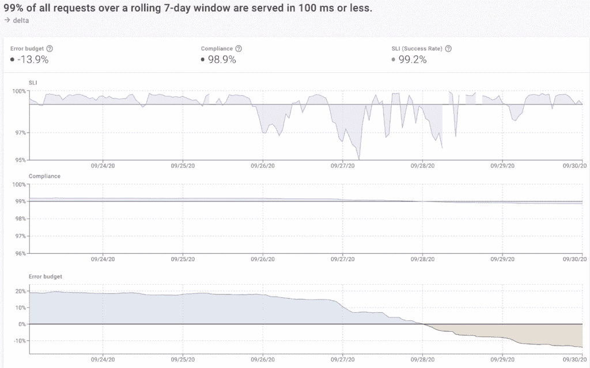

# Kubernetes 的服务水平目标

> 原文：<https://thenewstack.io/service-level-objectives-in-kubernetes/>

[Cloud Native Computing Foundation](http://cncf.io/)赞助了这篇文章，期待虚拟 [KubeCon + CloudNativeCon 北美 2020–虚拟](https://events.linuxfoundation.org/kubecon-cloudnativecon-north-america/)，11 月 17-20 日。

服务水平目标(SLO)越来越成为软件可靠性的常用工具。由 Google 推广的 SLO 通常被描述为服务所有者的一种工具，用于平衡对给定应用程序进行更改的风险和回报。鉴于我们刚刚经历了一次宕机，我们应该发布这个新产品特性吗？我们如何量化风险，并与所有利益相关者就此展开对话？

不太为人所知的是，SLOs 也可以成为*平台所有者*的有力工具。对于 Kubernetes 运营商来说，SLO 可以提供一种方法来描述集群上运行的服务的健康状况，这种方法可以在不了解底层应用程序或其运行历史的情况下进行解释。这意味着平台所有者可以使用 SLO 对大量应用程序进行分类，并快速确定是否有任何东西需要立即关注——随着应用程序数量的增长，这一点尤为重要。

## **简而言之 SLOs**

 [威廉·摩根

William 是 bound 的联合创始人兼首席执行官，该公司是开源服务网格项目 Linkerd 的创始人。在 Ruby 之前，他是 Twitter 的基础设施工程师，在那里他帮助 Twitter 从一个失败的单片 Ruby on Rails 应用程序转移到一个高度分布式的容错微服务架构。他是 Powerset、微软和 Adap.tv 的软件工程师，MITRE 的研究科学家，拥有斯坦福大学计算机科学硕士学位。](https://www.linkedin.com/in/wmorgan/) 

在最基本的层面上，SLO 仅仅是一个指标、该指标的一个目标和一个时间段。例如:“服务 A 的成功率在过去 30 天内必须至少为 99.7%。”这个标准被称为“服务水平指标”(SLI)，目标是“目的”

SLO 的输出是*误差预算*，这是一种度量指标在该时间段内相对于目标的表现的方法。例如，如果您的 SLO 被定义为在 30 天内 99%成功，并且该期间的成功率为 99.75%，则您的误差预算为 75%。

误差预算是衡量在违反目标之前还有多少余地的指标。对于服务所有者来说，错误预算代表了一种量化他们可能招致的风险量的方法——例如，这是一种指示您是否应该推迟新部署直到事情冷却下来的指标。

但是对于平台所有者来说，错误预算是另一回事:一种对服务健康状况的*上下文无关的判断*。如果 SLO 的误差预算是 100%且稳定，那么我们知道该服务进展顺利。如果接近 0(或者低于 0！)和下降，那么我们知道事情进展不顺利。无论底层指标是什么，应用程序做什么，或者上个月的表现如何，错误预算都是一个通用的数字。

误差预算值的这种普遍性和与环境无关的性质是 SLO 在 Kubernetes 平台环境中提供价值的关键。

Kubernetes 工作负载的 SLO 合规性、SLIs 和错误预算(Dive 仪表板)。

## 【Kubernetes 平台所有者的 SLOs】

Kubernetes 平台所有者可能负责运行在数十或数百个 Kubernetes 集群上的数百或数千个应用程序。他们可能一个也不懂。(可以说，这种不了解是健康平台的标志！)

在这种情况下，指标的效用开始下降。如果一个给定的服务目前有 97%的成功率，这是好还是坏？如果下降到 95%,这值得关注吗？如果它的成功率是 100%，但第 99 个百分位数的延迟慢慢上升到 1200 毫秒，是否应该寻呼任何人？如果没有关于这个服务*应该如何*运行的上下文，平台所有者就没有办法知道。

SLO 提供了一种摆脱这种情况的方法。与度量标准相反，错误预算的普遍性实际上*的确*给了平台所有者一种方式，让他们能够对这些服务的健康状况做出基于价值的判断。换句话说，通过将这些指标包装在 SLO 中，平台所有者获得了一种评估服务健康状况、观察趋势以及识别哪些服务需要立即关注的通用方法。

## **使用 SLO 的挑战**

尽管有很多好处，但在 Kubernetes 平台上实现 SLO 可能很困难。作为第一个挑战，一致的 SLO 需要一致的指标—您的 Kubernetes 工作负载在任一时间点的成功率、延迟等如何？接下来，您必须用适当的 sli、目标和时间段来制定 SLO——您想要跟踪的 SLO 的“正确”参数化是什么？最后，您必须实际计算误差预算。虽然数学很简单，但在正确的时间段内从正确的工作负载中选择正确的指标数据点可能并不简单，尤其是当服务和工作负载随时间变化时。

对于度量挑战，至少有一些简单的选择。像开源 CNCF 项目 [Linkerd](https://linkerd.io/#_ga=2.236570697.910803178.1602098398-1426782781.1602098398) 这样的服务网格可以为 Kubernetes 集群上的所有 HTTP 和 gRPC 服务提供一致和统一的指标层，而不需要任何配置。

下一步是在这些指标的基础上制定 SLO。这里有一系列的选择——从“召集所有利益相关者开会，从基本原则开始讨论”到“只使用当前的指标值作为目标，看看会发生什么。”这里的工具可以提供基于历史数据的建议，非常有帮助，特别是对于后一种方法。

最后，计算误差预算。Kubernetes 生态系统以 Prometheus 和 Grafana 等开源工具的形式提供了很好的选择——例如，有了 Linkerd 指标，SLO 可以表示为 Prometheus 查询，错误预算绘制为 Grafana 仪表板。或者，像 Dive 这样的托管工具可以利用这些相同的 Linkerd 指标，并允许您通过点击按钮来[设置和跟踪任意数量的集群和工作负载的 SLO。](http://www.dive.co)

无论您采取哪种方法，采用 SLO 都可以在帮助平台所有者以统一且与上下文无关的方式了解其应用状态方面发挥至关重要的作用，这意味着他们可以优先考虑他们的工作，并确保应用及其运行的平台保持可靠。

*要了解更多关于 Kubernetes 和其他云原生技术的信息，请考虑参加 11 月 17 日至 20 日在 T4 举行的 [KubeCon + CloudNativeCon 北美 2020 大会。](https://events.linuxfoundation.org/kubecon-cloudnativecon-north-america/)*

云计算原生计算基金会是新堆栈的赞助商。

通过 Pixabay 的特征图像。

<svg xmlns:xlink="http://www.w3.org/1999/xlink" viewBox="0 0 68 31" version="1.1"><title>Group</title> <desc>Created with Sketch.</desc></svg>