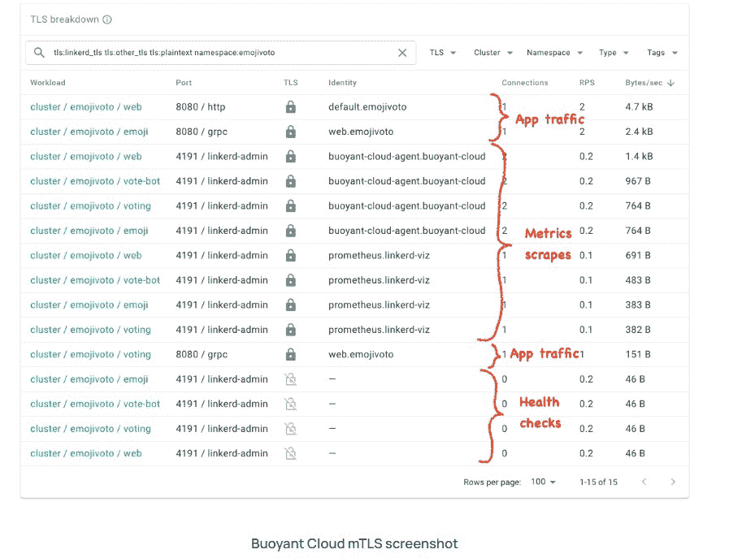

# 对 Kubernetes 的服务网格需求转向安全性

> 原文：<https://thenewstack.io/service-mesh-demand-for-kubernetes-shifts-to-security/>

底特律— [服务网](https://thenewstack.io/category/service-mesh/)一直被认为是创建、部署和管理 [Kubernetes](https://thenewstack.io/category/kubernetes/) 环境的基本要素。然而，随着社区越来越意识到与管理高度分布式容器化环境相关的威胁和挑战，[安全性](https://thenewstack.io/category/security/)已经成为服务网格为 [DevOps](https://thenewstack.io/category/devops/) 团队提供的主要好处。

根据对 KubeCon + CloudNativeCon Europe 与会者进行的调查，安全性仍然是服务网格采用背后的关键驱动因素。

Linkerd 的创建者、浮力公司的首席执行官威廉·摩根告诉新的堆栈，浮力云现在将能够自动化 Linkerd 的升级、安装、回滚、数据平面版本同步等。摩根对 Linkerd 的创意哲学似乎也延续自 Twitter 早期的[时代，当时摩根的 Twitter 工程师同事寻求一种方法来简化平台的扩展，以适应数亿用户，这导致了 Linkerd 的诞生。摩根在这里举行的 KubeCon + CloudNativeCon 北美活动上与新堆栈进行了交流。](https://thenewstack.simplecast.com/episodes/buoyant-ceo-on-linkerds-origins-during-twitters-heady-early-days)

“如今，安全功能是头号驱动因素。这让我们感到惊讶，因为当我们作为平台工程师进入 service mesh 时，我们认为早期的 Linkerd 是关于可观察性和流量控制的，当然，这仍然是有用的，”摩根说。“有时他们几乎是在道歉，但我告诉他们，他们不必道歉，因为这有道理。”

相互传输层安全性(mTLS)是 TLS，但也有助于确保客户端通过身份验证。摩根解释说，TLS 是一种连接级协议，旨在为 TCP 连接提供安全性。(我们将在下面看到安全性的确切含义)。由于 TLS 工作在连接级，它可以与任何应用级 TCP 协议结合，而无需该协议做任何不同的事情，Morgan 在一篇博客文章中写道。例如，HTTPS 是 HTTP 和 TLS 的结合(HTTPS 的“S”指的是 SSL，TLS 的前身)，HTTP 不需要做任何改变来适应 TLS.1，Morgan 写道。

摩根传达的 TLS 提供的连接的三个保证包括:

*   真实性:任何一方都可以证明他们是他们所说的人。
*   保密性:其他任何人都不能看到正在交换的数据。
*   完整性:收到的数据与发送的数据相同。

“MTLS 是一个非常好理解的协议。它有它的缺点，也有它的批评者，这并不奇怪，”摩根告诉《新书库》。“但这是我们现有的标准，所以让我们让它发挥作用吧。”

摩根说，在这个 DevOps 希望在运营中实现或实施零信任安全的时代，服务网格的 sidecar 组件仍然至关重要。边车被视为服务网络的关键组成部分。它将微服务连接到不同的分布式容器和虚拟机，或者更准确地说，将微服务互连到不同的分布式容器和虚拟机。它还通过服务网格为连接 Kubernetes 环境中的微服务提供关键功能，在许多方面充当网关。然而， [Solo.io](https://www.solo.io/) 和谷歌[最近推出了](https://thenewstack.io/can-you-now-safely-remove-the-service-mesh-sidecar/) [Istio Ambient Mesh](https://istio.io/latest/blog/2022/introducing-ambient-mesh/) ，该公司代表称这是业内第一个提供边车或无边车架构的服务网格，同时保持了服务网格提供的关键安全功能。

然而，在没有提到 Istio Ambient Mesh 的情况下，摩根指出，在“零信任世界”中，服务 Mesh 边车在“无边车的嗡嗡声”中变得“真的更有趣”

“零信任的要点是，基础设施的每一部分都在做自己的验证、认证和授权，”摩根说。“但是如果没有 sidecar，那么代理就是实施点，当您脱离 sidecar 模型时，安全界限就会变得更加模糊。”

<svg xmlns:xlink="http://www.w3.org/1999/xlink" viewBox="0 0 68 31" version="1.1"><title>Group</title> <desc>Created with Sketch.</desc></svg>