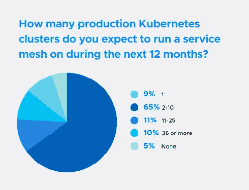
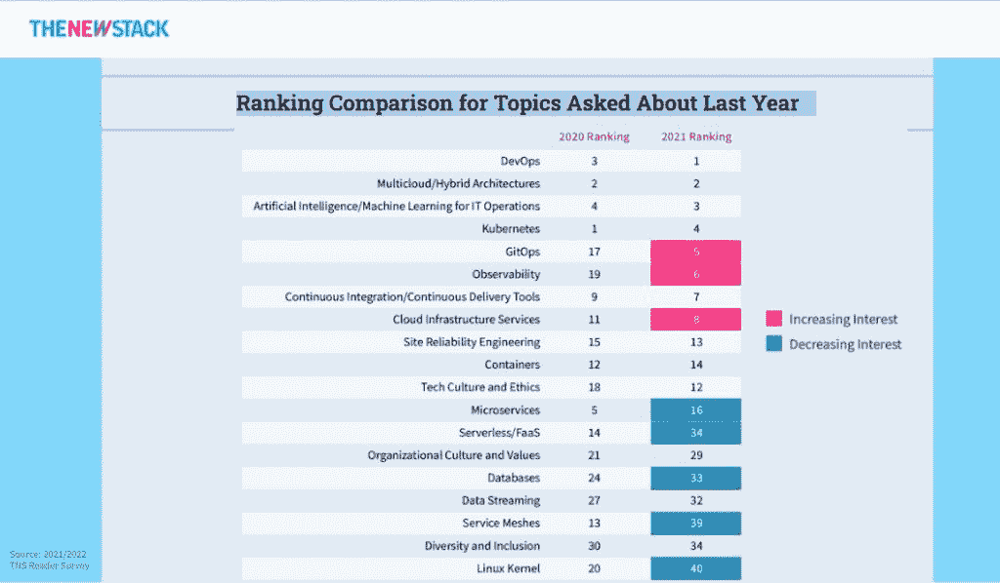

# 服务网格变得无聊，这是一件好事

> 原文：<https://thenewstack.io/service-mesh-gets-boring-and-thats-a-good-thing/>

最近发布的[云本地计算基金会](https://cncf.io/?utm_content=inline-mention)调查指出了[服务网格对于大多数使用 Kubernetes](https://thenewstack.io/why-do-you-need-istio-when-you-already-have-kubernetes/) 和微服务的组织来说是多么重要。与此同时，对新堆栈读者的调查显示，有迹象表明服务网格甚至变得无聊，或者至少是一个读者没有以前那么感兴趣阅读的主题。

在 5 月 KubeCon+CloudNativeCon EU 期间发布的 [CNCF 调查](https://www.cncf.io/wp-content/uploads/2022/05/CNCF_Service_Mesh_MicroSurvey_Final.pdf)中，作者报告称“服务网格成为云原生基础设施的关键组成部分并不奇怪。”在 253 名调查受访者中，70%在生产或开发中运行服务网格，19%在评估模式中运行服务网格。“有些人说，他们正在为高采用率的客户运行服务网络。报告作者说:“那些没有实施服务网络的人形成了一个独特的少数群体——不到 10%”。

## 对服务网格不太感兴趣

但是，虽然服务网格已经成为调查受访者所代表的大多数组织的支柱，但新的堆栈读者对这个主题不太感兴趣。当被问及 2022 年读者希望新堆栈涵盖哪些主题时，只有 9%的读者表示服务网格，相比之下，DevOps 和多云/混合架构的主题分别为 30%和 29%。与 2020 年的第七名相比，2021 年服务网在“去年询问的主题比较”排名中跌至第 39 名。

这两个数据点预示着服务网格在几年前被引入后，现在已经成为主流。新的书库读者调查显示，随着主题的成熟，读者对阅读它的兴趣越来越少。总之，CNCF 的数字反映了服务网络是如何成熟的，[bubble and Linkerd 的首席执行官威廉·摩根](https://www.linkedin.com/in/wmorgan/)在 KubeCon+CloudNativeCon EU 期间告诉新堆栈。“多年来，服务网格市场一直受到大肆宣传的推动，现在这种宣传已经有所转变。

“服务网状市场对我们来说也很棒，因为现在在服务网状市场的人真的对解决问题感兴趣，”摩根说人们对这项技术本身并不感到兴奋——他们试图用它来实际解决业务问题。这是一种不同类型的关系，甚至是我们现在关于服务网格的一种非常不同的对话。"

## Wasm 影响

CNCF 的调查表明，用户也对使用新技术的服务网格感兴趣。在环境中使用服务网格，如 [WebAssembly (Wasm)](https://thenewstack.io/cloud-native-webassembly-applications-are-already-here/) 对 25%的受访者来说很重要，这表明了该语言的前景，因为对 Wasm 的兴趣相对较新。

例如，虽然 Wasm 已被证明有助于降低数据流的计算能力和延迟，并提供其他令人印象深刻的计算基准，但它将在多大程度上被广泛采用仍是未知数。相反，服务网格现在“绑定到开发软件的整个云原生模式，”摩根说。

<svg xmlns:xlink="http://www.w3.org/1999/xlink" viewBox="0 0 68 31" version="1.1"><title>Group</title> <desc>Created with Sketch.</desc></svg>