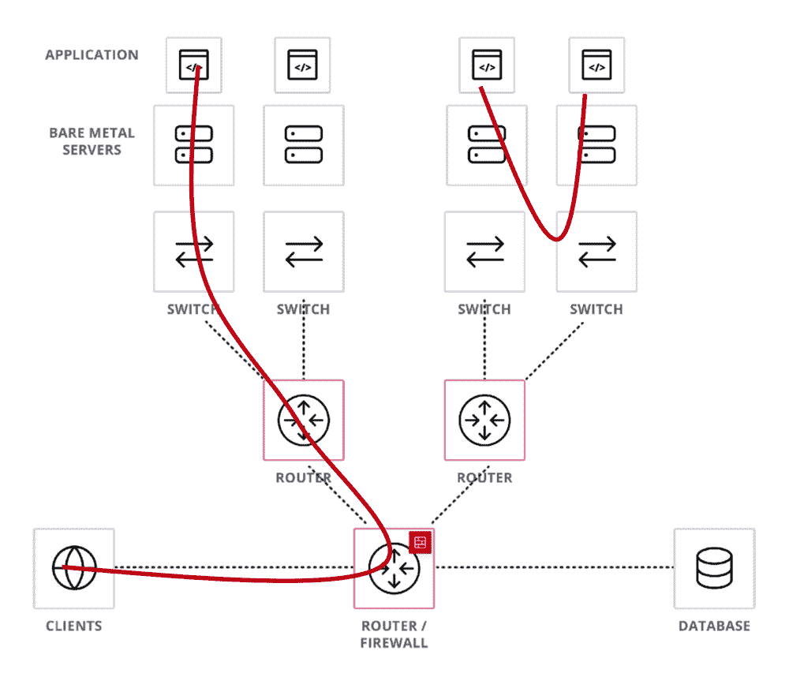
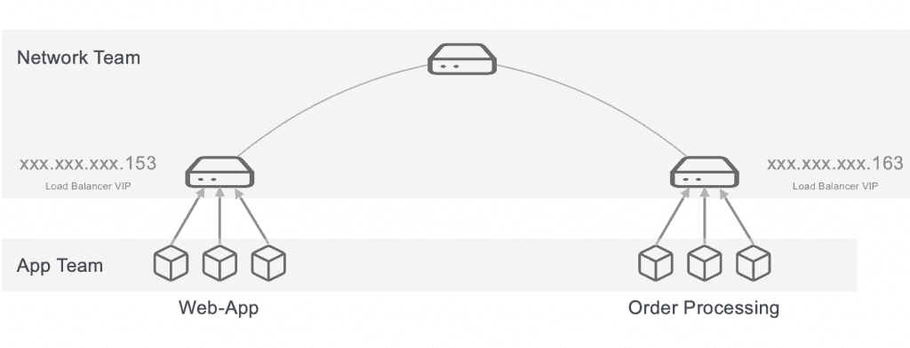
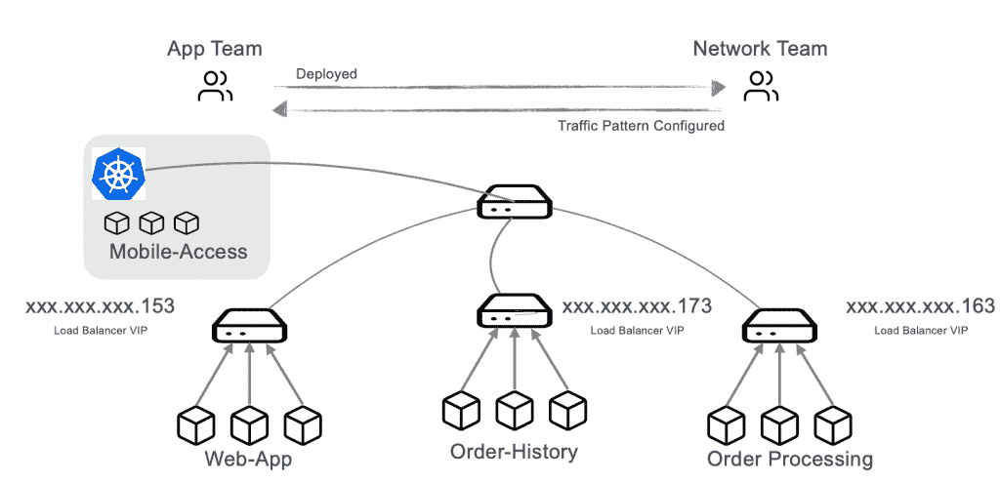
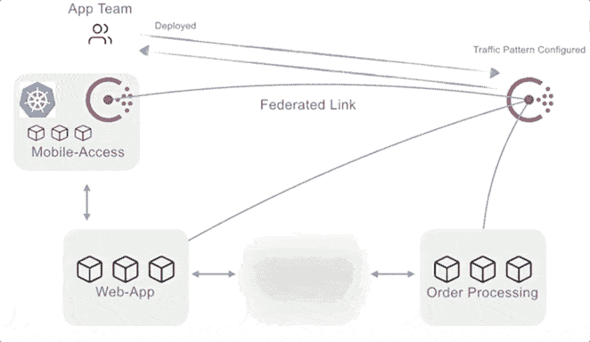

# 服务网格只是冰山一角

> 原文：<https://thenewstack.io/service-mesh-is-just-the-tip-of-the-iceberg/>

[HashiCorp](https://www.hashicorp.com/?TheNewStack) 赞助本帖。

 [斯蒂芬·威尔逊

Stephen 是 HashiCorp 的解决方案工程师。他在专注于将技术应用于业务战略的岗位上拥有超过 20 年的经验。](https://www.linkedin.com/in/stephen-wilson-9420617/) 

服务网格是一个热门话题。大多数时候，关注点是相互 TLS 连接、健康检查或可观察性。这些都值得讨论，但是有一个基本假设几乎没有人谈论:服务发现。

如果您正在研究服务网格，您的第一个问题应该是:“我的服务今天是如何找到彼此的？”如果你没有这个问题的答案，那是你需要解决的第一个问题。

在本文中，我将简要解释服务发现背后的前提，并展示您为什么需要它。如果你不确定服务发现，构建服务网格就没有意义。

## 使用身份而非 IP 管理网络

在许多应用程序遵循客户机/服务器思想的时代，联网是相当简单的，你可以将流量路由到一个单一的服务。

可伸缩性不是主要因素，应用程序运行在裸机上，因此在代码中硬编码 IP 地址并使用它来管理网络流量不成问题。

然后，当我们开始添加更多服务、虚拟化、物理和虚拟交换、物理和虚拟防火墙以及其他组件以扩大应用的规模和范围时，事情变得一团糟。IP 地址成为应用程序和底层物理基础设施之间的紧密耦合。这不仅降低了我们内部创新的能力，也降低了我们迁移到更新的基础设施和工作负载(如云和容器)的能力。

### 如果没有 IP 呢？

IP 将始终存在于网络命名抽象之下，但其思想是在识别服务时从人类操作员的角度移除 IP。这个问题引出了其他一些非常重要的问题，这些问题触及了混合云模型中网络的核心。服务如何找到彼此？如何有效地分配负载和管理故障转移？

答案是增加抽象概念，使我们能够通过指定的身份管理网络，而不是 IP 地址。有了这种方法，IP 地址编码对日常运营商来说将变得不可见，然后就可以实现可扩展的快速服务网络。

你可能会说，“我们已经解决了这个问题。我们已经用 **DNS** 解决了这个问题。”DNS 只是解决方案的一部分。为了使 DNS 正常工作，您需要几个硬件和软件组件，例如:

*   负载平衡器
*   开关
*   路由器
*   或其他网络组件

这些组件具有复杂的配置，可以将虚拟 IP 地址(VIP)转换为 DNS 条目，从而提供我们想要的可读身份。

在下面的例子中，我有名为 *Web-App* 和*订单处理、*的服务，它们前面都有负载平衡器。

这种负载平衡器模式在服务网络中很常见。这些负载平衡器确保服务之间的流量平衡，有一种统一的方式将服务名称链接到一致的 IP，并且可以优雅地处理一些故障转移。这解决了服务发现问题。我可以在负载平衡器(入口点)中为动态 IP 添加一个虚拟 IP，然后在它下面，我允许这些单独的组件拥有自己的任何性质的 IP 地址，并且仍然可以找到它们。

## 使东西交通复杂化

随着基于服务的应用程序和系统变得越来越大，这种每个服务都有负载平衡器的模式变得非常复杂。负载平衡器在当今的服务网络中仍然占有重要地位，但在许多情况下，如果组织将这些设备捆绑到每个服务上，并使用它们来管理基于服务的应用程序中的所有流量(东西向流量)，他们会因要管理的设备数量过多而不堪重负。上图在比例上有几个问题:

*   **更长的延迟**:从一个服务到负载均衡器，然后到下面的服务，再返回，意味着比直接连接更多的网络跳数。
*   **高成本**:如果负载均衡器关闭，连接的每个服务实例都将不可用。这需要物理设备的冗余。这意味着购买、实施和维护这些设备的成本增加了一倍，无论它们是物理设备还是虚拟设备。
*   **管理复杂**:上图显示了这种方法如何需要两个团队(一个应用团队和一个网络团队)之间的深度协调，以确保服务的可靠性，同时还能处理升级、代码部署和中断。管理该系统的过程可能需要几天或几周的时间，仅仅是为了让新服务上线。

这并不意味着你应该摆脱你的负载平衡器。最终，您应该始终根据您的环境需求进行架构设计。在您的东西向流量路径中，您需要像“粘性会话”这样的高级功能吗？那么负载平衡器绝对有意义。

这里的关键要点是，许多组织可以通过试验更直接的服务发现机制来受益，这些机制与您现有的网络基础架构一起工作，并防止负载平衡器不必要的扩散或手动配置。

## 选择正确的服务发现路径

我将重复我之前说过的话:如果你不确定服务发现，实现服务网格就没有意义。

这就是流行的服务发现解决方案应该出现在您的团队对话中的地方。有像 Kubernetes 这样的解决所有挑战的大型解决方案，它给你的不仅仅是服务发现。[consult](https://www.consul.io/)是另一个[流行的开源选择](https://twitter.com/mitchellh/status/1068584717589434368)，因为它可以从提供服务发现开始，一旦你确定了这种做法，你就可以打开它成熟的服务网格特性。有很多其他方法可以实现服务网格，但是让我们以这两个例子为起点，甚至探索如何将它们结合起来使用。

### Consul 和 Kubernetes 的建筑范例

Kubernetes 内置了服务发现、负载平衡器和内部网络来解决前面讨论的模式中的许多问题。当您的完整应用程序在其集群内运行时，它的工作效果最佳。然而，这意味着如果你不是一家拥有全部基于 Kubernetes 构建的绿地应用程序的初创公司，你必须迁移一些棕色地带的应用程序，以便在你的绿地应用程序上启动或使用它。在任何启动后的场景中，您都将通过运行新的 Kubernetes 服务和其他非 Kubernetes 服务来为您的环境添加一些异构性。

在下图中，我在 Kubernetes 上添加了一个移动访问服务。

这里剩下的几个问题是:

*   Kubernetes 原语在非 Kubernetes 环境中不可用。
*   在异构环境中，Kubernetes 服务发现和配置并不总是在集群之外很好地转换，因为它通常需要外部 DNS 进行解析。但是，可以做到。有一些工具可以让与异构环境的集成感觉更像是 Kubernetes 本地的，但是这会增加解决方案的复杂性。

这就是像 Consul 这样的专注于服务发现的工具——无论是单独使用还是与 Kubernetes 一起使用——能够真正发挥作用的地方。

Consul 不需要迁移到容器化的工作负载，它是一种嵌入式的独立服务，可以连接虚拟机、容器、裸机甚至大型机上的组件。它使用本地原语在 Kubernetes 中工作，并允许用户以 Kubernetes 本地方式在与非 Kubernetes 工作负载共享的环境中工作。

### 通过咨询发现服务

Consul 创建了一个注册表来跟踪服务，并创建了一个可选的键值存储来实现可伸缩的自动化配置更改。它的服务注册中心在单个服务和 Kubernetes 集群之外运行，因此它可以在任何地方管理网络。

在上图中，您可以看到一个名为 *Order-History* 的新服务启动并自动在 Consul 中注册。这种自动发现以及故障检测是良好的服务发现基础的关键特征。像 Consul 这样的服务发现解决方案需要提供:

*   **命名抽象**屏蔽了 IP 管理，这样一些负载平衡器，比如上图中的那些，就不是每个服务都需要的。或者，在许多现有的带有负载平衡器的环境中，可以使用 Consul 来实现自动化。
*   **直接连接**需要更少的网络跳数，从而减少延迟。
*   健康检查(Health checks )( T7 ),这样，如果任何实例死亡或出现健康问题，注册中心将会发现这一点，并避免将该地址返回给其他服务。
*   **负载均衡**随机向不同的实例发送流量，这样就不会有服务被过多的请求淹没。

这种服务发现提供的最大优势是可管理性。它通过自动添加新服务并从注册表中删除不健康的服务，消除了人工劳动，从而降低了成本。它还消除或显著缩短了基于票证的部署流程，并为您的团队提供了自助服务的能力。

如果您在上图中注意到，在某些情况下，应用程序部署不再需要网络团队。应用团队可以直接与 Consul 交互，Consul 将自动执行网络团队以前必须处理的部署任务。

虽然这超出了本文的范围，但另一个使网络自助服务更进一步的组件——特别是在一个法规遵从性很强的组织中——是一个[策略即代码](https://docs.hashicorp.com/sentinel/concepts/policy-as-code/)引擎，当开发人员在 Consul 中执行违反公司协议的操作时，它会自动拒绝或警告开发人员。

## 坚实的服务发现基础的标准

与基于服务的架构的好处类似，服务发现的好处很大程度上来自于由此带来的组织敏捷性的提高和改进。无论您是选择 Consul、Kubernetes、二者，还是其他服务发现方法，您的决策标准都应该围绕敏捷性、操作负担、可移植性、安全性和弹性。

### 敏捷性和自动化

您希望能够立即更新——不只是每天更新，而是随时更新。服务的发现和与服务网络其余部分的连接需要快速和自动。自助服务系统需要缩短或消除售票等待时间。

### 运营负担

去除票务系统的重量级流程。此外，考虑一下认知负担——当您试图更快地交付服务时，您不希望过多考虑如何交付和管理所有这些服务的互通。

### 轻便

无论服务是在本地、云中还是在另一个数据中心运行，您的服务发现系统都应该能够在所有环境中顺利工作。

### 安全性

服务应该能够针对单个服务注册中心进行自我认证。这允许机器验证其发布服务的授权，同时仍然给予操作者监督和控制。

### 弹性

健康检查、流量自动重新路由和[渐进式交付](https://redmonk.com/jgovernor/2019/08/07/hashiconf-eu-2019-the-service-mesh-push/)功能需要自动化。

## 结论:数据中心的服务身份平面

当您的动态工作负载(例如微服务)达到无法再手动配置这些连接的规模时，就开始需要服务发现和服务网格。为管理跨多种云、技术和组织的爆炸式增长而实施的流程和系统根本无法扩展。因此，受影响的是交货时间。

正是由于这种无法快速移动的能力，在构建服务网格之前，您需要一种将服务身份负担转移给应用程序的服务。它需要健康检查、动态配置和安全广播授权。有了这个服务发现启动板，您可以开始考虑添加其余的服务网格功能，例如安全通信、可观察性和针对流量分割、A/B 测试、功能切换/标记等模式的渐进式交付网络控制。

来自 Pixabay 的特征图像。

<svg xmlns:xlink="http://www.w3.org/1999/xlink" viewBox="0 0 68 31" version="1.1"><title>Group</title> <desc>Created with Sketch.</desc></svg>