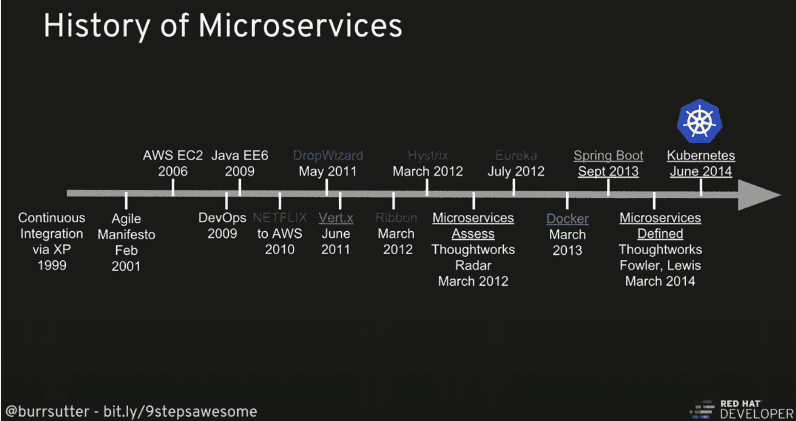
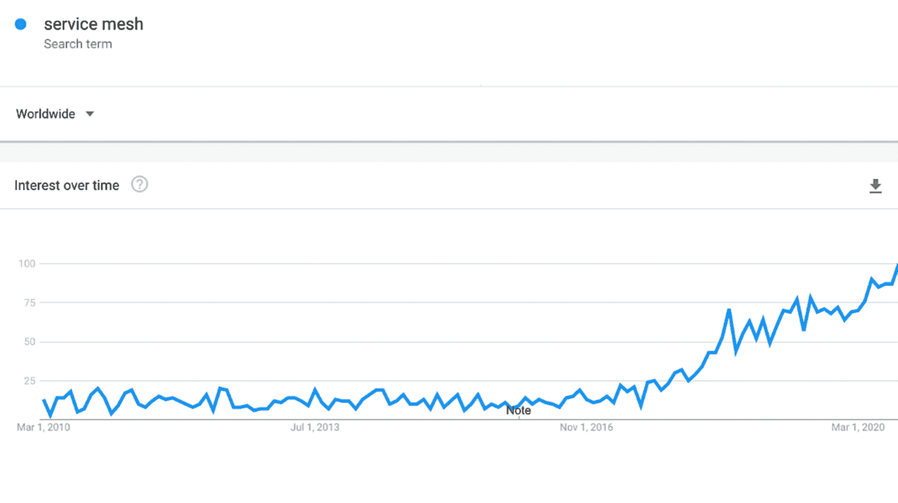
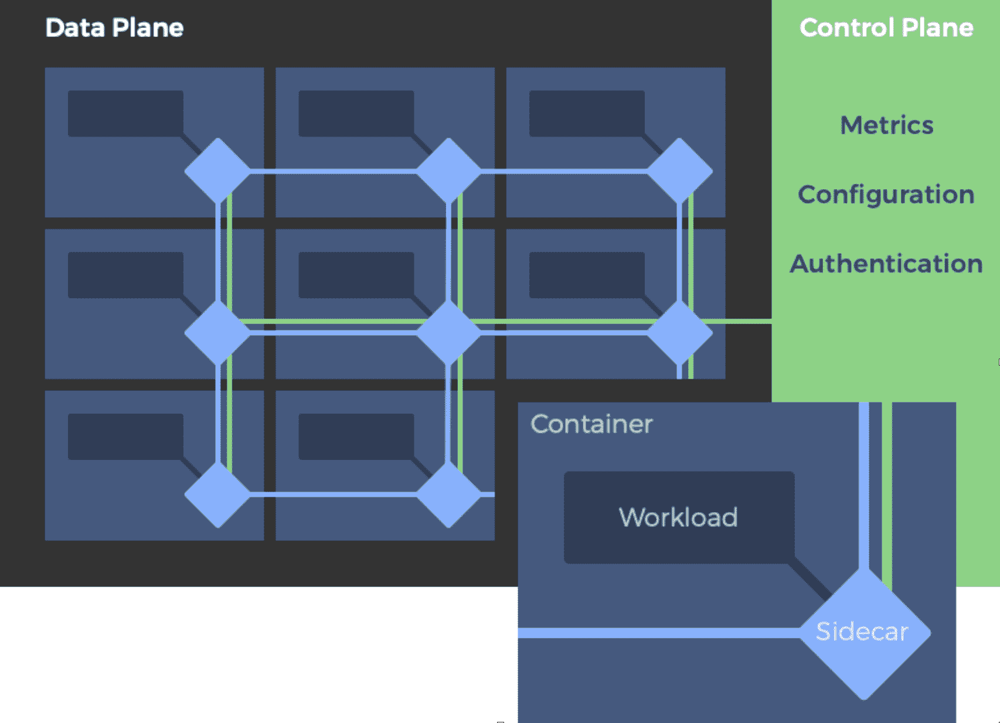
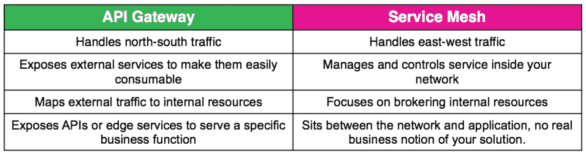
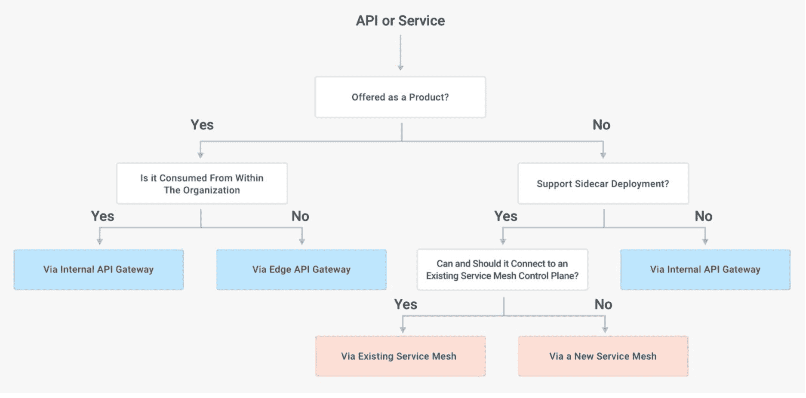
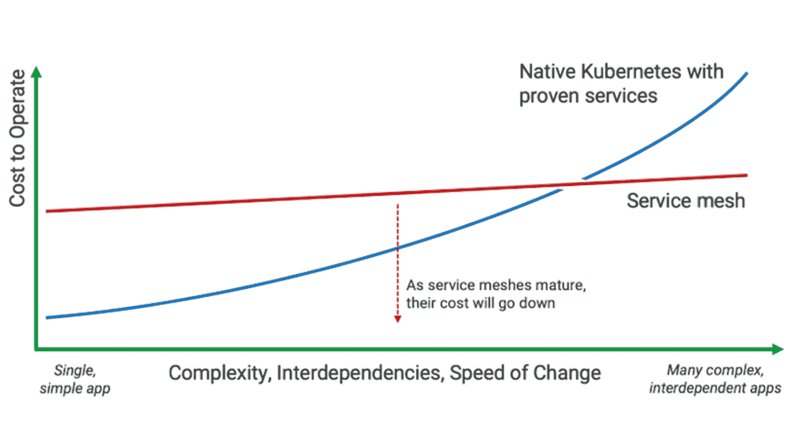

# 云世界中的服务网格

> 原文：<https://thenewstack.io/service-meshes-in-the-cloud-native-world/>

微服务已经占据了软件行业的中心舞台。从整体架构过渡到基于微服务的架构，使公司能够更加频繁、可靠、独立地部署其应用程序，并且没有任何麻烦。这并不意味着微服务架构中的一切都是绿色的；有些问题需要解决，就像设计分布式系统一样。这就是“服务网格”概念越来越流行的地方。

很长一段时间以来，我们一直在考虑将大型应用程序分解成较小的应用程序，以简化软件开发和部署。下面的图表借用了 Burr Sutter 题为“[使用 Kubernetes](https://youtu.be/ZpbXSdzp_vo) 实现卓越的 9 个步骤”的演讲，解释了微服务的发展。

图片来源:[德沃克斯的伯尔·萨特](https://youtu.be/ZpbXSdzp_vo)

服务网格的引入主要是由于 IT 领域的一场完美风暴。当开发人员开始使用多语言(多语言)方法开发分布式系统时，他们需要动态服务发现。运营需要平稳地处理不可避免的通信故障，并执行网络策略。平台团队开始采用像 [Kubernetes](https://www.infoq.com/articles/service-mesh-ultimate-guide/%23kubernetes) 这样的容器编排系统，并希望使用现代 API 驱动的网络代理(如 [Envoy](https://www.infoq.com/articles/service-mesh-ultimate-guide/%23envoyproxy) )在系统中动态路由流量。

## 什么是服务网格？

 [帕万·贝拉加蒂

Pavan Belagatti 是印度增长黑客领域的先驱之一，他也是 DevOps 的影响者和谷歌认证的数字营销人员。他已经就 DevOps 这个主题写了 100 多篇文章。他通常写 DevOps、市场营销和增长黑客。他是世界上一些顶级网站的客座撰稿人。](https://www.linkedin.com/in/pavan-belagatti-growthmarketer/) 

众所周知，微服务可以降低组织中软件开发的复杂性，但是随着组织中微服务的数量从个位数增加到大量，服务间的复杂性会变得令人生畏。

因此，服务网格是管理和控制应用程序各部分如何交互、相互通信和共享数据的合适方法。服务网格是一个构建在应用程序中的专用基础设施层的概念。这种可见的基础设施层有助于优化通信，并在应用增长时避免停机。

微服务带来了诸如操作复杂性、联网、服务之间的通信、数据一致性和安全性等挑战。这就是服务网格派上用场的地方，它是专门为解决微服务带来的挑战而设计的，通过提供对服务如何相互通信的细粒度控制。

服务网格提供:

*   服务发现
*   服务网络
*   路由和流量管理
*   加密和认证/授权
*   粒度指标和监控功能
*   可观察性
*   限速
*   断路
*   负载平衡
*   分布式跟踪

下图显示了谷歌搜索术语“服务网格”的趋势如你所见，它在向上移动。

## 服务网格是如何工作的？

服务网格主要由两个基本组件组成:数据平面和控制平面。在微服务架构内进行快速、可靠和安全的服务对服务调用是服务网格努力要做的事情。虽然它被称为“服务网格”，但更恰当的说法是“代理网格”，服务可以插入并完全抽象网络。

图片来源:[开放](https://glasnostic.com/blog/service-mesh-istio-limits-and-benefits-part-1/service-mesh-ea486b17e8.png)

在一个典型的服务网格中，这些代理作为 sidecar 被注入到每个服务部署中。服务不是直接通过网络调用服务，而是调用它们的本地 sidecar 代理，代理代表服务处理请求，从而封装了服务到服务交换的复杂性。互相连接的 sidecar 代理实现了所谓的数据平面。用于配置代理和收集度量的服务网格的组件统称为服务网格控制平面。

服务网格旨在解决开发人员在访问远程端点时遇到的多重障碍。特别是，服务网格可以帮助运行在 Kubernetes 等容器编排平台上的应用程序。

## 服务网状产品

在管理云应用时，服务网格是一个很好的问题解决方案。如果有人在微服务架构中运行应用程序，他们可能会被认为是服务网格的良好候选人。随着组织采用[微服务架构](https://jfrog.com/knowledge-base/the-role-of-containers-in-your-microservice-architecture/)，服务的数量趋于增长，服务网格允许您从庞大的微服务集合中清除增强的复杂性。

一些广泛使用的服务网格产品包括:

*   [Linkerd，](https://linkerd.io/)于 2016 年发布，引入了这一新类别，是一个开源的[云原生计算基金会](https://cncf.io/?utm_content=inline-mention)孵化项目，主要由浮力维护和赞助。
*   [Istio](https://istio.io/) **，**于 2017 年 5 月发布，是谷歌、IBM、Lyft 的开源项目。
*   [领事连接](https://www.consul.io/)，2018 年 11 月发布，是 HashiCorp 管家的开源软件项目。

## API 网关与服务网格:一起更好？

虽然 API 网关可以处理东西向流量，但服务网格似乎更适合这里，因为服务网格在连接的两端都有代理。

类似地，尽管服务网格可以处理南北流量，但 API 网关被认为更适合这种安排，因为连接的一部分超出了服务网格的管理范围。

南北交通通常需要终端用户的监督。API 网关更加关注管理终端用户体验。

图片来源: [DZone](https://dzone.com/articles/api-gateway-vs-service-mesh)

公司可以使用 API 网关，通过一个集中的入口点将 API 作为产品提供给外部或内部客户/用户，并管理和规范它们的暴露。这通常在复杂的应用程序需要相互通信时使用。

图片来源:[孔](https://konghq.com/blog/the-difference-between-api-gateways-and-service-mesh/)

服务网格可用于在我们的系统中运行的所有服务之间建立安全可靠的 L4/L7 流量连接，使用分散的 sidecar 部署模式，该模式可在每个服务上采用和实施。它们通常用于在与应用程序相关的所有服务之间创建点对点连接。

公司通常会同时使用服务网格和 API 网关，并同时使用它们来相互补充。在 Melissa McKay 的“[服务网格解决方案:速成班](https://jfrog.com/shownote/service-mesh-solutions-london-microservices/)”中了解更多关于服务网格的信息。

## 您真的需要服务网格吗？

非常通用和安全的答案是，“视情况而定。”

这取决于用例、时机、运行的微服务数量、成本，以及对成本与收益的仔细考虑。

服务网格使软件平台能够完成大量繁重的应用程序。当开发人员面临安全性、可扩展性、可观察性和流量管理挑战时，它们提供基础设施标准化，并进行集中管理。

如果您正在部署您的第一个、第二个或第三个微服务，您可能不需要服务网格。相反，沿着学习 Kubernetes 的道路前进，并在您的企业中使用它。会有一个转折点，你会意识到对服务网格的需求。此外，当我们项目中的微服务数量增加时，我们自然会熟悉服务网格将解决的障碍。这将有助于我们在最佳时机到来时准备和规划我们的服务网格之旅。

图片来源:NGINX

随着应用程序复杂性的增加，实现服务网格成为逐个服务地实现功能的现实替代方案。这在 NGINX 的文章“[我需要服务网格吗？](https://www.nginx.com/blog/do-i-need-a-service-mesh/)

通过降低微服务架构中涉及的复杂性，服务网格提供了各种各样的功能，并已成为出色的 DevOps 代理。如果您正在采用云原生方式，它们将成为一种必须。采用服务网格的公司看不到放缓的迹象。

在采用微服务架构时，确保诸如二进制文件、容器映像、秘密、元数据等工件的存储和安全是至关重要的。因此，强烈建议您使用一个健壮的工件存储库管理器，如 Artifactory，它可以作为您的 [Docker 和 Kubernetes registry](https://jfrog.com/integration/kubernetes-docker-registry/) ,以实现平稳、无忧的微服务部署过程，并在您的需求增加时使用该基础深入研究服务网格方法。

快乐的祈祷！

<svg xmlns:xlink="http://www.w3.org/1999/xlink" viewBox="0 0 68 31" version="1.1"><title>Group</title> <desc>Created with Sketch.</desc></svg>