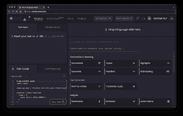

# 服务为开发人员简化了自然语言处理

> 原文：<https://thenewstack.io/service-simplifies-natural-language-processing-for-developers/>

自然语言处理并不完全是普通的开发人员技能；但是现在，开发人员可以通过“即服务”产品来访问 NLP 功能。

One AI 的创始人兼首席执行官 Amit Ben 告诉 the New Stack，One AI 在 5 月份推出了这项服务，并在它的[低代码平台](https://thenewstack.io/key-concepts/low-code-no-code/)上签下了“数万名开发者”。

“随着时间的推移，我们已经扩展了 [API 功能](https://thenewstack.io/how-to-innovate-fast-with-api-first-and-api-led-integration/)，解决方案的健壮性和规模，并且我们添加了更多的定制，”Ben 说。“我们的许多用户向我们展示了他们的源材料是音频还是视频，因此我们增加了向平台输入音频和视频的能力，然后应用我们所有的语言处理能力来提取价值信息、细节，并以各种方式处理内容。”

## 平台使用耳语

Ben 说，转录是容易的部分，因此 One AI 的目标是尽可能便宜地提供它，利用[开源自动语音识别(ASR)系统 Whisper](https://github.com/openai/whisper) 。Whisper 接受了 OpenAI 的 68 万小时多语言和多任务监督数据的训练。

“我们可以提供廉价的转录，作为我们对客户服务的一部分，因为我们相信价值在于语言处理，而不是转录本身，”他说。

人工智能希望解决的真正问题是将关键信息浓缩成可消化的形式。

“没有人会坐着听数百小时的录音。通常，他们甚至不会听一个小时的录音，”本说。“所以你转录它，把它变成文本，这样人们就可以更容易地消费这些信息。但是你知道吗？人们也不想读它，尤其是在非常大的范围内。”

## 训练模型

该公司使用人工智能从文本、音频或视频中提取意思。例如，它可以创建一个转录摘要，提供谈话的亮点，检测会议时间和日期，甚至检测何时提到竞争对手。

本说，人工智能根据一个人工智能从合作伙伴和“其他数据源”收集的数据进行训练。数据分析师团队收集并注释数据。

“没有多少模特在服务邮件或销售电话上接受过培训，因为这些数据是不公开的，所以我们必须做跑腿工作，收集数据，然后[训练模特，](https://thenewstack.io/ai-development-needs-to-focus-more-on-data-less-on-models/)”Ben 说。

最终结果是，该平台由多个不同的模型支持，每个模型都是针对不同的领域和用例定制的。他说，该平台识别领域，并应用适合该内容的正确模式。他解释说，这类似于 IP 语音平台，它经过训练可以选择正确的压缩方式。

“当你用手机打电话时，你得到的压缩和编码器与你用拨号或桌面打电话时不同，这就是 IP 语音平台的作用。他们善于为你选择合适的压缩方式，”本说。“我们的数据科学团队一直担心要确保每项技能在我们支持的每个领域都达到最先进或更好的模式。”

## 低代码平台简化了编码

图像通过一个人工智能

[低代码平台](https://thenewstack.io/what-a-low-code-platform-offers-frontend-developers/)是语言不可知的。它允许开发人员通过拖放来为各种[的 NLP 功能](https://docs.oneai.com/docs/about-skills)创建 API 代码，包括总结、创建标题、识别演讲者和角色。Ben 说，该公司为那些想要更深入研究或根据自己的需要进行修改的开发人员发布了完整的文档。

然后，该 API 可以从开发人员的程序中调用该函数。一个潜在的用例可能是一个客户服务应用程序，它调用一个人工智能来转录一个呼叫，并将重点内容提供给客户服务代表以获得响应。有一个 JSON 响应选项，可以为开发人员提供创建自动化和逻辑所需的任何数据输出。例如，人工智能会检测到文本包含星期五下午 1 点的日期，然后自动安排会议。

价格因字数而异，但有一个免费的选项，所以开发者可以玩这些功能。

One AI 的创始人兼首席营销官 Yochai Levi 说:“我们希望让它变得如此便宜、简单和精简，以至于任何在家玩游戏的开发者……都可以尝试，同时，它将尽可能地强大。”。

据 Crunchbase 报道，该公司已经筹集了 800 万美元的种子资金。

<svg xmlns:xlink="http://www.w3.org/1999/xlink" viewBox="0 0 68 31" version="1.1"><title>Group</title> <desc>Created with Sketch.</desc></svg>