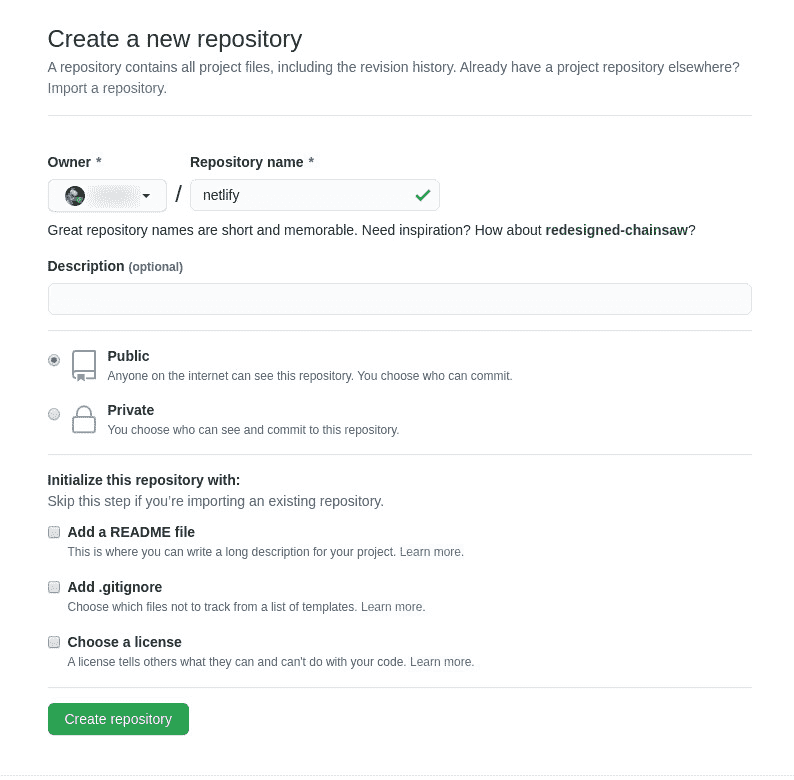

# 用 Netlify 建立一个静态网站

> 原文：<https://thenewstack.io/set-up-a-static-website-with-netlify/>

你是一个正在寻找下一代技术来提高工作效率和可扩展性的 web 开发人员吗？如果这听起来像是你的风格，网络生活可能正合你的胃口。With Netlify 使用一个能够推送至您的 GitHub 存储库和托管微服务的存储库，然后微服务通过一个广泛的内容交付网络(CDN)执行和分发您的内容，将您的静态网站交付给消费者、客户和访问者。

在分发阶段，Netlify 将始终选择最好的 CDN 并在那里分发您的内容，这导致比传统托管平台更快的加载时间。当一个访问者浏览你的内容时，他总是会从最近的服务器上看到一个预装的版本。

因此，您不仅可以获得自动化的分发，还可以为您的静态站点获得更快的页面加载。

我知道你在想什么:“静态网站？谁用[静态站点](https://thenewstack.io/back-to-the-future-static-websites-for-high-performance/)？”

答案？很多。

人们使用静态网站是因为:

*   他们速度很快。
*   它们易于构建和托管。
*   他们很安全。
*   它们是开发人员友好的。
*   他们是可靠的。
*   它们很便宜。
*   它们伸缩性很好。
*   它们可以自动化。

而这还只是入围名单。

因为 Netlify 有内置的 DNS 管理和(免费的)SSL 证书，所以启动静态站点的复杂性会更低。

我将向您展示如何安装 Netlify 并开始使用命令行工具。我将在 Ubuntu 20.04 上演示，但你也可以在 macOS 和 Windows 上安装。

## 安装网络生活

在我们真正进入安装部分之前，你会想要前往 [Netlify 注册页面](https://app.netlify.com/signup?_ga=2.58805101.1387423994.1602250867-1105850871.1602250867)并创建一个免费帐户。你可以注册 GitHub，GitLab，Bitbucket 或者 email。

一旦你注册了一个帐户，登录到你的 Ubuntu 机器，首先用命令安装 Node.js:

`sudo apt-get install nodejs -y `

一旦安装了 Node.js，您将需要使用以下命令安装 npm:

`sudo apt-get install npm -y`

您也可以选择用一个命令安装它们:

`sudo apt-get install nodejs npm -y`

解决了依赖关系后，我们将使用 Node.js 包管理器安装 Netlify，如下所示:

`sudo npm install netlify-cli -g`

使用以下命令验证 Netlify 安装:

`netlify`

您应该会看到可用的命令列表(图 1)。

图 1

Netlify 已成功安装在 Ubuntu 18.04 上。

## 将 CLI 连接到您的帐户

现在是时候将 Netlify CLI 连接到您的 Netlify 帐户了。为此，发出以下命令:

`netlify login`

这将打开您的默认浏览器，进入一个要求您授权应用程序的页面。

Authorizing the Netlify CLI to access your Netlify account.

单击 Authorize，应该会返回命令提示符。恭喜，您现在已经安装了 Netlify 并连接到您的帐户。

## 连接到您的 GitHub 帐户

接下来，您需要将 Netlify 连接到您的 GitHub 帐户。确保您通过默认的 web 浏览器登录 GitHub 帐户。为此，您将为 GitHub 创建一个帐户级别的访问令牌。在此之前，请确保使用以下命令安装 git(如果尚未安装):

`sudo apt-get install git -y`

现在，使用以下命令创建一个新目录:

`mkdir NETLIFY`

使用以下命令切换到新目录:

`cd NETLIFY`

接下来，我们将使用以下命令初始化目录:

`netlify init`

出现提示时(图 3)，使用键盘箭头键选择“No ”(如果尚未选择),然后按键盘上的 Enter 键。

图 3。

Making sure to connect the current directory to your GitHub account.

现在我们需要用以下命令初始化 git 的目录:

`git init`

将您站点的所有文件复制到新目录中，然后使用以下命令提交所有这些文件:

`git add .`

接下来，我们将使用以下命令创建初始提交:

`git commit -m 'Initial Commit'`

打开 GitHub URL https://github.com/new，并创建一个将链接到 Netlify 的新存储库。您可以随意命名该存储库。

创建一个名为 netlify 的新 GitHub 资源库。

创建存储库后，您需要复制存储库地址(格式为 yourgithubname/your-repo-name . git，如下所示:

`USERNAME/netlify.git`

其中用户名是您的 GitHub 用户名。

使用以下命令将远程存储库与本地目录链接起来:

`git remote add origin git@github.com:USERNAME/netlify.git`

其中用户名是您的 GitHub 用户名。

接下来，使用以下命令将所有文件从本地存储库推送到 GitHub repo:

`git push -u origin master`

最后，用以下命令初始化 Netlify 站点:

`netlify init`

出现提示时，请确保选择创建和配置新站点，然后回答剩余的问题。网站创建后，您将获得管理 URL、URL 和网站 ID。

确保将当前目录连接到您的 GitHub 帐户。

如果您发现通过 app.netlify.com 使用 GitHub 授权不起作用，请重新运行 init 命令并选择手动输入您的 GitHub 凭据。

完成后，您可以使用以下命令推送您的 git 存储库并触发新的站点构建:

`git push`

推送存储库后，您可以使用以下命令打开站点的 Netlify 管理 URL:

`netlify open`

现在你有了它，你已经安装了 Netlify，将它连接到你的 GitHub 帐户，并推出了你的第一个静态站点。此时，您可以开始构思将 Netlify 集成到 web DevOps 管道中的方法，以实现自动化交付等等。

<svg xmlns:xlink="http://www.w3.org/1999/xlink" viewBox="0 0 68 31" version="1.1"><title>Group</title> <desc>Created with Sketch.</desc></svg>