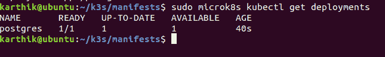

# 设置 MicroK8s 运行 Edge 应用程序

> 原文：<https://thenewstack.io/set-up-microk8s-to-run-an-edge-application/>

我们已经知道 [Kubernetes](https://kubernetes.io/) 是世界上基于容器的应用程序的首选编排平台，可以自动部署和扩展这些应用程序，并简化维护操作。然而，Kubernetes 也有自己的复杂性挑战。那么，企业如何利用容器化来解决物联网的复杂性，而不会以更复杂的 Kubernetes 告终呢？

Canonical 的 [MicroK8s](https://microk8s.io/) 是一个强大的、经过云计算原生计算基金会认证的 Kubernetes [发行版](https://www.cncf.io/certification/software-conformance/)。我认为，以下是它成为强大的企业边缘计算平台的一些关键原因:

*   **以 snap 包的形式提供:**这些应用程序包适用于桌面、云和物联网，易于安装并通过自动更新保护，可以安装在任何支持 snap 的 Linux 发行版上。这使得 MicroK8s 非常适合在组成物联网的各种硬件上运行。
*   **严格限制**:这确保了与底层操作系统的完全隔离和安全的生产级 Kubernetes 环境，所有这些都在一个非常适合边缘网关的小空间内。
*   **生产级附加组件** : [Istio](https://istio.io/) 、 [Knative](https://cloud.google.com/knative/) 、 [CoreDNS](https://coredns.io/) 、 [Prometheus](https://prometheus.io/) 、 [Jaeger](https://www.jaegertracing.io/) 、 [Linkerd](https://linkerd.io/) 、[纤毛](https://cilium.io/)和[头盔](https://helm.sh/docs/)都可以作为附加组件使用，设置起来很简单，只需要几行命令。
*   [**Kubeflow**](https://www.kubeflow.org/) 也可以作为 MicroK8s 的插件，用于改进人工智能(AI)和机器学习(ML)能力。

凭借其降低复杂性的能力，MicroK8s 将加速物联网和边缘部署。将物联网设备视为分布式容器化应用程序，可以让开发人员专注于应用程序而不是基础设施，并使运营团队的生活更加轻松。

MicroK8s 允许您将 Kubernetes 安装集群在一起，这样它们就可以形成一个集群，并将工作负载放在一个或多个这样的节点上。在本文中，我们将学习如何在 MicroK8s 集群上部署一个基于有状态 Angular、Spring Boot 和 Postgres 的应用程序，在该应用程序中，用户可以创建一个带有“姓名”和“年龄”属性的客户

如果你是 Kubernetes 的新手，我建议在阅读这篇文章之前先阅读下面的实践指南

## 设置一个 MicroK8s 集群

[](https://cdn.thenewstack.io/media/2020/08/fe3d2e9c-karthik-01.jpg)

图像–示例应用程序。

为了部署该应用程序，我们将使用 ***持久卷* (PV)** ，它是集群中由管理员调配或动态调配的一块存储。PV 是像卷一样的卷插件，但其生命周期独立于使用 PV 的任何单独的 pod。

***PersistentVolumeClaim*****(PVC)**是用户的存储请求。它类似于一个豆荚。Pods 消耗节点资源，PV 消耗 PV 资源。Pods 可以请求特定级别的资源(CPU 和内存)。声明可以请求特定的大小和访问模式(例如，它们可以装载为 ReadWriteOnce、ReadOnlyMany 或 ReadWriteMany)。

在下一节中，我们将看看如何在 MicroK8s 集群上安装和部署我们的应用程序。MicroK8s 通过[快照](https://snapcraft.io/)部署。快照是易于创建和安装的容器化软件包(如 Docker ),它们捆绑了它们的依赖项，无需修改即可在所有主流 Linux 系统上工作。快照会自动更新，可以安全运行。另外，请注意，MicroK8s snap 会经常更新，以匹配 Kubernetes 的每个版本。

可以使用以下命令安装 MicroK8s snap:

`snap install microk8s --classic --beta`

如果你正在寻找详细的步骤，请参考这篇[文章](https://thenewstack.io/get-the-smallest-fastest-fully-conformant-kubernetes-in-just-3-steps/)。

此时，我们已经安装了 MicroK8s，使用以下命令检查新部署的节点是否处于就绪状态。

`kubectl get nodes`

[](https://cdn.thenewstack.io/media/2020/08/a401c23b-karthik-02.jpg.png)

图像—2 节点 Microk8s 群集

## 使用 PersistentVolume 在 Kubernetes 上部署 Postgres

```
kind:  PersistentVolume
apiVersion:  v1

metadata:
   name:  postgres-pv-volume
   labels:
     type:  local
     app:  postgres

spec:
   storageClassName:  manual
   capacity:
     storage:  100Mi

   accessModes:
     -  ReadWriteMany

   hostPath:
     path:  "/var/lib/postgres"

---

kind:  PersistentVolumeClaim
apiVersion:  v1

metadata:
   name:  postgres-pv-claim
   labels:
     app:  postgres

spec:
   storageClassName:  manual
   accessModes:
     -  ReadWriteMany

   resources:
     requests:
       storage:  100Mi

---

apiVersion:  apps/v1

kind:  Deployment

metadata:
   name:  postgres

spec:
   selector:
     matchLabels:
       app:  postgres

   replicas:  1

   template:
     metadata:
       labels:
         app:  postgres

     spec:
       containers:
         -  name:  postgres
           image:  postgres:10.4

           imagePullPolicy:  "IfNotPresent"

           ports:
             -  containerPort:  5432

           envFrom:
             -  configMapRef:
                 name:  postgres-config

           volumeMounts:
             -  mountPath:  /var/lib/postgresql/data
               name:  postgredb

       volumes:
         -  name:  postgredb
           persistentVolumeClaim:
             claimName:  postgres-pv-claim

---

apiVersion:  v1
kind:  Service

metadata:
   name:  postgres

   labels:
     app:  postgres

spec:
   type:  NodePort
   ports:
    -  port:  5432

   selector:
    app:  postgres

```

我们在上面的清单文件中创建了四个资源。一个 PersistentVolume，一个用于请求访问 PersistentVolume 资源的 PersistentVolumeClaim，一个用于 Postgres 数据库的静态端点的服务，以及一个用于运行和管理 Postgres pod 的部署。

Postgres 容器使用 postgres-config ConfigMap 从环境变量中读取数据库凭据。

```
apiVersion:  v1

kind:  ConfigMap

metadata:
   name:  postgres-config
   labels:
     app:  postgres

data:
   POSTGRES_DB:  postgresdb
   POSTGRES_USER:  postgresadmin
  POSTGRES_PASSWORD:  admin123

```

现在让我们通过应用 YAML 配置来部署 Postgres:

[](https://cdn.thenewstack.io/media/2020/08/da9ca4ce-kathik-03.png)

图像–应用 Postgres 部署。

您可以使用以下命令检查集群中创建的所有资源:

[](https://cdn.thenewstack.io/media/2020/08/0d68dbc7-kathik-04.png)

图像 Postgres 部署的状态。

[](https://cdn.thenewstack.io/media/2020/08/3b8a523f-kube-04.png)

图像–Postgres PV、PVC 部署。

## 在 Kubernetes 上部署 Spring Boot 应用程序

现在我们已经部署了 Postgres 实例，让我们继续部署 Spring Boot 应用程序。

以下是 Spring Boot 应用程序的部署清单:

```
apiVersion:  apps/v1

kind:  Deployment

metadata:
   name:  spring-boot
   namespace:  default

spec:
   selector:
    matchLabels:
     app:  spring-boot
   replicas:  1

   template:
     metadata:
       name:  spring-boot

       labels:
         app:  spring-boot

     spec:
       containers:
       -  name:  spring-boot
         env:
           -  name:  POSTGRES_USER

             valueFrom:
               configMapKeyRef:
                 name:  postgres-config
                 key:  POSTGRES_USER

           -  name:  POSTGRES_PASSWORD
             valueFrom:
               configMapKeyRef:
                 name:  postgres-config
                 key:  POSTGRES_PASSWORD
           -  name:  POSTGRES_HOST
             valueFrom:
               configMapKeyRef:
                 name:  hostname-config
                 key:  postgres_host

         image:  karthi4india/orderapi:latest

---

apiVersion:  v1

kind:  Service
metadata:
   name:  spring-boot
   labels:
     app:  spring-boot
spec:
   type:  NodePort
   ports:
    -  port:  8080
   selector:
     app:  spring-boot

```

上面的部署使用了我们在上一节中创建的 postgres-config 中存储的配置映射。

让我们应用清单文件来创建资源

[](https://cdn.thenewstack.io/media/2020/08/889061f1-kube-05.png)

图像–创建 SpringBoot 部署。

您可以像这样检查创建的部署:

[](https://cdn.thenewstack.io/media/2020/08/9ca247b7-kube-07.png)

图像–部署的状态。

## 在 Kubernetes 上部署 Angular 应用程序

下一步是使用 Kubernetes 部署 Angular 应用程序，下面是部署清单:

```
apiVersion:  apps/v1

kind:  Deployment

metadata:
    name:  angular
    namespace:  default

spec:
    selector:
       matchLabels:
          app:  angular
    replicas:  1

    template:
       metadata:
          name:  angular
          labels:
             app:  angular

       spec:
          containers:
             -  name:  angular
               image:  'karthi4india/orderui:latest'
               imagePullPolicy:  Always

               volumeMounts:
                 -  name:  env-vars
                   mountPath:  /usr/local/apache2/htdocs/assets

          volumes:
               -  name:  env-vars

                 configMap:
                   name:  angular-env-vars
---

apiVersion:  v1
kind:  Service

metadata:
   name:  angular
   labels:
     app:  angular

spec:
   type:  NodePort
   ports:
    -  port:  4200

   selector:
    app:  angular

```

让我们应用上面的清单文件来部署 Angular 应用程序

[](https://cdn.thenewstack.io/media/2020/08/37f51147-kube-08.png)

图像–创建角度部署

您可以检查所有创建的部署，如下所示:

[](https://cdn.thenewstack.io/media/2020/08/32d84c88-kube-09.png)

## 部署入口

最后一步是部署入口，提供对集群中服务的外部访问。

```
apiVersion:  extensions/v1beta1

kind:  Ingress

metadata:
   name:  ingress-service
   annotations:
     kubernetes.io/ingress.class:  nginx
     nginx.ingress.kubernetes.io/rewrite-target:  /$1

spec:
   rules:
     -  http:
         paths:
           -  path:  /?(.*)

             backend:
               serviceName:  angular
               servicePort:  4200
           -  path:  /api/?(.*)

             backend:
               serviceName:  spring-boot
               servicePort:  8080

```

让我们应用上面的清单文件来部署入口服务:

[](https://cdn.thenewstack.io/media/2020/08/40e14c1d-kube-10.png)

图像-部署入口服务

您可以检查所有创建的入口部署，如下所示:

[](https://cdn.thenewstack.io/media/2020/08/ce539e0d-kube-11.png)

图像–入口已创建

您可以使用下面的命令检查所有创建的服务:

[](https://cdn.thenewstack.io/media/2020/08/c264fbbe-kube-12.png)

图片–服务列表

就是这样！现在，您将能够使用前端应用程序。这是该应用程序的外观:

[](https://cdn.thenewstack.io/media/2020/08/1e959477-karthik-13.jpg)

图像–创建客户

[](https://cdn.thenewstack.io/media/2020/08/46638de2-karthik-14.jpg)

图像–客户已创建

MicroK8s 为您提供了故障排除[工具](https://microk8s.io/docs/troubleshooting)来检查出了什么问题。请务必查看[常见问题](https://microk8s.io/docs/troubleshooting#common-issues)部分，以帮助解决常见问题。

凭借其增强 Kubernetes 生产力和降低复杂性的能力，MicroK8s 在加速物联网和边缘部署方面具有独特的优势。

## 有用的资源:

<svg xmlns:xlink="http://www.w3.org/1999/xlink" viewBox="0 0 68 31" version="1.1"><title>Group</title> <desc>Created with Sketch.</desc></svg>