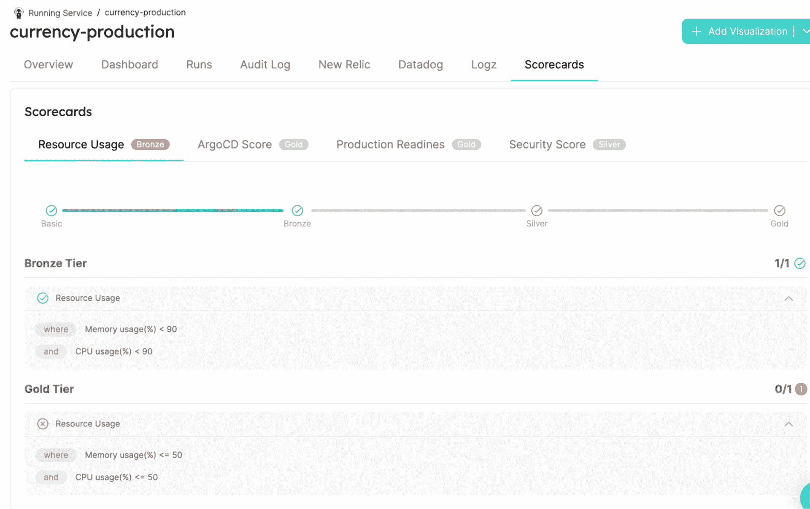

# 利用平台工程设定 Kubernetes 标准

> 原文：<https://thenewstack.io/setting-kubernetes-standards-with-platform-engineering/>

你不可能什么都是专家。但是缺乏专业知识不应该阻止你做任何事情，或者应该花费你很多时间来完成事情。相反，你只需要知道标准是什么，使用黄金路径，并看到重要的数据。

这就是平台工程的意义所在。它为开发人员创建了可重用的元素，例如重新部署图像标签、更新自动缩放组以提供新的包等等。这些功能可以通过内部开发人员门户访问，记分卡在其中发挥着重要作用。

我们以 Kubernetes 和开发者为例。说开发人员不是 Kubernetes 专家是不对的，因此他们应该要么学习 Kubernetes，自由漫游，同时希望不要破坏任何东西，要么等待 DevOps 门票。

我们需要允许开发者自治，这可以通过标准来实现。标准将开发人员从基础设施的复杂性中解放出来，并允许开发人员在限制范围内处理 Kubernetes。记分卡是表达这些标准的地方。

这不仅关乎良好的平台工程，还关乎良好的开发人员体验。开发人员应该得到设计良好的解决方案，就像那些开发人员提供给非技术人员的一样。

## **内部开发者门户制定 Kubernetes 标准**

我们已经写了内部开发者门户和他们的软件目录[如何抽象出 Kubernetes 的复杂性](https://thenewstack.io/developer-portals-can-abstract-away-kubernetes-complexity/)。内部开发人员门户自动映射所有 Kubernetes 元数据，并通过“白名单”数据帮助开发人员立即判断什么是重要的。在本帖中，我们将讨论内部开发人员门户如何使用记分卡将组织的 Kubernetes 标准付诸实践。

记分卡与内部开发人员门户中的护栏最终定义并推动更好的工程质量标准的想法紧密相关。定义 K8s 生产就绪性或安全标准不仅有助于单个开发人员的改进，还有助于整体的工程质量。

## **在软件目录中显示 Kubernetes 数据**

未经过滤的原始 Kubernetes 数据通常对开发人员来说太多了。有些数据是不相关的，有些可能是相关的，但是以一种对开发人员没有什么意义的方式呈现。内部开发人员门户包含软件目录，它们抽象数据以便开发人员可以使用。看一下这个从端口拍摄的单一服务视图。仅提供相关数据。

让我们看看 Kubernetes 的一些具体的记分卡示例。

## 生产准备记分卡

生产就绪记分卡评估现有 Kubernetes 对象(如部署或集群)的生产就绪情况。这有助于确保他们在生产环境中满足所需的性能、可靠性和可用性标准，并可以识别任何必要的更改或升级，以随着时间的推移保持或提高其就绪性，从而降低停机风险并确保为最终用户提供高质量的服务。

记分卡应涵盖以下类别:

*   **对于容器，**指标应验证容器资源配置，如内存请求和限制，并确保为所有容器配置了活跃度和就绪性探测器。这些配置对于确保容器高效运行并能够快速响应可能出现的任何问题至关重要。
*   **对于名称空间，**规则应该确保工作负载不会部署在默认的 Kubernetes 名称空间中，这有助于防止因干扰 Kubernetes 系统组件而可能出现的潜在问题。
*   **为了实现高可用性，**指标要求副本数量最少为两个，这对于在任何节点或单元出现故障时确保冗余非常重要。这种冗余对于确保工作负载的高可用性至关重要。

以下是 Kubernetes 生产准备情况的记分卡示例。

总的来说，记分卡中反映的标准旨在确保 Kubernetes 工作负载可用于生产，并且能够以可靠、可扩展和高效的方式运行。记分卡系统是一种有用的方法，可以跟踪对这些标准的遵守情况，并确保开发人员和运营团队都知道他们的工作负载的生产就绪状态。您可以点击查看该记分卡的现场演示版本[。](https://demo.getport.io/runningServiceEntity?identifier=ads-production&activeTab=7)

## **安全记分卡**

安全记分卡标准旨在确保安全措施到位，通过验证 GitHub、DataDog 和 Terraform 等外部系统的机密不会暴露来保护敏感信息。容器部署符合性标准确保容器配置有只读根文件系统，不访问底层主机并且不提升特权，所有这些对于维护容器安全性是至关重要的。标记和标签标准验证工作负载具有有效的标签值，并且所有容器映像都具有标记版本，这对于有效地组织和管理工作负载非常重要。

下面是这样一个记分卡的例子:(一个现场演示版是[这里是](https://demo.getport.io/runningServiceEntity?identifier=currency-production&activeTab=7))。

总的来说，这些规则有助于确保 Kubernetes 工作负载得到安全部署，并且能够以可靠和安全的方式运行。

## **资源使用记分卡**

虽然开发人员可能不太关心资源的使用，但是开发人员非常关心。你不能很好地利用资源使用问题，问题资源使用必然会产生更多的事件。记分卡可以提醒开发人员注意这些问题，这样他们就可以自己解决这些问题，并设定质量标准。

回到[运行服务记分卡](https://demo.getport.io/runningServiceEntity?identifier=currency-production&activeTab=7)，我们可以看到，由于 CPU 使用和内存问题，它在资源使用方面处于铜牌级别。通过搜索软件目录或使用其报告之一，这立即成为一个行动项目。

## ArgoCD 记分卡

[这是一个记分卡](https://demo.getport.io/runningServiceEntity?identifier=currency-production&activeTab=7)，用于评估 ArgoCD 工作流程和推广的生产准备情况。这些规则通过检查错误处理、配置管理、修订历史和扩展来确保工作流的可靠性和展示流程的合规性。

## 管理多个集群:记分卡拯救世界

管理多个 Kubernetes 集群具有挑战性，因为在所有集群中维护一致的配置非常复杂。由于多个集群分布在不同的区域和云中，因此很难确保所有集群的配置一致且正确，并且所有配置都是最新的。错误的配置可能会导致服务中断和安全漏洞等问题，这可能会产生严重的后果。

此外，大多数 Kubernetes 可视化工具不提供可以显示不同区域和云中的所有集群的统一仪表板，这使得很难从单一控制台监控整个 Kubernetes 环境的运行状况和性能。

在内部开发人员门户中，很容易创建一个显示所有 Kubernetes 集群及其最重要数据的仪表板。你可以在[现场演示版中看到它的样子:](https://demo.getport.io/k8s-clusters)

让我们在这些数据的基础上创建一个[生产就绪记分卡](https://demo.getport.io/k8s-clusterEntity?identifier=production&activeTab=3):

生产就绪记分卡用于根据一套标准评估 Kubernetes 集群的就绪情况。这些不同的规则可以用来确保 Kubernetes 集群的稳定性、可用性和可靠性。

“K8s 版本稳定”和“使用最新 K8s 版本”标准关注于确保所使用的 Kubernetes 版本是稳定的和最新的。例如，如果组织中有将集群从 Azure 迁移到 AWS 的计划，“云提供商不是 Azure”规则可以帮助跟踪和推动该计划，“使用 Argo CD”规则可以促进自动化和标准化的部署。

“为所有 pod 配置的就绪性和活动性”和“为所有 pod 配置的 CPU 和内存限制”有助于确保工作负载正常运行，并且不会超过可用资源。最后，“集群节点的数量至少为三个”确保了工作负载的冗余和高可用性。应用这些标准可以帮助组织维护一个稳定、安全和可伸缩的 Kubernetes 环境。

下面是一些额外的标准，主要关注 Kubernetes 环境的监控和可见性。“有 K8s 仪表盘吗？”standard 检查是否安装了 Kubernetes 仪表板，该仪表板提供了对 Kubernetes 环境的基本监控和可见性。“有普罗米修斯吗？”standard 检查 Prometheus 是否用于监控 Kubernetes 指标和基于这些指标的警报，这有助于快速检测和响应问题。

“有格拉夫纳吗？”standard 检查 Grafana 是否用于更高级的监控和指标可视化，这有助于监控 Kubernetes 环境的性能和健康状况。通过应用这些标准，组织可以确保他们的 Kubernetes 环境得到有效的监控和维护，以满足他们的性能和可用性要求。

## 为不同的环境和对象设定标准

为不同的实体设置不同的标准是很重要的，这反映了软件开发生命周期的不同阶段。

例如，在生产环境中，确保 Kubernetes 集群运行在最新稳定版本的 Kubernetes 上，并且有足够的节点来支持工作负载，这可能是至关重要的。可能还需要确保所有单元都配置了适当的资源限制，以防止出现性能问题。此外，可能需要 Prometheus 和 Grafana 等监控工具来提供高级监控和可视化功能。

另一方面，在试运行环境中，重点可能是在将新功能或变更部署到生产环境之前对其进行测试和验证。在这种情况下，标准可能更侧重于确保正确配置 Kubernetes 环境，并使用 Argo CD 等工具实现部署的自动化和标准化。

通过为不同的实体定义不同的记分卡，组织可以根据不同的环境定制他们的规则和检查，确保他们的 Kubernetes 环境针对每个环境的特定需求进行了优化。这有助于提高开发和部署过程的效率，同时确保 Kubernetes 环境稳定、安全和可靠。

## 结论

记分卡做三件事。他们以一种适合开发人员的方式抽象 K8s 数据，确保开发人员遵循 Kubernetes 的最佳实践和防护，以最大限度地提高应用程序的可靠性，并帮助开发人员推动计划。它们提供了帮助开发人员拥有安全性、可靠性和云支出的工具。当工作流根据记分卡自动运行以确定构建是否应该失败时，它们也很有价值。你可以在 [Port 的现场演示](http://demo.getport.io)中亲眼目睹，或者在这里注册一个免费版的[Port。](http://getport.io)

<svg xmlns:xlink="http://www.w3.org/1999/xlink" viewBox="0 0 68 31" version="1.1"><title>Group</title> <desc>Created with Sketch.</desc></svg>