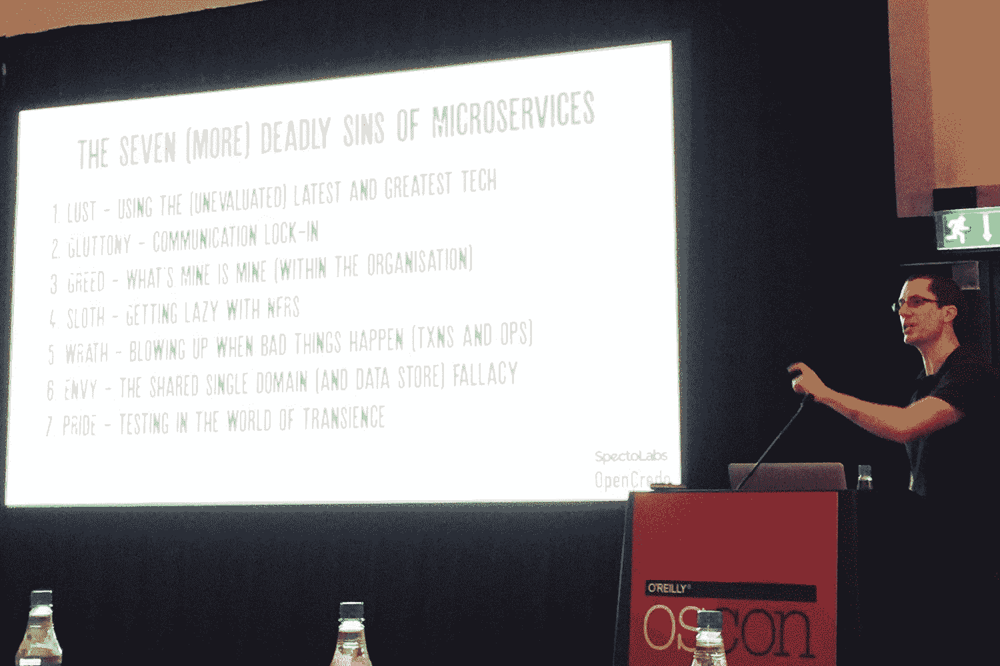

# 微服务的七宗罪(更多)

> 原文：<https://thenewstack.io/seven-deadly-sins-microservices/>

看起来开发社区对这些天的微服务非常兴奋，但是在 T2 OSCON 欧洲 T3，丹尼尔布莱恩特 T5，他是 open credo T7 的首席科学家，继续指出架构师和管理员在采用这种新的“松散耦合的面向服务架构和有限的上下文”时经常犯的一些错误，正如阿德里安科克罗夫特描述微服务。

今年早些时候，Bryant 在一次引人入胜的演讲中汇编了一份架构在使用微服务时犯下的常见错误列表，题目是“[微服务的七宗罪](https://www.infoq.com/presentations/7-sins-microservices)”本周，在一次名为“[微服务的七宗罪](http://www.slideshare.net/dbryant_uk/oscon-eu-2016-seven-more-deadly-sins-of-microservices)”的演讲中，他列出了另一个问题清单

根据 Bryant 的说法，以下是微服务的罪恶清单:

1.  **LUST** :使用(未经评估的)最新最棒的技术。
2.  **饕餮**:通讯锁定。
3.  **贪婪**:我的就是我的(组织内部)。
4.  **懒惰**:用 NFRs 变懒。
5.  愤怒:坏事发生时大发雷霆。
6.  **嫉妒**:共享单一域(和数据存储)谬论。
7.  骄傲:在短暂的世界中接受考验。

## 1.渴望

布莱恩特声称，我们经常像喜鹊一样，只想要最闪亮、最新和最棒的技术，但当我们复制其他人正在做的事情时，我们会继续绊倒自己，而不会花时间评估适合我们需求的正确解决方案。客户来找他说，“给我一些 Docker”或“给我一些 DevOps”或“给我一些微服务”，但他们只是追求闪亮的新工具，而没有考虑他们真正试图通过使用它们来解决哪个问题。他建议，我们应该更多地讨论需求和价值，而不是争论工具。

### 2.贪食

布莱恩特告诫我们不要因为过去的偏见而排除选择。与其排除很多人使用的 RPC(远程过程调用),为什么不考虑像 Google 的 gRPC 这样提供速度和其他好处的东西呢？另一个例子是 ESB([企业服务总线](https://www.mulesoft.com/resources/esb/what-esb))，许多人发现，一旦你打开它，“它通常是伪装的轮胎火灾。”但应用间通信的理念是良好支持的 API 网关，像[孔](https://getkong.org/)、 [Apigee](https://apigee.com/api-management/#/homepage) 、亚马逊网络服务的 API 网关、 [MuleSoft](https://www.mulesoft.com/) 。

### 3.贪婪

“微服务是关于人的，就像它们是技术一样，”Bryant 说，人的因素真的很重要。盲目抄袭他人的诱惑是强烈的，但相反，我们应该在做出改变之前了解我们的实践、原则和价值观。他说“devo PS[的成功在于同理心”，而同理心](/category/devops/)[是“优秀软件开发中隐藏的成分”](https://thenewstack.io/empathy-secret-sauce-good-software-development/)

### **4。懒惰**

一个是关于用 NFRs 偷懒([非功能性需求](https://en.wikipedia.org/wiki/Non-functional_requirement))。应该尽早确定技术要求，以确保在设计中正确处理这些要求。Bryant 谈到了敏捷教练对他的抵制，他们希望“将决策推迟到‘最后负责任的时刻’”，但有时当你使用微服务时，最后负责任的时刻就在前面。

Bryant 还提到，意识到容器中的安全性是有用的，因为许多微服务都部署在容器中，并且他是“在构建管道中获得一切的忠实粉丝”，在构建管道中，安全性测试可以与性能和负载测试一起执行。

### **5。愤怒**

技术难点包括分布式事务，Bryant 警告不要将事务范围推到单一服务中。然而，也有人们的痛点，他提到虽然“开发运维在 it 的核心真的很重要”，但全栈工程师的概念是一个神话。这对于一个人来说太多了，所以你应该定义职责，把重点放在重要的事情上(CI/CD、日志、监控等。)

### 6.羡慕

对于微服务，Bryant 提到，您应该意识到您在设计中引入的技术的含义。特别是，您应该注意不要将其他数据库视为关系数据库；例如，在 [Cassandra](http://cassandra.apache.org/) 中对数据进行调优或建模将与您在关系数据库中所做的不同。他还提到，您应该始终“注意运营开销”

### 7.骄傲

在微服务环境中进行测试更具挑战性，因为您的各种微服务会相互影响。“微服务应该是一次性的，”Bryant 说。对于一次性的瞬态微服务，测试可能非常困难，但通过服务虚拟化和 API 模拟，如 [Hoverfly](https://github.com/SpectoLabs/hoverfly) ，测试是可能的。

在你开始下一个大的应用之前，花点时间想想微服务的七宗罪是值得的！

<svg xmlns:xlink="http://www.w3.org/1999/xlink" viewBox="0 0 68 31" version="1.1"><title>Group</title> <desc>Created with Sketch.</desc></svg>