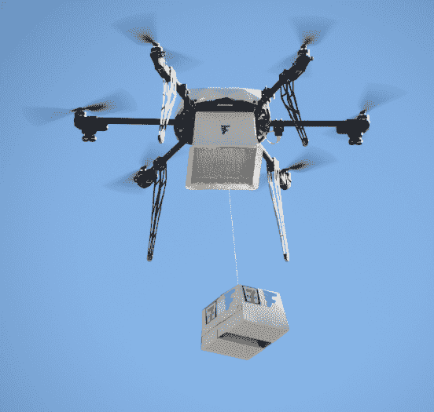

# 惊喜！7-11 开启了商业无人机送货时代

> 原文：<https://thenewstack.io/seven-eleven-kicks-off-era-commercial-drone-deliveries/>

未来已经到来，它带来了思乐冰。

“今天我们很兴奋地宣布， [@Fly_Flirtey](https://twitter.com/Fly_Flirtey) 和 [@7eleven](https://twitter.com/7eleven) 已经完成了第一次从商店到家庭的无人机送货！”阅读[在 Twitter 上发布的大公告](https://twitter.com/Fly_Flirtey/status/756547810267312128)。

历史性的递送包括甜甜圈、热咖啡、鸡肉三明治、糖果和思乐冰冷冻饮料。

“因为在思乐冰从天而降之前，你还没有达到真正的方便，”赫芬顿邮报打趣道。

“我已经准备好享受无人机送来的思乐冰了，”早安美国的贝基·沃利感叹道。当这个国家观看[她关于历史性无人机送货的轻松报道](https://www.youtube.com/watch?v=8iggIayLuks)时，她分享了一个关于收到送货的幸运家庭的深刻观察。“他们有三个不到七岁的孩子。哪些*不是*他们立即需要的？”

许多观察人士早就预计亚马逊将成为无人机送货上门领域的先驱，因此一家美国连锁便利店的跨越式发展有点令人惊讶。但这是有意义的。事实上，尽管这只是一次试飞，但参与思乐冰这种巨大飞跃的每个人都已经在想象未来，如果你忘记了防晒霜，或者你的电池没电了，无人机会从附近的 7-11 便利店为你送货上门。

“这只是我们与 7-11 合作的第一步，”[创造了这款无人机的 Flirtey](http://corp.7-eleven.com/news/07-22-2016-7-eleven-teams-with-flirtey-for-first-ever-faa-approved-drone-delivery-to-customer-s-home) 公司首席执行官马特·斯威尼(Matt Sweeny)自豪地说。“今天是向不远的将来迈出的一大步，在不久的将来，我们将按需为您提供便利。”

无人机辅助便利的主题也得到了 7-Eleven 首席采购官 Jesus H. Delgado-Jenkin 的强烈回应，他称无人机送货为 7-Eleven 的顾客提供了“终极便利”。“我们期待与 Flirtey 合作，随时随地为我们的客户提供他们需要的东西。”

https://www.youtube.com/watch?v=_sysBQ5-tZA

“祝贺你，美国，未来就在这里——而且是飞行垃圾食品，”[纽约每日新闻](http://www.nydailynews.com/news/national/u-s-commercial-drone-delivery-drops-junk-food-nev-article-1.2728575)开玩笑说。但在当天结束时，就连内华达州州长也在权衡这一重大的思乐冰交付，“我祝贺总部位于内华达州的 Flirtey 公司再次创造历史……通过我们的 FAA 测试点指定，Flirtey 巩固了内华达州作为商用无人机(UAV)行业领导者的地位，我期待着他们继续发展，并为我们的地区带来就业机会。”

本月发布的新联邦航空局指南使得无人机飞行员[更容易获得商业认证](http://ktul.com/news/local/drone-operators-excited-for-new-faa-regulations-to-go-into-effect)。因此，思乐冰的飞行及时提醒了我们，无人机真的已经成为一种“此时此地”的技术，它已经悄悄地进入了我们的日常生活。

例如，在南非，无人驾驶飞机正在作为一种帮助保护濒危动物的方式进行测试——通过[使用热传感器扫描偷猎者](https://www.theguardian.com/world/2016/jul/27/africas-drone-rwanda-zipline-kenya-kruger)。无人机公司 UAV & Drone Solutions (UDS)的主管告诉《卫报》，“我们已经看到了我们的存在和偷猎数量下降之间的直接联系，并补充说,“这项技术只会变得更好、更小、更便宜。"

在一篇题为“从杀人机器到希望的代理人”的文章中，这家英国报纸还描述了无人机如何在卢旺达作为一种运送医疗用品的方式进行测试，那里被雨水浸泡的道路经常无法通行。今年夏天，无人机甚至将被用来帮助[拍摄里约奥运会](https://www.fastcompany.com/3062179/rio-olympics-surveillance-logos-simera)。

因此，那场注定失败的星期五思乐冰跑步不仅仅是关于含糖垃圾食品，它也是我们未来的一瞥。根据 7-11 的新闻稿，这次任务的目的是“推进无人机融入国家空域系统的研究”7-Eleven 和 Flirtey 与一个叫做[内华达自主系统研究所](http://nias-uas.com/)的机构合作，测试 Flirtey 的包装(和“送货技术”)——当然，也是为了推进所有无人机送货的未来。“这次运送需要特殊的飞行计划、风险分析和详细的飞行程序，以确保住宅安全和隐私得到同等的整合，”NIAS 运营总监[克里斯·瓦拉奇](https://www.linkedin.com/in/christopher-walach-d-m-b6054429)说。该无人机使用客户房屋的 GPS 坐标自动飞行，并使用一个小型无人机大小的绞盘从空中降低其交付。

据 Tech Crunch 报道，为了找到愿意让飞行机器人处理订单的客户，这些公司对他们计划送货的商店周围 1 英里范围内的家庭进行了调查。当然，当任务完成时，会有无数次自豪的欢呼。该航班的官方新闻稿指出，它发生在 7-11 特许经营 89 周年之际，它包括 7-11 的热*和*冷商品，构成了“美国和全球商业的历史性里程碑”。"

没错，历史将证明，无人机交付的第一个商业交付产品不是亚马逊的书——而是思乐冰。也许历史书甚至会包括一张努力工作的雷诺爸爸迈克尔的照片——这个幸运的人收到了世界上第一次商业无人机送货。“一个飞行机器人在几分钟内就给我们送来了食物和饮料，这太不可思议了……”他在 7-11 的新闻稿中滔滔不绝地说道。“我和妻子都工作，有三个小孩，一个 7 岁，一个 6 岁，一个 1 岁。获得即时、全天候无人机送货的便利是无价的。”

《赫芬顿邮报》补充道:“我们不得不称赞这个家庭:他们在小吃方面有很好的品味。”。“当然，你可以开车到最近的 7-11 便利店，然后在几分钟内喝上一杯思乐冰，但这有什么意思呢？”

# WebReduce

* * *

<svg xmlns:xlink="http://www.w3.org/1999/xlink" viewBox="0 0 68 31" version="1.1"><title>Group</title> <desc>Created with Sketch.</desc></svg>