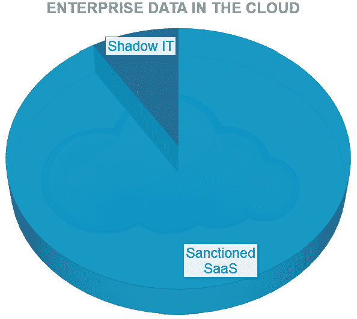
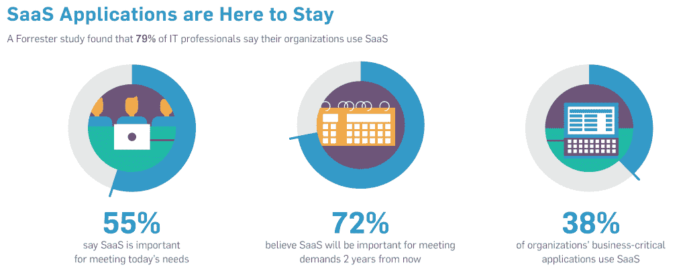

# 影子是一种转移注意力的东西

> 原文：<https://thenewstack.io/shadow-it-is-a-red-herring/>

编者按:Tal Klein 探讨了为什么对 Shadow IT 的恐惧有点可笑。管理人们使用的服务更有意义。Tal 与 Adallom 合作，adal lom 是新堆栈的赞助商。

对影子 IT 的恐惧可以通过研究 Dave McCrory 的数据引力理论来缓解:数据被吸引到效用，因此云中的大部分企业数据将被吸引到提供最大效用的云服务。

提供最大效用的 SaaS 应用程序不是流氓云服务，而是使员工能够作为一个组织高效工作的服务，如 Salesforce、Successfactors、Workday、ServiceNow、Concur、Netsuite、Office 365、Box(是的，还有 DropBox)和 Google Apps。这些都是受制裁的服务，即使它们一开始在企业中是流氓——一旦它们被足够多的员工采用，它们就会受到业务部门或整个公司的制裁。

这正是我们 Adallom 在客户中看到的情况。我不能引用我们的数据作为经验数据，因为我们的客户主要代表早期采用者(我们刚刚在 11 月脱离 stealth ),但是当我们考虑客户的完整云数据组合时，我们始终发现影子 IT 仅代表云中 2%到 9%的企业数据。

### **定义影子 IT**

恐惧源于我们不知道的东西。阴影这是一个具有挑衅性的话题，因为阴影中的任何东西都会引发危险、厄运和危难。这可能导致不稳定的组织风险态势，总是担心可能会发生什么。

阴影的概念会滋生恐惧和不信任。当然有骗子，但大多数人只是想完成他们的工作。我有自己的理论，如何通过我们能看到的东西，而不是我们看不到的东西来看待这个问题。那么，如果我们摘掉眼罩，我们会看到什么？通常很多人在日常工作中使用的 SaaS 技术。环顾四周——它应该把精力投入到人们使用的服务上。

我对这个话题的想法始于去年年底与 Forrester 分析师[安朵斯 Cser](http://www.forrester.com/Andras-Cser) 的一次简单对话。我问他，Forrester 对 Shadow IT 的立场是什么？他回答说，“嗯，这取决于你所说的‘影子它’是什么意思……”

接下来是一场引人入胜的讨论，最终导致了一份 Forrester 报告的诞生，这份报告是关于是什么真正导致人们规避 IT 的。这很简单:人们会去寻找真正适合他们的 SaaS 工具。事实上，有数百万人依赖这些 SaaS 技术。结果是:一个完全没有阴影的良性循环。光天化日之下其实是好买卖。各个业务部门了解新的应用程序，这些应用程序能够提高工作效率、更好地服务客户、实现移动性，并且可以作为服务提供。随着这一循环的继续，越来越多的人规避他们认为无效或缓慢的正式 IT 配置流程，并在此过程中回避 IT 安全控制带来了意想不到的副作用。

安朵斯将这种阴影定义为“部门化”与“消费化”形成对比。“消费化的影子 IT”和“部门化的影子 IT”之间有着明显的区别，“消费化的影子 IT”被定义为与未经批准的云应用程序交互的单个“流氓”用户，而“部门化的影子 IT”本质上与经批准的 SaaS 应用程序没有什么不同，后者现已成为各行业 IT 产品组合中的重要组成部分。

事实上，去年发布的一项 IDC 调查发现，超过 60%的企业技术项目是由业务部门而不是 IT 部门资助的，这意味着现状发生了如此深刻的变化，以至于“部门化”的 SaaS 服务比传统的 IT 部门提供的内部企业应用程序更有理由被称为受认可的服务。

如果我们能够接受业务部门和 it 调配的云服务属于同一个“受制裁”的范畴，那么最终就有可能就影子 IT 的威胁展开真正的对话。我的意思是，与影子 IT 相关的风险:**数据泄露**。我们担心我们不知道什么样的企业数据正在通过未经批准的云服务，这是推动“影子 IT 发现”购买行为的 FUD。我们担心过多的未经批准的云服务可能会与未知权限的企业数据进行表面上的交互。

大约一个月前，Lori MacVittie 为《信息周刊》写的一篇关于影子 IT 的文章做研究。Lori 问我，当人们运行我们的免费 ShadowScan 实用程序时，我们 Adallom 看到了多少未经批准的影子 IT 服务。我的回答，[后来在她的文章](http://www.informationweek.com/strategic-cio/executive-insights-and-innovation/shadow-it-honey-badger-better-care/d/d-id/1252696)中引用，是“从来不会少于 200。”通过文章中的其他一些引用，引用超过 3000 个流氓应用程序的夸张数字，我明白这似乎只是恶化了云恐惧症的症状。但这篇文章没有捕捉到的是，当我给出答案时，我耸了耸肩。我*应该*说的是，“永远不要少于 20 岁——但这没什么大不了的。从统计数据来看，应用越多并不意味着风险越大。”

影子 IT 将重点放在试图消除恐惧上，这些恐惧很大程度上是未知的，也许是量化的，但肯定不是定性的。将安全实践与这种恐惧联系起来是一种荒谬的做法。

真正的重点应该是我们知道人们在使用什么服务。将 IT 权限和控制扩展到这些服务，可以管理流入和流出这些 SaaS 环境的大量企业数据。这种方法实际上是有意义的，消除了恐惧因素，更好地代表了对成功企业至关重要的人和信任。

Tal Klein 是 Adallom 的营销副总裁，Adallom 是新堆栈的创始赞助商。

Flickr 图片[通过](https://www.flickr.com/photos/simon__syon/10151230905/in/photolist-gt2Hhv-4CCEKj-c2nUFW-7GiXu5-impVGH-fNjfVh-qHSmw-JgGGQ-drxRrU-dbbpxn-7hW17B-hKcWT5-gpZ9t6-dKNwBj-eN6szv-9QMUT6-9iRAKJ-f2JvxQ-efKbYY-6ncy5X-9tGoRr-ea1Ui1-7btGuG-fVi5eU-cnWtEW-fEcefU-8xtbEM-7kw7Cq-5sxzv9-7hPT6t-8w7CSd-9ELECd-dUSWcn-xp8AZ-7Wzyoc-dMJS2k-bv8Vm1-7Cjpva-8QJjwj-6STW8z-58tXj9-9s6dW3-8RaJAq-dpotBR-cPy7YE-GaJbi-XQW1-9NMKvf-dRb8Xm-9nuuWn)知识共享。

<svg xmlns:xlink="http://www.w3.org/1999/xlink" viewBox="0 0 68 31" version="1.1"><title>Group</title> <desc>Created with Sketch.</desc></svg>