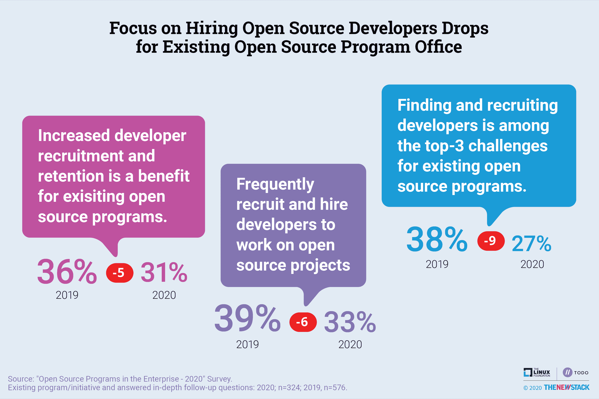

# 不稳定的经济抑制了对开发人员招聘工作的需求

> 原文：<https://thenewstack.io/shaky-economy-dampens-need-for-developer-recruitment-efforts/>

根据我们最新的[“企业中的开源”](https://thenewstack.io/open-source-contributions-on-the-rise-in-fintech-healthcare-and-government/)研究，开发速度和总拥有成本仍然是开源的最大优势。这两者都是可以量化的，但是很难将它们与促进开源的具体企业计划联系起来。这解释了为什么“开发周期中速度和敏捷性的提高”从 2018 年的 58%下降到 2020 年的 39%，成为受访者的[开源项目办公室](https://thenewstack.io/does-your-organization-need-an-open-source-program-office/) (OSPO)的首要收益。“加快新产品上市时间”也出现了类似的下降。这两个类别都描述了[创新](https://thenewstack.io/open-source-programs-become-more-critical-to-engineering-over-time)，这也很难衡量，但却是 OSPOs 的最大优势，部分原因是这是一种广泛使用的衡量业务表现的方法。

吸引有才能的人力资源是 MBA 企业业绩计算的另一个输入因素。然而，“增加开发人员招聘和保留”在关于 OSPO 福利的调查问题的 14 个可能选项中排在第 13 位。

有几个原因可以解释为什么开发人员招聘越来越不受重视。最明显的是经济。许多公司不再招聘，甚至可能已经裁员。在这种环境下，大型科技公司在招聘和留住人才方面面临的问题越来越少。在这种情况下，公司不需要像开源社区的好公民那样努力区分自己，这实际上变得越来越难了。我们的研究表明，越来越多的公司定期为[上游项目](https://thenewstack.io/open-source-contributions-on-the-rise-in-fintech-healthcare-and-government/)做出贡献，并且对管理开源项目的使用和贡献的各种正式政策的采用有所增加。

在这种环境下，公司不仅仅是开源自己的项目和资助合作。事实上，48%的受访者所在的组织有一项关于员工在个人时间为与工作无关的开源项目做贡献的政策。根据 2018 年接受调查的 62%的开发人员的说法，允许在工作时间为开源做出贡献将使开发人员更加成功。2020 年开源工作报告将更新这些数据以及其他几个关于开发者满意度的标准。

前述的 2018 版还发现，负责雇佣开源开发者的招聘经理认为他们的公司支持开源是为了让开发者开心。奇怪的是，48%的招聘经理组织决定为开源项目提供资金支持或贡献代码，以达到招聘从事该项目的开发人员的特定目标。

越来越不重视雇佣开源开发者并不是因为他们不受欢迎。这是因为人们的努力过于狭隘地集中在招募开发人员从事特定的开源项目上。人们意识到开源文化是可以教授的，而不是在一个社区中寻找具有特定经验的开发人员。

通过 Pixabay 的特征图像。

目前，新堆栈不允许直接在该网站上发表评论。我们邀请所有希望讨论故事的读者通过[推特](https://twitter.com/thenewstack)或[脸书](https://www.facebook.com/thenewstack/)访问我们。我们也欢迎您通过电子邮件发送新闻提示和反馈: [feedback@thenewstack.io](mailto:feedback@thenewstack.io) 。

<svg xmlns:xlink="http://www.w3.org/1999/xlink" viewBox="0 0 68 31" version="1.1"><title>Group</title> <desc>Created with Sketch.</desc></svg>