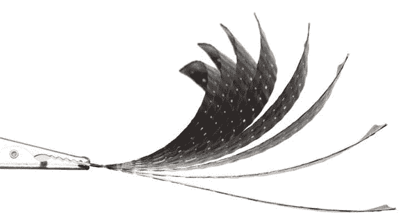

# 变形的东西:4D 印刷材料的自我改造“编程”

> 原文：<https://thenewstack.io/shapeshifted-things-4d-printed-materials-programmed-for-self-transformation/>

如果事物可以有一种记忆，允许它转换、组合或复制自己，那会怎么样？虽然 [3D 打印产品现在正在成为主流](https://www.cnet.com/news/amazon-launches-store-to-sell-3d-printed-products/)，但[麻省理工](http://web.mit.edu/)最近的发展将进一步改变生产和制造的面貌，他们称之为 4D 打印，材料被“编程”以随着时间的推移改变形状，组装甚至修复自己，适应各种功能。

4D 印刷中额外的 *d* 代表“动态”，以反映这一额外的时间因素。4D 打印涉及 3D 打印的多材料对象，但不同的分层材料被集成在一起，以便当温度、压力或能量发生变化时，这些不同材料的细胞或几何变换会相应地发生差异，从而使新的形式和属性成为可能。虽然这些类型的环境相互作用已经通过[纳米技术](http://www.nanowerk.com/news2/newsid=31566.php)在小得多的规模上进行设计，但将其扩大到工业应用将是一个挑战。

### 没有机器人的机器人

但这是一些最优秀、最聪明的人已经在应对的挑战。正如麻省理工学院[自组装实验室](http://www.selfassemblylab.net/)的建筑师兼研究主管 Skylar Tibbits 在 [FastCo 上解释的那样。设计](http://www.fastcodesign.com/3037037/mit-invents-tech-that-could-3-d-print-self-lacing-mcflys)，4D 印刷本质上是创造无需电机、电线或电源就能变形和工作的物体:

> 我们真正想做的是没有机器人的机器人。我们希望设计一种材料，当暴露在能量下时，它可以自我转变，但不一定需要电路板、电子设备或其他移动部件来操作。

Tibbits 涉足这项新技术的前沿是受他早期工作的推动，他设计了由数千个组件组成的装置，其中许多组件都是手工精心组装的——这与自我组装正好相反。他对生物系统和自组织的兴趣也在当前对可编程材料的研究中发挥了巨大作用。

那么物质是如何被“编程”的呢？我们大多数人都熟悉 3D 打印的加法过程，在这一过程中，材料被一层一层地添加，以创建所需的产品。这个实验性制造过程中的第四维是通过嵌入 3D 打印材料的定制“代码”来插入的。这些预定义的指令取决于对象的构造几何形状，并且还可以预测地指示其变换的方向、迭代和角度，并且仅当某些环境条件改变时才被激活。

Tibbits 说，4D 印刷有一些潜在的优势:与传感器和其他电子设备等移动部件相比，可编程材料不太复杂，也不太可能出现故障。它们的重量也更轻，这使 4D 印刷材料在运输、航天或航空等领域的应用中具有优势。自我组装实验室与像 [Stratasys](http://www.stratasys.com/) 、[空客](http://www.airbus.com/)和 [Carbitex](http://www.carbitex.com/) 这样的公司合作，已经在测试各种材料，如碳纤维、橡胶、织物和木材，以测试它们被[编程和 4D 打印](http://www.stratasys.com/3d-printers/design-series/objet-connex500)的能力，使用的是欧特克基于云的计算和模拟平台，名为 [Project Cyborg](http://www.autodeskresearch.com/projects/cyborg) 。

### 变压器鞋、轮胎和服装

4D 印刷的影响将是巨大的:这将意味着产品可以根据情况自行变形。鞋子、轮胎和衣服可以根据天气条件做出反应，改变它们的表面抓地力或透气性；家具可以自我组装，汽车可以自我调整空气动力学部件，从而提高速度。像木材这样的材料，如果要弯曲或塑造成非常规的形状，通常需要大量的时间和能量，可以成为 4D 印刷的复合材料，具有特定的纹理图案，可以控制其自我变形为所需的形状。

要了解这些转变材料的作用，请观看 Self Assembly Lab 的一些碳纤维和木材程序演示视频，并观看 Tibbits 在下面的 TED 视频中给出的 4D 印刷的大图:

[可编程碳纤维](https://vimeo.com/108872994)来自 [Skylar Tibbits](https://vimeo.com/user1791262) 在 [Vimeo](https://vimeo.com) 上。

[可编程木](https://vimeo.com/108869811)从 [Skylar Tibbits](https://vimeo.com/user1791262) 上 [Vimeo](https://vimeo.com) 上取下。

[https://www.youtube.com/embed/0gMCZFHv9v8?feature=oembed](https://www.youtube.com/embed/0gMCZFHv9v8?feature=oembed)

视频

Tibbits 说，自行转变的材料可能很难想象，但却是非常可能的:“我们正在研究对物理和生物材料进行编程以改变形状、改变属性甚至在硅基物质之外进行计算的能力。”随着[数字制造](https://thenewstack.io/3d-printed-buildings-made-by-robots-for-the-earth-moon-and-mars/)和[知识共享](https://thenewstack.io/wikihouse-open-source-sustainable-house-designs-that-anyone-can-build/)开始使设计、生产和传播民主化，4D 印刷指向一个更遥远的未来，在那里事物可能被编程为拥有自己的“生命”。

图片由麻省理工学院自我组装实验室提供

<svg xmlns:xlink="http://www.w3.org/1999/xlink" viewBox="0 0 68 31" version="1.1"><title>Group</title> <desc>Created with Sketch.</desc></svg>