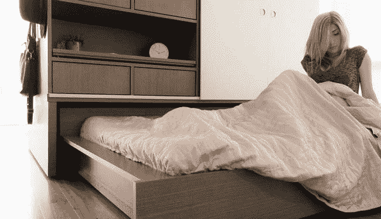

# 变形可编程机器人家具最大化微型公寓

> 原文：<https://thenewstack.io/shapeshifting-programmable-robotic-furniture-system-maximizes-tiny-apartments/>

随着空前数量的人口涌入城市，世界正在迅速城市化。今天，超过一半的全球人口生活在城镇或城市，预计到 2050 年这一数字将上升到 70%。城市也必须发展，这意味着在建设新的基础设施和提供水、电和卫生等基本服务方面将面临挑战。

一种应对人口密集的策略可能最终会采取所谓的微型住宅和微型公寓的形式，它们正在纽约市、[、三藩市、](http://uk.businessinsider.com/425-thousand-dollar-tiny-apartment-san-francisco-real-estate-2016-2)[、伦敦、](http://www.homesandproperty.co.uk/property-news/buying/new-homes/pocket-living-in-london-stylish-microflats-for-singles-or-couples-who-earn-under-66000-41371.html)、巴黎等城市中心涌现，其典型特征是平方英尺低于 400 平方英尺。

这听起来像是鞋盒领域，但设计和技术可以结合起来，使小空间最大化成为可能，让它感觉比实际大得多。这就是 Ori Systems 背后的想法，这是一个多功能家具单元，也是一个“可编程机器人系统”，能够通过智能手机应用程序进行控制。

Ori 由美国设计工作室 [Fuseproject](https://fuseproject.com/) 创造，灵感来自日本折纸的传统折叠形式，它隐藏了一张床、一张桌子、一个储物空间和一个娱乐单元，并且由于麻省理工学院媒体实验室[的研究人员设计的一个致动器和电子系统，它实际上可以通过按一个按钮在房间里自行移动，在需要时打开空间。看着它走:](https://www.media.mit.edu/)

[https://www.youtube.com/embed/001yqyHBR-4?feature=oembed](https://www.youtube.com/embed/001yqyHBR-4?feature=oembed)

视频

Ori 被认为是一个可移动的隔断，也是一个多功能的家具单元，它可以改变自己以适应手边的任何任务。经过一个宁静的夜晚，床收回到单位。按下按钮，整个单元本身就可以移动到公寓的一侧，为另一侧的客厅腾出更多空间。工作时，桌子可以从单元中拉出，或在完成时收拢起来。该单元的配置可以根据当前的需要随时改变，同时该单元本身也有多种型号。

Ori 首席执行官海瑟·拉里亚告诉我们，除了定制设计的机械致动器可以自己移动墙壁、壁橱和床之外，该系统还具有物联网(IoT)连接能力，这意味着驱动这些转换的电子设备可以使用您的个人设备进行远程编程，并根据您的个人习惯进行预设，例如，如果您喜欢下班后一回家就铺开床准备小睡一会儿。

Ori 的大部分技术基于麻省理工学院媒体实验室的 [CityHome 项目](http://cp.media.mit.edu/cityhome/)，该项目旨在开发“小空间大生活”的可扩展策略，专注于提高空间效率、节能和促进较小城市住宅居住者愉快生活体验的技术和机制。

Ori 建立在这些以前的实验基础上，但这并不容易，拉里亚说:“将原型转化为产品是一个巨大的挑战。当你创建一个原型时，你不需要考虑太多的安全特性、责任、可靠性等等。所有这些都是开发产品的核心。”

在它目前的表现形式中，Ori 意味着被整合到一个更大的系统中。由于其模块化和可扩展的组件，它可以扩展。“最初，这个系统是现有智能家居生态系统的一个节点，而不是一个中心枢纽，”拉里亚补充道。“我们正在使用现有的微控制器平台，如[粒子](https://www.particle.io/)。”

Ori 的目标之一是为小空间增加价值。“除了舒适和提高生活质量的各种住宿设施，Ori 还为租户或业主创造财务价值；例如，一个工作室变成了一个卧室，”Fuseproject 创始人伊夫·贝哈尔说。“Ori 系统对开发商来说也是有价值的，因为它可以立即提高房屋的价值。我们的目标是找到一个单一单元的场景，最大限度地发挥微型工作室或一居室公寓的价值。”

根据拉里亚的说法，该公司目前正在运行未来六个月的 Ori 系统测试版，该产品将于 2017 年上半年推出。它现在还希望利用他们的机器人工具包为酒店和办公室等其他市场开发新的空间解决方案。

图像:Ori 系统

<svg xmlns:xlink="http://www.w3.org/1999/xlink" viewBox="0 0 68 31" version="1.1"><title>Group</title> <desc>Created with Sketch.</desc></svg>