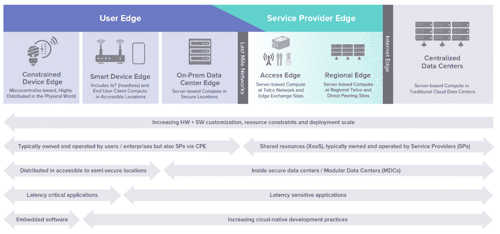
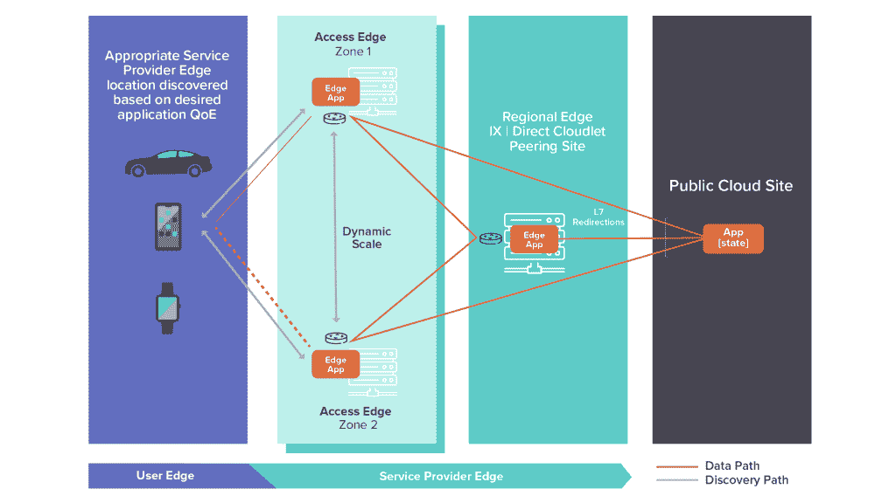

# 锐化边缘:Linux 基础边缘框架和分类法

> 原文：<https://thenewstack.io/sharpening-the-edge-the-linux-foundation-edge-framework-and-taxonomy/>

Linux 基金会赞助了这篇文章。

 [维克拉姆·西瓦赫

Vikram 是 LF Edge 管理委员会成员和 MobiledgeX 的首席产品经理。他展示了基础设施和虚拟化的前景，以将沉浸式和人工智能应用程序推向边缘。](https://www.linkedin.com/in/vsiwach/) 

各种垂直市场中的公司都在积极探索新的商业机会，这些机会是通过将云计算扩展到网络边缘来实现的。边缘计算的概念预示着激动人心的新收入机会，这种机会来自于向消费者和企业领域的新型客户提供新型服务。

然而，今天大多数边缘分类法和相关语言都偏向于一个市场/焦点领域的观点。他们经常使用容易被误解的模糊的“负载”术语(例如，近和远、薄和厚)。新的 Linux Foundation (LF) Edge 分类法基于跨越 Edge 连续体 **—** 的固有技术权衡，这是不容误解的。它对所有市场都是全面的，同时强调了每个市场可以在其上构建其首选/独特语言的独特权衡和整体观点。

[LF Edge](https://www.lfedge.org/) 成立于 2019 年，旨在建立一个独立于硬件、硅、云或操作系统的开放、可互操作的边缘计算框架。它拥有超过 70 家成员公司和九个边缘计算项目，包括 [Akraino](https://www.lfedge.org/projects/akraino/) 、 [Baetyl](https://www.lfedge.org/projects/baetyl/) 、 [EdgeX Foundry](https://www.lfedge.org/projects/edgexfoundry/) 、[French](https://www.lfedge.org/projects/fledge/)、 [Home Edge](https://www.lfedge.org/projects/homeedge/) 、 [Open Horizon](https://www.lfedge.org/projects/openhorizon/) 、 [Project EVE](https://www.lfedge.org/projects/eve/) 、 [Secure Device Onboard](https://www.lfedge.org/projects/securedeviceonboard/) 和 [State of the Edge](https://www.lfedge.org/projects/stateoftheedge/) 。

在本文中，我们将全面介绍边缘计算、其云原生设计原则及其对服务提供商的应用。更多详情，请[点击此处](https://www.lfedge.org/resources/publication-download/)下载完整出版物。

## **边缘连续体**

边缘计算代表了一种新的模式，在这种模式中，计算和存储位于网络的边缘，在必要和可行的情况下，尽可能靠近生成和消费数据的位置，以及在物理世界中采取行动的位置。边缘计算是分布式云计算，包括通过网络互连的多个应用组件；以及向网络的逻辑极限提供密集计算能力，以提高应用和服务的性能、安全性、运行成本和可靠性。通过缩短设备和为其服务的云资源之间的距离，以及减少网络跳数，边缘计算减轻了当今互联网的延迟和带宽限制，带来了新的应用类别。这些计算资源的最佳位置由集中和分散优势之间的内在权衡决定。

边缘计算连续体从离散的分布式设备到集中式数据中心，以及定义每个类别边界的关键趋势(参见下面的图 1)。随着计算资源越来越接近物理世界，这包括架构师需要做出的越来越复杂的设计权衡。图表的最右侧显示了代表基于云的计算的集中式数据中心。这些集中式设施提供了规模经济和灵活性，可以监督大量设备的集体行为，例如配置、跟踪和管理它们，但它受到数据中心的集中位置和资源共享这一事实的限制。

图 1:边缘连续体概述

从集中式数据中心到设备，第一个主要边缘层是服务提供商(SP)边缘，提供通过全球固定/移动网络基础设施交付的服务。与公共云一样，服务提供商边缘的基础架构(计算、存储和网络)通常作为服务使用。由于公共互联网和私有网络之间的差异，服务提供商边缘的解决方案可以提供比公共云更高的安全性和隐私性。服务提供商 Edge 是分布式的，使边缘计算资源更接近最终用户。

第二个顶级边缘层是用户边缘，其通过位于最后一英里网络的另一端而与服务提供商边缘相区分。有时，为了进一步减少延迟、节省网络带宽以及提高安全性和隐私性，有必要使用更接近物理世界中的最终用户和流程的本地和高度分布式计算资源。

边缘计算分类和框架是经过仔细考虑后开发的，旨在平衡各种市场因素(例如，云、电信、电缆、IT、OT/工业、消费者)，同时还基于上述关键技术和物流权衡创建高级分类类别。

## **边缘原生:将云原生扩展到边缘**

随着容器化和 Kubernetes 的出现，越来越多的云原生软件应用程序基于独立于平台、基于服务的架构和持续集成/持续交付(CI/CD)实践来实现软件增强。云原生开发在数据中心的优势同样适用于边缘，使应用程序能够由一流的组件动态组成，以分布式方式纵向扩展和横向扩展，并随着开发人员的不断创新而不断发展。

许多网络规模的设计原则可以应用于在服务提供商边缘实现类似云的计算能力。在过去几年中，Kubernetes 等编排技术使得在内部、混合或多云环境中运行云原生工作负载成为可能。卸载到服务提供商边缘的大多数应用不需要对其设计或代码进行重大更改，并将保留连续的交付管道，这些管道可以在服务提供商边缘站点部署特定的工作负载，例如那些具有低延迟、高带宽或严格隐私需求的工作负载。此外，工作负载可能会以复杂的方式与网络进行交互，例如基于需求为特定应用确定服务质量(QoS)的优先级，例如为生命安全应用提供优先级。

网飞、苹果和 YouTube 等主要内容所有者预计将保留其基于缓存的分发模式，这需要在集中的公共云中存储状态以及认证和授权(AA)功能，同时根据客户端设备的体验质量(QoE)来重定向“最佳”缓存中的内容交付——其中“最佳”并不总是指最近的缓存。这种方法将被保留用于其他利用边缘加速的分布式工作负载，如增强现实(AR)、虚拟现实(VR)、大型多人游戏(MMPG)等。

根据上面提到的设计原则，服务提供商 Edge 将需要根据延迟和带宽等关键应用需求，确保测量和实施 QoE 的确定性方法。由于大多数互联网流量都是加密的，这些保证很可能基于传输层，从而导致拥塞控制算法的发展——它决定了传输速率。对于商店和工作负载的地理数据隔离政策，类似的设计原则也将不断发展，而不仅仅是遵守全球数据保护法规。

下图显示了在服务提供商边缘部署高可用性边缘应用的示例，这些应用可以跨对等站点的多个服务提供商网络进行联合，同时还可以与公共云工作负载协作。

## 服务提供商边缘的边缘应用部署

开发人员可以研究其客户的地理消费模式，并确定其应用程序的最佳延迟和 QOS 要求。使用机器学习(ML)算法，他们甚至可以预测这些模式如何随着时间的推移而变化，用于高级规划目的。编排服务将会出现，这些服务将允许开发人员指定他们的工作负载需求，以便提供自动化的布局。

应用后端的部署可以独立于网络移动性或特定设备连接。后端服务部署可以基于许多不同的策略来实现边缘应用的移动性，包括:

*   静态，开发者选择特定的边缘站点和每个站点的特定服务。动态，开发人员向编排服务提交标准，编排服务代表开发人员做出关于工作负载放置的最佳决策。其中一种实施方式是让开发人员选择一个区域，将控制权交给系统运营商或云运营商的协调系统，以便根据请求的计算实例数量、用户数量和任何专门的资源策略来确定工作负载的最佳位置。

Akraino 项目正在根据以下部署工作流程制定边缘应用生命周期管理的蓝图:

*   创建集群，将微服务部署为一组容器或虚拟机(VMs
*   创建应用清单，定义包括 QoE、地理商店和隐私策略的应用移动性策略；创建应用程序实例，启动 Edge 应用程序并自动缩放。

有关此主题的更多信息，请访问 Akraino Edge Stack 项目的[开发者部分](https://api.akraino.org)。

## 识别为用户服务的最佳边缘位置

最近的边缘位置并不总是最好的。取而代之的是，客户端必须基于在每个地理位置上的边缘站点的应用的最近记录的 QoE 被引导到应用后端。网络可以提供 QoS 映射来改善 QoE。

基于这种设计，应用程序发现引擎可以嵌入到多个 CSP 中，记录应用程序后端的运行状况和每个应用程序在一个区域内所有边缘站点的 QoE，并公开一个控制 API 来确定最佳位置。这个 API 还可以用来调整内容交付的速率，以获得最佳体验。例如，网飞和 YouTube 等内容服务为同一部电影或电视节目保留了数十种不同的比特率编码，以便根据设备特性、网络拥塞和其他因素提供最佳分辨率。可以使用发现引擎，该发现引擎将返回统一资源标识符(URIs)的排序列表，基于包括以下内容的选择标准来识别附近的最佳站点:

*   基于客户位置的地理定位站点中的边缘应用程序实例；
*   URI 排名基于最近的第 4 层 QoE 测量(延迟和比特率)。

LF Edge Akraino Edge Stack 项目已经定义了这样一个应用发现引擎:请访问 [Find Cloudlet 部分](https://api.akraino.org/device/#operation/FindCloudlet)。有关发现和控制 API 的更多信息，请阅读以下补充文件:[Akraino Edge Stack API](https://www.lfedge.org/wp-content/uploads/2020/06/Akraino_Whitepaper.pdf)。

## 移动性呢？

**应用移动性**基于资源感知，无状态应用的后端可以基于计算能力、专用资源和/或服务级别协议(SLA)边界跨区域移动。有状态的边缘应用将状态从集中式服务器同步到边缘，并在第 7 层将其重定向到边缘应用，无论单个 CSP 的编排系统如何，都可以一致地运行。

**设备移动性**基于路由感知。提供商网络被设计为锚定到网关，这导致了与运行在 COLO 边缘的延迟敏感型工作负载的直觉相反的次优路由结构。好消息是，它可以通过利用网络规模的公司所使用的容器移动技术来改变。但这不仅需要虚拟化计算(VNF/CNF)，还需要虚拟化网络，以便底层 IP 路由可以基于应用的身份和设备的位置。标识符-定位器寻址是一种不使用封装实现网络覆盖的方法，有助于实现无锚点设备的移动性。

有关处理应用和设备移动性以及服务提供商边缘设计考虑的更多详细信息和最佳实践，请阅读[服务提供商边缘部分](https://www.lfedge.org/resources/publication-download/)。

*我要感谢技术架构小组的所有参与者，他们在 LF EDGE 的领导下，为边缘计算的技术和业务方面协调了一个框架。这项工作分布在开源边缘项目和专注于物联网、企业、云和电信的不同社区。*

通过 Pixabay 的特征图像。

<svg xmlns:xlink="http://www.w3.org/1999/xlink" viewBox="0 0 68 31" version="1.1"><title>Group</title> <desc>Created with Sketch.</desc></svg>