# 用 Go 泛型将 Google 的 B 树实现削减 40%

> 原文：<https://thenewstack.io/shaving-40-off-googles-b-tree-implementation-with-go-generics/>

有很多理由对 Go 中的泛型感到兴奋。在本文中，我将展示 ScyllaDB 如何使用 Go 泛型在一个已经很好优化的包中实现了 40%的性能提升，这个包就是 [Google B 树](https://github.com/google/btree)实现。(作为背景， [ScyllaDB](https://www.scylladb.com/) 是一个 NoSQL 数据库，用于需要高性能和低延迟的数据密集型应用。它有开源版、企业版和 DBaaS 版)。

 [米哈尔·马特丘克

Michal 是负责 ScyllaDB 管理器、驱动程序和 ScyllaDB 云的软件团队领导。他是 goc qlx(ScyllaDB 的对象关系映射框架)的作者，也是许多开源项目的贡献者。他拥有华沙大学的计算机科学硕士学位和数学学士学位。](https://twitter.com/michalmatczuk?lang=en) 

A [B 树](https://en.wikipedia.org/wiki/B-tree)是一种自平衡树。出于本文的目的，说它是一个集合就足够了。您可以添加、移除、获取或迭代它的元素。Google B 树优化的很好；采取措施来确保内存消耗是正确的。每个导出的方法都有一个基准，基准结果显示，除了克隆之外，所有操作在 B 树代码中都没有分配。这表明使用传统技术很难进一步优化。

本文涵盖的工作是 ScyllaDB 与华沙大学计算机科学系长期合作的一部分。我们合作过很多项目:集成 [Parquet](https://www.scylladb.com/2020/08/05/scylla-student-projects-part-i-parquet/) ，一个[异步用户空间文件系统](https://www.scylladb.com/2020/08/25/scylla-student-projects-part-ii-implementing-an-async-userspace-file-system/)，一个[用于 Seastar](https://www.scylladb.com/2020/11/17/scylla-student-projects-part-iii-kafka-client-for-seastar-and-scylla/) 的 Kafka 客户端，一个用于 ScyllaDB 中的[线性代数](https://www.scylladb.com/2021/09/07/linear-algebra-in-scylla/)的系统，以及一个新的 [Rust 驱动程序](https://www.scylladb.com/2021/07/13/scylla-rust-driver-update-and-benchmarks/)的设计。

*(如果你沉迷于这样的性能优化，* [*参加 P99 CONF*](https://www.p99conf.io/)*——一个致力于所有性能的免费虚拟会议。)*

## 用泛型构建更快的 B 树

在与华沙大学的学生一起开发新的 ScyllaDB Go 驱动程序时，我们将 B 树代码移植到了 [generics](https://github.com/Michal-Leszczynski/btree) 。(如果你不熟悉围棋中的泛型，可以查看一下[这篇教程](https://go.dev/doc/tutorial/generics)。).

最初的结果是:根据 Google 基准测试，泛型代码快了 20%到 30%([这是我们公开的问题](https://github.com/google/btree/issues/41))。下面是用 benchstat 完成的一个完整的基准比较。

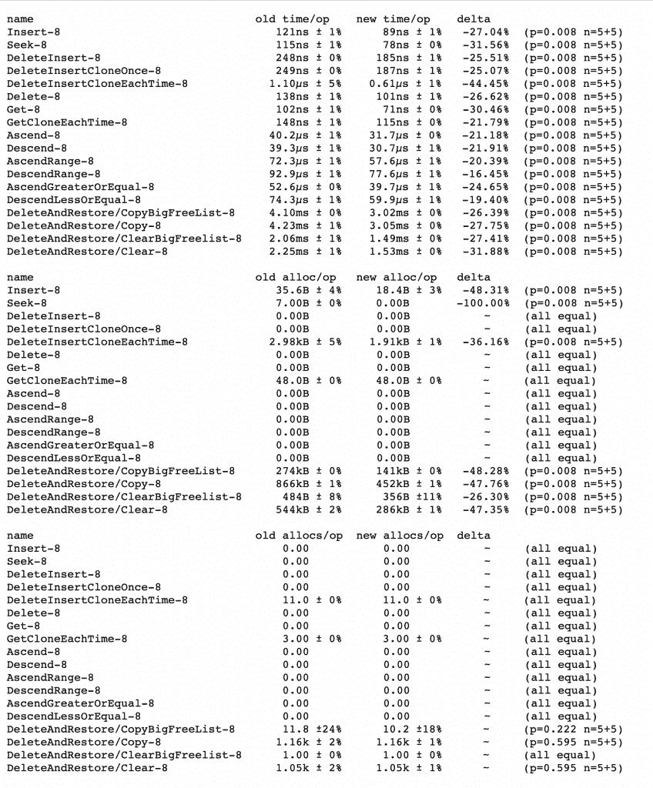

这很好，但在这些数字中隐藏着一个令人不安的细节。假设函数接受一个接口作为参数，那么零分配通常是不常见的。

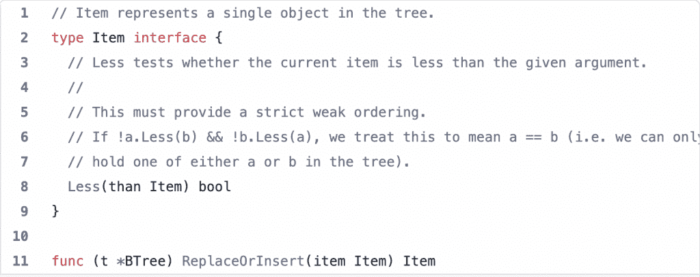

对于本文的其余部分，让我们关注负责接收数据的`ReplaceOrInsert`函数的基准测试。考虑一个简化的基准。

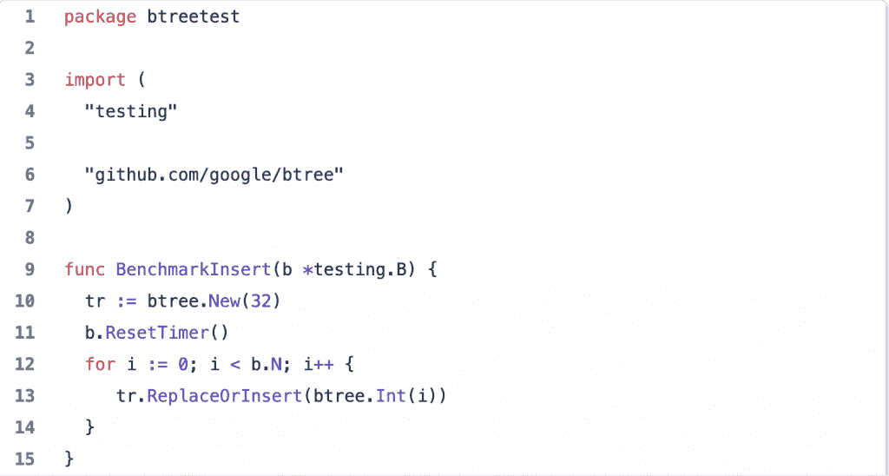

结果显示了更大的改进:31%对 27%，分配从 1(在基于接口的实现的情况下)下降到 0(在泛型的情况下)。

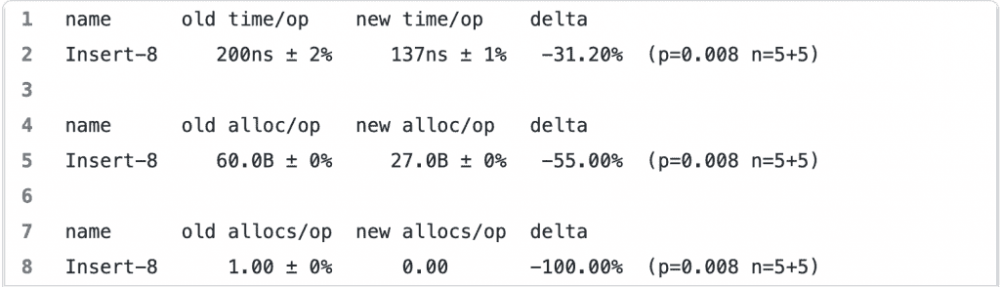

让我们试着理解这里发生了什么。

## 额外分配

Google 基准在一个被项目接口隐藏的整数 B 树[上运行。他们在切片中使用预先生成的随机数据。当一个项被传递给`ReplaceOrInsert`函数时，底层的整数已经在堆上了。从技术上讲，我们是在复制一个指针。当一个普通整数需要被转换成一个项目接口时，情况就不一样了——参数值开始“转义成堆”](https://github.com/google/btree/blob/ac7cc57f11e692c57831c3d9bcffb4b7a649b738/btree.go#L885)

Go 有一个特性，可以决定你初始化的变量应该在函数的栈中还是在堆中。传统上，编译器非常“保守”当它看到像`func bind(v interface{})`这样的函数时，任何你想作为`v`传递的东西都必须先去堆。这被称为变量转义到堆。多年来，编译器变得越来越智能，对本地函数或项目中其他包中的函数的调用可以被优化，从而防止变量逃逸。您可以通过运行 Go 软件包中的`go build -gcflags="-m".`来自行检查。

在下面的例子中，Go 可以判断出将一个指针指向主函数的堆栈是安全的。

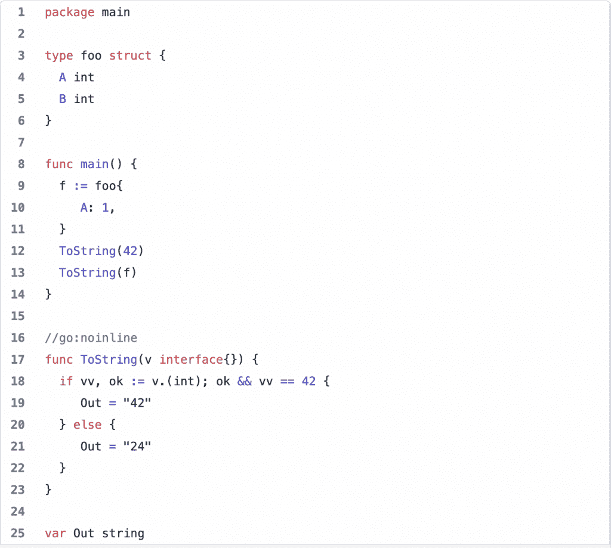

如您所见，编译器通知我们变量不会转义到堆中。

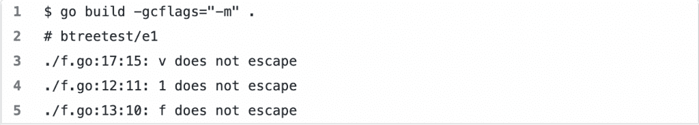

通过将 ToString 实现更改为

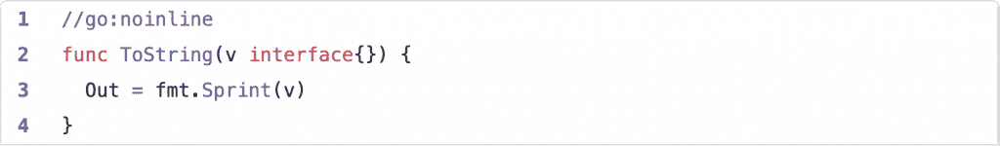

我们看到变量和文字值开始转义。

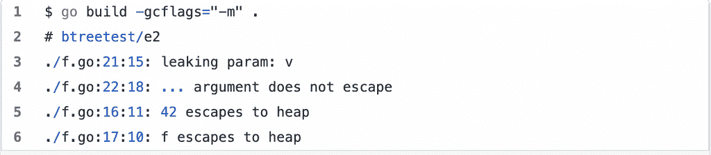

在实际例子中，当调用接受接口作为参数的函数时，值几乎总是转义到堆。当这种情况发生时，它不仅通过分配减慢了函数调用，而且增加了垃圾收集(GC)的压力。为什么这很重要？泛型方法实现了真正的零分配 API，零 GC 压力。我们会继续报道。

## 为什么更快？

B 树是由节点组成的树。每个节点都有一个项目列表。

当项是前泛型的普通旧接口时，它所包含的值必须单独存在于堆中的某个位置。编译器无法判断项目大小。从运行时的角度来看，接口值是指向数据(word)的不安全指针，指向其类型定义(typ)的指针，指向接口定义(ityp)的指针——参见反射包中的[定义。比运行时包更容易消化。在这种情况下，我们将项作为 int 指针的一部分。](https://github.com/golang/go/blob/357c9141369361101345f3048a6b2b3e149299d5/src/reflect/value.go#L180)

另一方面，对于通用接口

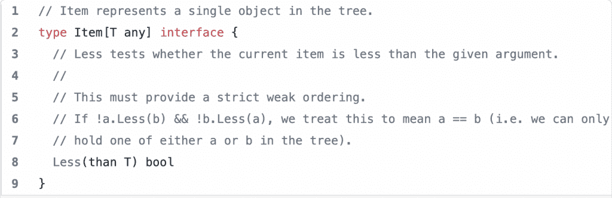

和泛型类型定义

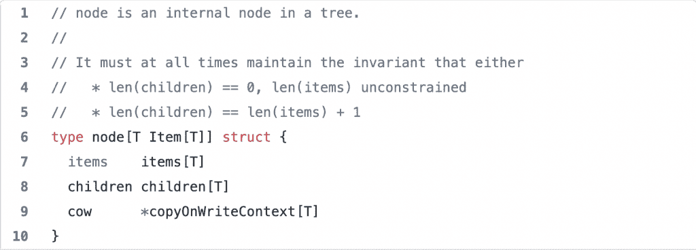

项目是整数的一部分。这将小堆对象的数量减少了 32 倍。

理论够了。让我们试着考察一个具体的用法。出于本文的目的，我编写了一个测试程序，它是我的基准代码的放大版本。

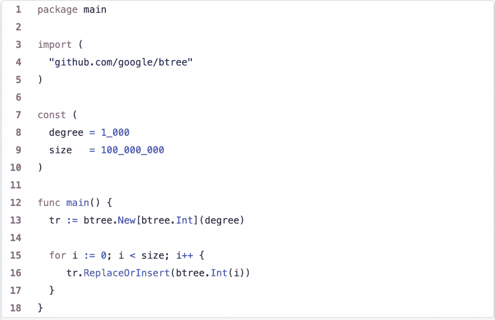

我们在加 1 亿个整数，B 树的度(一个节点的项数)是 1k。这个程序有两个版本:一个使用泛型，另一个是普通的老接口。代码上的差异很小。它只是将第 13 行中的`btree.New(degree)`改为`btree.New[btree.Int](degree)`。让我们比较一下在`/usr/bin/time -l -p`下运行两个版本所收集的数据。

这里，使用泛型解决了一个版本的接口片的 N+1 问题。现在，我们可以只拥有整数片，而不是堆中的一个片和 N 个整数。结果是深远的。新代码在各方面都表现得更好。墙壁持续时间减少了 40%，上下文切换减少了 40%，系统资源利用率减少了 60% —这都归功于小堆对象减少了 99.53%。

最后，让我们来看看 CPU 的最高利用率。

`go tool pprof -top cpu.pprof`

你可以看到界面是多么的混乱，gc 是如何开始扼杀它的…当我们关注 gc 时，这一点更加明显。

`go tool pprof -focus gc -top cpu.pprof`

通用版本在 GC 上花费了**0.29 秒**(**2.62%**)，而接口版本花费了**6.06 秒**，占总时间的 32.49%！

[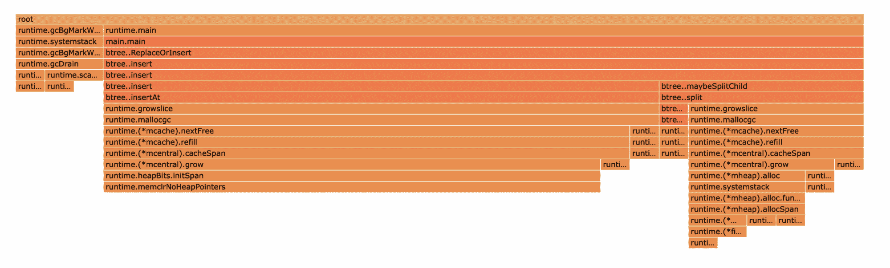](https://cdn.thenewstack.io/media/2022/07/df6f1536-image1.png)

泛型:CPU profile flame 专注于与 GC 相关的函数。

[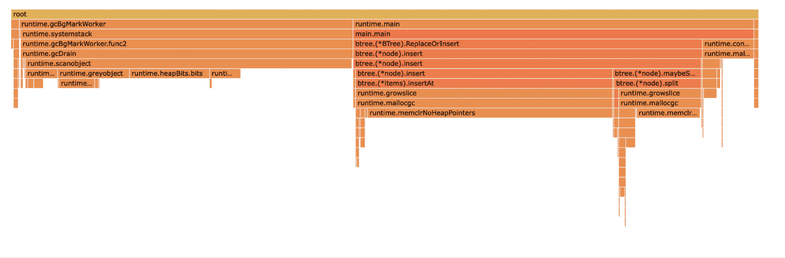](https://cdn.thenewstack.io/media/2022/07/575ba8ab-image2.png)

界面:CPU profile flame 专注于 GC 相关的功能。

## 结论

通过从使用接口的实现转移到使用泛型的实现，我们能够显著提高性能，最小化垃圾收集时间，并最小化 CPU 和其他资源的使用，例如堆大小。特别是在堆大小方面，我们能够减少 99.53%的堆对象。

Go 泛型的未来是光明的，尤其是在切片领域。

## 加入我们的 CONF P99

如果你喜欢钻研这种级别的围棋性能优化，你将会真正喜欢 P99 CONF 的技术讲座，这是一个将于 10 月 19 日至 20 日举行的免费虚拟会议。P99 CONF 致力于痴迷于 P99 百分位和高性能、低延迟应用的工程师。您可以在 [p99conf.io](https://www.p99conf.io/) 查看演讲者阵容并立即注册。

<svg xmlns:xlink="http://www.w3.org/1999/xlink" viewBox="0 0 68 31" version="1.1"><title>Group</title> <desc>Created with Sketch.</desc></svg>