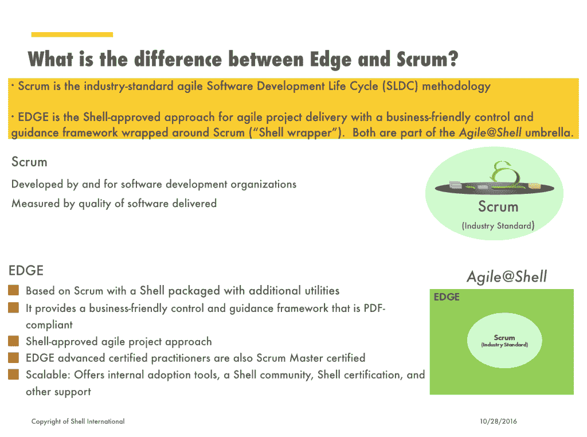
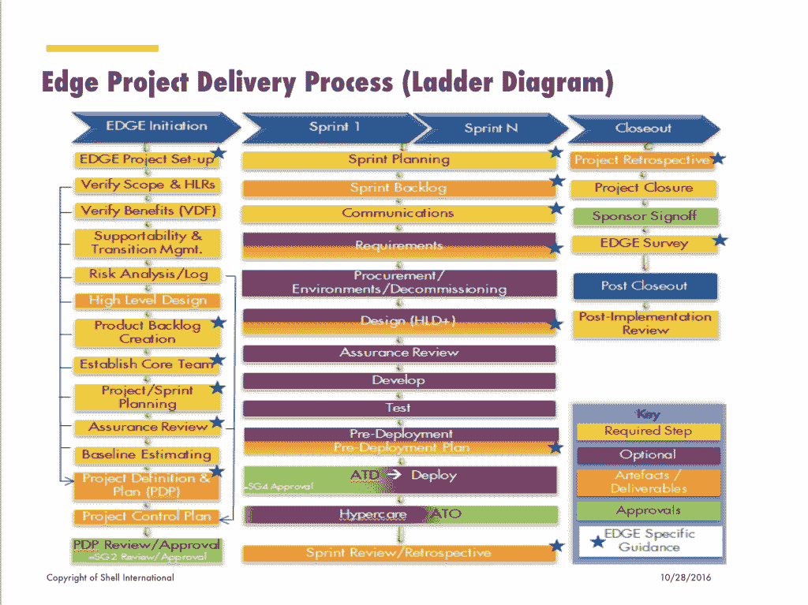
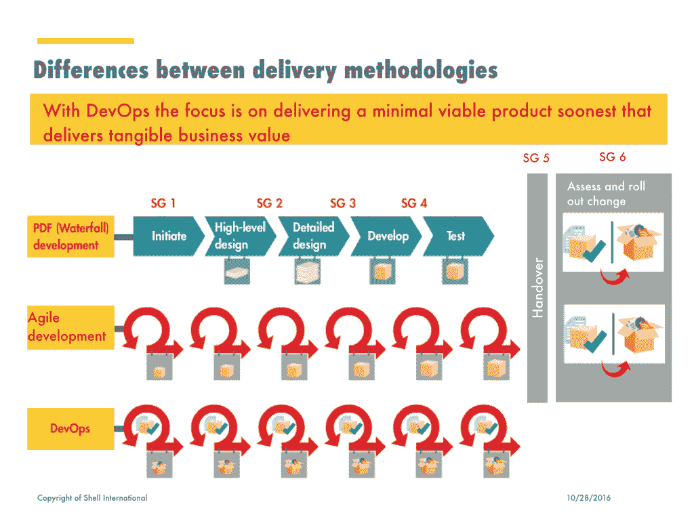
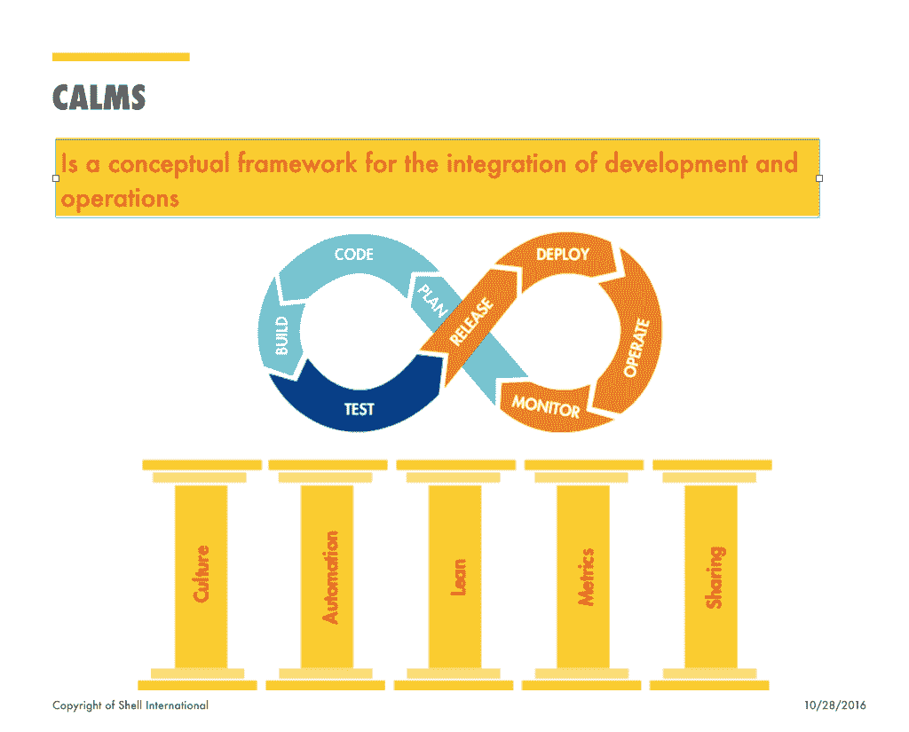

# 壳牌石油如何将 DevOps 和 Agile 带到前沿

> 原文：<https://thenewstack.io/shell-gives-new-meaning-devops-agile-scale/>

**根据[壳牌国际](http://www.shell.com/)全球保障性和过渡经理 [Gregory Dubus](https://www.linkedin.com/in/gregory-dubus-6122746) 的说法， [DevOps](/category/devops/) 和敏捷项目管理的未来应该集中在保障性和过渡上。最近在伦敦的 DevOps World 大会上，他为世界上最大的企业之一的大规模敏捷和 DevOps 过渡拼凑了构建模块。**

 **他说，“在壳牌，我们不使用术语敏捷，我们使用术语‘优势’Edge 是对 Scrum 和 DevOps 的总结。”

在壳牌，他们将 Edge 作为一个总括术语，用来涵盖贯穿整个公司的敏捷和精益原则和实践，这些原则和实践源于一项 IT 计划。

Project Edge 始于 2010 年，因为“我们需要 IT 解决方案尽可能快地改变”，这是交付项目和保持竞争力的更快、更便宜的方式。

他们是如何实现大规模敏捷的？

## 前沿:壳牌如何实施敏捷下游

Edge 是壳牌公司称之为“尖端”的方式，它将敏捷项目交付方法与 scrum 结合起来，用于敏捷软件开发生命周期。它还使用 DevOps 来实现连续交付，同时保留传统[瀑布项目管理](http://www.base36.com/2012/12/agile-waterfall-methodologies-a-side-by-side-comparison/)的某些方面。

Dubus 说，我们的目标是，到 2018 年，“让我们所有的业务都具备世界级项目交付的优势”。

实施从完全瀑布式到 Edge“冲刺、学习、成功”思维模式的广泛转变的第一步是决定在哪里实施，在哪里不实施。

Edge 被认为最有利于需要以下一项或多项的项目:

*   上市速度至关重要。
*   原型和概念证明。
*   “尽早失败”对于较小的迭代版本。
*   涉及非关键业务应用的事情。
*   不需要超过六到八名团队成员的工作投入。

Dubus 补充道:“我们喜欢在业务需求不明确的时候使用它。”

Edge 在以下情况下被视为无效:

*   对适应新的工作方式有抵触情绪的地方。
*   当企业无法投入必要的资源时。

下面你可以看到梯形图，它更深入地解释了 Edge 项目交付流程。

这种双模型敏捷瀑布方法同样涉及不同的领域和标准，以决定何时应用哪个模型:

*   **敏捷**适用于不确定性、需要快速决策、灵活性和早期交付的情况。
*   **瀑布**适用于安全性、准确性、可预测性和控制优先的情况。

壳牌公司的交付方法不同于那些几乎自动实施敏捷的小公司。在这里，壳牌项目经理“不要总是先考虑敏捷，”Dubus 说。“这取决于我们需要什么。”

下面你可以看到这些交付方法是如何实现的，注意 DevOps 和 agile 是如何包含短迭代的，而瀑布遵循一个固有的更长、更慢的过程。

## 壳牌如何通过 DevOps 增强竞争力

Dubus 说:“DevOps 意味着你做一些事情，并把事情投入生产。”他解释说，使用 Edge，他们如何介于敏捷和 DevOps 之间，因为当他们把事情投入生产时会有所不同。

他继续说道:“DevOps 优化了开发和运营之间的协作，实现了更快、更可预测、更频繁的发布。

他说开发团队已经在 DevOps 中做了很多敏捷工作，并对他们致力于自动化一切、自主集成和更新源代码表示兴奋。

对壳牌来说，快速迭代开发运维的价值主张是“交付和实现更快创造价值的业务能力，同时保持运营和安全。”

壳牌公司的项目经理们正在开发工具，以确保它们是安全的，这样他们就可以走得更快。在发现有必要明确哪些是 DevOps，哪些不是之后，去年，壳牌为所有壳牌 IT 员工提供了 DevOps 101 培训，以了解更多关于此类变更和发布管理的信息。

在上面，你可以看到推动这一全公司倡议的概念框架，该倡议旨在打破孤岛，创建一个团队。

Dubus 表示，在实施 Edge 计划之前，该公司严重依赖顾问——约占 IT 项目员工的 50%——而现在只有 5%的员工是顾问。

## 但是你如何衡量文化变化呢？

当然，作为全球第五大富有公司，衡量其成功是首要任务。除了我们前面提到的大幅减少顾问外，自项目实施以来，该项目还发现:

*   100%接受调查的企业用户对解决方案的价值、质量和速度感到满意。
*   97%接受调查的企业用户对上述解决方案的成本感到满意。

当然，衡量石油和天然气行业成功的另一个重要方法是它是否遵守了规定。对于严格监管的世界中的敏捷和 Scrum 来说，“遵从”无疑是“完成”的另一个定义

衡量文化变化总是一个挑战，但对于这样一家大型跨国公司来说，这是一个特别的障碍。10 月底，壳牌发布了第一阶段试点项目的以下经验:

*   运营和保障资源需要纳入开发运维团队。
*   文化和心态的改变仍然是一个关键的挑战。
*   尽管服务和基础设施合同大幅减少，但管理其余承包商并将其纳入新的 DevOps 结构仍是一项挑战。
*   实施的预算和成本仍然不清楚，这当然会影响项目真正商业价值的确定。
*   自动化仍然进展太慢。
*   即使在运行时间最长的试点中，开发运维的持续交付和部署仍未完全实现。

这些认识导致了以下建议:

*   DevOps 是许多运营和开发人员的新方法，这意味着必须进行再培训。
*   他们仍然需要澄清什么是 DevOps，它应该在哪里应用，不应该在哪里应用。
*   需要增加战略参与，在继续实施之前更好地解释 DevOps 的价值。
*   应向新开发团队提供指导。
*   所有级别的业务和 IT 部门都需要 DevOps 的认可和支持。
*   在 sprint 规划期间，所有功能性和非功能性需求都必须是单一产品 backlog 的一部分。
*   自动化工具之旅必须继续，包括强调持续集成、自动化测试和持续部署。
*   他们需要引入外部例子和在其他公司学到的经验，以发现更多可以遵循的 DevOps 最佳实践。

如你所见，壳牌还有很长的路要走，还有几年的时间。但这是大型跨国公司最大规模的开发运维及敏捷项目之一。即使作为一家大得多的企业，它也面临着与初创公司相同的挑战——抵制文化变革和衡量成功。只有克服了这些障碍，才能确定 DevOps 是成功还是昙花一现。

<svg xmlns:xlink="http://www.w3.org/1999/xlink" viewBox="0 0 68 31" version="1.1"><title>Group</title> <desc>Created with Sketch.</desc></svg>**