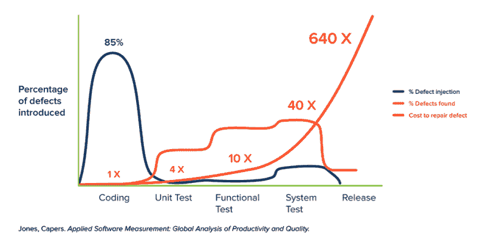

# 应用于 Kubernetes 的左移测试

> 原文：<https://thenewstack.io/shift-left-testing-applied-to-kubernetes/>

 [西尔万·卡拉什

西尔万·卡拉什是一名企业家和软件工程师，目前在他联合创办的霍尔伯顿学校工作。](https://www.sylvainkalache.com/) 

Kubernetes 容器编排引擎是一个复杂的软件，为错误配置提供了很多机会。例如，Kubernetes 配置基准[报告](https://www.fairwinds.com/kubernetes-config-benchmark-report)分析了超过 100，000 个 Kubernetes 工作负载，发现每个集群平均有 328 个 Kubernetes 错误配置，这对负责基础设施的专业人员来说是一场噩梦。这可能就是为什么网络安全公司 Cyble 发现超过 90 万个 Kubernetes 集群暴露在互联网上，因为配置错误。

在过去的几年中，软件行业越来越多地采用左移测试策略，该策略提倡在部署管道生命周期的早期完成测试。因为它的声明性质， [Kubernetes 是一个很好的工具](https://thenewstack.io/do-i-really-need-kubernetes/)，可以在这里实现左移策略。在本文中，我们将通过查看开源解决方案 Gatekeeper 和 Datree 来探索左移和右移策略对于发现 Kubernetes 集群错误配置的好处。

## 右移测试

在讨论左移测试之前，让我们先看看它的反面。右移测试尽可能推迟测试阶段，通常是在部署到产品中之前。这种方法在历史上一直被用于软件行业。它的优点是可以捕捉到在一个临时环境中可能检测不到的东西，比如性能问题、容错能力，或者应用程序的用户体验。

开源软件[看门人](https://github.com/open-policy-agent/gatekeeper)充当 Kubernetes API 服务器和 [OPA](https://www.openpolicyagent.org/) 策略之间的桥梁。每当一个资源创建、更新或删除请求被发送到 Kubernetes 集群时，Gatekeeper 作为一个验证 webhook，将检查提交的请求是否违反了预定义的 OPA 策略。因为 Gatekeeper 是在集群级别上工作的，这可以在部署前的试运行阶段完成，也可以直接在生产中完成，所以它可以用作右移测试策略的一部分。

> 由于其声明性，Kubernetes 是一个可以实现左移策略的很好的工具。

然而，这并不总是理想的情况。右移测试意味着基础设施团队，通常在运输管道的远端，将不得不处理错误的配置。这可能很快成为一个压倒性的任务，特别是如果有许多开发人员，这通常大大超过基础设施团队的数量。

每个 Kubernetes 集群平均有 [328 个错误配置](https://www.fairwinds.com/kubernetes-config-benchmark-report)，事情会很快失去控制。这可能会导致应用程序开发生命周期的速度急剧下降，并使那些看不到他们的代码投入生产的开发人员感到沮丧。

## 左移测试

这就是左移测试方法可以发挥作用的地方。通过将测试阶段提前，最好是在开发阶段，每个开发人员都成为一个测试单元。因为测试阶段是在他们的级别上进行的，与将责任归于另一个团队相比，他们将更多地参与捕捉错误配置。这将增加测试覆盖率，提高应用程序交付速度，并避免开发人员因看到他们的代码处于生产前而感到沮丧。

开源软件 [Datree](https://github.com/datreeio/datree) 提供了一个 CLI 工具——可以发现 Kubernetes 的错误配置——可以直接在开发人员的笔记本电脑上执行，或者作为 [CI/CD 管道](https://thenewstack.io/3-ways-to-use-automation-in-ci-cd-pipelines/)的一部分，也可以用作左移测试策略的一部分。将测试阶段转移到左边的一个重大挑战显然是让开发人员接受来进行测试，并确保他们拥有相关的知识。这就是为什么工程领导层必须确保与团队广泛讨论该主题。

组织头脑风暴会议来提出一个每个人都知道并同意的测试基线是必须的。为发现错误配置提供开发人员友好的工具也将增加团队参与的机会。例如，Datree 提供将自动检查直接集成到代码编辑器中——通过他们的 [VS 插件](https://marketplace.visualstudio.com/items?itemName=SuyashSonawane.vscode-datree)——同时提供开发人员友好的错误消息，不需要丰富的 Kubernetes 管理知识。

一旦左移测试策略到位，并且开发人员的团队也加入进来；确保跟踪进度。类似于跟踪应用程序代码库的覆盖测试，对您的 Kubernetes 配置文件做同样的事情。记得在团队起立时提出这个话题，庆祝成功，并讨论测试挑战，以确保左移测试成为应用程序生命周期的顺利部分。

左移右策略和左移策略各有利弊，但左移策略正在兴起，这通常是公司需要改进的地方。最终，两者都到位可以提供可靠的测试覆盖。

在当今快速运输的 CI/CD 管道中，在运输过程中尽早修复 Kubernetes 错误配置可以将错误配置成本[从 15，000 美元减少到 8 美元](https://www.cncf.io/blog/2022/02/02/the-cost-of-a-kubernetes-repair-in-development-vs-production/)。因此，不要让您的公司基础架构滑入这个 640 倍区域！

<svg xmlns:xlink="http://www.w3.org/1999/xlink" viewBox="0 0 68 31" version="1.1"><title>Group</title> <desc>Created with Sketch.</desc></svg>