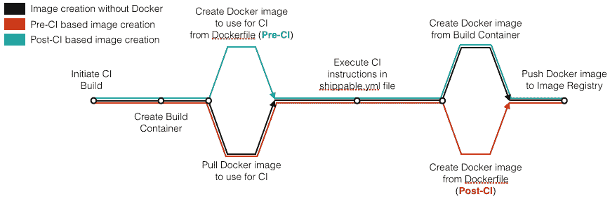
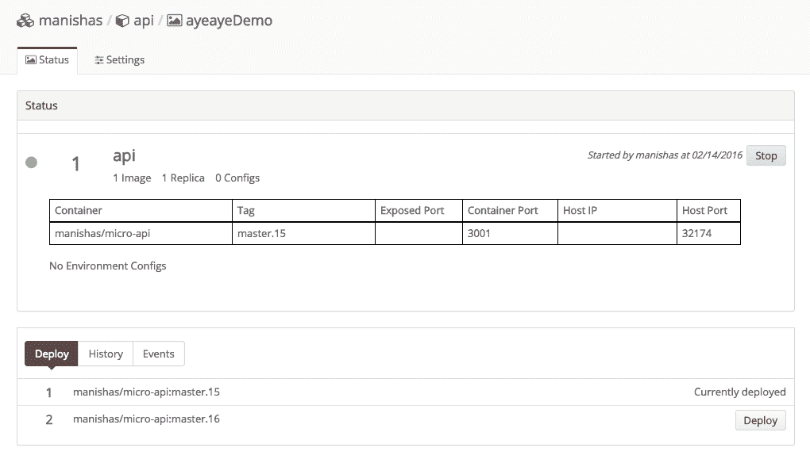
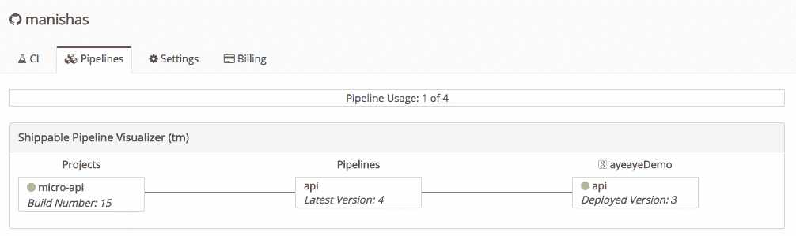
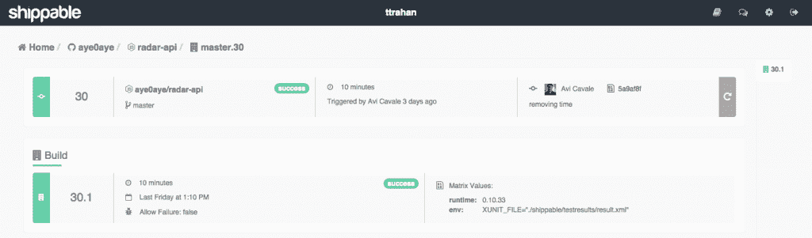

# 可运输 4.0 起航，改进了 Docker 集成

> 原文：<https://thenewstack.io/shippable-4-0-sets-sail-improved-docker-integration/>

开发人员面临着比以往更多的工作，因为工作流管道让他们一天要创建几十次甚至几百次新版本。当服务器平台提供商[Packet.net](https://www.packet.net/)着手优化他们的内部构建系统时，它指望[shippible](https://app.shippable.com/)帮助它实现目标。通过 onboarding Shippable，该公司的构建时间增加了八倍。

CI 管道不仅帮助公司缩短了构建时间，还极大地减少了开发团队每天必须处理的“繁重工作”的数量。当移动广告技术提供商 [PushSpring](http://www.pushspring.com/) 引入 Shippable 来帮助其构建管道自动化时，它这样做是为了给他们的开发人员更多的时间来从事那些对他们的最终用户更有意义的项目。

这还不是所有的[shipped](https://thenewstack.io/shippable-speeds-code-production-front-line/)能做到的。本周，该公司[在其 4.0 版本中推出了各种新功能](https://app.shippable.com/?redirectUrl=/products.html)，包括可定制的 Docker 工作流、更好的管道可视化等。

## 可发货 4.0 中的新功能

用户注意到的第一件事是它增加了灵活性。开发人员可以使用他们目前使用的工具和平台来自动化他们的构建和部署管道。

“当你想改变工具或语言，转向微服务或容器等新技术，或者扩展你的部署环境时，你不必重新开始重建你的应用交付渠道，”Shippable 首席执行官 Avi Cavale 说。

从头开始重新创建一个人的系统可能是一件令人头疼的事情，Shippable 希望通过对该平台 4.0 版本的改进来遏制这一问题。

通过可发货的 CI/CD 创建 Docker 映像

Shippable 4.0 中的下一个生活质量改进是一个单一的连接管道，旨在减少代码和开发人员之间的摩擦。Cavale 指出，CI 只是挑战的一部分:真正的成功来自于将代码持续部署到产品中。这种改进的管道允许开发人员在应用程序的整个生命周期中跨代码库、测试、集成和部署无缝连接。

拥有一个端到端的工作流程是 ship 希望能让开发者更快地交付高质量的代码，同时减少整体的摩擦。

“管道可视化让用户能够精确了解每个环境中正在运行的内容，以及从回购到生产的代码提交的生命周期。他们可以看着图表说‘测试版的 API 服务目前比测试版落后 9 个版本，’”Cavale 说。

最后，随着 Shippable 的发布， [Docker](https://www.docker.com/) integration 对其架构进行了重大改进，使开发人员能够对其 Docker 配置进行精细控制，从而为开发人员和运营团队提供最大的灵活性。

可发货 4.0 中的单元状态

用户可以选择使用 Shippable 提供的自动化管理，或者定制设置以更好地适应他们的使用情况。Shippable 从一开始就专注于容器，其管道能够支持现有的应用程序和在容器中运行的应用程序。Cavale 希望这不仅能帮助已经建立了容器化基础设施的开发人员迅速起步，还能帮助更多的用户按照他们自己的速度过渡到容器。

## 减轻部署压力

有了 Shippable，开发人员能够专注于构建他们的产品功能，而不是建立复杂的部署管道，担心如何在内部实现连续交付。“Shippable 支持较旧的 n 层应用程序以及较新的技术，如容器和管道，因此客户可以今天就开始使用，并在采用较新技术时成为“面向未来”的产品，而无需重建任何东西，”Cavale 说。

Shippable 可以跨多种云和设置进行部署，无论它们是公共云、私有云和混合云。工作流管道有 50 多个提供者集成，包括注册中心、通知、源代码控制等技术。

Cavale 指出，客户可以灵活地选择他们的工具和提供商，而不会被束缚或必须创建自己的定制集成。Shippable 支持许多开发平台，如 GitHub (SaaS 和企业版)、Bitbucket (SaaS 和基于服务器的)、GitLab、亚马逊的 ECS 和谷歌容器引擎。

管道状态–可发货的 4.0 版本

Shippable 并没有严格地提供一个纯粹的 CI 平台，而是进一步创建了一个专注于简化持续交付流程的端到端平台。在大规模工作时，可预测性是关键，尤其是在一天中处理多个构建或代码变更时。“只要代码没有发生重大变化，构建每次在平台上运行都要花费相同的时间。这意味着构建时间不会受到噪音邻居的影响，也不会受到执行时间的影响，”Cavale 说。

Shippable 还为用户提供了基于 YML 的构建，允许开发和运营团队定义一个构建，并将其从单个文档而不是用户界面中打包。通过这种方式，更改很容易实现，并且不需要通过 UI 进行大量的艰苦工作。

Docker 映像配置项构建在可发运中

Shippable 4.0 希望成为一个“面向未来”的解决方案，不仅支持开发人员和运营团队目前使用的工具，还支持这些用户将来可能会采用的工具。他们希望减少公司在迁移到新架构或在工作流程中加入新软件时不得不进行的重建和工作。花费在重建系统上的时间与开发产品特性和改进上的时间是不一样的，而 Shippable 的目标是让用户自己去重建。

最终，Shippable 4.0 允许开发人员在需要的地方管理他们的代码，具有容器的灵活性，面向未来的发展，以及更少的“幕后”工作。

Docker 是新堆栈的赞助商。

通过 [Pixabay](https://pixabay.com/) 的特征图像，通过 Shippable 的嵌入图像。

<svg xmlns:xlink="http://www.w3.org/1999/xlink" viewBox="0 0 68 31" version="1.1"><title>Group</title> <desc>Created with Sketch.</desc></svg>