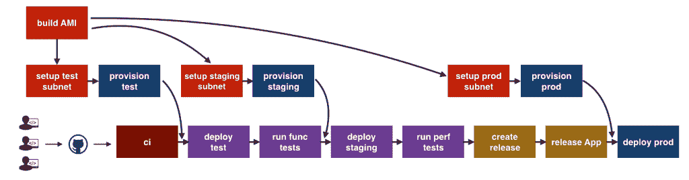

# Shippable 为企业提供了一个持续集成平台

> 原文：<https://thenewstack.io/shippable-server-offers-new-features-enterprise/>

基于容器的[可运输的](https://www.shippable.com/enterprise.html)持续集成平台已经成为开发人员的流行工具，DevOps 软件背后的公司现在也将产品瞄准了企业。

新发布的[可发货服务器](https://www.shippable.com/enterprise.html)提供了与现有软件相同的功能，但增加了安全和软件功能。

“我们将 shippible 的所有产品打包成一个服务器产品，”shippible 首席执行官[阿维·卡瓦勒](https://www.linkedin.com/in/avinc/)说，“我们需要增加一些东西来使它适合企业:比如更好的控制和一系列新的集成。”

Cavale 说，企业内部团队面临的主要挑战之一是这些组织中使用的工具的多样性。它走了一条类似于汽车制造商抛弃专家职位的道路。

企业在他们的设置中引入了更多的自动化，但结果是创建了不同软件的口袋，所有软件都支持独立的应用程序，但没有凝聚力。

Cavale 说:“最大的问题是我们在筒仓中自动化。”。“我们有所有这些工具，但人们已经发现我们无法让这些工具相互交谈，例如，我们如何让厨师与詹金斯交谈；Shippable 旨在创建一种将这些孤岛连接在一起的方式。”

Shippable 的一些新特性包括改进的安全性和控制，确保更好地实施安全策略；自动化程度提高；改进的管理—或者更确切地说，改进的信息可视化。Cavale 说，这有助于更快地识别瓶颈。其他新功能包括增强的工作流，使资源调配更加容易。

Shippable 是一个装配线的高级视图，用于交付一个应用程序或微服务。

还有更安全的交付方式。Shippable Server 可以与 GitHub、GitHub Enterprise、Bitbucket 和 Bitbucket Server 等代码库一起工作，尽管许多企业会说这种方法不合适，Cavale 说。“虽然我们的许多客户在 AWS 和 Azure 上运行，但他们倾向于通过自己的虚拟私有云来这样做，他们出于安全原因而运行这些云，”他说。

然而，根据 Cavale 的说法，该公司计划在未来与更多的云提供商合作。

可运输的方法已经得到了分析家们的认可。 [451 Research](https://451research.com) 的首席分析师杰伊·莱曼说:“虽然云获得了大部分的关注，但企业非常关注在内部运行至少部分应用程序版本和基础设施，可交付服务器有助于满足这种需求。”

然而，他说，尽管它很灵活，但它仍然是一家新公司的事实可能会抑制企业对它的接受。

“提供可以在云和内部运行的容器即服务有助于很好地定位 Shippable:它的主要挑战集中在它作为许多企业可能不熟悉的新提供商的地位。它也缺乏一个开源软件项目来帮助推动它的社区和市场，”莱曼说。

Cavale 表示，该公司的提议非常强大，不仅在于它连接不同孤岛的能力，还在于它的易用性——该公司不希望系统管理员为复杂的部署而挣扎。“我们使用非常简单的声明性语言；学习语法需要两三个小时，”他说。

Shippable 在一个非常拥挤的领域竞争，尽管竞争对手非常不同。“ship able 的主要竞争对手来自其他使用容器进行持续集成和持续部署的供应商，”莱曼说，并指出 ship able 的竞争对手包括 CircleCI、Cloud 66、Drone.io、Force12.io、HyperForm、Iron.io、Kontena、Robin Systems 和 Weaveworks。"

然而，他补充说，Shippable 也与更成熟的自动化公司竞争，这些公司已经集成并支持 Docker 和 containers 的使用。其中包括 Atlassian、BMC、CA Technologies、CloudBees、Cloudsoft、HashiCorp、Rackspace Carina、ThoughtWorks 和 Travis CI。

此外，他说，该公司还与虚拟化供应商竞争。“Shippable 承诺支持虚拟机上的现有和传统应用以及云原生应用，这也意味着与 VMware 的竞争，VMware 在其 vSphere 集成容器中为现有环境提供容器支持，并通过其 Photon container 操作系统支持云原生和容器优先部署。”

AWS Marketplace 立即提供可发货的服务器，起价 499 美元。

通过 Pixabay 的特征图像。

<svg xmlns:xlink="http://www.w3.org/1999/xlink" viewBox="0 0 68 31" version="1.1"><title>Group</title> <desc>Created with Sketch.</desc></svg>