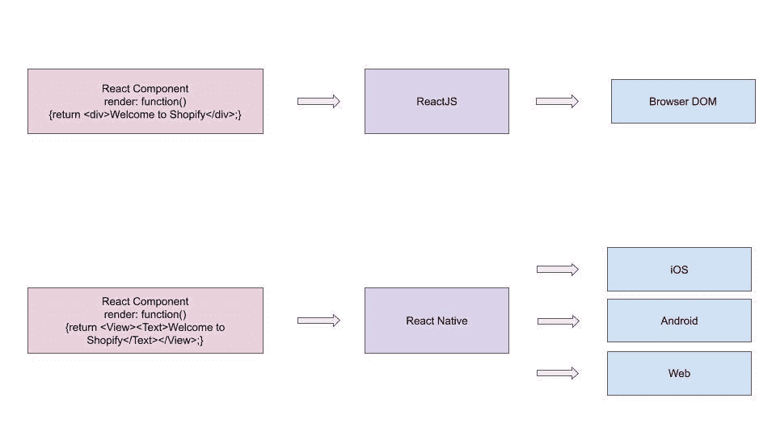

# Shopify 统一了 React Native 下的移动开发

> 原文：<https://thenewstack.io/shopify-unifies-mobile-development-under-react-native/>

电子商务服务提供商 Shopify 正在围绕 T2 React Native 进行客户端开发，React Native 是一个起源于脸书的 JavaScript 框架，用于构建跨平台应用。

“经过多年的原生移动开发，我们决定全力以赴使用 React Native 开发我们所有的新移动应用，”Shopify 渠道和移动工程副总裁[法尔汉·塔瓦](https://twitter.com/fnthawar)在[最近关于这一举动的博客文章](https://engineering.shopify.com/blogs/engineering/react-native-future-mobile-shopify)中写道。加拿大一家跨国电商店铺。Shopify 为零售商建立自己的电子商务商店提供了一个平台。来自 175 个国家的 100 多万家企业使用了该平台，该平台在 2018 年支持了超过 411 亿美元的销售额。

据 Thawar 称，React Native 消除了为 iOS 和 Android 维护单独代码库的需要。该公司还可以使用 Shopify 已经为网络维护的相同代码和库。

React Native 是 React T9 的一个分支，React T9 是一个 JavaScript 库，用于构建基于 Web 的声明式用户界面，也是由脸书开发的。React 构建了一个替代的文档对象模型(DOM)供浏览器使用。ReactJS 的目标是浏览器，React Native 的目标是移动 API，通过将虚拟 DOM 转换为平台本机绑定，如 Windows、macOS，当然还有 Android 和 iOS。

Shopify 在 2015 年首次关注 React Native，尽管经过漫长的调查后通过了，因为当时的技术仍然太新。然而，随着时间的推移，该公司开始见证其价值，因为它看到了磁带库性能的提高。2018 年，Shopify [收购了](https://ecommercenews.eu/shopify-acquires-tictail/)瑞典电子商务初创公司 Tictail，这是一家基于 React Native 的移动优先公司。因此，在那年晚些时候，它在 React Native 中重写了它的一个应用程序 Arrive，发现它比原生 iOS 应用程序崩溃得更少。这也让该公司能够迅速推出 Android 版的 Arrive。

《华盛顿邮报》称，减少可能使用的技术数量，可以让 Shopify 围绕更少的核心技术建立更深入的专业知识。该公司在 15 年前就做出了这样的选择，当时它押注于一个新生的 Ruby-on-Rails。当时并不认为 Ruby-on-Rails 可以投入生产，实际上它给了公司一个竞争优势，因为它允许开发人员更快地创建新功能。该公司两年前再次冒险，决定将其运营从自己的数据中心转移到谷歌云。

在这里看帖子[。](https://engineering.shopify.com/blogs/engineering/react-native-future-mobile-shopify)

图片来自 Pixabay 的 gonghuimin468。

<svg xmlns:xlink="http://www.w3.org/1999/xlink" viewBox="0 0 68 31" version="1.1"><title>Group</title> <desc>Created with Sketch.</desc></svg>