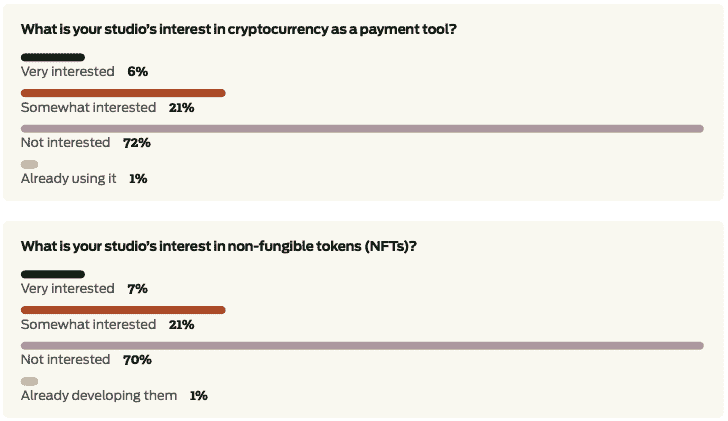
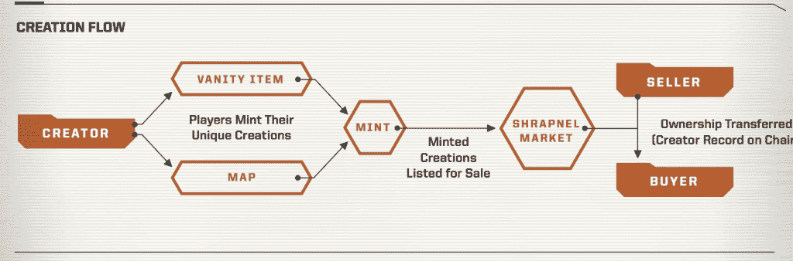

# 《榴霰弹》在第一人称射击游戏中拥抱区块链

> 原文：<https://thenewstack.io/shrapnel-embraces-blockchain-in-first-person-shooter-game/>

Web3 游戏开发至今没有给我留下深刻印象。除了育碧对他们的石英平台做了一些实验，很少有大型游戏工作室公开发布任何集成了区块链技术的游戏。今天可用的 play-to-earn 和 NFT 游戏的努力感觉像是他们将一个游戏固定在一个去中心化的应用程序上，而不是专注于游戏优先的产品路线图，这恰好看到了整合区块链的好处。这些游戏的起点通常是 1000 美元或更高，这疏远了大多数游戏玩家和加密本地人。

持怀疑态度的不止我一个人。根据一月份发布的 [GDC 游戏产业状况](https://gdconf.com/news/gdc-state-game-industry-2022-devs-weigh-nfts-unions-and-more)，绝大多数游戏工作室对 crypto 和 NFTs 不感兴趣(如下图所示)。当讨论与游戏开发相关的 NFTs 和加密货币的话题时，有一部分开发人员非常消极。

[fragment](https://www.shrapnel.com/our-vision)是一家游戏工作室，它试图逆这些趋势而动，发布一款融合了第一人称射击游戏的精华和区块链元素的游戏，目标是为游戏玩家提供新的功能。

## 区块链对游戏开发有什么补充？

在与新堆栈的采访中，Studio [的弹片负责人 Don Norbury](https://mobile.twitter.com/donnorbury) 解释说:“从用户故事的角度与区块链分散共识机制的角度相比，后者更具技术性，区块链通过互操作性和可移植性赋予用户所有权，并从头开始以这种方式构建。”

这种对用户授权的关注是 shroupant 的方法与我们迄今为止在区块链和 NFT 游戏领域看到的大多数方法不同的地方。他们不是在建造一个沙盒，让用户呆在榴霰弹生态系统中，相反，他们把他们正在建造的东西视为大元宇宙的一小部分。

“我们从区块链的角度出发，很早就开始考虑我们的合同架构应该是什么样子，以实际支持互操作性，”Norbury 解释道。“在一个互操作标准中，允许你在我们正在构建的链上或其他地方拥有一些东西，但然后通过一组合同，能够在其他平台、项目和其他链上拥有它们的表达。由于底层所有权存在交易，这种交易是如何渗透的，人们如何控制它。这是你在中央集权系统中无法真正做到的部分。”

## 游戏优先发展

与其专注于如何让用户登陆 Web3，让他们能够以新的方式玩游戏，不如专注于让用户体验尽可能地顺畅。听起来，如果用户想的话，他们可能可以从 Metamask 钱包开始，但 sucrania 最初的重点是利用来自 [Amber Group](https://www.ambergroup.io/) 的保管钱包技术，该技术允许简单的入职体验。

这个决定的一部分是为了克服 Web3 在游戏中引入摩擦的一些挑战。游戏中的一个功能允许用户从已故的玩家角色那里领取 NFT 装备，如果需要钱包签名，这将大大减慢速度。这类 NFT 不同于用户创建(或铸造)的 NFTs，在 NFTs 中，用户从世界内部获取材料，并为角色创建新的地图或美学属性。

## 构建玩家友好的创作者生态系统

《榴霰弹》正在构建的功能应该会吸引那些喜欢用自己的作品增强游戏体验的游戏玩家。九十年代见证了《雷神之锤》和《半条命》的粉丝们以各种有趣的方式扩展游戏世界。《我的世界》和 Roblox 创造了全新一代的粉丝，他们认为创造力是游戏的核心部分。

“榴散弹”将区块链和 NFTs 视为一种创建模块化结构的方式。Norbury 说，“我们与许多传统开发者的不同之处(我认为他们最终会站在我们这边)在于材料定义是如何工作的。我可以给你东西的组件，给你一个指导手册，告诉你如何使用这些组件，让它们为我们的项目工作。当你把材料做成一组纹理时，这些纹理存在于实际 NFT 引用的分散存储中。”

榴霰弹取得那个 NFT，并把它表现为游戏中可以被虚幻引擎使用的资产。他们的材料管道显示了 NFT 的资产是如何从原材料中构建出来的，这反过来将允许其他平台利用相同的方法。Norbury 甚至说，“最终我们看到了榴霰弹的成功，因为半天的会议是在创造者地图上，而不是在榴霰弹地图上。那是流行香槟日。有多少是由社区有效拥有和运营的。”

## 熟悉的积木与区块链相结合

游戏开发人员可能会熟悉 shroupant 构建 FPS 提取游戏的方法。这个游戏是用[虚幻引擎 5](https://www.unrealengine.com/en-US/unreal-engine-5) (UE5)以及一些从 UE4 转换到 UE5 的组件构建的。理论上，这将《榴霰弹》与其他基于虚幻引擎的 AAA 级游戏归为一类——比如《堡垒之夜》。

在区块链方面，榴霰弹正在使用[雪崩](https://www.avax.network/)——这允许快速的交易吞吐量，也解决了比特币和以太坊的批评者提出的一些生态问题，因为雪崩的能耗更低。Avalanche 报告的交易时间不到 2 秒，而以太坊的交易时间是以分钟计算的。Avalanche 的理论交易量约为每秒 4500 笔，而以太坊的交易量为每秒 15 笔。弹片选择雪崩还有其他考虑。Norbury 解释说:“它是可扩展的，允许我们自定义虚拟机。我们正在构建它，所以我们不会与其他 dApps 或游戏共享块空间。如果堡垒之夜有一个好的一天，他们不会采取弹片下来。这是被翻译成区块链的吵闹的邻居问题。”未共享的块空间是由于 Avalance 支持子网划分。

榴散弹还与 Anybrain 合作，提供一些安全和反作弊技术。该公司在职业游戏领域最为人所知的是，它能够检测到某个账户何时被其他人玩了。对游戏可执行文件的额外保护来自于 [Byfron](https://byfron.com/) ，它为游戏开发者提供了防篡改技术，帮助防止游戏的逆向工程和发现漏洞；虽然这基本上是一场军备竞赛，但技术都试图领先一步。

FPS 游戏的其他传统组件，如排行榜，将保持离线状态。鉴于这些变化的速度之快，在每场比赛后将它们写入区块链可能效率不高。

## 弹片和区块链游戏的下一步是什么？

榴散弹的愿景很远大。在发布游戏之前，他们还有很多里程碑要完成。[工作室团队](https://www.shrapnel.com/team)的每个成员都参与过你可能熟悉的游戏，即使你不是游戏玩家，所以他们成功的可能性很大。

我最感兴趣的是，他们是否能设法建立一个创作者框架，允许其他开发者以新的和创造性的方式扩展他们所建立的东西，同时保持他们对 FPS 游戏的兴趣。如果他们带头鼓励其他区块链游戏开发商首先专注于游戏，这对整个行业来说肯定是一个胜利。

<svg xmlns:xlink="http://www.w3.org/1999/xlink" viewBox="0 0 68 31" version="1.1"><title>Group</title> <desc>Created with Sketch.</desc></svg>