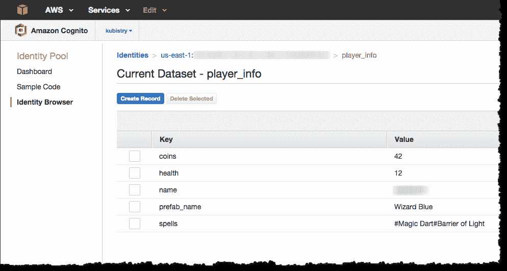
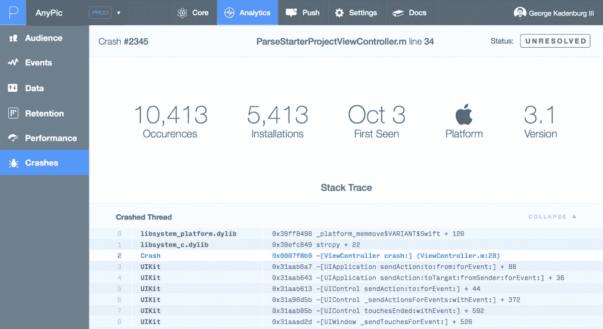
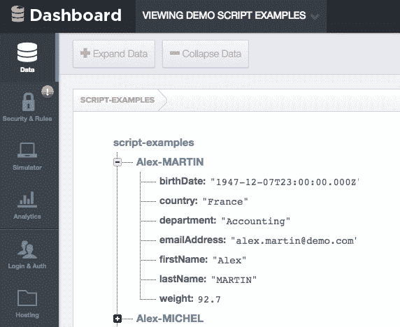
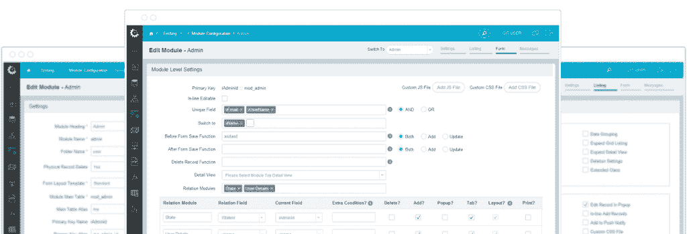
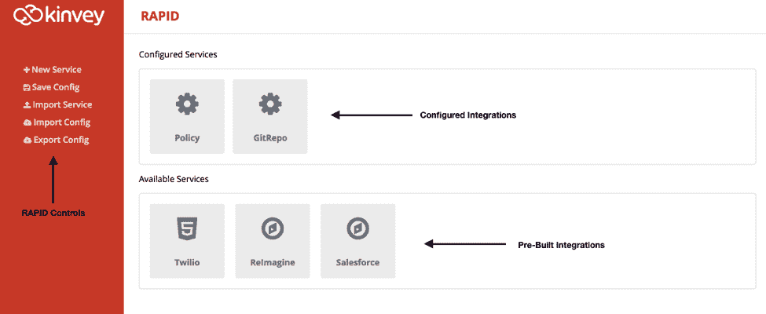

# 脸书 Parse 的关闭和移动后端即服务的未来

> 原文：<https://thenewstack.io/shuttering-parse-future-mobile-backend-service/>

脸书上个月宣布将关闭其广受欢迎的 BaaS[后端即服务]Parse,这让不少软件开发商感到意外。对于那些已经创建了大量解析应用的人来说，这个消息引起了愤怒。

幸运的是，脸书有先见之明，缓和了这个消息，宣布它也将[开源 Parse 的代码](https://github.com/ParsePlatform/parse-server)发布给社区。对于那些更喜欢托管平台而不是通过开源为 Parse 的持续寿命做出贡献的人来说，有各种各样的托管 MBaaS(移动后端即服务)和 BaaS 解决方案可用。

使用 Parse 托管和开发其应用程序的企业已经提出了在 Parse 过渡到 OSS 的整个过程中它们将会受到怎样的影响。随着开源社区开始勾勒出明年要解析的功能和更新的路线图，依赖其软件的开发人员有机会改进它，超越脸书的愿景。

## 他们都会一起倒下

Parse 最初是一个面向移动开发人员的 MBaaS 平台，随着越来越多的开发人员开始关注为企业创建和维护移动应用程序，它迅速获得了关注。MBaaS 为开发人员提供了一个一体化平台，用于部署他们的移动应用程序、验证用户登录、发送欢迎电子邮件、推送通知，以及几乎任何其他可以放入 API 挂钩的功能。

Parse 还处理了移动应用程序开发中更麻烦的方面，比如安全性、可伸缩性和数据存储。像 Parse 这样的 MBaaS 平台为开发人员提供了一个经济高效的解决方案来管理他们的整个应用程序后端，而不必在更精细的细节上花费大量时间。

AWS 认知用户数据

脸书在 2013 年接管 Parse 后，该品牌开始将重点从 MBaaS 解决方案转移到推广其信使服务和企业功能。随着物联网的不断发展，人们不禁要问，为什么脸书会停止在一个持续增长的领域提供服务。

“脸书为开发者提供了足够的 API 来消费基本的社交图和广告服务。Janakiram & Associates 的创始人兼负责人贾纳奇拉姆·MSV 说:“随着它的发展方向——增强现实、移动广告和无处不在的连接——支持开发者变成了一种负担，因为它与脸书的使命没有直接联系。”

解析崩溃报告

随着脸书继续从连接大学生和他们的母校转变为通信软件巨头，Parse 被进一步推向边缘。这种重心的转移使得脸书可以节约资源，将开发人员的精力从维护和更新 Parse 转移到有利于他们在全球范围内开发全服务通信平台的项目上。

IDC 软件开发研究项目主管 Al Hilwa 说:“到目前为止，他们肯定有 100 名最优秀的开发人员在从事 Parse 项目，而很多开发人员没有从事与脸书项目更密切相关、能为他们创造更多商业价值的其他项目。”

Parse 并不是第一个遭遇这种命运的 MBaaS。StackMob 是另一个随着 PayPal 转移重心而关门的 MBaaS 产品。Parse 是开源的，允许该服务的用户将其数据导出到 MongoDB 服务器上，并在各种平台上运行。公司可以在本地运行他们的解析服务器，或者将其部署在容器中。

几乎就在 Parse 宣布关闭之后，容器部署服务 Instainer 已经为部署自己的 Parse 服务器创建了 [Docker 镜像](https://hub.docker.com/r/instainer/parse-server/)。开源软件工程师 Felix Rieseberg 有一个关于使用微软 Azure 转向开源解析的[深度教程。除了这些工具，Parse 自己的迁移指南提供了从几乎所有架构进行迁移的详细说明。](http://www.felixrieseberg.com/running-your-own-parse-with-azure-and-docker/)

## MBaaS 的下一步是什么？

Parse 即将关闭，在其新的开源社区中引发了一系列活动。这为 OSS 开发者提供了一个强有力的基础来合作和决定新的特性、更新和改进，这些是脸书在监督 Parse 开发期间无法完成的。

贾纳基拉姆·MSV 强调，Parse OSS 核心服务必须首先将其功能与当前可用的商业产品相匹配，例如通过 API 添加推送通知。“然后他们应该致力于高可用性托管和基础设施集成，”他补充说。

数据输入谷歌 Firebase

对于有兴趣与长期支持他们项目的公司合作的开发者来说，这通常是一个寻找已经合作的品牌的问题。AWS、Azure、Google Cloud 和其他 PaaS/IaaS 解决方案没有显示出切断对开发者支持的迹象。就 AWS 而言，这样做几乎是不可想象的。

虽然多年来许多 MBaaS 解决方案已经失传，但公司仍有拓展业务的机会。Janakiram 指出，“大多数小公司，如 FeedHenry、Firebase、Strongloop 和 Modulus 都被收购了。像[金维](http://www.kinvey.com/)、 [AnyPresence](http://www.anypresence.com/) 和 [Kii](https://en.kii.com/) 这样的当前玩家专注于企业客户。现在是他们为面向消费者应用的开发者创造产品的时候了。”

Configure.it Insights 仪表板

AWS Cognito 和 Google Firebase 拥有许多人希望的安全未来，它们都为 iOS 和 Android 开发者提供了各种后端功能。Google Firebase 是通过 JSON 管理的——开发人员可以通过客户端库或 REST API 访问数据，而 Cognito 完全运行在 AWS 云中。对于那些已经迁移了应用的人来说， [Pusher](https://pusher.com/) 是一个免费的实时应用平台，与 Parse 配合得很好。它为开发者提供了对实时数据、webhooks、30 多个库等的访问。

Kinvey Android 快速仪表板

贾纳基拉姆 also 还指出，关闭 Parse 为精通技术的开发人员提供了新的机会。Configure.it 的团队已经利用了这样一个机会。这个新的 PaaS 迅速填补了 Parse 宣布关闭后留下的空白，为用户的应用程序提供数据迁移、托管和 REST API。 [Configure.it](http://www.configure.it/) 使用基于 MySQL 的关系数据库，而 Parse 利用 MongoDB。对于那些有大量应用程序库需要迁移的用户，Configure.it 拥有无限的数据存储空间，而 Parse 只为用户提供 20GB 的存储空间。

随着企业转向基于云的软件解决方案，始终需要确保成为事实上的开发解决方案的工具的持续寿命。Parse 的关闭和随后转向开源展示了许多人希望的未来之路。如果一个私有化的技术平台关闭了，至少它的代码应该对整个社区开放，以便改进、扩展和提高。

通过 Pixabay 的特征图像

<svg xmlns:xlink="http://www.w3.org/1999/xlink" viewBox="0 0 68 31" version="1.1"><title>Group</title> <desc>Created with Sketch.</desc></svg>