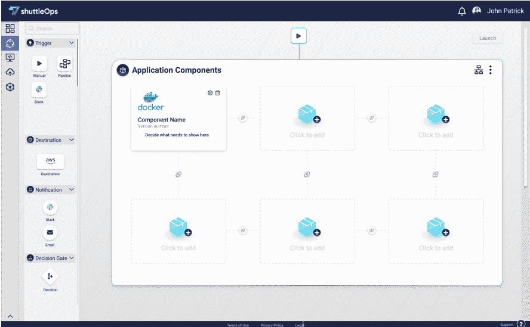
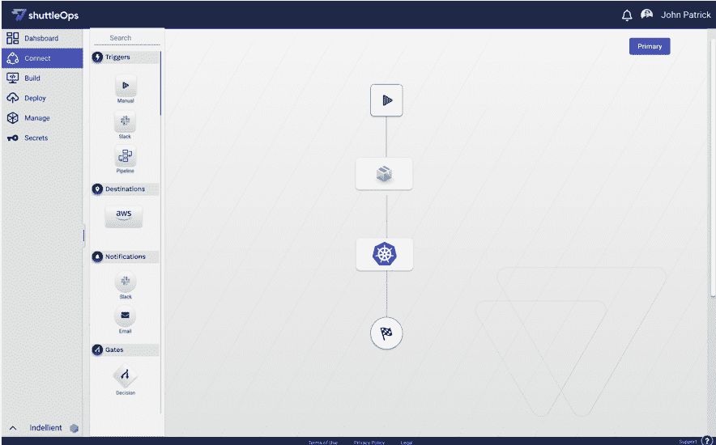

# ShuttleOps:无代码 Docker 和 Kubernetes

> 原文：<https://thenewstack.io/shuttleops-no-code-docker-and-kubernetes/>

无代码持续集成和持续交付(CI/CD)供应商 [ShuttleOps](https://www.shuttleops.io/) 添加了拖放功能，用于构建 Docker 容器映像并将其部署到 Kubernetes 集群。这是帮助组织加快应用程序交付并缩小这些新兴技术的技能差距的努力的一部分。

有了 [Docker 和 Kubernetes 的支持](https://thenewstack.io/kubernetes-vs-docker-swarm-whats-the-difference/)，该平台可以管理应用运行时配置，并跨亚马逊网络服务(AWS)、微软 Azure 和谷歌云平台(GCP)自动化应用交付。

> ShuttleOps 平台管理 YAML 文件，因此用户不必这样做。

在应用程序开发和生产之间，有一系列旨在帮助公司更快交付软件的工具，尽管每个工具都需要时间来让团队加快速度，更不用说花费时间来管理各种工件管理、秘密管理、云、容器、部署和配置管理技术了。

“这些都是非常棒的解决方案。但每一个都是真正的投资回报率。由于知识差距，投资回报时间延长了。ShuttleOps 首席执行官[大卫发现](https://www.linkedin.com/in/davefound/?originalSubdomain=ca)说:“你必须让团队参与进来，如果你失去了擅长某一特定领域的团队成员，那么与损耗相关的成本现在会被放大。”。

ShuttleOps 的答案是用一个无代码的可视化管道编辑器来自动化手动任务。只需几次点击，用户就可以构建、配置、保护、供应和部署应用程序。

虽然许多 CI/CD 工具也旨在提供像 ShuttleOps 那样的端到端管理，但“它们仍然停留在非常技术化的筒仓中，仍然需要大量中等数量或大量代码才能实现这一点，”Found 说。

这家总部位于多伦多的公司在 5 月份发布了其无代码软件即服务 CI/CD 产品，当时仅支持 [Chef Habitat](https://thenewstack.io/chef-habitat-gains-a-foothold-in-the-enterprise-streamlines-packaging/) 的打包功能以及 HashiCorp Vault 的秘密管理。

[https://www.youtube.com/embed/hR9-ucu5MUo?feature=oembed](https://www.youtube.com/embed/hR9-ucu5MUo?feature=oembed)

视频

Found 说，最初的版本基本上是一个概念验证，Docker 和 Kubernetes 支持其与其他工具广泛集成的第一个计划。

ShuttleOps 平台管理 YAML 文件，因此用户不必这样做。

“几乎我们所有的客户都提到的一个最大的痛点是管理 YAML 配置文件的激增和困难，”Found 说。“大部分专业知识存在于一个小团队中，甚至有时只是个人，因为它需要深厚的专业知识。而这在摩擦中就会消失。

“正因为如此，而且在整个企业中进行扩展仍然非常具有挑战性，所以您的知识差距要大得多。…我们希望简化 Docker 容器的构建，例如直接从您的源代码控制系统推送或拉取请求。我们正在提供从 Docker 容器注册到 Kubernetes 集群的无 YAML 部署体验。我们正在 UI 中启用名称空间的供应和配置。我们支持用户期望从 Kubernetes 获得的所有核心功能，例如滚动更新。我们还为集群、应用程序和所有正在运行的环境提供这种可见性。”

### 可视化管道生成器

ShuttleOps UI 有四个主要选项卡:连接、构建、部署和管理。在 Connect 选项卡上，用户点击 GitHub、GitLab 或 Bitbucket 存储库，并选择一个云环境，如 AWS、Azure 或 GCP。

使用 HashiCorp Vault，可以以更安全的方式存储和共享凭证。尽管可以向其他用户授予访问权限，但用户名/密码或 API 访问密钥不会在物理上传递，从而消除了剪切和粘贴的问题。

在 Build 选项卡上，核心需求是源和目标。在 Docker 世界中，您只需选择 Docker 文件。Found 说，它可以无缝地为同一应用程序或多个应用程序运行并行构建。它还允许用户合并业务流程，例如推送事件的时间表，或者您是否需要 Slack 或电子邮件通知。

在 Deploy 下，您可以管理各种云上的 Kubernetes。您可以添加诸如[格拉夫纳](https://grafana.com/)和[普罗米修斯](https://prometheus.io/)之类的工具来查看在您的环境中正在运行的实例上收集的指标。使用名为 binds 的 Chef Habitat 概念，您可以将它们链接在一起，这样它们就可以相互对话。您还可以深入了解各种指标，以便更好地了解每个实例的运行状况。

您可以选择 Linux 或 Windows 部署，扩大多节点集群中的实例数量，以及规模和卷等。您还可以管理安全规则和配置负载平衡器。

对于希望使用脚本进行资源调配的用户，他们可以这样做。

### 释放全部能力

ShuttleOps 在最初的版本中与 Chef 合作，尽管它提出了一个问题，为什么用户不直接使用 Chef Habitat。

“Chef Habitat 是一个很棒的应用程序框架，但使用它有一些已知的复杂性，”Found 说。“这对于采用来说是一个挑战——试图确保能够使用 Chef 的用户能够释放其全部潜力。通过我们的 DevOps 经验和服务项目，我们为超大型组织开启了这一领域。因此，通过将这些知识打包到这个平台中，您实际上能够发现并释放这些功能，而无需真正完全了解 Chef Habitat 能为您做些什么。”

New Stack 分析师 Lawrence Hecht 报告说[对低代码或无代码平台](https://thenewstack.io/low-code-platform-adoption-gets-a-boost-from-digital-transformation/)的使用正在增长，尽管主要是专业的 IT 人员。在 [OutSystems 的一项调查](https://www.outsystems.com/1/state-app-development-trends/?utm_source=thenewstack&utm_medium=website&utm_campaign=platform)中，只有 3%的受访者表示业务部门在没有 IT 部门干预的情况下使用无代码平台。

在关于企业低代码应用平台的[市场报告](https://www.gartner.com/en/documents/3956079/magic-quadrant-for-enterprise-low-code-application-platf)中，Gartner 指出 OutSystems 是领导者，同时还有一系列供应商，包括微软、Salesforce 和 Mendix。

IDC 开发运维研究总监 Jim Mercer[表示:“由于可用工具种类繁多、多云环境盛行以及人才保留动态，在应用和基础架构团队中实现最佳实践的一致性可能会非常复杂。“帮助公司统一应用程序开发以及部署和管理工作流的平台可以降低各种技能组合的参与门槛，并帮助组织在市场上创造更大的价值。”](https://www.idc.com/getdoc.jsp?containerId=PRF005085)

<svg xmlns:xlink="http://www.w3.org/1999/xlink" viewBox="0 0 68 31" version="1.1"><title>Group</title> <desc>Created with Sketch.</desc></svg>