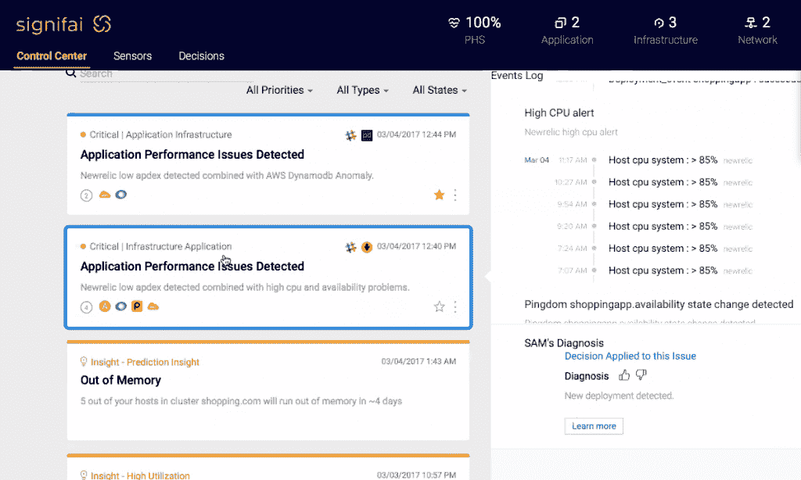
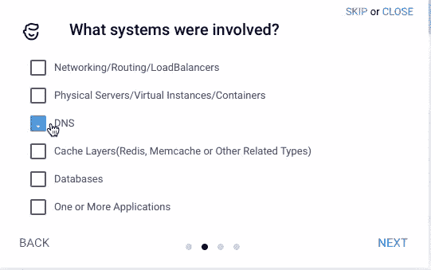

# SignifAI 使用机器学习来监控整个堆栈

> 原文：<https://thenewstack.io/signifai-builds-monitoring-cherry-top-full-stack/>

想象一下:你坐在一排显示器前，看着八个不同系统的仪表盘。你允许自己微笑，因为所有的系统都是绿色的。然后砰！生产数据库关闭。

熟悉的危机程序启动了，在几个小时的故障排除和愤怒的客户/经理/首席执行官之后，你发现最近对 PagerDuty 的更新与计划下周升级的稍旧版本 NewRelic 不完全兼容。你想写一篇事后总结，讲述你煞费苦心发现的解决方法，但一个新的危机吸引了你的注意力。

这正是导致 SignifAI 发展的情景，这是一家在波特兰召开的 [Monitorama 会议](http://monitorama.com)上跳出秘密模式的新创业公司。

一定有更好的方法，SignifAI 的首席技术官和联合创始人[盖伊·菲格尔](https://www.linkedin.com/in/guyfig/)想道。一年前，他召集了一个 TechOps 专业人员团队，这些人厌倦了在多个显示器上管理多个系统的工作，每个系统都有自己的警报，跟踪不同的事情，并将大部分时间花在灭火上。

“他们想做很多事情来改善系统，”Fighel 在博客中写道，“但他们永远无法实现，因为他们一直处于危机模式中。”。

正如 [Capital Picard](http://www.startrek.com/database_article/picard-jean-luc) 所说，如果你每天都处于红色警戒状态，那么红色警戒就毫无意义。

Fighel 看着云和机器学习的兴起，心想，“如果我们在所有这些现有的监控系统之上创建一个监控系统，会怎么样？如果这个系统将所有这些数据结合成一个庞大的数据集，这样我们就可以跨系统跟踪停机时间，并整理事件数据、日志数据和指标数据，从而为我们提供预测停机或可能停机的方法，那会怎么样？然后使用机器学习和机器智能来捕捉和存储事后信息？”

Fighel 和 signivali CEO[JP Marcos](https://www.linkedin.com/in/jeanphilippe1/)挑选了一个 TechOps 工程师团队，他们都有在复杂堆栈环境中进行监控的经验，并开始构建他们想要的系统*。目标是将他们的时间从监控系统的苦差事、危机管理的噩梦、随叫随到的夜晚和周末中解放出来。他们希望能够做一些有趣的事情，比如微调环境，或者让它们像超级跑车一样运行。也许还能在合理的时间表内跟上所有的系统更新。*

马科斯说:“我们本质上是为自己打造了一个工具。“我怎样才能从数据中找到重要的东西？我如何减少 MTTR(平均修复时间)，我如何用我能理解的语言立即理解发生的事情，一旦我弄清楚是什么并修复它，我如何用我将实际做的直接语言以简化的方式获取这些知识。”

马科斯说，第一条规则是让事情变得简单。尽可能抽象出运行多个系统的复杂性。第二条规则是让事情变得简单。在四个屏幕中捕捉尸检。最后一条规则是让事情变得简单。在一个屏幕上运行所有系统，仅显示最高级别的数据，并深入到各个监控系统。事实也的确如此。

## 20 分钟后设置完毕

SignifAI 通过 API 将数据拉至 IT 资产。初始设置是向导驱动的，这是一组简单的步骤，客户可以在其中选择他们想要添加的系统。该公司声称，包括数据下载在内的整个过程大约需要 20 分钟。

该软件目前支持 60 多个集成，包括 Slack、NewRelic、PagerDuty、GitHub、AppDynamics、Amazon Web Services 和 Datadog。

马科斯解释说，系统连接数据有两种方式。一个功能是主动检查器，它查看来自所有系统的监控数据；另一个名为 Web Collector，用于监听警报。

重要的仪表板看起来很干净，便于使用

控制中心将来自所有连接系统的警报汇总到“问题卡”中，根据系统的设置方式，这些卡按照警报的重要性、来源或类型进行分类。有两种类型的警报:蓝色，这是一个正在发生的问题，黄色，这是一种“洞察力”(例如，您将在五天内耗尽 x 容器中的内存)。

控制中心只显示非常高级别的数据，这种数据由于信息量太大而切断了其他系统中产生的噪音。如果您对细节感兴趣，只需点击一下鼠标就可以深入了解。这使得控制中心屏幕干净并且容易跟随。

## 见见萨姆，你的新队员

马科斯说，该产品的优势之一是 SAM，它代表显著增强会员。马科斯将自动化人工智能视为监控团体的团队成员。

“机器有完美的记忆，”马科斯说。"一年后，你的工程师可能不记得到底发生了什么，但电脑记得."

SignifAI 不断在幕后关联数据，以寻找潜在威胁正常运行时间的问题。SAM 实时关联所有系统中每个组件的大量日志、事件和指标数据，并对其应用预测算法。

马科斯说，机器学习能够实现快速的根本原因分析，并提供答案和见解，这将需要一个人类工程师团队花更长的时间来完成。几秒钟而不是几天。

## **如何有效工作**

通过打破整个公司的数据孤岛，SAM 将时间序列、事件和日志数据转换为统一的数据集，从而智能地跨堆栈向下输出数据。马科斯说，然后它按照一个逻辑框架应用一系列分析，这个逻辑框架是明智的，非常类似于人类专家。

他解释说，当公司设置警报时，他们是在寻找已知的信息。例如，当您跟踪服务器内存使用情况时，这在很大程度上被认为是“已知数据”,因为您知道您在寻找什么。

有意义的是寻找未知的信息。你不能知道的信息，因为你不知道它在那里。通过查看所有可用的数据，并在你进行的过程中捕捉数据，计算机可以查看你的全部立场，并挖掘你不知道存在的相关性。例如，一个系统中的升级和另一个系统中的损坏之间的相关性。

将机器学习应用于指标、用户行为、反馈和人类专家，使 SAM 能够不断适应和改进其结果。马科斯说，在整个过程中，它还捕捉团队的知识，并在需要内容时自动提供。“这使 TechOps 团队能够快速获得准确的答案、预测性的见解，并利用不断增长的知识库，以便更快地解决和防止影响系统正常运行时间的问题，”他说。

## 验尸报告

在 TechOps 环境中，捕获事后数据传统上很难，因为团队通常从一个危机转移到下一个危机。马科斯说，重要的是使这变得容易。当 SAM 提出问题时，捕获解决方案是一个快速的四步流程。

4 步事后分析很简单，只需点击并放下代码

在“发行卡”上，有一个按钮叫“我修好了。”这将打开一系列四个窗口。第一个“根本原因是什么？你点击一个常见根本原因的固定列表。下一个窗口询问哪些系统受到了影响。第三个窗口询问是否使用了任何脚本。最后一个窗口是自由文本，以自然语言捕捉任何上下文或你需要知道的事情，如果这些情况再次发生。

马科斯说，所有这些条件都结合在一起，如果这些条件在未来得到满足，软件就会自动显示这些信息。这就是机器完美的知识和记忆派上用场的地方。SAM 将创建一个问题卡，在发生类似问题时提醒用户，并提供如何解决问题的建议。

## 不断学习

系统在不断学习。“我们从您的反馈中学习。我们从 Slack、PagerDuty 和所有系统中获取的所有文本中学习。当一张票打开时，当一张票关闭时，我们学习，”马科斯说。

随着 SignifAI 的扩展，学习将会在客户之间发生。使用第一个示例，如果机器了解到 page duty 升级对旧版本的 NewRelic 有影响，SignifAI 可以在所有使用 page duty 和 NewRelic 的公司中查找这些条件，并向这些公司发送警报。马科斯说:“这就是加速的好处。”"我们称之为制度化的知识转移."这本质上是另一种学习方式。

马科斯说，由于 SignifAI 只对实时事件感兴趣，它只关注元数据。原始数据在 30 天后被转储。图书馆和

SignifAI 在 Kubernetes 中作为一组微服务运行，但由于专有算法，Marcos 不愿透露更多关于封闭堆栈系统的信息。

Pinterest 广告工程主管 Chris Amen-Kroeger 说:“机器智能的一大好处是它拥有完美的记忆，可以将过去问题的原因和解决方案与现在发生的问题进行匹配。因此，该软件有助于“从响应警报的团队转变为主动解决问题的团队。”

专题图片: [Wonderlane](https://www.flickr.com/photos/wonderlane/) 的[箭鱼壁画](https://www.flickr.com/photos/wonderlane/7821886774/in/photolist-cVcdqN-fcsv9V-atpHUq-4rpytc-pBPti7-bmukED-6NBYo-Vvsntr-ox49po-5FSt-7bb3U1-6VMzS-Ti7sWy-a6ogsC-amD5bN-PYjpji-7b7ixx-afBurP-jCJveS-d9Cy29-gCdNcc-nifgpB-4Wt1L2-AsbHd7-gCcL3W-i3gqRR-pm1car-2h8ngm-cZgjrj-SaKs1Y-9HkTWj-5ugaPo-8NeqEn-VpDueS-jr6Wvy-cX3ny5-dfZuUs-gCcJtU-5ugbFd-c7QVTw-w3vJf-6DBNgk-7MNFq-3F3dhU-f5yQG3-fgJsyg-gCcLBb-6ZsjZ3-avUdr5-8tYDao)，授权于 **[CC BY-SA 2.0](https://creativecommons.org/licenses/by/2.0/)** 。

<svg xmlns:xlink="http://www.w3.org/1999/xlink" viewBox="0 0 68 31" version="1.1"><title>Group</title> <desc>Created with Sketch.</desc></svg>