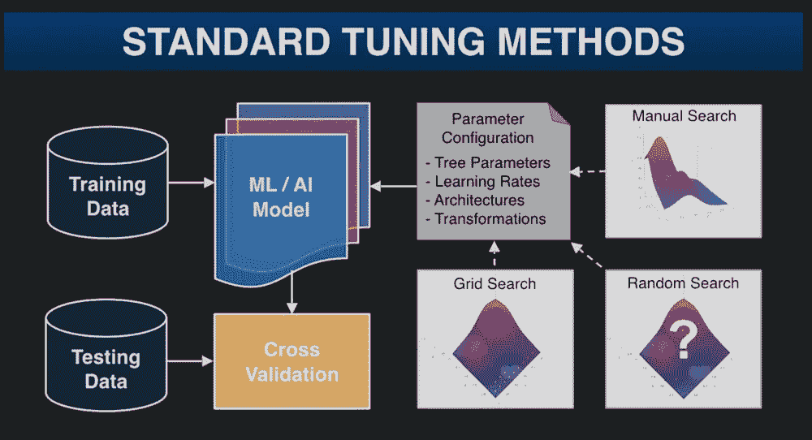
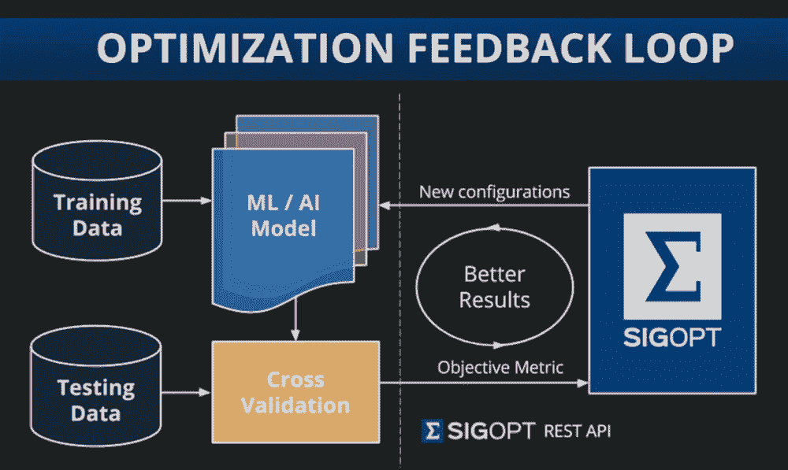

# SigOpt 希望如何优化您的机器学习算法

> 原文：<https://thenewstack.io/sigopt-wants-optimize-artificial-intelligence/>

为我们智能手机上的推荐引擎、语音识别和寻路应用提供动力，[机器学习](/category/machine-learning/)以我们意识不到的更多方式渗透到我们的生活中。然而，这些系统背后的机器学习模型可能非常难以优化，并且不直观。专家并不总是知道为什么某些模型配置在某些情况下有效，而在其他情况下无效，即使是最简单的模型也有令人眼花缭乱的参数需要调整。通常，这些模型是使用试错法来调整的，但是这可能是耗时且昂贵的。

为了解决这个非常现实的问题，总部位于旧金山的初创公司 [SigOpt](https://sigopt.com/) 提供了一种优化即服务 API，允许用户无缝调整人工智能和机器学习模型中的配置参数。这是一种基于用户每月调谐多少模型的订阅服务，最近[在去年的首轮融资中筹集了 660 万美元](https://techcrunch.com/2016/08/24/sigopt-series-a/)。SigOpt 通过贝叶斯和全局优化算法的结合来优化模型(甚至广告和产品)，这允许用户和公司提高其模型的性能，同时削减成本并节省以前可能花费在更乏味的传统调整方法上的时间。

SigOpt 服务的一些优势包括它的易用性:它可以很容易地集成到任何现有的工作流程之上，其图形界面也简化了流程。它还使用了该公司所谓的“黑盒优化”——这意味着 API 不需要访问底层数据来优化它，这意味着公司的 ML 模型和知识产权是私有的。SigOpt 还允许用户通过作为参数调整的“分布式调度程序”来并行调整任何算法，以便串行排列的模型可以并行调整，从而在更大范围内更快地实现更好的结果。到目前为止，SigOpt 已经被用于学术和企业场合，从欺诈检测到研究和产品开发。我们请 SigOpt 的联合创始人兼首席执行官斯科特·克拉克帮助我们更好地了解 SigOpt 是如何产生的，以及它在幕后是如何工作的。

是什么促使你创办了这家公司，你希望解决什么现实问题？

SigOpt 诞生于让专家更高效的愿望。当我在康奈尔大学(Cornell)攻读应用数学博士学位时，我注意到，在生物信息学和计算流体力学等不同领域，研究的最后阶段往往是领域专家通过反复试验调整他们已经建立的东西，以期实现更好的性能。因为更复杂的技术通常不可用或不可用，所以这种调谐通常是通过昂贵的暴力、随机搜索或手动调谐来执行的。

完成博士学位后，我在 Yelp 开发了一个开源包[度量优化引擎](https://github.com/Yelp/MOE) (MOE)来解决这个问题，并使用它来优化 Yelp 的机器学习模型和 A/B 测试。我发现业内许多专家正面临着和我的同事在研究生院时一样的挑战，需要调整他们的推荐系统、搜索算法、欺诈检测方法、算法交易策略等等。我们构建 SigOpt 是为了让这些专家通过一个简单的 API 使用最好的技术来解决他们的优化问题，这样他们就可以专注于构建他们喜欢的东西。

**什么是“黑盒优化”？**
黑盒优化是一种优化形式，你只能观察特定系统的输入和输出，而不能观察其他。目标是找到最大化一个或一组输出的输入配置。这是一种特别困难的优化形式，因为你没有办法内省底层系统来帮助决定下一步做什么，你只能观察你输入的原始输出。一个例子是深度学习管道中的超参数、架构和数据预处理参数。这些是在系统进行任何学习之前需要设置的配置参数。只有在训练完成后才能观察到系统的输出，这可能非常耗时且昂贵。

**更详细地描述 SigOpt 背后的技术是如何工作的。**
SigOpt 使用了来自贝叶斯和全局优化的多种方法。这个领域有时被称为“最优学习”目标是有效地对一个耗时且评估成本高的系统进行采样，以最大化某些输出。这些技术试图权衡“探索”和“利用”

> "如果你不调整你的模型配置参数，你就是在浪费钱."

探索是试图尽可能多地了解底层系统以及各个参数如何相互作用以产生输出。剥削就是试图利用这些信息来尽可能地增加产量。通过权衡这两种方法，我们可以从以前的尝试中学习，找到全局良好的配置。

有哪些 SigOpt 技术的应用实例？
SigOpt 已经帮助世界各地的工业界和学术界的专家调整他们的模型。例子包括像 Hotwire 这样的技术公司，他们使用 SigOpt 来调整他们的搜索排名模型。算法交易公司使用 SigOpt 来调整他们的基本策略。学术界的研究人员已经使用 SigOpt 来调整与材料科学(寻找下一个伟大的电池)、生物信息学(为 DNA 测序建立 CNN)、公共政策(医疗保健的文本数据分析)等相关的模型。

[https://www.youtube.com/embed/EjGrRxXWg8o?feature=oembed](https://www.youtube.com/embed/EjGrRxXWg8o?feature=oembed)

视频

**SigOpt 的技术如何整合到公司的工作流程中？任何现有 ML 或 AI 工作流之上的 SigOpt 螺栓。用户向 SigOpt 提供关于其系统中的配置参数的信息，如超参数、架构或深度学习管道中的预处理参数。SigOpt 建议用户在他们当前的基础设施中尝试特定的配置。用户报告这些配置在给定目标(如准确性或预期收入)上的表现。SigOpt 从这些信息中学习，建议尝试下一个最佳配置。**

当我们收敛到使系统目标最大化的最佳配置时，重复这个过程。因为 SigOpt 是一个黑盒优化服务，我们不需要访问底层数据、模型或验证策略来执行优化。SigOpt REST API 只需要配置参数和它们的性能。这使我们能够在任何底层系统之上进行扩展，无论它是否是专有的，并且您的数据在您当前的基础架构中保持安全。

**SigOpt 与其他同类服务的区别是什么？**

 [来自书库:ICML 2016

**贝叶斯优化方法的分层分析**:实证分析是理论分析的重要补充，用于研究实际的贝叶斯优化。经验主义的见解常常会暴露出理论分析无法触及的优势和劣势。我们定义了两个度量来比较贝叶斯优化方法的性能，并提出了一个排序机制来总结各种类型或层次的测试函数的性能。这提供了一种灵活有效的方法来研究具有感兴趣的特定属性的函数，例如振荡行为或域边界上的最优值。](https://arxiv.org/abs/1603.09441) 

SigOpt 是黑盒优化即服务的唯一商业提供商。我们与谷歌的[超参数调整](https://cloud.google.com/ml-engine/docs/using-hyperparameter-tuning)等服务不同，因为我们在任何底层的 ML 或 AI 模型和管道上工作，可以调整任何目标，而不是局限于[谷歌云平台](https://cloud.google.com/kubernetes-engine)、Tensorflow 和特定用例。我们与开源方法不同，因为我们更容易设置、使用、管理，并且我们提供更好的结果，更快*【作者注:查看 2016 年国际机器学习会议的[同行评审论文了解更多细节】。](https://arxiv.org/abs/1603.09441)*

SigOpt 在这个问题上优于传统的方法，如暴力、随机或手动搜索，因为它的效率要高几个数量级。为了证明这一点，我们提供了 SaaS API 订阅的免费试用版，并且很乐意与任何可比较的服务进行比较(无论是内部的还是外部的)。

**为什么公司应该考虑使用这样的优化服务？**
如果您不调整您的模型配置参数，您就是在浪费钱。如果您使用标准技术(如网格、随机或手动搜索)来调优您的模型，您会浪费昂贵的资源，并且性能很差。如果你试图构建或修改开源算法，你就是在浪费宝贵的资源去解决你业务线之外的问题，而这些资源本可以用来区分你的产品。SigOpt 提供了一个简单的 API，让您可以访问由世界专家管理的一整套最先进的方法。

要了解更多信息，请查看 [SigOpt](https://sigopt.com/) 演示，阅读[开发者文档](https://sigopt.com/docs/overview)。

[https://www.youtube.com/embed/J6UcAdH54RE?feature=oembed](https://www.youtube.com/embed/J6UcAdH54RE?feature=oembed)

视频

[谷歌](https://cloud.google.com/kubernetes-engine)是新堆栈的赞助商。

由[jrg Buntrock](https://unsplash.com/@drive_art)通过 [Unsplash](https://unsplash.com/photos/wTYeNrbC9ok) 拍摄的特征图像。

<svg xmlns:xlink="http://www.w3.org/1999/xlink" viewBox="0 0 68 31" version="1.1"><title>Group</title> <desc>Created with Sketch.</desc></svg>