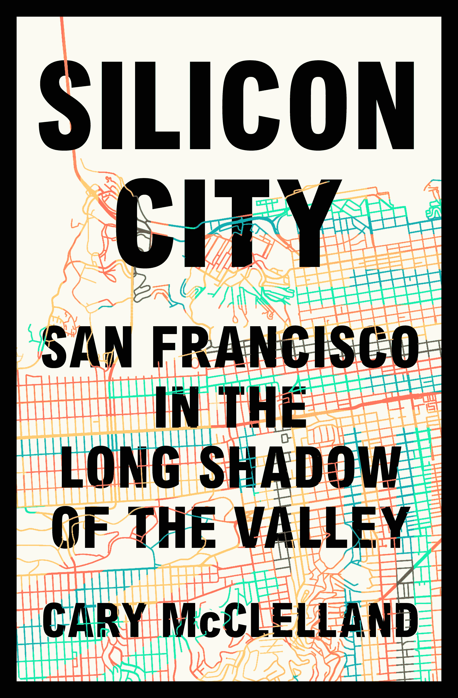

# “硅城”探索科技资金如何改变旧金山

> 原文：<https://thenewstack.io/silicon-city-explores-how-tech-money-changed-san-francisco/>

卡里·麦克莱兰的《硅谷:硅谷长长阴影下的旧金山》讲述了人们的心声，每个人都分享了自己对这座城市的理解，就像是现在的 T2 的口述历史。

它很复杂，引人注目，它即将于 10 月 9 日出版，感觉像一个文化事件。在他的报道中，麦克莱兰在三藩市进行了一次非凡的冒险，进行了 150 多次采访。他把他们所有的声音聚集到一个特别的对话中，给我们的现代时代一个信息，这本书描述了“一个创造新未来的城市”

但是悬在书上是一个非常重要的问题。即使硅谷的资金威胁要赶走一直是这座城市核心的丰富多样性，旧金山还能保持自己的身份吗？“如果一个结合了人才、爱心和金钱的领域都找不到解决方案，那么谁能找到呢？”

卡里·麦克莱兰的《硅谷:硅谷长长阴影下的旧金山》

这本书是全景式的，复杂的——并且惊人地平衡。硅谷传奇营销人 Regis McKenna 深情地谈到年轻的史蒂夫·沃兹尼亚克和史蒂夫·乔布斯去他办公室的日子。一名加州大学伯克利分校的学生承认，虽然她想做“变革推动者的事情”，但她担心会让家人失望，她补充说，“在校园里，在这个地区，加入科技行业的压力太大了。”

这本书包括一个古董街机运营商，他坚持认为“技术是一种时尚，它将会消失……所以让他们玩他们的新玩具，让他们变得陈旧和无聊。”码头工人莱曼·霍林斯(Lyman Hollins)说，当地的黑人教堂现在收到了来自最近移民的噪音投诉。比尔·费舍尔(Bill Fisher)经营着他从父亲那里继承的典当行业务——他自己的儿子在教会的商店里工作，有时甚至是他的孙子——他说他很同情那些“被房东赶走”的家庭。

但是尽管旧金山面临着挑战，许多在“硅城”接受采访的人仍然保持着令人惊讶的希望。德裔纹身艺术家 Idexa 十几岁时从洛杉矶搭便车来到这座城市，他说，尽管今天出现了新的流离失所，“它也很美。已经有大量的资金投入到社区和建筑中。那些可能会倒塌的建筑已经被翻新了。*哦，世界末日快到了。*我们不是第一代这样想的人。”

卡里·麦克莱兰

这是一幅近乎诗意的旧金山图景，证明了这个世界并不像人们通常认为的那样简单——或者令人沮丧，这本书充满激情的目的似乎自然而然地融入了每个采访对象的话语中。

“除非你站在某人面前，用你自己的耳朵听他们说话，否则你永远也不会理解他们，”加利福尼亚最近一次野火的幸存者说。

因此，麦克莱兰听从了，在他的介绍中写道“这本书要求我们听到该地区齐声说话。”

他导演了一部关于巴基斯坦的纪录片(和两部短片)。似乎有一个共同的主题——展示一种文化并给予它发言权是解决问题的第一步。

周四，就在他期待已久的新书发布前几天，我们采访了他。

### 这本书几乎是一部没有胶片的纪录片。

这就是我的看法。你可以用一本书和一台录音机来进行大规模的拍摄，比我在电影中所能做的要多得多。你不能在他们的客厅里设置一个怪物，盯着他们，仔细检查你所说的一切。所以有一种方式让对话感觉更自然、更亲密。更像是朋友和家人之间的交谈，而不是在一些镜头采访中的感觉。

### **Kirkus 评论称你的书“[坚定地继承了 Studs Terkel 的传统](https://www.kirkusreviews.com/book-reviews/cary-mcclelland/silicon-city/)对工人阶级生活的第一人称探索”和“对流行的城市研究的坚实贡献”当你把这本书拼在一起的时候，你有没有感觉到 Studs Terkel 在你身上若隐若现？**

他是个英雄，我永远做不到他那样。但是他——如果我能从他那里得到任何指导的话，那就是你把自己安置在某个地方，然后*听着*。找到一种方法，让倾听的行为有效地呈现一个比你开始时更能被充分理解的世界。

### **你的大部分家人(包括你的父母)都在加州生活，你在湾区度过了很多成长时光，然后回到斯坦福大学接受研究生教育。但是是什么让你想写这本书呢？最终是什么点燃了火花？**

我一生中的大部分时间都是在讲某种故事。在高中，我以写小说和当演员的形式出现，在大学，我以写剧本和当导演的形式出现。当我离开大学时，我非常想成为一名戏剧导演和电影导演。目标是通过确保人们能够通过视频或其他形式的讲故事实时感受到这些故事，从而揭露重要的侵权行为。在某一点上，你还想做更多的工作。

### 你在旧金山遇见了你的妻子。这对你的书有影响吗？

我认为，从很多方面来说，我们的婚姻有助于将这本书持续地建立在人们生活的情感体验上，并建立在我们的采访基础上——对他们个人经历的非常私人和亲密的反映。这本书的目标是反映人们的主观观点，他们的经历——活生生的、发自内心的、情感的、亲密的。客厅体验…

我认为现在观察旧金山的有用之处在于，我们能够实时观察这种以闪电般速度发生的变化。我们正看着它发生在可以说是这个时代的巨大经济引擎中，造福了如此之多的人。希望旧金山以外的读者在看到这本书时，会发现这本书与他们身边的人物、故事和经历相呼应，激发了同等的自省和参与行为，这在纽约、西雅图、芝加哥和洛杉矶都是必要的。

### 当你开始面试别人时，你看到了什么？

来到这座城市，你会有一种简单的冲动，在这里，你几乎立刻就会看到，流行的叙事正变得更像是一个双城记:对于那些拥抱了旧金山一个半世纪或两个世纪以来所体现的一切精华的科技界人士来说，未来是无限的，而对于许多社区来说，他们觉得自己曾努力建设的旧金山似乎不再有他们的空间。

同样明显的是，这两个城市比人们通常想象的要复杂得多。我不认为旧金山正在经历的事情可以很容易地被拖入技术二分法。经济和社会力量把每个人都逼到了一个他们觉得无处可去的角落。我认为这本书的目标是帮助我们看到每个人，无论你是坐在技术的顶端，无论你是作为一名程序员在努力工作，无论你是在创新未来的技术，无论你是在开出租车还是在学校教书，都已经在那里生活了几十年或刚刚到达——你看到了问题。

每个人都在试图找到一种贡献的方式。这本书的目的是展示每个人在共同的斗争中团结在一起，但往往对他们的经历是如何相互关联视而不见。

### **你会对你的书的潜在读者说些什么？** 

虽然它深入探讨了旧金山和湾区目前的核心问题，但也有一封给这座城市的真正的情书。

在每次采访中，我总是听到和听到的是，每个人都热情地关心这座城市。他们搬到了旧金山，或者他们的家庭搬到了旧金山。很少有人是从那里*来的。大多数人都有一个故事，或者他们的父母或祖父母有一个关于他们如何来到那里的故事，这个故事，无论是什么故事，都是非常一致的。你听到的故事是，当他们到达时，他们看到了无限的地平线去探索和征服。*

我想起了其中的一个人，卡伦·库索利托，她是一个艺术家，来到湾区，讲述了她第一次站在悬崖上俯瞰太平洋的故事，她意识到那里的风景比她以前见过的任何东西都要大，她可以呼吸到比她以前呼吸过的任何空气都更干净、更纯净的空气。我想这是我们都经历过的事情。所以希望这给了我们很多东西去保存，并让其他人有可能保存。

### 你从这个项目中学到了什么？

作为口述历史学家的挑战在于，你的工作是认真倾听，尽可能清晰有力地表达人们的观点。因此，在这个项目中，我有意识地避免一种傲慢，试图将我的理想解决方案的想法映射到一个如此庞大而复杂的问题上。这本书的问题是美国的问题和大量财富的问题，改变对工作、家庭和持久性的看法，改变对合法性和尊严的看法——所有这些都在汤里，在混合物里，没有一本书能够明确地开出药方来治疗正在发生的事情。

我所看到的不仅仅是这本书的贡献和希望，还有我所听到的声音，是一种渴望，渴望这座城市能够保持它的能力，成为一个地方，使这个国家所能提供的最必要的正义和机会的理念成为可能。对我来说，有些故事反映了这一点。一对夫妇收留了一个移民家庭，以使他们在美国的地位合法化，并使他们在旧金山的生活成为可能。这个故事不仅在很多方面让人觉得是典型的旧金山。它还显示了如何前进。如果有的话，这种精神是我希望这本书激励其他人的……从那里，我认为我们可以开始衡量问题的大小，并一起讨论如何建立我们真正需要的规模，以实现任何真正的变化。

<svg xmlns:xlink="http://www.w3.org/1999/xlink" viewBox="0 0 68 31" version="1.1"><title>Group</title> <desc>Created with Sketch.</desc></svg>