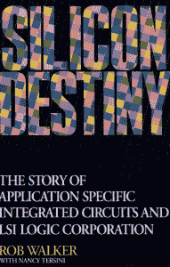
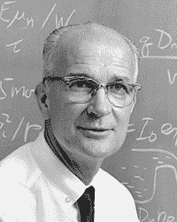

# 硅的起源:斯坦福的半导体工业口述历史

> 原文：<https://thenewstack.io/silicon-genesis-stanfords-oral-histories-of-the-semiconductor-industry/>

一个始于 1995 年但仍在继续的项目，正在与新一代极客在线分享硅谷的历史。斯坦福大学的“[硅的起源](https://exhibits.stanford.edu/silicongenesis/)”收集了 100 多段口述历史和对硅谷半导体产业创始人的采访。

该网站的“[关于](https://exhibits.stanford.edu/silicongenesis/about/about-silicon-genesis)”页面首先感谢建造了世界上第一个商业化硅晶体管的工程师团队。在威廉姆·肖克利(1956 年诺贝尔物理学奖获得者)的带领下，这群工程师“分散在山谷各处，追寻他们的想法”，包括由创立飞兆半导体的罗伯特·诺伊斯博士领导的八名肖克利关键员工。

四十年后，“硅的起源”的灵感来自 Rob Walker，他是 Fairchild 和 Intel 的校友(也是 LSI Logic 的创始人之一)。

“罗布认识到，如果这些先驱的非凡故事没有被捕获，以利于未来的公众访问，它们将被披露和永远丢失，”该网站指出。

## 先驱者的故事

从 1995 年开始，沃克开始与斯坦福大学图书馆的硅谷档案馆合作，记录口述历史——但他已经开始积极参与文化保护。1992 年，沃克写了“[硅的命运:专用集成电路和 LSI 逻辑公司的故事](https://books.google.com/books?id=XA9Zx1bMH-oC&printsec=frontcover#v=onepage&q&f=false)”沃克的书承认“所有同意讲述 ASICs 现象故事的行业资深人士”，称他们的话是“这本书的核心”。

Walker [与斯坦福图书馆的特殊收藏部门分享了他的采访和文献](https://searchworks.stanford.edu/view/4084241)，Silicon Genesis 是“Rob 记录硅谷半导体行业历史的努力的延伸”该项目的网站还指出，在接下来的 17 年里，从 1995 年到 2012 年——直到他 78 岁——罗布是他们的首席采访者。

您还可以访问“ [the Rob Walker papers](https://searchworks.stanford.edu/view/4084161) ”，其中包括飞兆半导体的手册和会议记录(以及研究材料和其他文件)，加上 LSI Logic 的材料，甚至是 20 世纪 60 年代 Walker 在 Lawrence Livermore Laboratories 的研究数据。

沃克在他 1992 年的书中写道，鲍勃·诺伊斯的去世“让我们所有人意识到了我们的死亡……硅谷的先驱们现在已经五六十岁了；我们最好趁还能讲的时候，把我们的故事讲出来。”沃克想收集口述历史，他记得在[2005 年的公告](https://news.stanford.edu/pr/2005/pr-fairchild-030905.html),“当我发现斯坦福也有同样的想法时，我欣喜若狂，于是我们开始了合作”

亨利·罗沃德，图书馆系统的科学和技术收藏的历史馆长，补充说，沃克“可以接触到很多人，可以用一种历史学家不能的方式和他们交谈。”

该公告还指出，该项目也得到了半导体行业协会的一些支持。

## 历史的一瞥

那么收藏品中有什么呢？有一些有趣的现象可以说明是什么激发了这些影响深远的人物。在 2011 年对东芝董事 Tsuyoshi Kawanishi 的采访中，Walker 回忆起 1981 年 LSI 和东芝是如何“共同努力改善他的日本大公司和我们的美国小公司的。”

还有一篇发人深省的 2007 年采访[张忠谋的文章，他是台湾半导体制造公司](https://exhibits.stanford.edu/silicongenesis/catalog/cy579mp7822)的创始人(前首席执行官)，该公司是世界上第一家也是最大的硅代工厂。常(音译)还记得他移居美国前在中国的头 18 年，“战争、贫困、不公正……在一个社会不公正的环境中，充满了怨恨和仇恨。对我个人来说，我需要努力学习，然后努力工作。并希望会有和平。”

> “如果没有谢尔曼·费尔柴尔德，我想我们可能已经放弃了，也许硅谷就不会有硅了”——阿瑟·罗克

但是最引人注目的记录之一是 2007 年举行的“飞兆半导体 50 周年纪念座谈会”。首先是约翰·汉尼斯的介绍，他当时是斯坦福大学的校长，也是计算机历史博物馆的研究员(也是 MIPS 的最初创始人之一，也是谷歌母公司 alphabet Inc .的未来董事长)。上台后，轩尼诗介绍了飞兆半导体最初创始团队的三名成员:朱利叶斯·布兰克(Julius Blank)，他“在飞兆负责晶圆厂”，杰伊·拉斯特(Jay Last)，他负责生产第一个集成电路的团队，以及戈登·摩尔，他负责飞兆的 R & D 团队(1968 年离开后与鲍勃·诺伊斯共同创立了英特尔)。

出席的还有亚瑟·洛克，他是 1957 年刚毕业的哈佛工商管理硕士，在飞兆的资助中起了“重要作用”。轩尼诗指出，洛克继续资助硅谷第一批风险投资公司之一，“后来成为苹果和英特尔的早期投资者和董事会成员。”

12/2/1965
威廉·b·肖克利，诺贝尔物理学奖获得者

轩尼诗告诉观众，早在 1957 年，圣克拉拉还是一个人口不到 50 万的大部分是农村的县，它的昵称仍然是“心之欢乐谷”。但是历史即将发生。“威廉姆·肖克利是一位伟大的科学家和理论家，但很明显，他是一位糟糕的管理者。正是这后一个特点导致八名同事，现在称为飞兆半导体八人组，于 1957 年离开肖克利半导体公司，成立飞兆半导体公司。肖克利称他们为“叛逆八人组”

主持人莱斯利·柏林(斯坦福大学博士，鲍勃·诺伊斯的传记作者)询问了一些个人见解:“你是如何鼓起勇气创办自己的公司的？”戈登·摩尔记得这是唯一的选择，并补充说“坦白地说，这比出去找另一份工作要容易得多。”但他对两位银行家给予了很大的信任，他们的早期信任被证明是至关重要的——亚瑟·罗克和巴德·科伊尔。“然而，如果没有我们得到的鼓励，以及来自纽约的融资，我不认为我们会成功，因为当时没有风险资本。”

洛克还告诉观众，当他向团队投资时，他被 35 家公司拒绝了——但最终，他的坚持得到了回报，有人建议他与发明家谢尔曼·费尔柴尔德谈谈。“如果没有谢尔曼，我想我们可能已经放弃了，也许硅谷就不会有硅了。”

1957 年 10 月，飞兆获得了 IBM 的第一份订单，并于 1958 年 8 月发货。“与此同时，”朱利叶斯·布兰克回忆道，“我们必须在十个月内建造一栋大楼，装备一个工厂，购买设备，发明产品，发明工艺，学习如何测试，虚拟制造和运输。”

他们也发展到 60 名员工——但是听他们说话，你会觉得那是一个非常独特的时刻。

戈登·摩尔认为那个时期创造了一个仍然经常被忽视的遗产:

*我们必须开发所有的基本流程，这些流程至今仍在使用。我们是第一个使用平版印刷术在晶体管中印刷半导体器件的人。我们把核聚变作为我们的生产过程；之前只在实验室里做过。在那段时间里，我们不得不做所有这些事情，这些都是所有这些衍生公司在该地区成立公司时所做的零碎事情。因此，我认为这一系列技术和零零碎碎的东西是飞兆半导体做出的最重要贡献之一。*

Silicon Genesis 也有一套名为“[仙童编年史](https://exhibits.stanford.edu/silicongenesis/catalog/xk947bx3871)的采访视频，这是一部由罗布·沃克制作的三小时纪录片。他告诉《西雅图时报》,总有一天人们会对那个历史时刻感到好奇——“总有一天能看到是谁引发了这场革命，这将是一件好事。”

早在 2002 年，洛克也曾因《硅的起源》而单独接受采访；1995 年，戈登·摩尔接受采访。沃克本人甚至在 1998 年分享了一些回忆[。](https://exhibits.stanford.edu/silicongenesis/catalog/xx390qp9435)

“对我来说，人们在采访记录中所说的事情是非凡的，”洛伍德在 2005 年的声明中说，“这是一座金矿。我们这里有几篇论文广泛使用了它。”北卡罗来纳州立大学的罗斯·巴塞特在《走向数字时代:研究实验室、初创公司和 MOS 技术的兴起》一书中引用了这些采访。

巴塞特说，这些采访“真实地再现了硅谷的历史。”

* * *

# WebReduce

特色图片:硅谷朝南朝向圣何塞市中心，2014 年，酷凯撒通过维基百科，知识共享。

<svg xmlns:xlink="http://www.w3.org/1999/xlink" viewBox="0 0 68 31" version="1.1"><title>Group</title> <desc>Created with Sketch.</desc></svg>