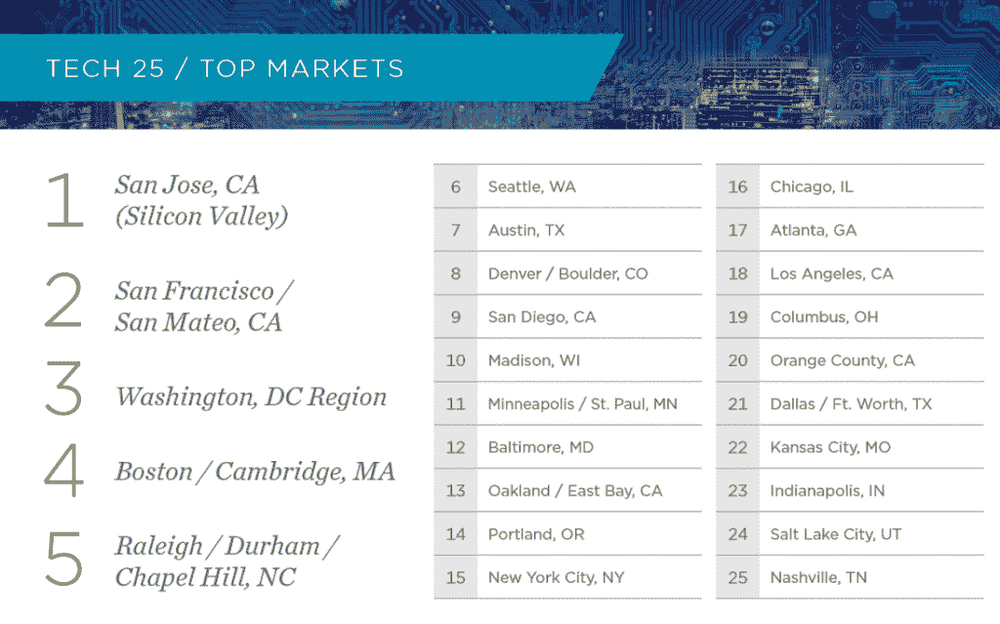

# 硅沼泽？报告确定了美国最有前途的科技城市

> 原文：<https://thenewstack.io/silicon-swamp-report-identifies-americas-top-coming-tech-cities/>

本月早些时候，世界上最大的房地产公司之一大肆宣扬一些令人惊讶的消息，这些消息是关于硅谷以外的美国最佳替代技术地点的。硅谷之外的顶级地点？华盛顿特区

总部位于芝加哥的商业房地产服务公司 Cushman & Wakefield 报道称，“华盛顿特区已经成为继圣何塞和旧金山之后最有前途的科技城市中心。”。

这是该公司新报告《科技城市 1.0》(Tech Cities 1.0)的第一版，该报告旨在确定美国最有前途的 25 个科技中心，并称赞华盛顿特区是“寻求接近政策制定者的科技公司以及蓬勃发展的网络安全投资的重要前哨。”(尽管[实际上不是建在沼泽之上](https://www.citylab.com/politics/2017/03/was-washington-dc-really-a-swamp/519003/)，华盛顿特区在夏天确实有相当多沼泽的天气，这一点那些从气候较温和的三藩市迁徙过来的人可能要记住)。

那么，是什么让某个地方成为顶级科技城市呢？据这家房地产公司称，房地产正迅速成为首要因素。但是科技人才的板凳深度也有很大影响。

Cushman & Wakefield 分析了它认为的最佳指标——“组成科技大杂烩的关键成分”——包括科技人才和资本的可用性。其他因素包括至少拥有学士学位的工人比例，以及千禧一代在人口中的比例。

有趣的是，西雅图仅排在第六位，落后于波士顿/马萨诸塞州剑桥和罗利/达勒姆/教堂山(分别排在第四和第五位)。

“在过去的几年里，西雅图一直在迎头赶上，”该报告的作者之一、[罗伯特·萨蒙斯](https://twitter.com/rsammonsre)说。“但随着住房建设现在超过湾区，以及最近在投票箱通过的 540 亿美元的巨大交通倡议，这可能会使它与这些市场在列表的顶端进行更积极的竞争。”

萨蒙斯认为，湾区众所周知的高房价——以及公共交通问题——也在帮助其他城市吸引科技产业的份额，包括奥斯汀、丹佛和圣地亚哥(其报告分别将它们列为美国第七、第八和第九大科技城市)，甚至是排名第 24 的盐湖城。

“随着沿海城市，包括旧金山、纽约(排名第 15)和波士顿(排名第 4)变得越来越昂贵，难以以可承受的成本进行扩张，科技公司越来越依赖丹佛这样的中小市场来增加劳动力，招聘和留住受过教育的人才，并降低管理成本，”该公司的一位执行董事总经理向丹佛商业杂志解释道[。尽管科技公司的公司总部可能在其他地方，“我们继续看到更大、更成熟的公司在丹佛开设办事处，包括谷歌、苹果和亚马逊。”](http://crej.com/news/cushman-wakefield-report-puts-denver-no-8-among-tech-cities-according/)

【T2

高纬物业并不是唯一一家发布榜单的房地产公司。去年夏天，收入达 110 亿美元的全球最大房地产投资管理公司世邦魏理仕集团(CBRE Group)计算出了美国和加拿大的最佳科技人才市场——定义为“吸引、发展和留住科技人才库的能力”。这项分析使用了 13 个指标，包括住房成本和工资。有趣的是，我们可以看到不同的结果，以及没有不同的结果。

世邦魏理仕集团仍然选择了这两个城市作为榜单的第一名，尽管将旧金山和圣何塞归为“湾区”，这使得大都市地区的得分为 84.62 分，远远高于得分为 67.24 分的华盛顿特区。但 CBRE 认为，科技人才的下一个最佳市场是西雅图、纽约市和得克萨斯州的奥斯汀，其次是达拉斯/沃思堡地区。

在这份榜单上，北卡罗来纳州的罗利-达勒姆地区排名第七，波士顿排名第八。紧随其后的是亚特兰大、巴尔的摩，令人惊讶的是，亚利桑那州的凤凰城——一个甚至没有出现在高纬环球上周排名的前 25 名中的城市。

这两份榜单并不一定衡量相同的东西，它们也是用不同的指标来计算排名。但是像这样的列表的乐趣在于它暗示了隐藏的趋势——以及它们对周围地区的影响。

堪萨斯城商业杂志 上的一篇文章[指出，在圣何塞，知识工作者占劳动力的 27.4%，而全国平均水平仅为 4.81%。Cushman & Wakefield 的报告承认，科技公司来到纽约面临的大问题是“缺乏他们需要的熟练劳动力，特别是工程师”，以及最近对纽约大学科技教育的投资，这些投资应该会在未来产生回报。](http://www.bizjournals.com/kansascity/news/2017/06/08/guess-which-metro-ranks-with-silicon-valley-as.html)

但是，在高纬环球的榜单上，前 25 名科技城市中有 6 个城市的知识工作者排名低于平均水平——印第安纳波利斯、芝加哥、纽约、哥伦布、洛杉矶和纳什维尔。至少有一部分似乎是基于这样一个事实:这份报告使用的是工人的百分比，而不是工人的*数字*——这解释了为什么像波特兰、纽约、芝加哥、亚特兰大和洛杉矶这样的大城市最终分别排在榜单的第 14 到第 18 位。

“真的，洛杉矶排名的关键原因是巨大的市场规模，”萨蒙斯[向洛杉矶时报](http://www.latimes.com/business/technology/la-fi-tn-tech-cities-los-angeles-20170607-story.html)*解释道。“洛杉矶县的不同部门正在蔓延，人们更关注媒体和娱乐，所以科技有时会被卷入其中。”*

 *或者，正如报告所言，“洛杉矶是一个巨大的市场，它在不断扩张……”

这些列表的真正意义是什么？有两种方式来看待它。高纬物业堪萨斯城办事处的一名高级主管告诉当地商业杂志，好的技术机会“对业主、经纪人、餐馆和整个城市都是积极的。”

但是报道该榜单的商业期刊数量可能是它存在的另一个原因。我最近读了芭芭拉·科克兰的传记，她是电视节目《鲨鱼池》的投资者之一，她回忆起发布《纽约市房地产趋势》的科克兰报告——这是为房地产公司争取免费宣传的一个简单方法。

* * *

# WebReduce

<svg xmlns:xlink="http://www.w3.org/1999/xlink" viewBox="0 0 68 31" version="1.1"><title>Group</title> <desc>Created with Sketch.</desc></svg>*