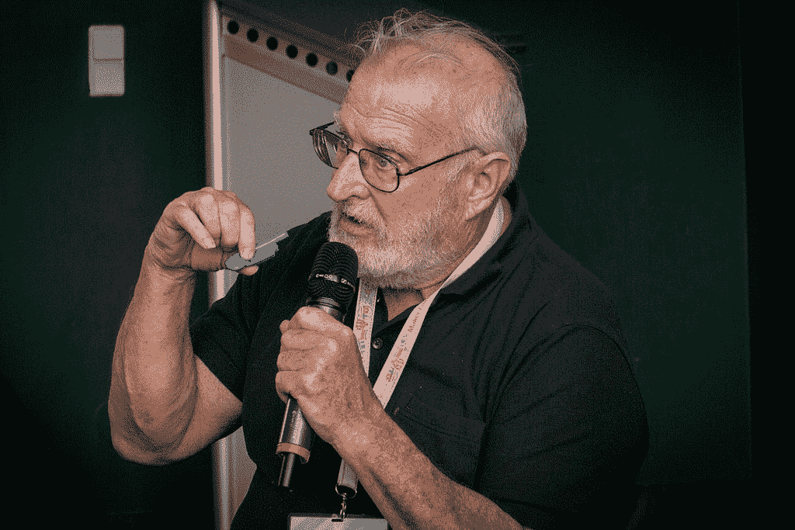

# 硅谷传奇“嘎吱船长”出版了他的人生故事

> 原文：<https://thenewstack.io/silicon-valley-legend-captain-crunch-publishes-life-story/>

如果不是现年 74 岁、被称为“危机船长”的前电话黑客约翰·德雷珀不断的技术好奇心，苹果公司今天可能不会存在。

现在，船长刚刚在 Kickstarter 上筹集了 26000 美元来出版他的传记。它承诺讲述一个“一个古怪的天才从一个身无分文的黑客变成百万富翁，然后又回来”的荒诞故事。德雷珀是一名黑客，“如此沉迷于自己的想象，以至于他周围的现实世界总是退居其次。”这本书的前言已经由他的老朋友、苹果联合创始人[史蒂夫·沃兹尼亚克](https://twitter.com/stevewoz)写好了，宣传活动的页面承诺了一次“[凯鲁亚克](https://www.goodreads.com/book/show/70401.On_the_Road)之旅”，它“让我们通过最有影响力的先驱之一的视角，深入了解现代计算的诞生。”这本书明年三月到期。

德雷珀的一生一直被认为是硅谷早期历史中最丰富多彩的故事之一。他因入侵电话公司而声名狼藉，而当时很少有人想到这样做的可能性。

“我是个逃犯，”德雷珀在他的 Kickstarter 页面上写道。“在 70 年代初，我找到了各种方法来黑进电话公司并获得免费通话。他笑着称他们为“十恶不赦的罪行”。"

根据《华尔街日报》的简介，德雷珀出生于二战期间，是一名美国空军工程师的儿子，到 1964 年，21 岁的约翰已经加入了空军，驻扎在阿拉斯加，他通过当地的电话总机帮助其他军人打免费电话。

但在他被解雇后，德雷珀很快就因偷工减料而获得了终身的恶名，即操纵一个臭名昭著的“蓝盒子”，它可以模仿控制整个美国电话系统的音调——有效地允许他向世界任何地方拨打免费电话。

在他即将出版的新书《the Daily Dot》的节选中，德雷珀分享了他在这款设备上工作的回忆——同时还和家人住在家里。“我真的需要离开我父母的房子。我母亲的唠叨没完没了，而我父亲只是坐在厨房里，一支接一支地抽烟，”他写道。他将第一个被盗电话打给了芝加哥的一名接线员，他的传记最终捕捉到了历史上那一刻的所有细节，当时德雷珀第一次感受到了成功的眩晕。

“我在房子里跑来跑去，喊着‘成功了，成功了，成功了！’

“我爸爸让我安静下来，我妈妈尖叫着让我安静下来，而*【我的兄弟】*罗恩只是站在那里挠着下巴。我不敢告诉他们任何人我实际上在做什么……我兴奋得几乎睡不着觉，当我睡着时，我做了一个惊人的梦，我控制了世界上所有的电话公司。”

“我有世界的钥匙，我知道这一点。”

德雷珀为预购他即将出版的书的人提供他的 bluebox 的复制品作为“赠品”。

德雷珀在 1971 年因他的工程学而出名，当时作家[罗恩·罗森鲍姆](https://twitter.com/RonRosenbaum1)在*时尚先生*中描述了这位年轻的黑客，该杂志将这篇文章吹捧为“一个如此不可思议的故事，甚至可能会让你为电话公司感到遗憾。”

文章“[小蓝盒子的秘密](http://classic.esquire.com/secrets-of-the-blue-box/)”激发了全世界无数修补匠的想象力，包括沃兹尼亚克，他记得，“我很想成为这个叛逆小东西的一部分。”因此，沃兹尼亚克和他的朋友史蒂夫·乔布斯设法会见了著名的电话窃听者，了解了他的秘密，并最终开始自己销售电话窃听硬件。

沃兹尼亚克和乔布斯都认为，如果没有德雷珀，苹果电脑可能永远不会出现。在 1994 年的一次采访中，乔布斯说这段经历给了他们两件事。首先，“我们有信心建造一些东西并让它发挥作用”——但其次，也许更重要的是，“一种魔力——我们可以影响世界。”

https://youtu.be/dxCNvNwl60s?t=10

当然，没有德雷珀的蓝盒子，第一台苹果电脑就不会出现，还有一个更具体的原因。“沃兹需要的初始资金来自销售，”德雷珀[在 Reddit](https://www.reddit.com/r/IAmA/comments/2hpje1/im_the_person_who_showed_steve_jobs_the_blue_box/?st=j9j6d7rp&sh=9e6c9cc3) 上写道，“这些钱用于布局和生产苹果 One 的印刷电路。”

但是当乔布斯和沃兹尼亚克在苹果公司取得巨大成功的时候，德雷珀却因为电话诈骗而锒铛入狱。

他从监狱释放后，“我是苹果电脑的先驱之一，”德雷珀在一段视频中说，“帮助推出了苹果 II。他甚至开发了调制解调器的早期版本，即电话接口板，它允许通过我们今天所知道的电话线传输数据。”但是根据 2008 年 Draper 的一次采访，那块板实际上从未上市，因为美国电话电报公司“太害怕了”。

2014 年的约翰·德雷珀

“因为一切都是在软件中完成的，所以电路板可能会有邪恶的想法，而你不想拥有一个有邪恶想法的电路板……有软件和正确的音调表，你可以将它变成一个蓝盒子。美国电话电报公司不希望这样。”

它本来可以提供 300 波特的速度——尽管 1200 波特的 DC·海斯调制解调器的出现很快就会使它过时。但至少德雷珀以一个有趣的故事结束了他在苹果的早期生活:“史蒂夫(沃兹尼亚克)修改了程序，一遍又一遍地拨打史蒂夫·乔布斯的家庭电话号码，并让它整夜运行。”

德雷珀的许多故事似乎都遵循着同样的模式,《侥幸逃脱》。“我还为 Apple II 编写了首字处理程序 EasyWriter，”德雷珀说。他在监狱牢房中写下了第一个设计[——因电话诈骗再次服刑。“我们复制光盘的速度赶不上销售，我还在监狱里，参加一个工作休假项目……”德雷珀在 Reddit 上回忆道。](http://www.nytimes.com/2001/01/29/business/the-odyssey-of-a-hacker-from-outlaw-to-consultant.html)

“他们会让我在非常严密的监督下在白天去办公室，在回监狱之前，我会打印一份源代码的新副本(在 FORTH 中)，并在晚上研究和修改代码。”

德雷珀还声称他“抢先了比尔·盖茨一步”——具体来说，就是在将 EasyWriter 移植到 IBM 个人电脑的竞赛中击败了年轻的比尔·盖茨。尽管在他的 Reddit 露面时，德雷珀也断言，后来他因为“与我的出版商的不正当交易”而失去了这部作品的版税。

但是德雷珀后来成为了一个传奇人物。“对于许多小打小闹的年轻程序员和互联网活动家来说，德雷珀仍然被认为是一个民间英雄，”[在《每日邮报》的一篇新简介中断言。“在过去的十年里，他周游世界，讲述自己的故事，公开谈论电信、网络隐私和加密方面的安全缺陷。”](https://www.dailydot.com/layer8/john-draper-captain-crunch/)

到 2014 年，他经历了一系列健康问题，包括几次脊椎退行性疾病手术——其中一次持续了九个多小时——在麻醉期间，他还遭受了心脏骤停。这导致了一个月的住院和漫长的康复计划。“保险公司支付了大部分费用，但[我]了解到，我康复所需的许多物品都不在保险范围内，而且相当昂贵，”德雷珀在 Reddit 上发布道。

尽管如此，他的粉丝们还是支持他。“在今年的 DefCon 期间，寻宝游戏的参赛者写了一张大的‘康复’卡，并在医院里交给了我。”

但事情并没有就此结束，一项在线活动[很快筹集了 17062 美元](https://www.qikfunder.com/crowdfund/help-john-draper-captain-crunch)。“德雷珀本人甚至不知道是谁发起了这次募捐，”[报道*Ars Technica*，“但是这笔钱是用来帮助他支付医疗费用的。”](https://arstechnica.com/information-technology/2014/09/fans-raise-cash-to-help-phone-phreaker-john-draper-aka-capn-crunch/)

[https://www.youtube.com/embed/0ZgnRiCF_sI?feature=oembed](https://www.youtube.com/embed/0ZgnRiCF_sI?feature=oembed)

视频

当然，在整个经历中，他仍然是那个不可抑制的黑客。在医院的时候，“他们在我身上绑了一根告密线，所以如果我离开轮椅，它就会爆炸，护士就会跑过来，”约翰当时写道。

“我知道如何让它失效……”他补充道，“但我决定不去干扰它。”

* * *

# WebReduce

<svg xmlns:xlink="http://www.w3.org/1999/xlink" viewBox="0 0 68 31" version="1.1"><title>Group</title> <desc>Created with Sketch.</desc></svg>