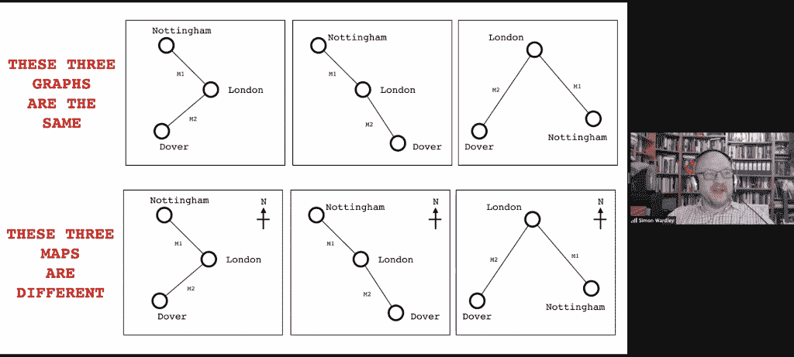
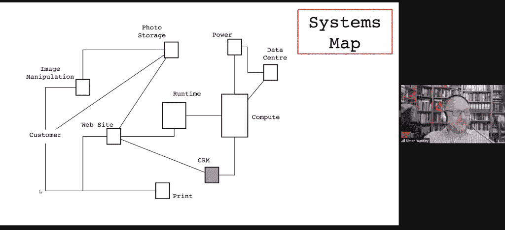
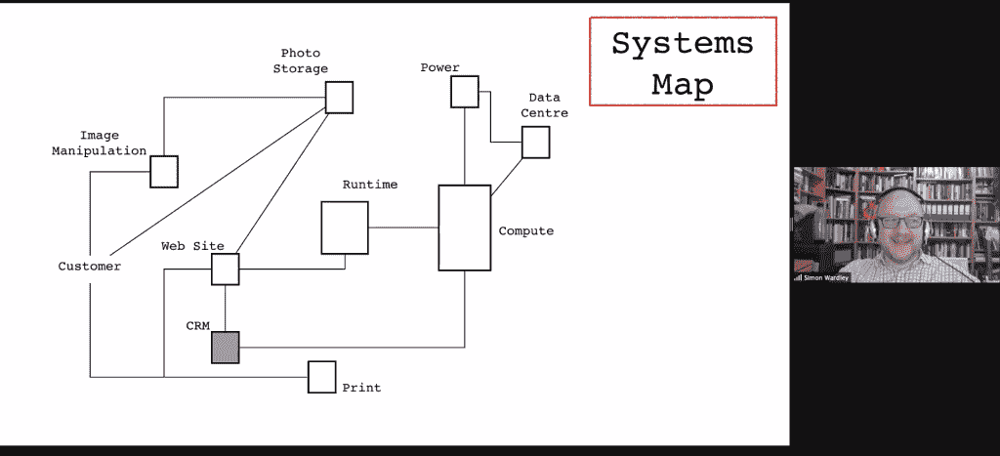
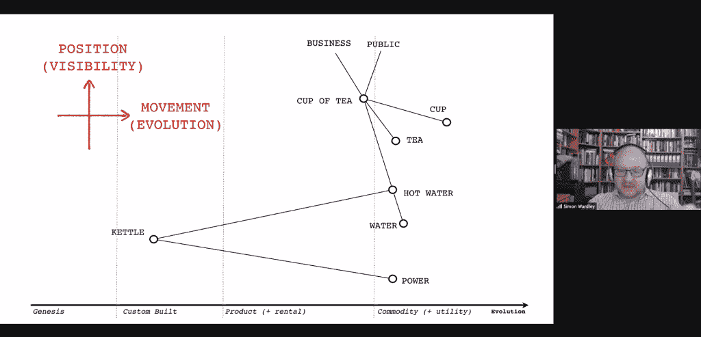
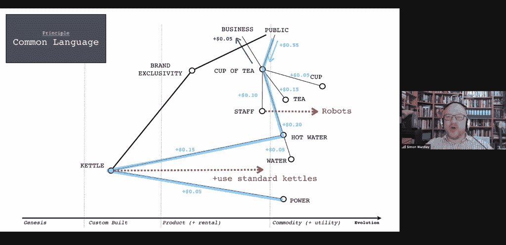
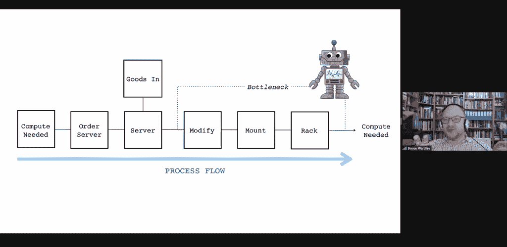
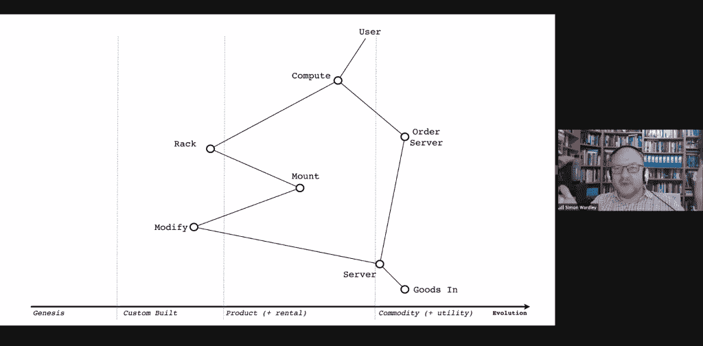
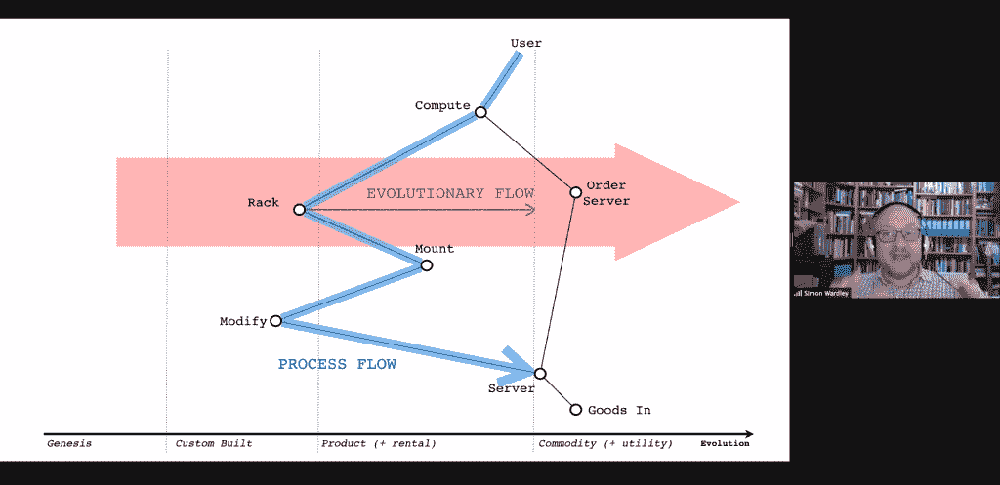
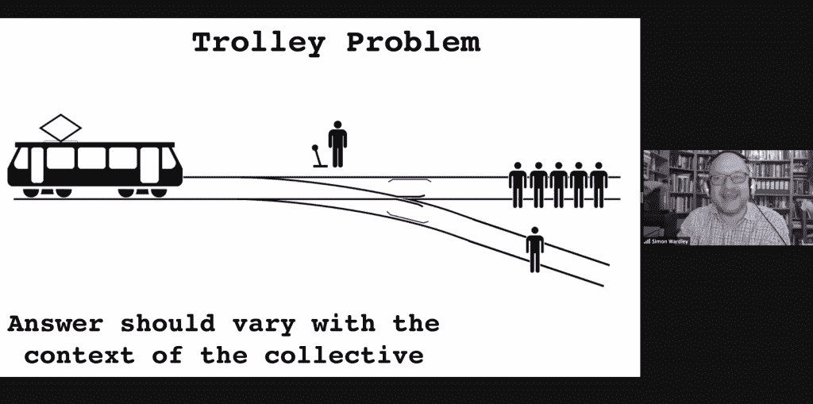

# 西蒙·沃德利论映射我们通向共同语言的道路

> 原文：<https://thenewstack.io/simon-wardley-on-mapping-our-way-to-a-common-language/>

西蒙·沃德利(Simon Wardley)是[前沿论坛](https://leadingedgeforum.com/)的技术和商业文化研究员，他的工作是发现变化的信号。他最出名的是他将“T4”沃德利地图应用于商业和全球问题。

我们与英国人讨论了地图到底是什么——相对于他们的冒名顶替者:图表——以及为什么它们被应用于复杂的问题，从云中的分布式系统到节省数十亿美元的成本到[气候紧急事件](https://learnwardleymapping.com/home-deprecated/climate/)再到联合国的每一个可持续发展目标。

地图非常有效地将我们所有人集中在一个方向，并澄清意义和语言的细微差别，这样我们就可以解开模式。也许他们也对人类讲故事的习惯进行了一些检查。我们和沃德利谈过了，想了解更多情况。

**新堆栈:您是如何开发沃德利地图的，这是如何演变成一场运动的？**

**西蒙·沃德利**:我曾经经营过一家名为[福坦戈](https://www.mbejda.com/how-a-camera-company-started-the-serverless-revolution-then-killed-it/)的公司。我们有才华横溢的工程师和其他一切，但我的主管完全一无所知。随着时间的推移，我意识到问题的一部分在于我根本无法感知我的风景。

如果你回到孙子的《孙子兵法》中，“你有目标，有道德义务，你需要了解你的风景，你甚至需要了解它是如何变化的，游戏规则，天堂的气候模式。然后你进入组织原则，学说，然后你进入领导。

孙子谈到了五个重要的因素:

1.  **目的** /道德命令
2.  **景观**(即情境意识)
3.  **气候**(即变化的模式、游戏规则)
4.  **学说**(即组织原则)
5.  **领导力**(即游戏性)

最基本的事情是:了解你的风景。我不了解我的风景。我没有地图。我有很多图表。事实上，商业中大多数我们称之为地图的东西都是图形。它们实际上不是地图。所以我不得不创造一种映射的方式。我从 2005 年开始使用它。

后来，我和我的一个朋友[马克·舒托沃尔斯](https://www.linkedin.com/in/mark-shuttleworth/)，在[Ubuntu](https://ubuntu.com/)【Linux 上开源操作系统的发行商】的首席执行官一起，为一家名为 [Canonical](https://canonical.com/) 的公司管理战略。我用它来[规划云空间](https://powermaps.net/ubuntu)，我们在 18 个月内从操作系统市场的 2-3%增长到云市场的 70%。它花了我们大约 50 万美元。

然后，我和其他人一起写了一篇名为[“更好更少”的论文](https://ntouk.files.wordpress.com/2015/06/better-for-less-1.pdf)[副标题:“如何让政府 IT 实现节约”]这导致了英国政府的转型，帮助创建了一个名为[支出控制](https://blog.gardeviance.org/2016/05/stopping-self-harm-in-corporate-it.html)的东西，并帮助支持了一个名为 [GDS](https://www.gov.uk/government/organisations/government-digital-service) 【英国政府数字服务】的东西，当时所有的在线公共服务都在 2011 年“默认数字化”。]

大约就在那个时候，我在 2011 年开始发现，实际上，人们并没有在 MBA 学习如何绘制地图。他们没有地图。就像，嗯，你是怎么做决定的？结果大部分是运气或者模仿别人——67%的将军会炸山，所以炸山吧。或者 67%的将军在做人工智能、大数据或区块链——“哦，看，他们在做，我们也应该做。”

所以它就是从那里长出来的。事实证明，观察你的环境是一件非常有用的事情。

为什么是地图而不是图表？有什么区别？ ***【注:这里沃德利开始屏幕分享很多地图，会撒在各处。】***

人们喜欢一直谈论地图，因为地图唤起了这种战略思想。但实际上我们主要拥有的是图表。

顶部的这三个图像都是图表，它们都是相同的。所以这是三个不同的地方——诺丁汉、伦敦、多佛，由 M1 和 M2 两条路连接。这不是特别准确，但它们是三个相同的图形，而底部的三个图像完全不同。因为它们是地图。图形和地图的根本区别在于，在地图中，空间是有意义的。如果你在地图上移动一个棋子，它会改变意思。

有点像地理地图。如果我移动，比如说，澳大利亚，把它放在英格兰旁边，这显然改变了背景，地图的意义。但对于很多我们在商业中称之为地图的东西来说，情况并非如此。

让我们移动 CRM。

地图怎么变了？它没有。因为这不是地图。这是一个图表。几乎所有我们在商业中称之为地图的东西——价值流图、系统图、思维导图——都很棒，非常有用，但没有一个是地图。它们都是图表。

如果你试图探索一个景观，并从中学习模式，有一张地图真的很有用。但是我们的地图不是地图，我们有的是图表。所以学习模式和其他东西变得非常困难。

> "在地图上，空间有意义。"

西蒙·沃德利

如果你想创建一个地图，你需要三个基本特征:

*   锚或磁北
*   棋子的位置(即:北、南、东、西和距离)
*   运动的一致性

这是我 2005 年开始的地方。我想泡一杯茶。我打算选两个——消费茶的大众和卖茶的商家。他们是我的锚。公众需要一杯茶，企业需要卖一杯茶。

现在，这杯茶需要什么？它需要茶，杯子，热水，热水需要水壶，水壶需要冷水。所以我得到的是一个需求链，我越往下走，对我来说越不可见。因此，如果我是公众中的一员，我正在购买我的一杯茶，加热水壶的电源是在很远的地方——所以这给了你距离的概念。所以现在我有了锚和位置。

我需要运动。事实证明，所有这些都是资本的进化形式。你可以映射物理事物，你可以映射数据实践，甚至像道德价值观这样的东西，但这些都是资本的形式。事实证明，资本发展有一个共同的模式。这是一张地图。

了解细节:“为什么会这样？我不知道为什么它会在那里。”因为别人能看出你错过了什么。

“你缺人手。”“我们不需要员工。我们想要机器人。”

“为什么我们不用标准水壶？”“我们只使用品牌。”

然后其他人可以把指标放在那里，这样我们就可以计算利润和损失。但关键是，不管你是营销、商业、金融还是工程，我们都有共同的语言，可以谈论相同的环境。

这是大约十年前的。这是一家保险公司的流程图。他们在修改服务器方面遇到了瓶颈，所以他们想出了一个投资机器人的计划——大约 1000 万英镑左右的资本投资——投资机器人来消除这个瓶颈，以改善他们的流程。听起来很明智。我们花了六个月的时间来做这件事，看了所有供应商的 RFP，他们得到了他们的投资回报、计算和其他一切。

但是现在他们让我看一看。问题是，我不能“你为什么要投资机器人？”因为他们编造了一个大故事来解释他们为什么要这么做。故事的问题是——正如我们告诉每个人的——要成为一个好的领导者，你必须是一个伟大的讲故事者。也就是说，你的想法没有成功是因为你用错误的方式推销。这意味着当你质疑任何人的故事时，你实际上是在说“你是一个糟糕的故事讲述者。”你在挑战他们，这意味着它很快变得高度政治化。所以我不能出现并说‘你为什么要做机器人’因为防御上升了。

所以我说，“你能不能快速地把这个画出来？”

所以我对他们说，“为什么要有机架式和定制的服务器？”“嗯，我们让这家公司建造了我们自己的机架。”

"那么你给服务器做了什么药？"“它们不适合我们的机架，所以我们必须取下机箱，钻新的孔，添加新的板，以便让它们适合我们的机架。这就是你需要机器人的地方。”

房间里有人问，“为什么我们不用标准机架？”

现在，这里的问题是这些人并不愚蠢。他们非常非常聪明。但是他们被故事所困，被他们生活的环境所困，因为他们看不到环境。所以他们正在做的是优化流程，这会让你想到“让我们花 1000 万在机器人上”，但实际上他们想做的是首先关注进化流程:事情是进化的。它不再是定制的，它更像是一种商品。

我们已经看到很多人犯了这样的错误。比如像云，比如计算机从产品到实用的转变。令人惊讶的是，有那么多人决定自己动手建造。

你只是从中学习基本的伙伴。它总是非常壮观。在政府方面，我们估计将节省大约 15 亿英镑[约 20.7 亿美元]。它所做的一切都来自于使用地图。

**你的地图社区中最疯狂的用例是什么？**

一个是打击非法捕鱼和奴隶制。一个是与联合国一起关注[全球贫困](https://www.infoq.com/presentations/interview-wardley-maps/)。它一直深入到各个国家的统计组织，因为像全天候道路这样的事情真的很重要。全天候道路我们用于从人们到他们工作的任何地方的转换，所以我们需要知道所有全天候道路在哪里。每个不同的国家都有自己的国家统计机构收集这方面的信息，但他们都是以完全习惯的方式进行的，这很正常。事实上，他们数据平台上的[联合国书](https://www.amazon.co.uk/Platform-Handbook-Information-Technology-Strategy/dp/1913805255/ref=sr_1_3?dchild=1&qid=1628170443&refinements=p_27:Simon+Wardley&s=books&sr=1-3&text=Simon+Wardley)也全是地图。

皇家国家救生艇协会慈善机构，詹姆斯·芬利做了一些工作，减少了他的交流时间。地图帮助了他，所以拯救了生命。

NASA 卫星上有碳地图[[用来精确定位甲烷和二氧化碳排放物。]](https://www.planet.com/pulse/carbon-mapper-launches-satellite-program-to-pinpoint-methane-and-co2-super-emitters/)

很高兴听到人们发现它们在这些不同的领域很有用。但是关于地图的主要事情是，它们是空间的不完美的表现——即使是地理地图也是不完美的。如果你想要一张完美的地图，比如说法国的地图，那它必须是 1:1 的比例，也就是说它的面积相当于法国的大小，也就是说它是法国的，因此它是没有用的。

他们都不完美。而且都是模特。这个是基于进化的——所有的模型都是错的。它们并不完美，也是错误的，但它们往往对我们挑战事物和讨论事物非常有用。

**先说地图营社区，从 2017 年的一条推文开始。下一次地图营将于 2021 年 10 月 13 日举行。社区是如何形成和发展的？**

我做了所有的[知识共享](https://learnwardleymapping.com/)【开源】——那里有大约 600 页的书。现在有一个完整的社区。我们现在有了一个叫做[的地图营地](https://www.map-camp.com/)。去年，来自世界各地的 1300 人参加了会议。[沃德利地图]现在世界各地都在使用，从美国宇航局到亚马逊的书《达到云的速度》有大约 15-17 页的地图，现在有大约 13 本不同的书。现在只是传播。有关于沃德利制图和培训课程的完整练习册。

人们互相教授如何做这类事情，这很好。

**对于[行为驱动开发](https://thenewstack.io/two-ways-to-get-started-with-behavior-driven-design-bdd/) (BDD)和[领域驱动设计](https://thenewstack.io/domain-driven-design-aids-planning-microservices-architecture/) (DDD)来说，很多事情都是如此。有多少是锚定用户行为的？**

BDD 和 DDD 也使用映射。

有 [40 个映射的基本原则](https://wardleypedia.org/mediawiki/index.php/Doctrine_Patterns)【也称为原则模式】，从:

1.  有一个共同的语言——地图
2.  关注用户。(主播#1 在顶部。)
3.  你需要关注用户需求。(顶端的锚#2)
4.  了解细节——比如价值链
5.  了解正在考虑什么，组件是如何发展的
6.  挑战假设——它可能是不完美的[而且绘图感觉是中性的，或者是在讲故事之外]
7.  消除重复和偏见——定制构建的东西，而龙成了商品[大多数遗留软件]。]…

人们认为政府中的重复是不好的。我见过的政府中最糟糕的例子是大约 118 个工作流系统。我在私营部门见过的最糟糕的情况是，我们不再统计某家已经建立了 1000 多次风险管理系统的银行。它不断抱怨自己无法创新。

有人说“如果我们那么差，我们怎么能在竞争中生存？”原因是其他人也一样糟糕。关于竞争，你要记住的是，只要你是在和做完全相同事情的人竞争，使用错误的方法，不理解用户需求，把所有事情都弄错都是可以的。只要其他人都没用，没用也没关系。

唯一的问题是，如果有人进入你的空间，而他并不是那样的人，你就有各种各样的麻烦了。

**那么，颠覆者呢？**

你说是颠覆者，但亚马逊是一家专注于工业化的公司。他们从产品转向更实用的商品。一个行业接一个行业。

当我们谈论中断时，实际上有两种不同的类型—如果不绘制地图，您就看不到这两种类型:

*   可预测的颠覆者:产品到公用事业的替代，高度可预测的大致情况，就像旧的硬件服务器供应商向您销售服务器与亚马逊的公用事业计算相比
*   不可预测的颠覆者:产品与产品的替代，比如苹果和诺基亚

**随着心理安全和多样性、公平和包容的发展，用户是公司的焦点和支柱吗？**

你可以把员工，或者任何你想当靠山的人。所有的地图都有透视效果，这将根据你在顶部设置的锚而改变。

![A map of the interconnectivity of the 40 Wardley principles when applied to the emerging, convergent and accepted principles of humanity: Phase I - Stop Self Harm 1.1 Know your users 1.2 Challenge assumptions 1.3 Use appropriate methods 1.4 Use a systematic mechanism of learning 1.5 Focus on user needs 1.6 Focus on high situational awareness 1.7 Remove bias and duplication 1.8 Use a common language 1.9 Think small 2 Phase II - Becoming More Context Aware 2.1 Be transparent 2.2 Focus on the outcome, not a contract 2.3 Think aptitude and attitude 2.4 Strategy is iterative, not linear 2.5 Move fast 2.6 Use appropriate tools 2.7 Think small 2.8 A bias towards action 2.9 Be pragmatic 2.10 Manage inertia 2.11 Use standards where appropriate 2.12 Distribute power and decision making 2.13 Think Fast, Inexpensive, Restrained, and Elegant (FIRE) 2.14 Effectiveness over efficiency 2.15 Manage failure 3 Phase III - Better for Less 3.1 Provide purpose, mastery & autonomy 3.2 Do better with less 3.3 Be the owner 3.4 Set exceptional standards 3.5 Optimise flow 3.6 Strategy is complex 3.7 Commit to the direction, be adaptive along the path 3.8 A bias towards the new 3.9 Be humble 3.10 Think big 3.11 Seek the best 4 Phase IV - Continuously Evolving 4.1 Exploit the landscape 4.2 Design for constant evolution 4.3 There is no core 4.4 Listen to your ecosystems](img/667852a677a71056b4e7a8098fd517b1.png)

你可以从第一阶段到第四阶段选择任何一个标签，应用于物理事物、数据实践和知识的进化。包括一张非常不完美的文化地图。

所以人类学家是文化专家。他们花了 140 年时间，却无法定义那种文化是什么。

玛格丽特·米德谈到语言是文化的一部分。这是一个非常重要的概念，因为数学中有“T2”哥德尔不完全定理“T3”。如果某样东西是模型的一部分，你就不能描述它。如果语言是文化的一部分，你将无法仅用语言来描述文化。这让我开始了绘制价值观、道德价值观和体系的旅程，着眼于普遍基本收入、工人权利、公民权利等等。这些是价值观或信仰，我从那里延伸出来。

所以当你谈论安全和心理安全时，这很有趣，因为很多心理安全来自于组织内部的记忆，故事，符号，仪式，英雄，这在教义中很重要。

只有在一个组织内部存在心理安全的情况下，你才能有效地做[映射原理]“挑战假设”，而这取决于该组织内部人们的记忆。这与价值观有关。

如果我们想成为一个有竞争力的社会，我们需要人们挑战假设，这意味着我们需要人们感到被包容，并在心理上感到安全。

***如果你想与西蒙·沃德利探讨一下为什么“敏捷是一种崇拜”，他将与埃丝特·德比和吉恩·金一起参加 2021 年 10 月 21 日至 22 日在伦敦举行的[第九届年度敏捷巡回赛](https://aginext.com/agile-tour-london-2021-conference/)的主题演讲。这篇文章的作者是这次活动的联合组织者。***

<svg xmlns:xlink="http://www.w3.org/1999/xlink" viewBox="0 0 68 31" version="1.1"><title>Group</title> <desc>Created with Sketch.</desc></svg>