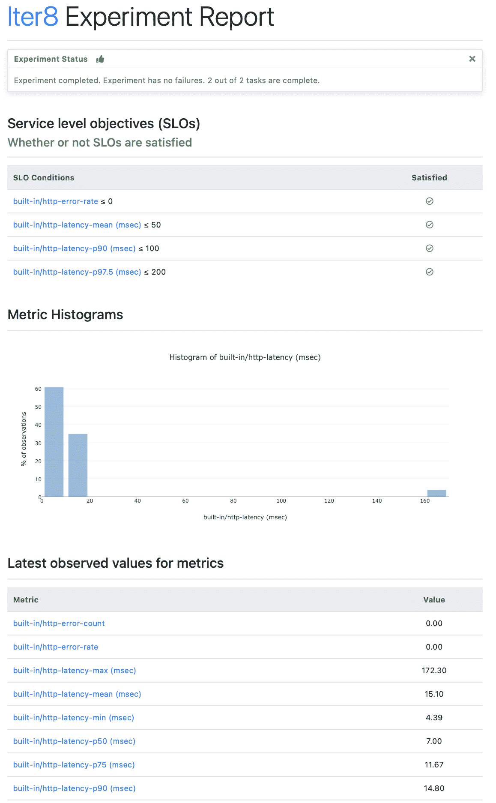

# 使用 SLOs 进行简单的 HTTP 负载测试

> 原文：<https://thenewstack.io/simple-http-load-testing-with-slos/>

[](https://www.linkedin.com/in/sriumcp/)

[Srinivasan Parthasarathy](https://www.linkedin.com/in/sriumcp/)

[Sri 是一名应用机器学习研究员，拥有为混合云、网络安全和数据探索问题领域创建可扩展的 AI/ML/高级优化企业解决方案的记录。作为 Iter8 的联合创始人，他曾在 Kubecon 2020 和 2021 以及 Knative 和 KFServing 等社区会议上发表过演讲。](https://www.linkedin.com/in/sriumcp/)

[](https://www.linkedin.com/in/sriumcp/)[](https://www.linkedin.com/in/sriumcp/)

负载测试是 HTTP 服务的持续集成和交付(CI/CD)中的一个基本构件。在负载测试期间，HTTP 请求流被发送到目标服务，并评估响应是否存在错误和延迟相关的违规。从开发人员的角度来看，建立负载测试涉及三个关键方面——即，I)请求流的*负载相关特性*，例如请求速率；ii)请求的*形状，特别是，HTTP 端点是否需要将有效载荷作为其请求的一部分发送；以及 iii)用于验证目标服务质量的*服务级别目标(SLO)*。*

本文展示了如何使用开源的 Kubernetes 友好发布工程平台 [Iter8](https://iter8.tools) ，在几秒钟内灵活地设置负载测试，并精确控制以上所有内容。

Iter8 的命令行界面(CLI)使得为符合 SLO 规范的 HTTP 服务设置负载测试、验证目标服务是否满足 SLO 以及创建负载测试的可视化报告变得简单而容易，如下所示。



## 先决条件:获取 Iter8 CLI 并运行示例应用程序

1.  使用以下方法之一安装 Iter8 CLI。

```
brew tap iter8-tools/iter8
brew install iter8

```

*   *   **使用预编译的二进制文件**

许多平台的预编译 Iter8 二进制文件都可以在这里获得[。解压缩您的平台的 iter8-X-Y.tar.gz 归档文件，并将 *iter8* 二进制文件移动到您的路径中的任何文件夹。](https://github.com/iter8-tools/iter8/releases)

```
go install github.com/iter8-tools/iter8@latest

```

现在，您可以从 gopath bin/目录运行 *iter8* 。

2.我们将使用 [httpbin](https://httpbin.org/) 作为目标服务。在单独的终端中运行它，如下所示。

```
docker run  -p  80:80  kennethreitz/httpbin

```

### 第 1 部分:带 SLO 的基本负载测试

Iter8 为负载测试提供了一个预定义的、高度可定制的*实验图*。与[掌舵图](https://helm.sh/)类似，Iter8 的实验图可以与数值相结合，创建可以由 Iter8 运行的完全指定的实验。

如下下载负载测试 HTTP 实验图。

```
iter8 hub  -e  load-test-http
cd load-test-http

```

示例应用程序(httpbin)实现了一个 HTTP 端点 [http://127.0.0.1/get](http://127.0.0.1/get) ，它接受 [HTTP GET 请求](https://developer.mozilla.org/en-US/docs/Web/HTTP/Methods/GET)。以下示例显示了如何为此端点运行负载测试。

```
iter8 run  --set url=http://127.0.0.1/get \
--set SLOs.error-rate=0  \
--set SLOs.latency-mean=50  \
--set SLOs.latency-p90=100  \
--set SLOs.latency-p'97\.5'=200

```

上面的命令向指定的 URL 和内置的错误和延迟相关指标发送稳定的 HTTP GET 请求流。默认情况下，会收集以下指标:错误计数、错误率、延迟平均值、延迟最大值、延迟标准偏差、延迟最小值以及列表[50.0、75.0、90.0、95.0、99.0、99.9]中的延迟百分比。此外，还会收集指定为 SLO 一部分的任何其他延迟百分比。在上面的例子中:

1.  收集并报告潜伏期百分位数[25.0、50.0、75.0、90.0、95.0、97.5、99.0、99.9]。
2.  以下 SLO 已经过验证。
    1.  错误率为 0
    2.  平均延迟低于 50 毫秒
    3.  第 90 百分位延迟低于 100 毫秒
    4.  97.5%的延迟低于 200 毫秒

您可以使用 *iter8 assert* 子命令来断言实验已经完成，没有任何失败，并且所有的 SLO 都得到满足(如下所示)。

```
iter8 assert  -c  completed  -c  nofailure  -c  slos

```

假设满足断言，上述子命令退出，退出代码为 0。否则，它以退出代码 1 退出。

您可以使用 *iter8 report* 子命令查看 HTML 或文本格式的实验结果。查看 HTML 格式的实验报告，如下所示。

```
iter8 report  -o  html  >  report.html

```

用浏览器打开 report.html
。在 MacOS 中，你可以运行*打开 report.html*来这样做。

### 第 2 部分:负载特性

Iter8 使得控制 Iter8 生成的请求流的负载相关特性变得容易。特别是，您可以指定负载测试的查询数/持续时间、每秒发送的查询数以及用于发送请求的并行连接数。以下示例显示了如何将发送的请求总数设置为 200 (numQueries)，将每秒请求数设置为 10 (qps)，将并行连接数设置为 5(connections)。用下面的命令替换第 1 部分中使用的 *iter8 run* 命令。

```
iter8 run  --set url=http://127.0.0.1/get \
--set SLOs.error-rate=0  \
--set SLOs.latency-mean=50  \
--set SLOs.latency-p90=100  \
--set SLOs.latency-p'97\.5'=200  \
--set numQueries=200  \
--set qps=10  \
--set connections=5

```

### 第 3 部分:请求的形式

具有 POST 端点的 HTTP 服务可以接受有效负载作为请求的一部分。Iter8 使得在负载测试期间将各种类型的内容作为有效负载发送变得容易。

在下面的例子中，Iter8 下载一个 [JSON 对象](https://json-generator.com)，并使用下载的 JSON 作为 POST 请求中的有效负载；有效载荷的类型设置为“应用程序/json”。

```
iter8 run  --set url=http://127.0.0.1/post \
--set payloadURL=https://json-generator.com/ \
--set contentType="application/json"  \
--set SLOs.error-rate=0  \
--set SLOs.latency-mean=50  \
--set SLOs.latency-p90=100  \
--set SLOs.latency-p'97\.5'=200

```

在下面的例子中，Iter8 [从 Pixabay](https://cdn.pixabay.com/photo/2021/09/08/17/58/poppy-6607526_1280.jpg) 下载一个图像，并使用下载的图像作为 POST 请求中的有效载荷；有效载荷的类型设置为“图像/jpeg”。

```
iter8 run  --set url=http://127.0.0.1/post \
--set payloadURL=https://cdn.pixabay.com/photo/2021/09/08/17/58/poppy-6607526_1280.jpg \
--set contentType="image/jpeg"  \
--set SLOs.error-rate=0  \
--set SLOs.latency-mean=50  \
--set SLOs.latency-p90=100  \
--set SLOs.latency-p'97\.5'=200

```

在下面的例子中，有效负载不是从 URL 下载的，而是作为字符串直接提供的:

```
iter8 run  --set url=http://127.0.0.1/post \
--set payloadStr="abc123"  \
--set contentType="text/plain"  \
--set SLOs.error-rate=0  \
--set SLOs.latency-mean=50  \
--set SLOs.latency-p90=100  \
--set SLOs.latency-p'97\.5'=200

```

### 结论:Iter8

Iter8 的负载测试 http 实验图表及其简单的 CLI 使您能够快速设置负载实验并验证 HTTP 服务。实验可以是*特设的*，即在命令行上手动运行。它们也是可脚本化的，可以轻松嵌入到 CI/CD/GitOps 管道中以实现更高的自动化，而 *iter8 assert* 命令的结果会影响管道的执行。

可获得 [Iter8 的完整文档](https://iter8.tools)。

<svg xmlns:xlink="http://www.w3.org/1999/xlink" viewBox="0 0 68 31" version="1.1"><title>Group</title> <desc>Created with Sketch.</desc></svg>