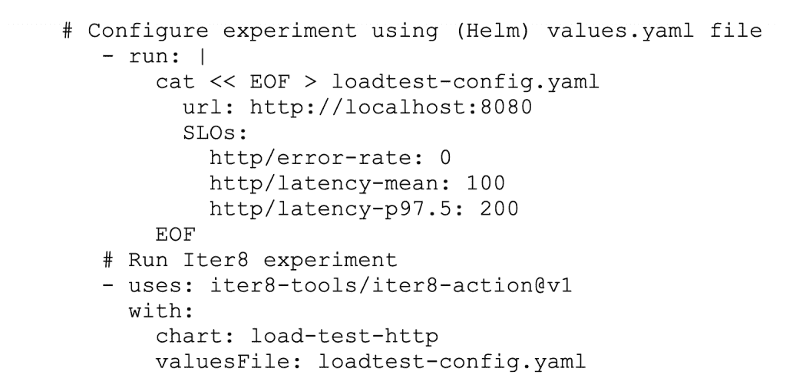
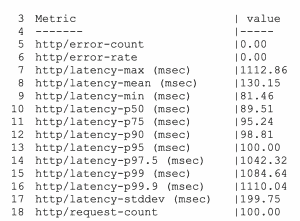

# 使用 GitHub 动作进行简单的负载测试

> 原文：<https://thenewstack.io/simple-load-testing-with-github-actions/>

 [迈克尔·卡兰塔

迈克尔是一名高级软件工程师，他参与了许多可扩展的分布式和基于云的企业系统的设计和开发。他是 Iter8 项目的联合创始人。](https://github.com/kalantar) 

在本文中，我们展示了如何使用 GitHub Actions 来负载测试、基准测试和验证具有服务级别目标(SLO)的 HTTP 和 gRPC 服务。

当开发新版本的 HTTP 或 gRPC 服务时，在升级当前版本之前，最好对其性能进行基准测试，并验证其是否满足期望的服务级别目标(SLO)。我们描述了一种基于 GitHub 动作的无代码方法，它可以用于在持续集成/持续交付(CI/CD)管道中的任何一点自动化这样的测试。例如，在构建时，它可以用于尽快验证新版本。或者，在部署时，它可以用于在生产环境中验证 SLO。

## **使用 Iter8 GitHub 动作进行 HTTP 负载测试**

Iter8 GitHub 动作`iter8-tools/iter8-action@v1`，在 GitHub 工作流程中启用自动化 Iter8 实验。要使用该操作，请通过一个舵`valuesFile`指定一个实验图表及其配置。不需要编程—所有配置都是声明性的。典型用途是在 values.yaml 文件中定义测试配置，并调用 Iter8 操作传递配置。例如，要对 HTTP 服务运行负载测试，使用内置的`load-test-http` [图表](https://github.com/iter8-tools/hub/tree/main/charts/load-test-http)。例如:

使用 Iter8 操作对 HTTP 端点 http://localhost:8080 运行负载测试并验证三个服务级别目标的示例:错误率必须为 0，平均延迟必须低于 100 毫秒，97.5%延迟必须低于 200 毫秒。

`load-test-http`实验图表的所有可用选项都记录在[图表自述文件](https://github.com/iter8-tools/hub/tree/main/charts/load-test-http)中。

在 [Iter8 端到端测试用例](https://github.com/iter8-tools/docs/blob/main/.github/workflows/tests.yaml)中可以找到用于测试 HTTP 服务的 Iter8 动作的其他示例。要运行这些测试用例:

1.  将 ITER 8 docs repo:【https://github.com/iter8-tools/docs】的分发给你的组织， **myorg** 。
2.  如果需要，在分叉的存储库上启用工作流(通过导航到 https://github . com/my org/docs/actions)。
3.  选择工作流程**端到端测试**。
4.  使用**运行工作流程**按钮运行工作流程。
5.  当工作流完成时，您可以检查测试定义(`test.yaml`*)和针对本地 httpbin 服务的负载测试日志，`local httpbin tests`*。**

 **### 标杆管理

当 Iter8 动作执行时，它会记录一个可以在以后检查的基准列表。基准测试报告示例如下:

### SLO 验证

默认情况下，Iter8 操作会验证任何指定的 SLO，并且仅当 SLO 得到验证时，操作才会成功。这样，使用该动作的工作流可以确定提升新服务是安全的。但是，如果目标只是对服务进行基准测试，那么可选标志 validateSLOs 可以设置为 false。在这种情况下，该操作不会验证 SLO，但会在实验完成时成功。

## **使用 Iter8 GitHub 动作进行 gRPC 负载测试**

gRPC 服务可以使用内置的`load-test-grpc` [图表](https://github.com/iter8-tools/hub/tree/main/charts/load-test-grpc)进行测试。 [Iter8 端到端测试用例](https://github.com/iter8-tools/docs/blob/main/.github/workflows/tests.yaml)包含一个例子。如上所述运行，但是检查`local grpc tests`*的日志。该图表的完整配置选项记录在图表的[图表自述文件](https://github.com/iter8-tools/hub/tree/main/charts/load-test-grpc)中。*

 *## **结论**

Iter8 GitHub 操作简化了 HTTP 和 gRPC 服务性能测试的执行。配置是声明性的；不需要编程。该操作生成负载并将其应用于目标服务。它测量并记录用于服务基准测试和验证所需 SLO 的性能指标。在 GitHub 工作流中，它可以用来确保只有在安全的情况下才升级新版本。

<svg xmlns:xlink="http://www.w3.org/1999/xlink" viewBox="0 0 68 31" version="1.1"><title>Group</title> <desc>Created with Sketch.</desc></svg>***