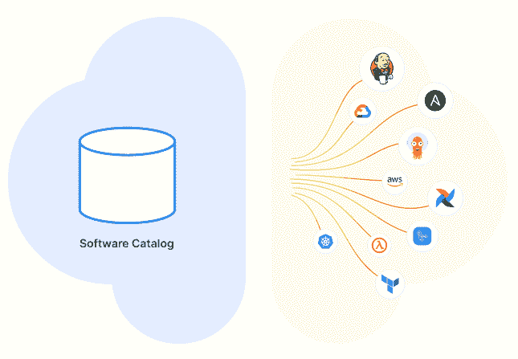
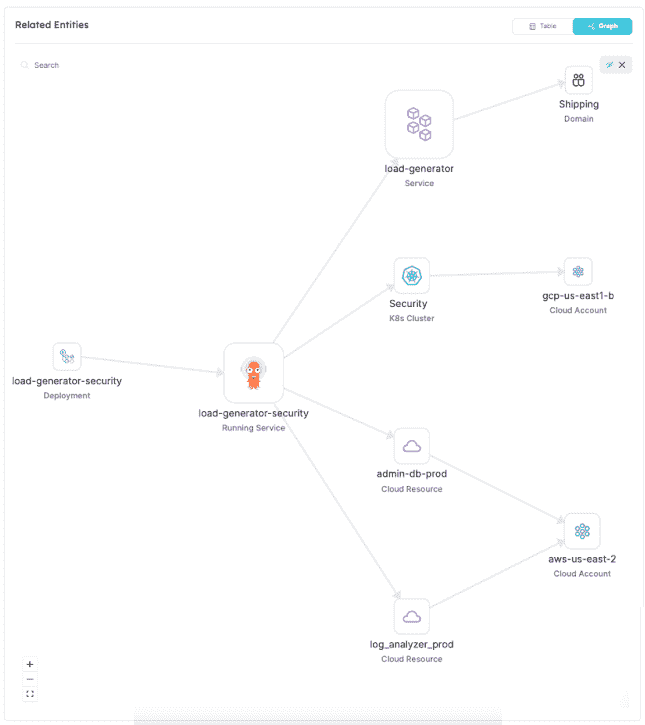

# 使用通用软件目录简化 CI/CD

> 原文：<https://thenewstack.io/simplify-ci-cd-with-a-general-purpose-software-catalog/>

为了自动化部署过程，CI/CD 需要上下文:部署配置、构建配置、工件、版本号、依赖项、环境变量、测试结果等等。这些数据不存在于一个地方——它通常分散在多个系统和工具中。

例如，部署配置可能存储在单独的 YAML 文件中，环境变量可能在脚本或部署清单中定义，版本号可能在电子表格中手动跟踪。

太多的真实来源会导致几个问题，包括增加的复杂性、元数据不一致、更新数据的困难，以及最重要的是无法应用自动化。软件目录，内部开发者门户的核心，可以[提供解决方案](https://thenewstack.io/port-platform-engineering-can-be-the-first-step-in-system-automation/)。

## **第一步:可以存储 CI/CD 数据的软件目录**

第一步是创建一个包含正确数据的软件目录。它应该是一个通用的软件目录，允许添加具有不同属性和关系的数据类型，提供灵活性，使每个人都能[将他们自己的数据模型带到目录中](https://www.getport.io/blog/the-four-pillars-of-internal-developer-portals)。

内部开发者门户[是平台工程的核心。它为开发人员提供了作为平台一部分构建的自助服务操作，以及软件目录。](https://www.getport.io/blog/guide-to-internal-developer-portals)

这就是有趣的地方。从开发人员体验的角度来看，软件目录可以解释为经过编辑的白名单数据存储，旨在帮助开发人员克服认知负荷(例如，[查看 K8s 数据如何呈现给开发人员](https://thenewstack.io/developer-portals-can-abstract-away-kubernetes-complexity/))。

但这并不是故事的全部。实际上，使用 CI/CD 的软件目录是非常强大的。一个软件目录可以存储关于构建、环境、云等等的数据。这种类型的软件目录非常有利于为 CI/CD 环境创建单一的事实来源。

我们与之交谈的平台工程团队正在积极实现这些优势，尤其是在 CI/CD 元数据方面。他们将软件目录用作 CI/CD 的单一真实来源，并且还将软件目录中的 CI/CD 数据用作其自动化工作流的一部分。

通过在软件目录中包含关于集群、环境、云区域和供应商的相关数据，CI/CD 流程可以更加智能和自动化，从而实现更好的工程设计。它将 CI/CD 从所需的上下文数据中分离出来，分离控制，并使故障和管道中断的故障排除变得更加容易。

通过开发人员门户，这些功能还可以帮助平台工程团队让开发人员更好地了解部署流程，因为他们可以实时看到部署状态和发生的任何错误。

## **下一步:版本控制和安全性**

一旦建立了软件目录，当 CI/CD 数据的一个真实来源还用于版本控制和安全性时，它的好处可以更进一步，

跟踪对元数据和配置文件所做的所有更改提高了元数据随时间变化的可追溯性。这对于审计和理解部署过程的发展非常有用。

此外，它还推动了更好的协作(通过版本和变更跟踪)、更快的问题解决以及快速恢复到先前版本的能力，并提高了合规性。当 CI/CD 数据支离破碎时——想想 git 中分散的版本历史——很难做到这一点，但有了软件目录就容易多了。
软件目录通常确保只有授权用户才能访问和修改元数据，从而降低未经授权的访问、数据泄露和其他安全事件的风险。例如，导致 S3 存储桶公开或向互联网公开带有个人身份信息的服务的错误配置。

## 它是如何工作的

软件目录本质上是一个存储所有与 CI/CD 流程相关的元数据的集中式数据库。可以通过 REST API 访问和修改它，这使得 CI/CD 管道能够以编程方式与元数据存储进行交互。数据类型、属性和关系可以在需要时轻松添加，因为不同的组织做不同的开发。

应该访问和存储哪些数据？这取决于我们所说的数据模型，也就是管道中重要的属性和类别。例如:

*   您可以按不同的类别组织目录，每个类别包含与 CI/CD 流程的特定方面相关的元数据。例如，可能有一个部署配置类别、一个环境变量类别和一个版本控制类别。
*   在每个类别中，会有不同的元数据项或键。例如，在部署配置类别中，可能有针对部署目标、部署策略和部署版本的元数据项。

CI/CD 管道可以通过使用 REST API 与元数据存储进行交互，指定它们想要访问的类别和元数据项。例如，为了检索特定应用程序的部署目标，CI/CD 管道可能会向部署配置类别发送一个`GET`请求，为部署目标指定元数据项。

## 图形数据库对软件目录的重要性

图形数据库对于软件目录来说很方便。由于软件目录中的不同实体具有复杂的关系(例如，服务部署在云帐户中 K8s 集群的名称空间上),并且这些关系非常重要，因此您需要能够在本机查询它们。图形数据库可以让你做到这一点。这在 CI/CD 管道的环境中特别有用，在这种环境中，开发人员、开发人员和机器需要能够快速访问关于系统的不同部分如何相关的信息。

*   或者说，我们想要识别使用特定映像版本的所有服务。如果没有元数据存储，您将需要手动搜索各种服务的配置和文档，以找到匹配的服务。但是有了图形数据库，我们可以为每个服务创建节点，并将它们链接到它们使用的图像版本。这允许我们快速查询图表，以找到使用所需图像版本的所有服务。我们可以从查询图像版本节点开始，然后遍历它与服务节点的关系。我们甚至可以向节点添加附加信息，例如服务运行的环境、上次更新的日期以及任何相关的警报或问题。这提供了整个系统的综合视图，使我们能够轻松地跟踪和管理我们的服务。

*   例如，假设我们想要识别在特定地区运行的所有服务(例如，如果您正在运行一个大规模的云平台，为不同地区的客户提供服务)。如果没有图形数据库，我们将需要跨不同的数据源执行多个查询，并尝试将信息拼凑在一起。然而，对于图形数据库，我们可以在一个查询中完成。

这种本地查询复杂关系的能力对于开发人员和机器更有效地执行影响分析、管理配置、运行连续测试和管理发布是至关重要的。这不仅简化了 CI/CD 流程，还有助于确保系统的整体稳定性和可靠性。

## 软件目录需要 API 优先

现在我们需要考虑如何轻松地将数据放入软件目录。要轻松地将数据吸收到软件目录中，需要一种 API 优先的方法。这包括来自[云提供商、](https://www.getport.io/blog/announcing-the-aws-exporter)(针对集群数据)、git 提供商、基础设施即代码(IaC)工具(如 Terraform 或 Crossplane)等的数据。

API 优先的方法还使得与其他工具和系统的集成变得容易，例如创建一个包含基础设施和应用程序信息的仪表板。这可以帮助您构建更全面、更有用的元数据存储，从而提供基础设施和应用程序的整体视图。

## 结论

平台工程和内部开发人员门户的兴起为开发人员提供了一个创建软件目录的机会，不仅对开发人员有用。具有 CI/CD 元数据的软件目录可以创建单一的事实来源，解决版本和安全问题，并允许部署过程的自动化等等。要了解通用软件目录可以包含什么，请点击这里观看 Port 的[现场演示。](http://demo.getport.io)

<svg xmlns:xlink="http://www.w3.org/1999/xlink" viewBox="0 0 68 31" version="1.1"><title>Group</title> <desc>Created with Sketch.</desc></svg>